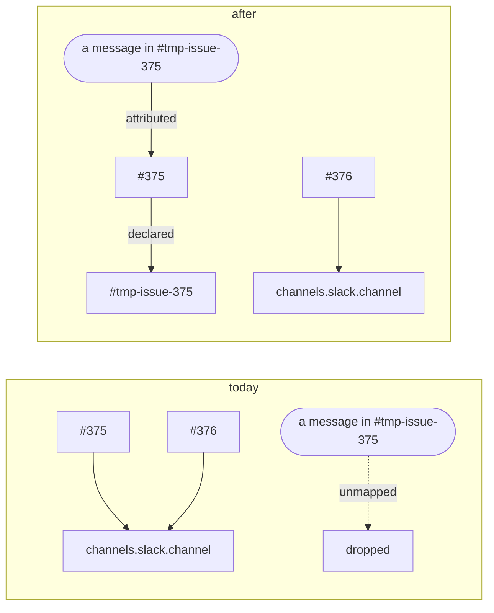

<!-- Authored per the the-loop:writing skill. -->

# Requirements: a work item names the room it is worked in

> Phase 1 of 4 (requirements → design → testing plan → tasks). Following the Kiro spec
> approach (<https://kiro.dev/docs/specs/>). This phase MUST be reviewed and approved by
> the required collaborators before moving to design.

## Introduction

[Issue-375](https://github.com/MadaraUchiha-314/the-loop/issues/375): *"Sometimes for a
particular work item a dedicated slack channel is created and many people want to
collaborate on that channel … The loop should have an option to add a slack channel (in
addition to any existing slack thread as defined in cli-config) … All messages in that
slack channel which comes from authorized users should be treated as an authorized user
commenting on the work item."*

`channels.slack.channel` is the operator's **one** channel. Every work item this
deployment touches gets a thread in it, so following one work item means following all of
them — and the people who care about *this* migration are already in `#tmp-issue-abc`,
where the-loop says nothing and hears nothing. Today the only way to bring them in is to
ask each of them to open a Slack thread in a channel they do not otherwise read.

Three facts about the current model make this a change in the *channel* layer rather than
in configuration:

| Today | Consequence |
|---|---|
| The channel to post in is `config.channel`, read directly at every outbound call | Every work item's conversation is in one room |
| A message is attributed to a work item only through a **bound thread** | A top-level message in a dedicated room is `unmapped` — or worse, opens a **new issue** through the kickoff |
| The kickoff reads the operator's channel and creates work items from it | A dedicated room cannot be the operator's channel without turning every message in it into an issue |

**The unit of the change is one work item naming one room.** Not a config key (an
operator's deployment has many work items and one config), and not a permission (who may
speak is already answered, twice).

## Requirements

### R1 — an authorized user declares a work item's collaboration channel

- **R1.1** WHEN a user named in `routing.authorizedUsers` comments
  `the-loop add-channel <type>@<target>` on a work item THEN the-loop SHALL record that
  channel in the work item's portable record with who declared it, when, through which
  surface and the comment's URL, SHALL consume the comment (never forward it to a
  session), and SHALL neither arm nor spawn anything.
- **R1.2** WHEN the body carries the keyword but names no channel that matches the
  grammar THEN the-loop SHALL refuse it (`control.rejected` / `missing-channel`) and
  change nothing.
- **R1.3** the-loop SHALL accept `<type>@<target>` and `<type>://<target>` as the same
  declaration, and SHALL store, print and compare the canonical `<type>@<target>`.
- **R1.4** WHEN the type is not one this deployment has an adapter for THEN the-loop
  SHALL refuse the declaration and name the types it has.
- **R1.5** WHEN the target is not valid for its type THEN the-loop SHALL refuse it. For
  Slack a valid target is a conversation id (`C…`, `G…`, `D…`); a channel **name** is
  not, because the bot holds no `channels:read` scope to resolve one.
- **R1.6** `the-loop remove-channel <type>@<target>` SHALL undeclare, under the same
  authorization, taking effect on the next event.
- **R1.7** A work item SHALL have at most **one** channel per type: a second declaration
  of the same type replaces the first, and the-loop SHALL say which one it replaced.
- **R1.8** A declaration SHALL be accepted at any point in a work item's life — before or
  after its collaborators, before or after its session exists, before or after its
  conversation has started. The order of operations SHALL NOT matter.
- **R1.9** `the-loop add-channel <ref> --work-item <ref>` SHALL apply the same
  declaration from the terminal and post the same keyword back to the work item, marked
  as the-loop's own.
- **R1.10** A work item's declarations SHALL be cleared when it ends, and by
  `the-loop sessions reset`, exactly as its collaborator roster is.

### R2 — the work item's updates go to a thread in that channel

- **R2.1** WHEN a work item with a declared Slack channel has no conversation THEN
  the-loop SHALL open its thread root in the declared channel rather than in
  `channels.slack.channel`.
- **R2.2** WHEN a work item's conversation is bound in a channel other than the one it
  now declares THEN the-loop SHALL open a root in the declared channel, rebind the
  conversation to it, and post a pointer in the thread it left saying where the
  conversation went and that replies there no longer reach it.
- **R2.3** WHEN a work item declares no channel THEN every outbound path SHALL behave
  exactly as it did before this change.
- **R2.4** WHEN the declared channel cannot be posted to THEN the-loop SHALL report it as
  it reports any other post failure, and SHALL NOT move the binding.

### R3 — messages in that channel are comments on that work item

- **R3.1** WHEN an authorized Slack user posts a **top-level** message in a channel a work
  item has declared THEN the-loop SHALL process it as a message on that work item —
  through the same classification, grants, ledger record and delivery a thread reply goes
  through — and SHALL NOT open a new work item from it, the configured kickoff channel
  included.
- **R3.2** WHEN a message arrives in a thread inside a declared channel that is bound to
  no work item THEN the-loop SHALL attribute it to the declaring work item.
- **R3.3** WHEN a thread inside a declared channel **is** bound to a work item THEN that
  binding SHALL win: the room decides only what the bindings do not.
- **R3.4** A channel SHALL back at most one work item. WHEN a declaration names a channel
  another work item holds THEN it SHALL be refused (`control.rejected` /
  `channel-taken`). WHEN two records nonetheless name one channel THEN a message there
  SHALL be attributed to neither.
- **R3.5** The declaration SHALL grant nobody anything: authorization for a message in a
  declared channel is the channel's own allow-list, unchanged, and an unauthorized
  member's message is dropped there exactly as it is anywhere else.
- **R3.6** In `socket` read mode every message in a declared channel SHALL be seen. In
  `poll` mode the channel's top-level messages and its bound threads' replies SHALL be
  seen. Either way a room SHALL be **baselined on first sight**, so declaring a channel
  never delivers its backlog, and a message SHALL be processed at most once across both
  transports.

### R4 — the question is asked where every other question about the work item is asked

- **R4.1** The `phase-selection` checklist SHALL carry a collaboration-channel section
  naming any channel already declared and, otherwise, the keyword that declares one.
- **R4.2** The selection confirmation SHALL name the declared channels, or say there are
  none.
- **R4.3** The gate SHALL NOT parse a channel out of the reply. The control vocabulary is
  the one parser for the grammar, so a tick state and a typed declaration can never
  disagree — and the section SHALL therefore carry no checkbox, which the gate's own
  parser would read as a phase.

### R5 — the change ships with its documentation

- **R5.1** The capability docs for channels and for webhook triggers SHALL describe the
  declaration, and carry a history row.
- **R5.2** The two new commands SHALL each have a CLI page, and the two new keywords an
  option entry; `docs/cli/state.md` SHALL describe the new portable section.

## Security considerations

The declaration adds one new instruction a comment can carry and one new way a message can
be attributed to a work item. Neither widens who may speak.

| # | Abuse case | Mitigation |
|---|---|---|
| A1 | A crafted `add-channel` body puts payload text into a path, an argv or an API call | The **entire** parser is a per-type regex over `<type>@<target>`. A token that does not match is refused, never sanitised, and scanning stops at the first token that is not one — so prose after the channel reaches nothing (R1.2–R1.5) |
| A2 | Two work items claim one room, so a message is delivered to the wrong one | Declaring a held channel is refused (R3.4); the reverse lookup answers "nobody" for a contested room rather than picking one, so the failure is silence, not misdelivery |
| A3 | A work-item collaborator, or any unauthorized member, declares a room to redirect a work item's conversation | Declaring is an **action**: the dispatcher's named-and-allowlisted-actor check runs before it, the same one every other control command passes. A collaborator cannot issue any control command, this one included |
| A4 | An authorized user declares a channel outsiders are in, to read a work item's conversation | Out of scope by design and stated plainly: an authorized user can already read and relay a work item. What the declaration cannot do is let those outsiders *speak* — inbound authorization is unchanged (R3.5) |
| A5 | Declaring the operator's own central channel turns every work item's thread there into #375's | A binding wins over a room (R3.3), so only messages the bindings do not already claim are attributed. What *is* suppressed there is the kickoff (R3.1) — deliberate, and the reason R3.4 exists |
| A6 | A room with months of history is declared and replays into the session | First-sight baselining (R3.6): with no cursor, the newest ts is recorded and nothing is delivered |
