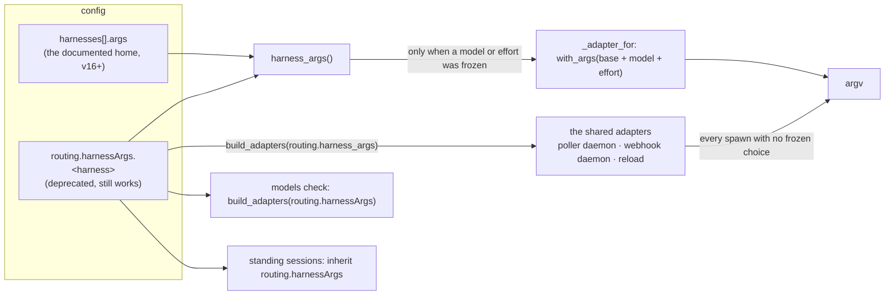

<!-- Authored per the the-loop:writing skill. -->

# Bugfix spec: a released work item is launched with the arguments the operator declared

> Phase 1 of 4 (bugfix → design → testing plan → tasks). This phase MUST be reviewed and
> approved before moving on.

## Summary

**Since v16.0.0 the arguments an operator declares under `harnesses[].args` reach a
session only when its work item froze a model or an effort level; every other session is
launched with none of them.** [Issue-377](https://github.com/MadaraUchiha-314/the-loop/issues/377)
reports the consequence on a devbox running v16.0.1: every work item started the normal
way — label, then a `the-loop execute` reply — gets a Claude session without
`--dangerously-skip-permissions`, which stops on its first file edit with an interactive
prompt in a tmux pane nobody is watching. `<work-repo>#123` sat there for 2 days 16 hours
while the status surface reported it as running.

The report splits the sessions by the event that spawned them — 13 with the flag off
`issues`/`labeled`, 6 without off `issue_comment`/`created` — and asks that the release
path build the command from the same config the label path uses. It does; the split is
real but the axis is not the event. It is the **upgrade**: the 13 labelled spawns are
dated before v16.0.0 shipped, the 6 released ones after, and v16.0.0 is the release that
(a) made every fresh work item spawn off the release comment rather than the label and
(b) introduced `harnesses[].args` as the new home of a harness's launch arguments — with a
deprecation warning telling the operator to move there — while leaving the adapters every
ordinary spawn launches on reading the **old** home only.

Reproduced here through the daemon's own dispatcher composition
(`the_loop.poller.daemon._build_dispatcher`) with a config whose only declaration of the
flag is `harnesses[].args`: the released session's record carries `harnessArgs: []`.

## Steps to reproduce

1. In `cli-config.yaml`, declare the flag where the v16 deprecation warning says to:

   ```yaml
   harnesses:
     - name: claude
       default: true
       args: ["--dangerously-skip-permissions"]
   ```

   and have no `routing.harnessArgs` (or move it, as the warning asks).
2. Label an issue `the-loop: auto-execute` and let the daemon post the `phase-selection`
   checklist (`session.spawn_deferred`, `reason: parked-at-human-start-gate`).
3. Reply `the-loop execute` with the phases ticked.
4. `ps -eo pid,cmd | grep "[c]laude --session-id"`, or read the work item's session
   record: the command line carries `--session-id <uuid>` and the prompt, and nothing the
   `harnesses` entry declared.

The same four steps with a model ticked at the gate produce a session that carries the
flag **but not the model** — the second defect below.

## Expected vs actual

- **Expected:** every session the-loop launches on a harness carries that harness's
  declared arguments, whichever event produced the spawn and whichever of the two config
  homes declares them; the session spawned by the reply that answers the gate already
  runs on the model that reply froze (issue-358, R8).
- **Actual:**

  | Session | `harnesses[].args` only | `routing.harnessArgs` only |
  |---|---|---|
  | spawned with no frozen model/effort (every fresh item since v16) | **launched with nothing** | launched with the args |
  | spawned with a frozen model/effort | launched with the args + the choice | launched with the args + the choice |
  | the one spawned by the gate-answering reply | **launched with nothing, and without the choice** | launched with the args, **without the choice** |
  | a standing session inheriting its args | **inherits nothing** | inherits the args |
  | `the-loop models check`'s probe | **probes without them** | probes with them |

  Event-log line for the released spawn, verbatim from the report (the record it wrote
  carries `harnessArgs: []`):

  ```json
  {"event": "session.spawned", "work_item": "github:<ghe-host>/<owner>/<work-repo>#123", "harness": "claude", "runner": "tmux", "interaction": "work-item", "gh_event": "issue_comment", "action": "created"}
  ```

## Root cause (confirmed)

**One resolver exists for a harness's launch arguments, and only one of eight readers
uses it.** `modelchoice.harness_args(config, harness, fallback)` returns
`harnesses[].args` when that entry declares a list, else the deprecated
`routing.harnessArgs.<harness>` (with a warning). It is called from exactly two places:
`Dispatcher._adapter_for`, on the branch taken only when the work item froze a model or an
effort level, and `config_findings`, a diagnostic. Everything that actually builds an
adapter reads the deprecated key directly:



Two consequences follow from that, and a third defect sits beside them:

1. **An operator who declares under `harnesses[].args` alone** — a fresh v16 install, or
   one that did what the deprecation warning asked — gets shared adapters with an empty
   `extra_args`. `_adapter_for` returns that shared adapter untouched for every work item
   that froze nothing (its documented "byte-identical to before" path), so the session is
   launched bare. The same empty `extra_args` is what `harnessTrust.acceptBypassPermissions:
   auto` reads to decide whether to pre-accept the bypass disclaimer, so that pre-seed is
   skipped too.
2. **The two paths can disagree at all.** `_adapter_for` re-reads the config to build the
   choice path's base instead of starting from the adapter it was handed, so nothing
   structural makes "the argv with a choice" a superset of "the argv without one".
3. **The session spawned by the gate-answering reply does not carry what the reply
   froze.** In `_spawn_for` the adapter is resolved *before* `graphlink.on_arm` advances
   the gate and without the checkout (`cwd`), so `_frozen_choices` reads a registry record
   that does not exist yet and a legacy portable section nothing writes any more, and
   answers "no choice". `_spawn_tmux` then records `model: ""` and, in case 1,
   `harnessArgs: []` — and `_choice_drifted` deliberately leaves a record with empty
   `harnessArgs` alone, so the session is never re-launched onto the right arguments
   either. This contradicts what issue-358's R8 promised ("the one that does spawn …
   already carries the frozen choice") and what `session.spawn_deferred`'s catalogue entry
   says.

Why the report's own table reads as an event split: every one of its 13 flagged sessions
was spawned by a pre-v16 daemon (the sample is dated 2026-09-13; v16.0.0 shipped
2026-09-14 and the first `spawn_deferred` in the log is 2026-09-14T05:06), and since v16
a fresh work item can only spawn off the release comment. The config on that box is not in
the report; the mechanism above is the only one found that produces its table, and it
assumes the flag is declared under `harnesses[].args` there. With `routing.harnessArgs`
alone the shared adapters carry the flag and only defect 3 remains.

## Requirements

### R1 — every session is launched with its harness's declared arguments

#### Acceptance criteria (EARS)

1. WHEN a session is spawned for a work item — on its first event, by the reply that
   answers its human start gate, on a respawn, or for a pull request endpoint — THEN the
   system SHALL launch it with the harness's launch arguments, resolved as
   `harnesses[].args` when that entry declares a list, else the deprecated
   `routing.harnessArgs.<harness>`, whichever event produced the spawn.
2. WHEN a work item froze a model or an effort level THEN the system SHALL launch it with
   the **same** base arguments followed by the model's and then the effort's fragments
   (issue-358 R3.1–R3.2 unchanged), and the choice path SHALL derive its base from the
   adapter the no-choice path launches on — never from a second read of the config.
3. WHEN both homes declare arguments for one harness THEN `harnesses[].args` SHALL win
   (as today) and the system SHALL say so once, when the adapters are built and in
   `the-loop models list|check` — never at a spawn.
4. WHEN neither home declares arguments THEN the session SHALL be launched with no extra
   arguments; the system SHALL never add a permission flag the operator did not declare.
5. WHEN a session is spawned or respawned THEN `session.spawned` / `session.respawned`
   SHALL carry the `harness_args`, `model` and `effort` it was launched with, so the
   regression check the report proposes — *the argv recorded for a `session.spawned`
   with `gh_event=issue_comment` contains every configured harness arg* — can be run
   against `events.jsonl` alone.

### R2 — the session spawned after the gate carries what the gate froze

#### Acceptance criteria (EARS)

1. WHEN an authorized reply unparks a work item from its human start gate THEN the session
   spawned by that same event SHALL be launched with the model and effort level that reply
   froze, read from the checkout the spawn just prepared.
2. WHEN that session is registered THEN its record SHALL carry that `model`, `effort` and
   `harnessArgs`, so the next event is delivered into it rather than re-launching it.

### R3 — the other readers of a harness's arguments use the same resolver

#### Acceptance criteria (EARS)

1. WHEN `the-loop models check` probes a harness THEN it SHALL probe with the base
   arguments a session on that harness is launched with.
2. WHEN a standing session's entry omits `harnessArgs` — declared in
   `standingSessions.sessions[]` or created through `the-loop standing create` / the API —
   THEN it SHALL inherit the resolved launch arguments; an explicit `[]` SHALL still mean
   none.

### R4 — the regression stays fixed

#### Acceptance criteria (EARS)

1. The fix SHALL include a test that composes the dispatcher the way the daemons do
   (`the_loop.poller.daemon._build_dispatcher`) with the flag declared only under
   `harnesses[].args`, releases a work item with an `issue_comment`, and asserts the
   recorded argv contains every configured argument — red before the fix, green after.
2. The fix SHALL include a test that a model frozen by the gate-answering reply reaches
   the argv of the session that reply spawns — red before the fix, green after.

## Security considerations

**The bug is fail-closed and the fix restores what the operator declared; it adds no
argument of its own.** `--dangerously-skip-permissions` is the flag most operators put
here, and losing it makes a session *narrower* (it stops and asks), not wider. The
security question is therefore whether the fix can ever make a session wider than the
operator's config says. It cannot:

| # | Abuse case | Closed by |
|---|---|---|
| A1 | A work item's `work-item-state.json` (agent-writable) names a model or effort to smuggle an argument onto the argv | Unchanged: a frozen choice is re-validated against the operator's declared `models`/`effort` and the probed verdicts on the way in (issue-358 abuse table), and now applies to the post-gate spawn too, where R2 makes it reachable for the first time. What the state file can contribute is still exactly `(model_flag, <declared name>)` — the name grammar admits no flag, path or shell fragment |
| A2 | A repository's checkout contributes arguments | It cannot: the base is the operator's `cli-config.yaml`, read on the daemon's machine; nothing under a checkout is consulted for it |
| A3 | Both homes declare, and the deprecated one silently wins or the two are merged | `harnesses[].args` wins, as documented; the union is never taken, and the conflict is reported (R1.3). A merge could double a flag or combine `--permission-mode` values the operator never wrote together |
| A4 | An unreadable or malformed `harnesses` section | Contributes nothing — `_entries` already fails in the shrinking direction; a session then launches bare and stops at its first prompt, which is the failure mode this ticket reports and the safe direction |

The arguments are passed to the harness as an argv list through `tmux`'s runner — never
through a shell — as before. **No new attack surface**: no new input reaches the argv;
one existing input now reaches every place it was documented to reach.

## Out of scope

- **The false "awaiting input" footer** the report notes on `expert-workspace-develop#506`
  reads from a different source than the event log and is a separate defect; it should be
  its own ticket so it is not lost inside this one.
- **A watchdog for a session stalled at an interactive prompt.** Nothing times out such a
  session today; that is a feature (issue-90 made the dialogs it knew about pre-answered),
  not this bug.
- **Moving `routing.harnessTrust`, `routing.harnessPlugins` and `routing.defaultHarness`
  under `harnesses[]`** — issue-358's named follow-up, unchanged.

## Open questions

None. The one assumption — that the reporting deployment declares the flag under
`harnesses[].args` — is stated in the root cause; the fix is the same under either
declaration.
