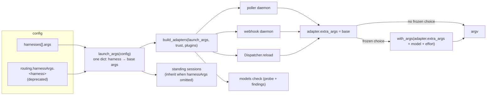
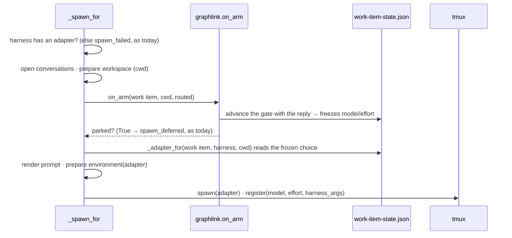

<!-- Authored per the the-loop:writing skill. -->

# Design: a released work item is launched with the arguments the operator declared

> Phase 2 of 4 (bugfix → design → testing plan → tasks). Derives from `bugfix.md`.
> MUST be reviewed and approved before moving to test planning.

## Overview

**One resolver produces a harness's launch arguments, every adapter is built from it, and
the choice path starts from the adapter it was handed rather than re-reading the config.**
Then the spawn that answers the gate is moved to after the answer, so it can read what the
answer froze. Four seams change; no config key, no schema, no event type is added.



The arrow that matters is the last pair: both branches of `_adapter_for` now leave from
the same adapter, so the argv with a choice is the argv without one plus the choice — by
construction, not by agreement between two readers.

## §1 One resolver: `launch_args`

**`modelchoice.launch_args(config, routing_args=None) -> Dict[str, List[str]]`.** For
every harness named in `harnesses[]` or in the deprecated `routing.harnessArgs`, the
result of the existing `harness_args(config, name, fallback)` — so the precedence rule
(`harnesses[].args` when it declares a list, else the fallback, with the deprecation
warning) is written once and stays where it is. `routing_args` defaults to
`config["routing"]["harnessArgs"]`; the daemons pass the `RoutingConfig.harness_args` they
already parsed, so the routing dataclass keeps owning that key.

A name that appears in neither list is absent from the dict, and `build_adapters` treats
absent as `[]` — which is R1.4: an install that declares nothing launches bare, exactly as
before.

**The conflict is a finding, not a merge.** `config_findings` gains one warning per
harness declared in both homes — *"`harnesses[].args` wins over `routing.harnessArgs.<h>`;
drop the deprecated key"* — so `the-loop models list|check` shows it, and `launch_args`
logs the same sentence once per build. The union of the two lists was
considered and rejected: it could double a flag or pair two `--permission-mode` values the
operator never wrote together (bugfix A3). The precedence itself is not new; only its
visibility is.

## §2 Every adapter builder takes it

| Reader | Before | After |
|---|---|---|
| `poller.daemon._build_dispatcher` (also `core.sessions` and `sessions_cmd` through it) | `build_adapters(routing.harness_args, …)` | `build_adapters(launch_args(cli_config, routing.harness_args), …)` |
| `webhook.daemon` | same | same |
| `Dispatcher.reload` | same | `launch_args(cli_config or self.cli_config, config.harness_args)` |
| `models_cmd._check` / `_emit` | `build_adapters(routing.harnessArgs)` | `build_adapters(launch_args(config))` |
| `standing.StandingConfig.from_mapping` | inherits `routing.harnessArgs.<h>` | inherits `launch_args(config).get(h)` |
| `core.standing.create_standing` | same | same |
| `Dispatcher._adapter_for` (choice path) | `harness_args(cli_config, h, routing fallback)` | `adapter.extra_args` |
| `config_findings` | `harness_args(…)` per harness | unchanged, plus the conflict finding |

The probe row is the one a reader might question: `probe()` runs
`[binary] + oneshot_argv(prompt) + choice_args`, and `oneshot_argv` already includes
`extra_args`, so the probe was measuring the harness *without* the arguments a session
would carry. After the change a `refused` verdict is a verdict about the argv that would
actually launch.

`build_adapters` itself is unchanged: it takes a dict of name → args and knows nothing
about where they came from. `critics.py` calls it with no arguments and keeps doing so — a
critic declares its own `args`.

## §3 The choice path starts from the adapter

```python
def _adapter_for(self, work_item, harness, cwd=""):
    adapter = self.adapters.get(harness)
    if adapter is None:
        return None
    model, effort = self._resolved_choice(work_item, harness, cwd)
    if not model and not effort:
        return adapter
    return adapter.with_args(
        effective_args(adapter.extra_args, model_args(model, adapter) if model else (),
                       effort_args(effort, adapter) if effort else ())
    )
```

Two things changed. The base is `adapter.extra_args` — what §2 put there — so this method
can no longer resolve a base the shared adapter does not have. And `cwd` is accepted and
passed through to `_resolved_choice`, which already took it: a caller that has just
prepared a checkout hands it over instead of letting the resolver look for a registry
record that does not exist yet. `_choice_drifted` and `_respawn_tmux` call it as before
(no `cwd`; their registry record exists) and are unaffected.

`_adapter_for` no longer needs `self.cli_config` or `self.config.harness_args` for the
base. `reload` still rebuilds the adapters from the swapped config, so a changed
declaration takes effect on the next event as it does today.

## §4 The spawn resolves after the gate

Today `_spawn_for` resolves the adapter first and asks the graph last; the reply that
unparks the item is applied by `on_arm`, *after* the argv was decided from a checkout the
spawn had not yet prepared. The order becomes:



The early "no adapter for defaultHarness" refusal keeps its place — it is a config error
that should fail before a conversation is opened or a clone is made — as a membership
check on `self.adapters`; the resolution with the choice happens once, after `on_arm`, and
the same adapter object is what `_prepare_environment` seeds for and what `_spawn_tmux`
launches and records. `_spawn_tmux` takes the resolved `(model, effort)` from that same
resolution rather than calling `_resolved_choice` a second time without `cwd`, so the
record cannot disagree with the argv.

Nothing else in `_spawn_for` moves: the deferral still returns `True` before any session
exists, the workspace failure still releases the delivery, and `on_spawn` still binds only
a session that spawned.

## §5 The events carry the argv

`session.spawned` and `session.respawned` gain three fields — `harness_args`, `model`,
`effort` — copied from the record being registered, each omitted when empty like the
record's own. `session.pr_spawned` gains `harness_args` (an endpoint carries no choice of
its own). This is what makes the report's proposed regression check runnable from
`events.jsonl`, and it is one line per emit; the catalogue entries in `eventlog.EVENT_TYPES`
and the observability capability doc name the new fields.

## §6 Security design

Restated from `bugfix.md` § Security considerations as the boundaries the code holds:

- **The base is the operator's.** `launch_args` reads `cli-config.yaml` on the daemon's
  machine and nothing else. A checkout, a comment, a state file cannot reach it (A2).
- **A choice can only append a validated fragment.** `_resolved_choice` is unchanged: a
  model must be declared, be a candidate for this harness, and not be `refused`; an effort
  must be declared and expressible. Moving the resolution after `on_arm` makes the
  post-gate spawn the first place a hand-edited state file could be read on a first spawn,
  and it is read through the same validation as every other path (A1).
- **Precedence, never union** between the two homes (A3); **shrink, never invent** on a
  malformed section (A4).
- **No shell.** The argv is a list handed to the tmux runner, as before.

## §7 What it costs

- **One deprecation warning per adapter build** instead of one per spawn-with-a-choice:
  `launch_args` runs at daemon start, on reload and per `models` command. Fewer lines, not
  more.
- **`standing.py` imports `modelchoice`.** `modelchoice` imports only the standard library,
  so no cycle; the standing config parser gains a view of the top-level `harnesses` key it
  did not have.
- **A session recorded by a pre-fix daemon** keeps its empty `harnessArgs`, so
  `_choice_drifted` keeps leaving it alone — it is not re-launched by the upgrade. An
  operator with a stalled session does what the report did: kill the pane and let the next
  event respawn it, which now resolves the arguments correctly. This is the existing
  "safety net, not a stampede" rule and is kept deliberately.
- **Nothing for the hot path.** `launch_args` walks two short lists at build time; a spawn
  does one fewer config read than before.

## Alternatives considered

| Option | Verdict |
|---|---|
| Have `_adapter_for` take the choice branch always, re-reading the config on every spawn | Rejected. Two readers can still diverge, the deprecation warning fires per spawn, and the base a session launched with becomes a function of when it spawned rather than of what the operator declared |
| Fold `routing.harnessArgs` into `harnesses[]` when the config is loaded | Rejected. `RoutingConfig` would then carry a key it no longer owns, `harness_args()` already encodes the precedence, and the deprecation would stop being visible where the operator looks |
| Remove the deprecated key now | Rejected. v16 promised it "still works with a warning"; a config that worked on 19.2 must work on the fix |
| **One resolver, adapters built from it, choice path derives from the adapter** | Chosen. Smallest change that makes the invariant structural, and every reader in §2's table lands on one line |

## Data models

No schema changes. The session record's `model` / `effort` / `harnessArgs` fields
(issue-358) are unchanged in shape and gain no new writer — the post-gate spawn now fills
them correctly. Three event types gain optional fields (§5).

## Error handling

Unchanged. A harness with no adapter fails the spawn exactly where it did; a malformed
`harnesses` section contributes nothing and logs the existing warning; a state file that
cannot be read resolves to the operator's defaults (a delivery is never failed over a read).

## Testing strategy

`testing-plan.md`. The two tests the report asks for are integration scenarios through
`poller.daemon._build_dispatcher`, so the composition itself is under test — a unit test
against a hand-built dispatcher is how this bug went unnoticed with a green suite.

## UI/UX design

N/A — daemon and CLI internals.
