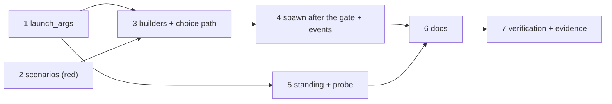

<!-- Authored per the the-loop:writing skill. -->

# Tasks: a released work item is launched with the arguments the operator declared

> The last spec artifact (bugfix → design → testing plan → tasks). A DAG of implementation
> tasks derived from the design and the testing plan.

## Task list

- [x] 1. One resolver for a harness's launch arguments
  - `cli/the_loop/modelchoice.py`: `launch_args(config, routing_args=None)` over
    `harness_args`, covering every harness named in either home; the conflict logged once
    and reported as a `config_findings` warning
  - _Depends on:_ none
  - _Requirements:_ R1.1, R1.3, R1.4
  - _Test:_ T1 — `pytest cli/tests/test_modelchoice.py -k launch_args or both_homes` (red→green)

- [x] 2. The regression scenarios, red
  - `cli/tests/test_spawn_gate_integration.py`: T2 (the report's check, through
    `poller.daemon._build_dispatcher`), T3 (deprecated home), T4 (the frozen model reaches
    the post-gate spawn and the record), T6 (the events carry the argv), T9 (a forged model
    buys nothing on that path)
  - Run them and record the failures before task 3
  - _Depends on:_ none
  - _Requirements:_ R4.1, R4.2
  - _Test:_ T2, T3, T4, T6, T9 (red)

- [x] 3. Every adapter builder takes the resolver; the choice path starts from the adapter
  - `cli/the_loop/poller/daemon.py`, `cli/the_loop/webhook/daemon.py`,
    `Dispatcher.reload`: `build_adapters(launch_args(cli_config, routing.harness_args), …)`
  - `cli/the_loop/webhook/dispatcher.py`: `_adapter_for(work_item, harness, cwd="")` with
    `effective_args(adapter.extra_args, …)`
  - `cli/tests/test_dispatcher_choice.py`: the fixture builds its adapter through
    `launch_args`, so the existing suite runs against the real wiring
  - _Depends on:_ 1, 2
  - _Requirements:_ R1.1, R1.2
  - _Test:_ T2, T3 (green), T5 — `pytest cli/tests/test_dispatcher_choice.py`

- [x] 4. The spawn resolves after the gate, and the events carry the argv
  - `cli/the_loop/webhook/dispatcher.py`: `_spawn_for` checks the adapter exists, prepares
    the workspace, asks `on_arm`, **then** resolves `_adapter_for(…, cwd)`;
    `_spawn_tmux` takes the resolved `(model, effort)`; `session.spawned`,
    `session.respawned` and `session.pr_spawned` gain the argv fields; the catalogue
    entries in `eventlog.EVENT_TYPES` say so
  - _Depends on:_ 3
  - _Requirements:_ R1.5, R2.1, R2.2
  - _Test:_ T4, T6, T9 (green)

- [x] 5. The other readers: standing sessions and the probe
  - `cli/the_loop/standing.py` and `cli/the_loop/core/standing.py`: inherit
    `launch_args(config).get(harness)` when `harnessArgs` is omitted
  - `cli/the_loop/commands/models_cmd.py`: `build_adapters(launch_args(config))` for the
    probe and the findings
  - `cli/the_loop/api/routes.py` and `docs/api-specs/openapi/the-loop.v1.yaml`: the
    `harnessArgs` description names both homes
  - _Depends on:_ 1
  - _Requirements:_ R3.1, R3.2
  - _Test:_ T7 — `pytest cli/tests/test_standing.py cli/tests/test_standing_integration.py -k inherit`; T8 — `pytest cli/tests/test_models_cmd.py -k launch` (red→green)

- [x] 6. Documentation and capability docs
  - `docs/config/cli/harnesses-options.md`, `docs/config/cli/routing-options.md`,
    `docs/config/cli/standing-sessions-options.md`: `harnesses[].args` is read by every
    spawn path, the standing sessions and the probe; `routing.harnessArgs` is deprecated
    and loses to it, with the conflict reported
  - `docs/capabilities/interactive-sessions.md`, `docs/capabilities/standing-sessions.md`,
    `docs/capabilities/observability.md`: behaviour clauses and history rows
  - `skills/the-loop/reference/automation.md`, `docs/capabilities/webhook-triggers.md`:
    the bypass-acceptance sentence names the launch arguments rather than `harnessArgs`
  - `evidence/documentation.md`
  - _Depends on:_ 3, 4, 5
  - _Requirements:_ — (ready-to-ship gate)
  - _Test:_ T11

- [x] 7. Verification, reviews and evidence
  - Run every activity of `testing-plan.md`, fill its results table; write
    `evidence/self-review.md`, `evidence/critic-review.md`, `evidence/security-review.md`,
    `evidence/final-validation.md`, `evidence/pull-requests.md`
  - _Depends on:_ 6
  - _Requirements:_ R4
  - _Test:_ T10, T11

## Dependency graph (DAG)

## Checkpoints

After task 2: the five new scenarios fail for the reasons `bugfix.md` names (empty argv;
no model on the post-gate spawn). After task 4: they pass, and the choice suite passes
against the rewired fixture. After task 6: `make check` (lint, format, typecheck,
config validation, full suite) is green. Then `verification` executes the plan and the
record is written in `testing-plan.md` § Verification results.
