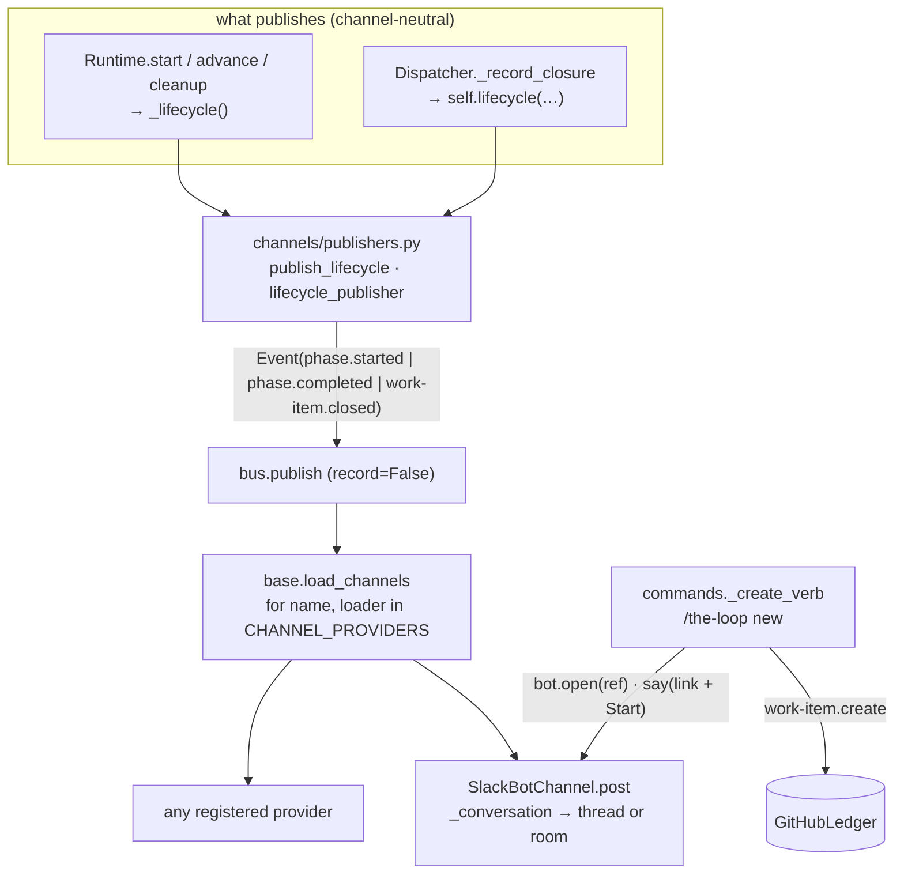
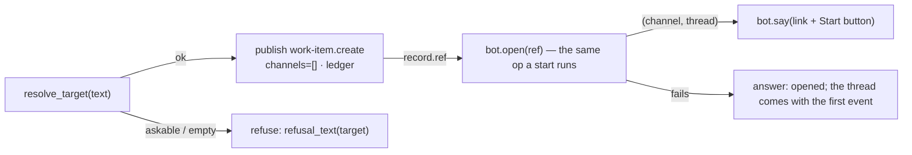
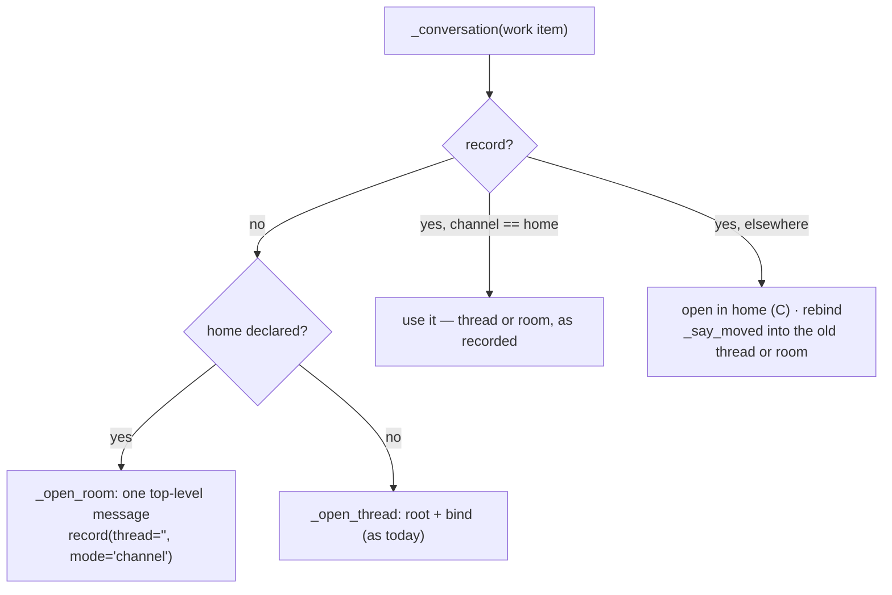

<!-- Authored per the the-loop:writing skill. -->

# Design: a work item's whole life is told to every channel, and Slack can begin one

> Phase 2 of 4 (requirements → design → testing plan → tasks). Derives from
> `requirements.md`. MUST be reviewed and approved before moving to test planning.

## Overview

**One sentence: three catalog rows the runtime and the dispatcher publish, one slash verb
that reuses the kickoff's tail, one conversation shape (`mode: channel`) the Slack channel
resolves in the same three-case function it already has, and a provider table where a
channel type used to be a name in code.**



Everything below is about the seams those arrows land on.

## §1 The catalog rows

Three rows in `channels/events.py`, grouped as `LIFECYCLE_EVENTS`:

| Event | Subscribable | Publishable | Recorded | Why not recorded |
|---|---|---|---|---|
| `phase.started` | yes | no | no | the ticket carries the `loop:<phase>` label, the repository the state file |
| `phase.completed` | yes | no | no | same |
| `work-item.closed` | yes | no | no | the closure **is** the ledger's record |

`NOTIFICATION_EVENTS` is untouched: it is the `notify` hook's vocabulary, and the test that
pins the shipped graphs' `notify` events to it keeps its meaning. The lifecycle rows are
`origin="loop"` like the notifications, so `channels status` prints them under the same
heading and the docs table gains three lines.

## §2 The publisher

`channels/publishers.py` already owns the two things the daemons hand the bus — the comment
publisher and the conversation opener — and both have the shape this needs: *config per
call, nothing built without a `channels` section, never raises*. The lifecycle publisher is
the third:

```python
def publish_lifecycle(event_type, work_item, text, detail, cli_config, url="") -> bool:
    if not cli_config or not cli_config.get("channels"): return False
    publish(Event(event_type, work_item, text, url, detail, source="loop"), cli_config, record=False)

def lifecycle_publisher(config_getter) -> Lifecycle:   # (event_type, work_item, text, detail) -> None
```

`record=False` is explicit rather than left to the catalog: the catalog says the same, but a
publisher that will one day be handed a custom event must not write a comment by accident.

**The runtime calls the function; the dispatcher takes the callable.** The runtime already
holds the CLI config (`self.config`, what `notify` reads as `cli_config`) and is
constructed in one place, so a seam would be ceremony. The dispatcher is constructed by two
daemons and the core facade over a *reloadable* config getter, and already takes `opener`
the same way — so `lifecycle` sits beside it, and `None` means "publish nothing", which is
what every existing test and embedder gets.

## §3 Where the runtime publishes

One private method, called from three places:

```python
def _lifecycle(self, item, *, event_type, node, **detail): ...
```

| Verb | After | Publishes |
|---|---|---|
| `start` | the entry chain of the first node | `phase.started` for the first node's phase |
| `advance` (edge taken) | `state.enter(target)` + the target's entry chain | `phase.completed` for the node left (outcome, `to`) **if** the phases differ, then `phase.started` for the target |
| `advance` (terminal) | `graph.completed` | `phase.completed` for the terminal node |
| `cleanup` | the `cleanup` entry chain | `phase.started` for `cleanup` with `from` |
| `force` | — | nothing (no entry chain, no label) |

"The phases differ" is `self.graph.node(a).phase != self.graph.node(b).phase`, with `""`
meaning "no phase". A node with no phase neither starts nor completes one: entering
`requirements-approval` from `requirements-definition` compares `""` to
`requirements-definition` — different — so the naive rule would fire. The rule is
therefore **the phase of the label**: the phase a node *carries* is the phase it declares,
else the phase of the node before it. Concretely the runtime carries `phase_of(node_id)`
as "this node's `phase`, or the current phase when it declares none", so an approval node
inherits its author node's phase and the transition into it is silent (R1.3).

The publish sits **after** the entry chain and the state save, beside `graph.started` /
`graph.advanced`, so a channel is told about a phase whose label is already set and whose
pointer is already persisted — a subscriber that reads the ticket on the event finds it
consistent.

The text is fixed words: `the-loop: <id> started phase *<phase>* (<node>)` and
`the-loop: <id> completed phase *<phase>* (<node>: <outcome>)`; a human node's start says
`— waiting on a person`. Detail: `node`, `phase`, `loop`, `actor`, and `outcome` / `to` /
`from` where they apply.

## §4 Where the dispatcher publishes

`_record_closure` is the one place a work item's end is written (issue-329), and it is
already ordered — owner check, control clear, roster clear, declaration clear, stamp. The
publish goes **between the owner check and the clears**:

```python
owner = self._owner_of(work_item)
if owner is not None: …; return          # a delivering PR: not a work item (R3.3)
self._announce_closed(work_item, routed, reason)   # ← before any clear (R3.1, A7)
self.control_store.clear(work_item); …; self.channel_store.clear(work_item)
```

Ordering is the whole design: after `channel_store.clear` the Slack channel's `home_for`
answers the central channel, and the room the people are in would hear nothing.

## §5 `/the-loop new`

A fourth verb family in `channels/commands.py`, `create`, whose grant is the existing
`work-item.create`. `parse_invocation` recognises `new` (and `create`) as the first token
and hands the **rest of the text** through as `target` — the only family whose target is
prose, and it is prose the kickoff already accepts from a top-level message.

The handler is the kickoff's tail with the thread step swapped:



`_open_work_item` in `inbound.py` binds the member's *own* thread and replies in it; a
slash command has no thread, so the conversation is opened the way a start opens it
(issue-317, `origin="kickoff"` on the record because a member's gesture began it). The
"Opened …" reply goes into that thread with the Start button under the same
`command_buttons_for("start")` rule, and the ephemeral answer carries the link and
`<#channel>`.

Why refuse rather than ask (R4.3): issue-349's picker writes its outcome onto the question
message, and an ephemeral message cannot be edited or found again by `ts`. The refusal text
names the candidates and the prefix, which is the whole of what the picker teaches.

`handle_slash_command` gains two seams the kickoff path already has — `create_issue` and
`client_factory` — so the test drives it with the fake Slack client and the fake writer,
no network.

## §6 The room conversation

`SlackBotChannel._conversation` keeps its three cases; what changes is *what "open in the
home" means* when the home is a declared room:



The record gains one optional key, `mode` (`thread` | `channel`; absent means `thread`).
`ChannelState.conversation_for(work_item)` returns `(channel, thread)` for either shape —
`thread == ""` for a room — and is what `post` / `open` read; `thread_for` keeps its
contract (a thread or `None`) for the inbound reader, which must never treat a room as a
thread. `ChannelStores.bindings()` accepts a record with a `thread` **or** `mode:
channel`; `_with_bindings` registers a thread map entry only when there is a thread.

`post` passes `thread_ts=thread or None` — today's code passes `bound[1]`, which for a
room would be `""` and which Slack rejects. `PostResult.thread` is the posted message's
`ts` for a room (as it already is for an unbound post) and the thread ts for a thread.

`_say_moved` already takes `(channel, thread)` pairs; with an empty thread it posts
top-level in the old room, which is exactly the pointer a room needs.

Why the declaration decides the mode (decision-130): a declared room exists for one work
item, so a thread inside it is a second container around a single subject; the central
channel is shared by every work item, so threads are what keep them apart. A per-declaration
flag was considered and deferred — nobody has asked for a threaded room, and a flag nobody
sets is a branch nobody tests.

## §7 The provider table

`channels/base.py`:

```python
Loader = Callable[[Mapping[str, Any], Optional[Callable]], Optional[Channel]]
CHANNEL_PROVIDERS: Dict[str, Loader] = {"slack": _load_slack}

def load_channels(cli_config, client_factory=None):
    … (the fail-closed section checks, unchanged) …
    return [c for name, load in CHANNEL_PROVIDERS.items() if (c := load(config, client_factory))]
```

`_load_slack` is the body `load_channels` has today. The table is module-level and
mutable on purpose — an embedder's channel is `CHANNEL_PROVIDERS["jira"] = load_jira` — and
the test for R6.3 does exactly that with a fake, drives `Runtime.advance`, and asserts the
fake received `phase.started`. `workchannels.CHANNEL_TYPES` (the declaration grammar) stays
where it is; the two tables answer different questions (*may a work item declare a room of
this type?* vs *is a channel of this type enabled?*) and a Jira channel adds a row to each.

## §8 Alternatives considered

| Option | Verdict |
|---|---|
| A `notify` hook on every node's entry and exit chain | Rejected. Five graphs × every node, and a custom graph would have to know the rule; the runtime already emits `graph.advanced` for every transition, so the lifecycle belongs beside it (R1.8) |
| Node-level events (`node.entered`) instead of phase-level | Rejected. The review chain alone is six nodes with no phase; a channel would see six messages for one label change. The label is what a person already follows |
| Record `phase.*` on the ledger as comments | Rejected. The label is the ledger's record of the phase; a comment per transition is noise the ingress then has to classify and drop (A6) |
| Fire `work-item.closed` from `cleanup_work_item` | Rejected. Cleanup is local reclamation and runs after the declaration is cleared; the closure path is where the item *ends* and where the room is still known (R3.1) |
| Ask which repository from the slash command with an ephemeral picker | Deferred. The picker's outcome is written onto the question message (issue-349), and an ephemeral one cannot be edited; the prefix is the answer (R4.3) |
| A `mode` on `add-channel` | Deferred. See §6 |

## §9 What this costs

- **Two more Slack calls per phase change** for a channel subscribed to both events (one
  each). A phase change is minutes to days apart; the ask and the comment mirror already
  post more.
- **A room is louder than a thread.** That is the point, and the operator chose it by
  declaring the room; the central channel is unchanged.
- **A conversation opened as a thread in a room stays a thread** (R5.5). The operator can
  `remove-channel` and `add-channel` to re-open it as a room; documenting that beats a
  migration that moves a live conversation under people.
- **`phase.completed` never fires for a phase a cleanup interrupts** (R1.4). `work-item.closed`
  or `phase.started(cleanup)` is what a channel sees instead, which is the truth.
- **One more optional key** in a portable record's `channels` entry. A record without it
  reads as a thread, so no migration.

## §10 What to check first

1. `runtime.py::Runtime._lifecycle` and `phase_of` — the inherited-phase rule (R1.3) is
   the one place a wrong answer produces either silence at every gate or a message at
   every node.
2. `dispatcher.py::_record_closure` — the publish is above the three clears.
3. `slack.py::_conversation` / `_open_room` — case two must be byte-identical for a
   thread in the home, whichever home.
4. `commands.py::_create_verb` — what reaches the ledger is `target.repo`, a declared slug.
5. `base.py::load_channels` — the fail-closed checks precede the table walk.
