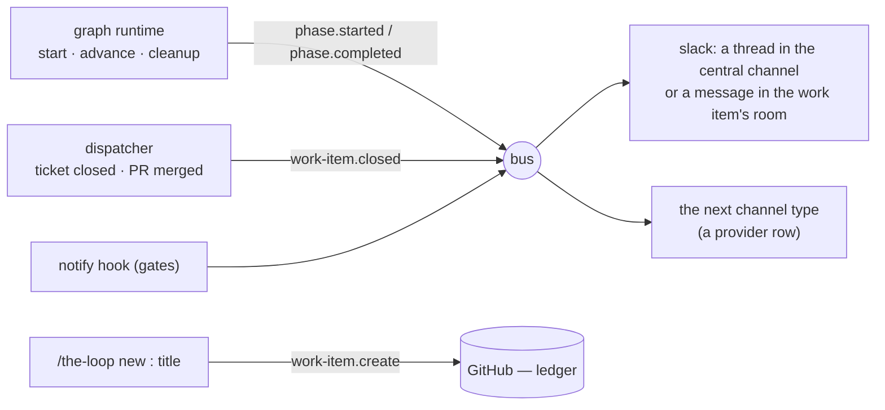

<!-- Authored per the the-loop:writing skill. -->

# Requirements: a work item's whole life is told to every channel, and Slack can begin one

> Phase 1 of 4 (requirements → design → testing plan → tasks). Following the Kiro spec
> approach (<https://kiro.dev/docs/specs/>). This phase MUST be reviewed and approved by
> the required collaborators before moving to design.

## Introduction

[Issue-378](https://github.com/MadaraUchiha-314/the-loop/issues/378): *"Here's how I want
to manage an entire work item from slack … Currently the problem is that slack channel
getting an event is a hit or a miss."* The ticket then lists six gestures — create from a
slash command; a thread or a channel message depending on how the collaboration is shaped;
every phase's start and end; every human gate; a reaction on every comment (done, issue-325);
and the close — and two constraints: nothing about *delivering* an event may be Slack's, and
Slack's own code is for Slack's API and rendering only.

The hit-or-miss is not a transport fault. It is that **most of a work item's life is not an
event**. Since issue-309 every channel is a subscriber on one bus, and the bus carries
exactly what somebody publishes onto it: the ask, the comment mirror, and the `notify`
hook — which fires only where a graph author wrote `{hook: notify}` on a node. Four nodes
of the outer loop have one. The other seven phases start and end in silence, a work item
closed on GitHub is announced nowhere, and the one way to *begin* a work item from Slack is
a top-level message in the central channel.

| Today | Consequence |
|---|---|
| A phase transition is a `graph.advanced` line in the machine's event log | A channel hears from the loop at the three approval gates and at `complete`, and nothing in between |
| `work-item-complete` fires from the `complete` node | An issue closed by a person, a `wontfix`, a merged pull request that ends the item — none of these reach a channel |
| The `/the-loop` command has verbs for a work item that exists | The only way to file one from Slack is a top-level message in the central channel |
| A declared room (issue-375) gets a thread root, like the central channel | In a room that exists for one work item, every update is a reply inside one thread nobody else in the room can see without opening it |
| `load_channels` names Slack in code | The next channel type is a code change to the bus's loader, not a row in a table |

**The unit of the change is three lifecycle events every channel may subscribe to, one
slash-command verb, and one rule for where a room's messages go.** No new grant, no new
scope, no new config key.

## Requirements

### R1 — every phase of a work item's loop is an event on the bus

**User story:** As a member following a work item on Slack, I want to be told when each
phase starts and finishes, so that I see the work move rather than only the moments it
needs me.

#### Acceptance criteria (EARS)

1. WHEN the runtime enters a node whose `phase` differs from the phase of the node it left
   (or enters the graph's first node) THEN the system SHALL publish `phase.started` on the
   bus, carrying the work item's ref, its URL, the node id, the phase, the loop's name and
   the node's actor as detail.
2. WHEN the runtime leaves a node on a satisfied outcome and the next node's `phase` differs
   (or the node was terminal) THEN the system SHALL publish `phase.completed` for the phase
   it left, carrying the outcome and the node entered next.
3. WHEN two consecutive nodes carry one phase (`requirements-definition` →
   `requirements-approval`) THEN the system SHALL publish nothing for the transition between
   them — a phase is what the `loop:<phase>` label says, and the label did not change.
4. WHEN the `cleanup` node is entered THEN the system SHALL publish `phase.started` for it
   with the node it came from as detail, and SHALL NOT publish `phase.completed` for the
   phase it interrupted — a cleanup ends a walk, it does not satisfy a gate.
5. WHEN a walk is **forced** (`the-loop graph force`) THEN the system SHALL publish nothing:
   a force runs no entry chain and sets no label, and the lifecycle follows the label.
6. Both events SHALL be rows of the catalog — subscribable by any channel, publishable by
   none, **not recorded** on the ledger: the ticket already carries the label and the
   repository the state file, so a comment per transition would be noise the ledger's own
   ingress then has to drop.
7. The publish SHALL be best-effort in the bus's sense: a channel that raises or a config
   with no `channels` section changes nothing about the transition, and the runtime's
   verdict, pointer and label are what they were before this work item.
8. Every shipped graph SHALL fire these without any change to its YAML: the runtime
   publishes them, not a hook a graph author has to remember.

### R2 — a human gate is always announced

**User story:** As an approver, I want every stop that waits on me to reach the channel I
read, so that a work item never parks in silence.

#### Acceptance criteria (EARS)

1. Every node of the outer loop with `actor: human` SHALL either carry a `phase` of its own
   (so R1.1 announces it with `actor: human` in the detail) or run a `notify` hook on its
   entry chain (`phase-approval-pending`, `pr-review-pending`) — and a test SHALL pin that
   invariant against the shipped graph, so a gate added without a notification fails CI.
2. WHEN a channel subscribes to `phase.started` THEN a message for a human node SHALL say
   it is waiting on a person.

### R3 — a closed work item is announced on every channel

**User story:** As a member of a work item's room, I want to be told when the item ends,
so that the room's last message is the end of the story rather than a question nobody
answers.

#### Acceptance criteria (EARS)

1. WHEN the dispatcher records a work item's closure — its issue closed, or the pull
   request that *is* the work item merged or closed — THEN it SHALL publish
   `work-item.closed` on the bus **before** it clears the item's collaboration-channel
   declaration, so the announcement lands in the room the item was worked in.
2. The event SHALL carry the closure's state (`closed` | `merged`), its reason, the actor
   GitHub named (when any) and the ref, and no comment text.
3. A pull request that delivers a tracked work item ending (`work_item.pull_request_ended`)
   SHALL publish nothing: it is not a work item, and its owner's closure is the event.
4. `work-item.closed` SHALL be a catalog row: subscribable, not publishable, not recorded —
   the closure *is* the ledger's own record.
5. A dispatcher built without a lifecycle publisher (tests, embedders) SHALL behave as it
   does today.

### R4 — a work item can be created from the slash command

**User story:** As an authorized member, I want `/the-loop new <repo>: <title>` to open a
work item, so that I can begin one from any conversation in Slack without knowing which
channel the kickoff reads.

#### Acceptance criteria (EARS)

1. WHEN an authorized member runs `/the-loop new <text>` AND the channel holds the
   `work-item.create` grant THEN the system SHALL resolve the text's repository exactly as a
   top-level kickoff does (a first-line `<repo>:` prefix against the declared
   `repositories`, else `kickoff.repo`) and SHALL create the issue through the ledger with
   the same `work-item.create` event, the same `kickoff.labels` and the member as its
   actor.
2. WHEN the issue is created THEN the system SHALL open the work item's conversation on
   every conversational channel through the same operation a start uses — on Slack, a
   thread rooted on the work item in its home channel — reply in it with the link and the
   **Start** button (where a press can be received), and answer the command ephemerally
   with the link and where the thread is.
3. WHEN the text resolves to no repository, to several, or to one that is not declared
   THEN the system SHALL refuse ephemerally with the kickoff's own refusal text (naming the
   declared candidates) and SHALL create nothing — a slash command has no message to hold
   and no thread to ask in, so the `<repo>:` prefix is the answer.
4. WHEN the text is empty, or nothing but a prefix THEN the system SHALL refuse and create
   nothing.
5. The verb SHALL be authorized before anything is read from the text, SHALL be judged
   under the `work-item.create` grant, SHALL act once per `trigger_id`, and SHALL be listed
   by `/the-loop help` with its grant.
6. A failure to open the conversation SHALL NOT fail the creation: the issue exists, the
   answer says so, and the first event opens the thread lazily as before.

### R5 — a declared room is channel-based; the central channel stays thread-based

**User story:** As a member of `#tmp-issue-378`, I want the-loop's updates to be messages
in the channel, so that the room I am in reads as the work item's timeline rather than one
collapsed thread.

#### Acceptance criteria (EARS)

1. WHEN a work item has a declared collaboration channel (issue-375) AND has no
   conversation bound there THEN the Slack channel SHALL open its conversation as the
   **room itself**: one top-level message naming the work item, and a conversation record
   with an empty thread and `mode: channel`.
2. WHEN a work item's conversation is the room THEN every event for it SHALL be posted as a
   **top-level message** in that room, never as a reply.
3. WHEN a work item has no declared channel THEN nothing SHALL change: the thread root is
   opened in `channels.slack.channel` and every event is a reply into it (issue-312).
4. WHEN a work item is declared into a room after its conversation started as a thread
   THEN the conversation SHALL move to the room as R5.1 describes, the thread it left SHALL
   be told where it went (issue-375 R2.2), and the old thread SHALL be unmapped.
5. WHEN a conversation is already bound as a thread inside a declared room (opened before
   this change) THEN it SHALL keep that shape: a restart never changes the shape of a
   conversation that exists.
6. A room conversation SHALL be listed by `the-loop channels threads` with its mode, SHALL
   be counted by `channels status`, and SHALL be the conversation the inbound pipeline
   already attributes the room's messages to — a reply under any of the-loop's messages
   there is a message on the work item, as issue-375 R3.2 already says.
7. `open` SHALL stay idempotent for a room: a second start posts nothing.

### R6 — delivering an event is nobody's channel in particular

**User story:** As the person adding the Jira channel, I want a channel type to be a
provider row and a module, so that the bus, the runtime and the dispatcher never learn
its name.

#### Acceptance criteria (EARS)

1. The lifecycle publishers (R1, R3) SHALL speak in `Event` and `bus.publish` only, and
   SHALL name no channel type.
2. `load_channels` SHALL iterate a **provider table** (`name → loader`) rather than
   naming Slack, so a second type is a row plus a module; the loader's contract SHALL be
   *config in, an enabled channel or nothing out*, failing closed exactly as today.
3. A channel of a type the-loop does not ship, registered in that table by an embedder,
   SHALL receive the lifecycle events end-to-end — pinned by a test that registers a fake
   provider and drives a walk through the runtime.
4. The `notify` hook's "nothing subscribed" message SHALL name the channel's own
   `subscribe` list, not Slack's.

### R7 — the change ships with its documentation

1. The catalog table in the channels options page, the schema's `subscribe` description
   (both copies), the shipped config template and this repository's config comment SHALL
   list the three new events; the existing catalog-to-docs test SHALL pass.
2. `docs/capabilities/channels.md` SHALL describe the lifecycle events, the room mode and
   the `new` verb in *Current behaviour*, with a history row.
3. The Slack guide SHALL show `/the-loop new` in the modes table, the slash-command
   reference and *Starting a work item from Slack*, and SHALL say what a declared room
   looks like now.
4. `docs/capabilities/process-graph.md` SHALL say the runtime publishes the lifecycle.

## Non-functional requirements

- **Cost per transition.** One `bus.publish` per phase change — a config read the
  runtime already holds, and one Slack call per subscribed channel. A config with no
  `channels` section builds no event at all.
- **Observability.** Every publish is a `bus.published` line; every post `channel.posted`
  or `channel.post_failed`; a room opened is `channel.thread_opened` with `mode: channel`;
  the verb's receipt is `channel.command_received` / `channel.command_completed` as for
  every other verb. Payloads carry ids and event types, never text.
- **Compatibility.** No config version bump: no key is added, renamed or removed. A
  channel that subscribes to nothing new sees nothing new. A conversation record without
  `mode` is a thread.

## Security considerations

Two boundaries move, and neither widens who may speak or what a message may become.

| # | Abuse case | Mitigation |
|---|---|---|
| A1 | `/the-loop new` text reaches a repository argument, a path or an argv | The text goes through `kickoff.resolve_target` — the same grammar the top-level kickoff uses — and what reaches the ledger is a **declared** slug from the operator's config, never the member's text (R4.1, R4.3). The title and body are the same untrusted prose a kickoff already hands the issue writer |
| A2 | An unlisted member files issues through the command | Authorized before the text is read (R4.5), through the same allow-list every inbound surface uses; an unlisted member is dropped and answered with nothing |
| A3 | A channel without the grant opens work items because the verb is new | The verb family's grant is `work-item.create`, the same row the kickoff needs; without it the command is refused and named (R4.5) |
| A4 | A replayed slash payload files the same issue twice | A trigger acts once (`_first_sight`), as for every existing verb |
| A5 | A lifecycle event carries a comment's text or a token into a channel | The events are composed from fixed words, the ref, the node id, the phase and the outcome (R1.1, R3.2). Nothing from a comment, an artifact or the environment is read |
| A6 | A phase transition writes a comment onto the ticket under the operator's credential | `phase.*` and `work-item.closed` are **not recorded** (R1.6, R3.4); the bus records nothing for them and the ledger's ingress never sees them |
| A7 | The closure announcement lands in a room another work item has since claimed | It is published **before** the declaration is cleared (R3.1), while the room is still this item's; after the clear nothing can be posted there for it |
| A8 | A room conversation lets somebody's reply in it reach the work item who could not before | No: attribution in a declared room is issue-375's rule, unchanged, and authorization is the same allow-list. The mode changes where the-loop **posts**, not what it **reads** |
| A9 | A forged conversation record with `mode: channel` and no thread posts elsewhere | The record's channel is the declared room resolved from the work item's own portable record; a record naming a channel that is not the home is treated as *bound elsewhere* and moved to the home (R5.4), exactly as a thread record is today |

**Fail closed:** no `channels` section → no lifecycle publish; no grant → no `new`; no
declared repository → no creation; an unreadable declaration → the central channel, as
today.

## Out of scope

- A per-declaration choice of thread or channel mode. The room is channel-based because it
  is the work item's own; a `mode` flag on `add-channel` is a later work item if anyone
  wants a threaded room.
- A repository picker for the slash command. An ephemeral message cannot be edited to show
  the outcome, and the `<repo>:` prefix already answers the question.
- Reading thread replies under the-loop's room messages in **poll** mode. Issue-375
  documented that an unbound thread's replies are read only under Socket Mode; the room
  mode inherits it.
- A Jira channel. This work item makes the next type a row; it does not add one.

## Open questions

None raised on the ticket at the time of writing. The two design choices worth a human's
eye — a declared room is channel-based, and the lifecycle is the runtime's rather than a
hook's — are recorded in [decision-130](../../decisions/decision-130.md).

## Review comments

> Appended by the-loop's `record-feedback` hook when a human gate approves with
> comments (issue-109).
