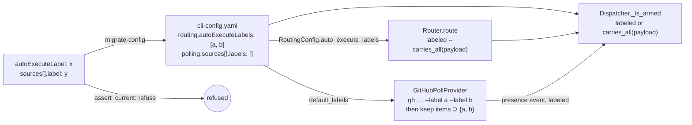

<!-- Authored per the the-loop:writing skill. -->

# Design: a work item is armed by a set of labels, all of which must be present

> Phase 2 of 4. Derives from `requirements.md`. Reviewed with `testing-plan.md` at one
> gate (`design-approval`).

## Overview

**One key becomes a list, one predicate becomes all-of, and the four readers of the old
string read the list through that predicate.** Nothing else moves: the arming gate keeps
its place in the dispatcher, the poller keeps its `gh` listing, and the migration module
gains one more mechanical move.

## §1 The predicate

`router.event_carries_labels(payload, labels)` answers *does this event's item carry every
one of these labels*. It is `all(event_carries_label(payload, l) for l in labels)` with
an empty list answering `False` — the fail-closed direction R1.5 asks for, and the reason
`all([])` is not used bare. `event_carries_label` stays as the single-label primitive: it
already reads the label being added in a `labeled` action together with the item's
current set, which is what R1.4 needs for free.

`normalize_labels(value)` beside it turns what the config held into the list every reader
uses: `None`/`""` → `[]`, a string → `[string]`, a list → its non-empty entries as
strings, duplicates dropped in order. The schema forbids a string, but a hand-built
mapping reaches `from_mapping` without the schema, and one helper is cheaper than four
defensive branches.

## §2 The readers

| Reader | Today | After |
|---|---|---|
| `RoutingConfig.auto_execute_label: str` | reads `autoExecuteLabel` | `auto_execute_labels: List[str]`, reads `autoExecuteLabels` through `normalize_labels`, default `["the-loop: auto-execute"]` |
| `Router(auto_execute_label=…)` | `event_carries_label` in `route` | `Router(auto_execute_labels=…)`, `event_carries_labels` |
| `Dispatcher._is_armed` | recomputes from the payload | same, through `event_carries_labels` |
| `Dispatcher._refuse` (spawn-policy reason) | names the label | names the list (R1.6) |
| `GhClient.list_labeled_issues / list_labeled_prs / _list_prs` | one `--label x` | one `--label` per label, in order |
| `GitHubPollProvider(label=…)` | lists, then tracks | `labels=…`; `_list_scope` / `_list_issues` keep only items whose label set is a superset (R2.1) |
| `GitHubPollProvider.from_source(default_label=…)` | `source["label"] or default` | `default_labels=…`; `normalize_labels(source.get("labels")) or default_labels` |
| `poller.build_provider` / `daemon._build_providers` | `default_label` | `default_labels` |
| `presence_event` | `event_carries_label` | `event_carries_labels` |
| `webhook/daemon.py`, `poller/daemon.py` | pass the string | pass the list |

`gh` forwards each `--label` to GitHub's list filter, which returns items carrying every
named label. The provider re-checks the listing regardless (one set comparison per item,
already in memory) so the tracking decision never depends on a CLI's filter semantics —
and so a test can prove R2.1 with a fake `gh` that returns too much.

## §3 The migration

Config version `0.9.0` → `0.10.0`. Two removed keys, both moved rather than dropped
because each has a lossless replacement:

| Removed | Replacement | Move |
|---|---|---|
| `routing.autoExecuteLabel: x` | `routing.autoExecuteLabels: [x]` | wrap; `""` becomes `[]` — which the schema then refuses, and the report says to declare at least one |
| `polling.sources[].label: x` | `polling.sources[].labels: [x]` | wrap; `""` is removed with no replacement (absent already means *reuse routing*) |

`needs_migration` detects either key; `assert_current` refuses either, in the voice the
other refusals use — the key, why it is not being ignored (a custom label silently
replaced by the shared default is *wider* than what the operator set), the command.
`migrate_cli_config` gains `_migrate_auto_execute_labels(data, report)`, called before the
version stamp, idempotent, and keeping an already-present `autoExecuteLabels` over the old
key with a note (R3.4). Only `github` sources are touched — `label` under another provider
is that provider's key, as `repos` was.

## §4 The schema and the surfaces

- `.the-loop/cli-config.schema.json` and its byte-identical package copy: `routing.autoExecuteLabels`
  (`array` of `string`, `minItems: 1`, `uniqueItems: true`, default
  `["the-loop: auto-execute"]`); `polling.sources[].labels` (`array` of `string`, default
  `[]`). The old properties are removed — `routing` has `additionalProperties: false`, so
  the schema and the gate refuse the same thing.
- The template `cli-config.yaml`, this repository's `.the-loop/cli-config.yaml`, and
  every doc that names the key (the inventory is `tasks.md` task 5).
- The agent's own commands (`work-on`, `execute-tasks`, `reference/automation.md`): apply
  **every** label in the list, not one.

## UI/UX design

N/A — no user-facing surface beyond configuration and documentation.

## Data models

`RoutingConfig.auto_execute_labels: List[str]`; `GitHubPollProvider.labels: List[str]`.
No state file, portable record or event-log field changes.

## Error handling

- An empty list at runtime (a hand-built mapping) arms nothing; the daemon's start-up
  line names the list, so `[]` is visible.
- A source `labels` that is a string is read as one label; a non-string entry is
  stringified. Neither is reachable through a schema-valid file.
- The migration never raises on a malformed old value: a non-string `autoExecuteLabel`
  is stringified and reported, as the other moves do.

## Security design

- **AuthN/AuthZ:** unchanged. The list narrows which items are *looked at*; who may start
  one is still `routing.authorizedUsers` + `control`, checked after the label.
- **Input validation & injection surfaces:** labels reach `gh` as separate argv entries
  (no shell); they reach nothing else. Exact string equality against payload label names.
- **Secrets handling:** none involved.
- **Least privilege:** unchanged; applying a label still needs triage rights, and the
  poller's listing gets narrower, not wider.
- **Fail-closed behaviour:** `event_carries_labels([], …)` is `False`; an un-migrated
  config is refused at load (`load_cli_config` → `assert_current`), so no daemon runs on
  the default in place of a custom label.
- **Abuse-case coverage:** subset of labels → `test_event_carries_labels_requires_every_label`,
  `test_an_item_missing_one_label_does_not_spawn`; wrong label added → the same unit
  test's `labeled` case; empty list → `test_an_empty_label_list_arms_nothing`;
  old key → `test_an_un_migrated_label_key_is_refused`.

## Testing strategy

Unit tests pin the predicate, the config reader, the `gh` argv and the provider-side
filter; the migration is tested both ways as every migration is; one integration scenario
per ingress proves the all-of rule end to end (`Scenario: an item carrying only some of
the labels is not armed`, `Scenario: the poller drops a listed item missing one label`);
the existing docs-parity, schema-parity and config-validation suites gate the surfaces.
Detail in `testing-plan.md`.

## Trade-offs & decisions

- **All-of, not any-of.** The ticket asks for it, and it is the only semantics under
  which adding a label can only narrow what an instance arms. Recorded in
  [decision-131](../../decisions/decision-131.md).
- **Breaking, with a migration, not a shadow alias.** The doctrine of
  `migrations.py`: a custom single label silently read under a new key would be lost to
  the default. The cost is a config-version bump every operator pays once with
  `the-loop migrate-config`.
- **The provider filters after `gh`.** One set comparison per listed item buys
  independence from `gh`'s filter semantics and a test that does not need a real `gh`.

## Open questions

None.

## Review comments

> Appended by the-loop's `record-feedback` hook when a human gate approves with
> comments (issue-109). Append-only and attributed.
