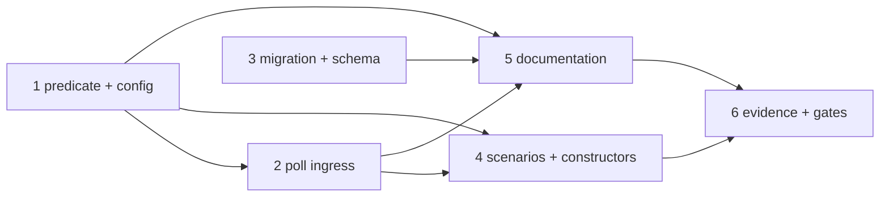

<!-- Authored per the the-loop:writing skill. -->

# Tasks: a work item is armed by a set of labels, all of which must be present

> The last spec artifact (requirements → design → testing plan → tasks). A DAG of
> implementation tasks derived from the design and testing plan.

## Task list

- [x] 1. The predicate and the config reader
  - `cli/the_loop/webhook/router.py`: `normalize_labels`, `event_carries_labels`;
    `Router(auto_execute_labels=…)` flagging through it
  - `cli/the_loop/webhook/dispatcher.py`: `RoutingConfig.auto_execute_labels`,
    `from_mapping` reading `autoExecuteLabels`, `_is_armed`, the refusal reason
  - `cli/the_loop/webhook/daemon.py`: the wiring
  - _Depends on:_ none
  - _Requirements:_ R1.1–R1.6
  - _Test:_ T1, T2, T3 (red→green)

- [x] 2. The poll ingress
  - `cli/the_loop/poller/github.py`: `GhClient` listings take `labels`, one `--label`
    each; `GitHubPollProvider(labels=…)`, `from_source(default_labels=…)`, the
    provider-side superset filter, `presence_event`
  - `cli/the_loop/poller/base.py`, `cli/the_loop/poller/daemon.py`: `default_labels`
  - _Depends on:_ 1
  - _Requirements:_ R2.1–R2.3
  - _Test:_ T4, T5 (red→green)

- [x] 3. The migration and the schema
  - `cli/the_loop/migrations.py`: `CURRENT_CONFIG_VERSION = "0.10.0"`, detection,
    refusal, `_migrate_auto_execute_labels`
  - `.the-loop/cli-config.schema.json` + `cli/the_loop/schemas/cli-config.schema.json`:
    `autoExecuteLabels`, `sources[].labels`; the old properties removed
  - `.the-loop/cli-config.yaml`, `skills/the-loop/templates/cli-config.yaml`: the new
    keys, version `0.10.0`
  - _Depends on:_ none
  - _Requirements:_ R3.1–R3.4, R4.1
  - _Test:_ T6, T9 (red→green)

- [x] 4. The integration scenarios and the renamed test constructors
  - `cli/tests/test_webhook_routing_integration.py`: T7
  - `cli/tests/test_poller_integration.py`: T8
  - every suite constructing `RoutingConfig(auto_execute_label=…)`,
    `Router(auto_execute_label=…)` or `GitHubPollProvider(label=…)`
  - _Depends on:_ 1, 2
  - _Requirements:_ R1, R2
  - _Test:_ T7, T8, T10

- [x] 5. Documentation
  - `docs/config/cli/routing-options.md`, `polling-options.md`, `self-diagnosis-options.md`,
    `channels-options.md`, `index.md` (version); `docs/cli/getting-started.md`,
    `concepts.md`, `state.md`, `commands/sessions.md`, `commands/migrate-config.md`;
    `docs/guide/slack.md`; `docs/reports/gh-queries.md`, `labels-and-dashboards.md`,
    `cli-architecture-survey.md`
  - `skills/the-loop/reference/automation.md`; `commands/work-on.md`,
    `commands/execute-tasks.md`, `commands/upgrade-the-loop.md`
  - `docs/capabilities/webhook-triggers.md`: the Current-behaviour clause and the
    history row; `docs/decisions/decision-131.md` + index
  - _Depends on:_ 1–3
  - _Requirements:_ R4.1–R4.3
  - _Test:_ T9

- [ ] 6. Evidence and the gates
  - `evidence/self-review.md`, `critic-review.md`, `security-review.md`,
    `final-validation.md`, `documentation.md`, `pull-requests.md`; `make check`
  - _Depends on:_ 4, 5
  - _Requirements:_ all
  - _Test:_ T9, T10, T11

## Dependency graph (DAG)

## Checkpoints

After tasks 1–3 the unit suites they name are green; after task 4 the whole `cli`
suite; after task 5 the parity suites and `scripts/validate_config.py`; task 6 is
`make check`. Each red→green transition is recorded in the commit that carries it.

## Review comments

> Appended by the-loop's `record-feedback` hook when a human gate approves with
> comments (issue-109). Append-only and attributed.
