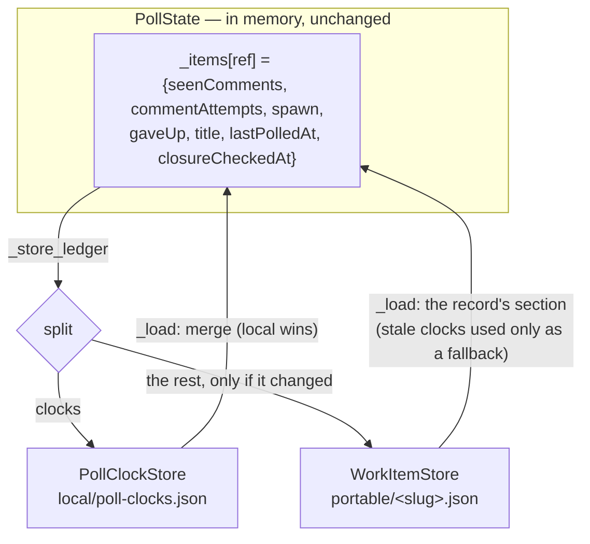

<!-- Authored per the the-loop:writing skill. -->

# Design: the poll clocks are this machine's, not the repository's

> Phase 2 of 4 (requirements → design → testing plan → tasks). Derives from the approved
> requirements. MUST be reviewed and approved before moving to tasks breakdown.

## Overview

**One new machine-local file, and one split at the poller's storage boundary.** The
ledger the poller keeps in memory is unchanged — `lastPolledAt` and `closureCheckedAt`
stay ordinary keys of the dict every method reads and writes — and the split happens in
the two methods that touch the disk: `PollState._store_ledger` peels the clocks off and
writes them to `<state.root>/local/poll-clocks.json`, `PollState._load` merges them back
in. Every caller above that line (`finalize`, `baseline_comments`, `absent_since`,
`note_closure_check`, the closure schedule) is untouched, which is what keeps a storage
change from becoming a behaviour change.

Two consequences fall out of the split rather than being implemented separately:

- the portable record now changes only when the poller **learns** something, so the
  record is written only when its body differs from what was read (R1.6), and a quiet
  cycle leaves the tracked tree alone;
- the record's stale clock keys disappear on that first write, so the upgrade is a
  read-fallback with no migration step (R2.2, R2.3).



## Architecture

The existing components and the one new one:

| Component | Role after this change |
|---|---|
| `the_loop.pollclocks.PollClockStore` **(new)** | the machine's poll clocks: `get`/`put`/`forget`/`all`, one JSON file, atomic write, best-effort |
| `the_loop.state.StateLayout.poll_clocks` **(new property)** | where that file is — `<root>/local/poll-clocks.json`, declared in `GENERATED_PATHS` as local |
| `the_loop.poller.poller.PollState` | splits on write, merges on read; skips a record write whose body is unchanged |
| `the_loop.workitem.WorkItemStore` | **unchanged** — it stores whatever section it is handed |
| `the_loop.reset` | drops the ref's clocks along with its `poll` section |
| `the_loop.core.workitems` | joins the two halves back for every reader of the control plane |

The clock file is machine-wide (one file, every ref), like `local/model-verdicts.json` and
`channels/<channel>.json` — not per-work-item like the session record. The reason is the
writer: one poller process, holding the single-instance lock, writes every entry, and the
whole map is two timestamps per ref. Per-item files would buy nothing and cost one inode
per watched thread.

## Components & interfaces

### `PollClockStore` (`cli/the_loop/pollclocks.py`)

```python
CLOCK_KEYS: Tuple[str, ...] = ("lastPolledAt", "closureCheckedAt")

class PollClockStore:
    def __init__(self, path: str | Path) -> None: ...
    @classmethod
    def beside(cls, portable_dir: str | Path) -> "PollClockStore": ...
    def get(self, ref: str) -> Dict[str, str]: ...       # {} when unknown
    def put(self, ref: str, clocks: Mapping[str, str]) -> None: ...   # {} drops the entry
    def forget(self, ref: str) -> None: ...
    def all(self) -> Dict[str, Dict[str, str]]: ...
```

On disk:

```json
{
  "clocks": {
    "github:octo/repo#15": {"lastPolledAt": "2026-09-18T10:42:00Z"},
    "github:octo/lib#7":   {"lastPolledAt": "2026-09-18T10:42:00Z"},
    "github:octo/repo#9":  {"lastPolledAt": "2026-09-17T08:00:00Z",
                            "closureCheckedAt": "2026-09-18T09:00:00Z"}
  }
}
```

Keyed by the ref itself, work item and pull request alike — refs are globally unique, so
the flat map needs no owner relation, which is the one piece of `poll`-ledger addressing
that does **not** have to be mirrored here.

`beside(portable_dir)` is how every caller that already holds a `WorkItemStore` finds the
file: `<portable_dir>/../local/poll-clocks.json`. `StateLayout.poll_clocks` is the same
path derived the other way, and a test pins the two to each other, so the convenience
cannot drift from the declaration.

Every read is best-effort: a missing, unreadable or malformed file is an **empty** map
(R2.5), and a value that is not a string is dropped entry-by-entry rather than failing the
load. Every write is `tempfile` + `os.replace` and swallows `OSError` with a warning — a
clock must never be what fails a delivery (R-abuse 3).

### `PollState` — the split (`cli/the_loop/poller/poller.py`)

```python
def __init__(self, store: WorkItemStore, clocks: Optional[PollClockStore] = None):
    self.clocks = clocks or PollClockStore.beside(store.root)
    self._stored: Dict[str, dict] = {}   # the body as it is on disk, per ref
```

- `_load(ref)` — reads the section (the work item's own, or its pull-request ledger under
  the owner), remembers it in `_stored`, and returns it merged with `self.clocks.get(ref)`.
  The local clock **wins**; a clock the record still carries is used only when the local
  file has none, which is the whole of the upgrade path (R2.2).
- `_store_ledger(ref, data)` — writes the clocks **first**, then the body, and only when
  the body differs from `_stored[ref]`:

  | `data` | clocks | record |
  |---|---|---|
  | `None` (forget) | `forget(ref)` | `write_section(ref, POLL, None)` — unconditional |
  | a ledger | `put(ref, {k: data[k] for k in CLOCK_KEYS if data.get(k)})` | written only if the clock-free body ≠ `_stored[ref]` |

  Clocks first because the failure that matters is a crash between the two writes: a clock
  written and a body not written means the item is dated but its new comment ids are not
  yet baselined — the next cycle re-reads them and resolves them again, which the ledger
  is already idempotent about. The reverse order risks a body that says a thread was
  handled with no clock recording when, which is the case the closure schedule reads.

### `reset_work_item` (`cli/the_loop/reset.py`)

Gains `clocks: Optional[PollClockStore] = None` (defaulting to `PollClockStore.beside`),
and drops the ref's clocks on a real run. Unconditional rather than only when the `poll`
section was present: a reset is *forget everything this machine holds about this work
item*, and a clock left behind for a record that has gone is exactly the orphan the verb
exists to prevent. Reported under the existing `poll` piece — the clock is part of what
`poll` means, not a new thing an operator has to learn.

### `core.workitems` — the join (`cli/the_loop/core/workitems.py`)

`get_work_item` merges this machine's clocks into the record it returns: into `poll` for
the work item's own ref, and into each entry of `pullRequests` for the pull requests'.
`list_work_items` builds one `PollClockStore` and passes it down, so a listing reads the
file once.

The merge is into **existing** section dicts only — a record with no `poll` section does
not grow one because a clock lingers. The API's contract wording changes from "the
portable record, verbatim" to "the portable record, with this machine's poll clocks"; the
shape the dashboard consumes (`ui/src/api/types.ts::WorkItemRecord.poll.lastPolledAt`) is
unchanged, which is why `ui/src/api/model.ts`'s `lastActivity` fallback and
`core.attention`'s clean-poll rule need no edit at all.

## UI/UX design

N/A — no user-facing surface changes. The dashboard's rendered fields are identical by
construction (the served record keeps its shape).

## Data models

| Where | Key | Before | After |
|---|---|---|---|
| `<root>/portable/<slug>.json` | `poll.lastPolledAt` | written every cycle | **gone** (read once on upgrade, then stripped) |
| `<root>/portable/<slug>.json` | `poll.closureCheckedAt` | written per closure question | **gone**, same rule |
| `<root>/portable/<slug>.json` | `pullRequests.<ref>.lastPolledAt` | written every cycle | **gone**, same rule |
| `<root>/local/poll-clocks.json` | `clocks.<ref>.lastPolledAt` | — | the last cycle that listed this ref |
| `<root>/local/poll-clocks.json` | `clocks.<ref>.closureCheckedAt` | — | the last cycle that asked about this ref and was not told *closed* |

`GENERATED_PATHS` gains one entry (`poll clocks`, `portable=False`); `ATTRIBUTES`' entry
for the operator file's `poll` loses "when it was last listed" from its `holds`. No schema
file, no config key, no API schema change.

## Error handling

| Failure | Behaviour |
|---|---|
| the clock file is absent | every ref reads as "no clock": a ledger-only record is due for one closure question, then dated |
| the clock file will not parse, or a value is not a string | logged once at `warning` (parse) / `debug` (a value), treated as empty; the next write rewrites the file whole |
| the clock file cannot be written (`OSError`) | logged at `warning`; the cycle continues, the item is re-stamped next cycle |
| the record write fails after the clocks were written | unchanged from today — the exception propagates to the cycle's per-item error handling; the clock is ahead of the body, which costs at most a deferred closure question |
| a reset runs while the poller is mid-cycle | the poller's in-memory map may rewrite an entry the reset removed; the item is first-sight again either way, and its next `finalize` stamps a fresh clock |

## Security design

- **AuthN/AuthZ:** unchanged. Neither clock is an authority: no path reads one to decide
  whether a work item is armed, who may command it, or whether it has ended — only *when
  to ask the provider a question the provider answers*.
- **Input validation & injection surfaces:** no new ingress. Both values are minted by
  `_utcnow()` inside the-loop; nothing from a comment, a ticket field or a webhook payload
  reaches the file. Reads validate by construction: the closure schedule already ignores a
  stamp that `_parse_utc` rejects, and the store drops a non-string value on load.
- **Secrets handling:** the file holds timestamps keyed by work-item ref. No secret, no
  token, no absolute path, no conversation id.
- **Least privilege:** the file lives under `state.root/local/`, which is already ignored
  by the published `.gitignore` recipe and never proposed by a pull request.
- **Fail-closed behaviour:** not applicable in the deny sense — a missing clock grants
  nothing. The conservative direction is *ask the provider again*, which is what an absent
  or unparsable value means, bounded by the unchanged `LEDGER_CHECKS_PER_CYCLE` cap.
- **Abuse-case coverage:**

  | Abuse case | Mechanism | Negative test |
  |---|---|---|
  | a clock forged into the future | the schedule's only reaction to a future stamp is *not due*; no path writes `ended` from a timestamp (unchanged from issue-332 A2) | `test_pollclocks.py::test_a_future_clock_is_not_due` |
  | a value that is not a timestamp | `_parse_utc` rejects it → treated as no clock → one question, then a well-formed date | `test_pollclocks.py::test_a_malformed_clock_reads_as_no_clock` |
  | a forged **tracked** record used to steer the poller's schedule | no longer possible: the schedule reads a machine-local file that a pull request cannot propose — the change removes an attack surface issue-332's review had to argue about | covered by `test_poller.py::test_the_closure_schedule_reads_the_local_clocks` |

## Testing strategy

Unit tests carry this. `test_pollclocks.py` pins the store itself (round-trip, absent
file, malformed file, unwritable directory, future and malformed values). `test_poller.py`
gains the split's observable claims: a finalized cycle leaves no `lastPolledAt` in the
portable record and a clock in the local file; a pull request's ledger does the same under
its owner; a record written by an earlier version is read from and then stripped; a cycle
that learns nothing rewrites no record; the closure schedule's window is measured on the
local clocks (the existing issue-332 suite re-pointed at them). `test_reset.py` proves the
clocks go with the `poll` section, `test_core_workitems.py` that the served record still
carries them, and `test_state_portability.py` that the new path is classified, documented
and ignored. The integration scenario is the restart claim — *a poller restarted mid-work
does not re-ask about an item it just polled* — in `test_poller_integration.py`, with the
Gherkin docstring the repo requires.

The executable detail is `testing-plan.md`.

## Trade-offs & decisions

| Decision | Alternative | Why |
|---|---|---|
| Move **both** clocks | move only `lastPolledAt`, as the ticket names | `absent_since` compares the two in one expression; splitting them across a tracked and a local file would make one schedule read two stores and leave half the churn behind. Both are the same kind of fact |
| One machine-wide file | one file per work item under `local/` | one writer, two timestamps per ref; per-item files cost an inode per watched thread and buy no isolation the poller's lock does not already give |
| A read-fallback for the upgrade | a migration command, or a version gate | the fallback is three lines, runs once per record, and dies with the last stale record. `the_loop.migrations` is for config keys that changed meaning, not for a value that is simply re-derived on the next cycle |
| Write the record only when its body changed | keep writing every cycle (identical bytes leave git clean anyway) | git is not the only reader of an mtime, and a cycle over 50 items otherwise rewrites 51 files a minute forever. Once the clocks are out, "the record changed" and "the poller learned something" are the same statement |
| Keep serving `poll.lastPolledAt` from the API | drop it and change the dashboard | the value is still true on the machine serving it, and the dashboard's *last activity* has no other fallback for an item with no session. The split is about storage, not about what a local reader may see |

Durable record: [decision-132](../../decisions/decision-132.md).

## Open questions

None.

## Review comments

> Appended by the-loop's `record-feedback` hook when a human gate approves with comments.
