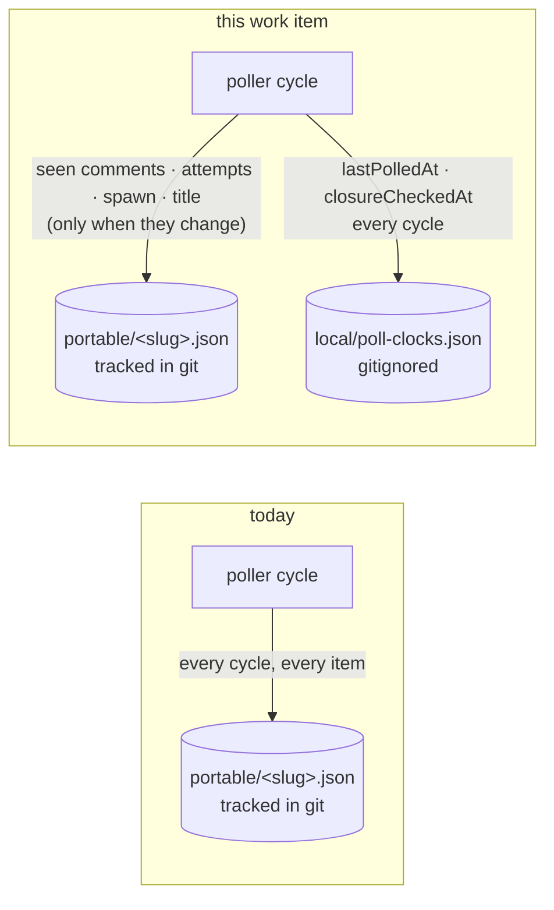

<!-- Authored per the the-loop:writing skill. -->

# Requirements: the poll clocks are this machine's, not the repository's

> Phase 1 of 4 (requirements → design → testing plan → tasks). Following the Kiro spec
> approach (<https://kiro.dev/docs/specs/>). This phase MUST be reviewed and approved by
> the required collaborators before moving to design.

## Introduction

**A tracked file is rewritten every minute with a number no other machine can use.**
[Issue-382](https://github.com/MadaraUchiha-314/the-loop/issues/382): *"`lastPolledAt`
being updated all the time makes the git repo has uncommitted changes which is annoying —
can this and should this be tracked in a local file?"*

`poll.lastPolledAt` is the clock reading of the last cycle that listed a work item. The
poller stamps it on every cycle for every item it sees, into
`<state.root>/portable/<slug>.json` — the half of the-loop's state that is **tracked in
git**, so an operator whose `state.root` sits in a repository (this one does) has a dirty
working tree for as long as the poller runs, and every `git status` before a commit shows
a diff nobody wrote. `poll.closureCheckedAt` is the same kind of reading, written by the
same component on the same schedule question ([issue-332](https://github.com/MadaraUchiha-314/the-loop/issues/332)).

The answer to the ticket's question is **yes, and the reason is the classification the
state layout already publishes**, not merely the annoyance. `docs/cli/state.md` splits
generated state by one test — *does it mean anything on another machine?* — and the
poller's other clock file, `poll-status.json`, is already local with the verdict "clock
readings from one machine's poller. Carried elsewhere they describe a process that is not
there." A per-item `lastPolledAt` is that same sentence, per item. What makes the rest of
the `poll` section portable does not apply to it:

| `poll` attribute | Is it a fact about the world? | If it is lost |
|---|---|---|
| `seenComments`, `commentAttempts`, `spawn`, `gaveUp` | yes — which comments exist and were already handled, not derivable upstream | the whole thread is re-forwarded to a fresh session |
| `title` | derived, a cached copy of the ticket's own | the dashboard shows a bare ref for one cycle |
| **`lastPolledAt`, `closureCheckedAt`** | **no — when a cycle on *this box* ran** | **one provider call: the item reads as due for its next closure question** |

So the two clocks are the only attributes of the record whose loss costs a question rather
than a redelivery, and the only ones rewritten on a schedule nobody chose.

**The unit of the change is one machine-local file holding the two clocks, read back
wherever they are used today.** No config key, no new ingress, no behaviour change the
operator can observe beyond the clean working tree.

## Requirements

### Requirement 1 — the clocks are written where they belong

**User story:** As an operator whose `state.root` is tracked in a repository, I want the
poller's per-item clock readings kept out of the tracked records, so that a running poller
leaves my working tree clean.

#### Acceptance criteria (EARS)

1. WHEN the poller finalizes a cycle over a work item THEN the system SHALL record that
   item's `lastPolledAt` in `<state.root>/local/poll-clocks.json` and SHALL NOT write it
   to `<state.root>/portable/<slug>.json`.
2. WHEN the poller baselines a work item on first sight THEN the system SHALL record its
   `lastPolledAt` in the same machine-local file.
3. WHEN the poller records a closure check for an unlisted item THEN the system SHALL
   record that item's `closureCheckedAt` in the same machine-local file and SHALL NOT
   write it to the portable record.
4. WHEN the poller writes the poll ledger of a pull request that delivers a work item
   THEN the system SHALL record that pull request's clocks in the same machine-local
   file, keyed by the pull request's own ref.
5. WHEN a work item's ledger is forgotten — the item ended, or `the-loop sessions reset`
   removed its `poll` section — THEN the system SHALL remove that ref's clocks from the
   machine-local file.
6. WHEN a poll cycle changes nothing about a work item except its clocks THEN the system
   SHALL NOT rewrite that item's portable record.

### Requirement 2 — nothing that reads a clock changes behaviour

**User story:** As an operator upgrading a running deployment, I want the closure
schedule and the dashboard to behave exactly as they did, so that moving a field costs me
nothing.

#### Acceptance criteria (EARS)

1. WHEN the poller decides whether a ledger-only record is due for a closure question
   THEN the system SHALL measure absence as the later of that ref's `lastPolledAt` and
   `closureCheckedAt` **read from the machine-local file**, against the unchanged window
   and cap of [decision-115](../../decisions/decision-115.md).
2. IF the machine-local file holds no clock for a ref AND that ref's portable record
   still carries `poll.lastPolledAt` or `poll.closureCheckedAt` written by an earlier
   version THEN the system SHALL read the record's value, so no item becomes due for a
   closure question merely because the deployment was upgraded.
3. WHEN the poller next writes the ledger of a ref whose portable record still carries
   either clock THEN the record SHALL be written without those keys.
4. WHEN the control plane serves a work item (`GET /api/v1/work-items`, `the-loop` core
   `list_work_items` / `get_work_item`) THEN the served record's `poll` section SHALL
   carry this machine's `lastPolledAt` and `closureCheckedAt` for that ref, so the
   dashboard's *last activity* and the attention surface's clean-poll rule are unchanged.
5. IF the machine-local file is absent, unreadable or malformed THEN the system SHALL
   treat every ref as having no clock — the item is due for one closure question and is
   then dated — and SHALL NOT fail a poll cycle, a reset, or an API read.

### Requirement 3 — the split is declared, not just implemented

**User story:** As the next person to add a generated file, I want the new file classified
where every other one is, so that the question "does this travel?" keeps being asked.

#### Acceptance criteria (EARS)

1. WHEN the machine-local clock file is added to `StateLayout` THEN `GENERATED_PATHS`
   SHALL carry an entry classifying it `portable=False` with its `holds` and `why`, and
   `docs/cli/state.md` SHALL classify it the same way.
2. WHEN `docs/cli/state.md` documents the `poll` section THEN it SHALL describe the two
   clocks in their new home, and the operator's-file attribute table SHALL no longer
   claim them as portable attributes.
3. WHEN the repository's `.gitignore` is evaluated against the new path THEN the file
   SHALL be ignored (`.the-loop/local/` already covers it), and the portability test
   SHALL prove it rather than assume it.

## Non-functional requirements

- **Writes.** A cycle over *n* work items that learns nothing new writes one small file
  (the clocks) instead of *n* records plus *n* index rewrites.
- **Observability.** Unchanged: `poll.cycle` still counts `ledger_checks`; no new event
  type, no new log line on the hot path.
- **Compatibility.** A record written by an earlier version is read, then rewritten
  without the clocks on the first write that touches it. No migration command, no version
  gate: the upgrade is one read-fallback that dies with the last stale record.

## Security considerations

> Threat-model-lite, captured with the requirements (always required).

- **Actors & trust:** unchanged. The only writer is the poller (and `sessions reset`);
  the only readers are the poller, the reset path and the control plane's read surface.
  No comment body, ticket field or webhook payload reaches either clock — both are
  `_utcnow()` strings minted by the-loop itself.
- **Trust boundaries & data:** the file holds two ISO-8601 timestamps per work-item ref.
  No secret, no token, no path, no conversation id. It moves a value **out** of a tracked
  file, so the change strictly reduces what a repository carries.
- **Abuse cases (EARS):**
  1. WHEN a clock is forged into the future — by editing the machine-local file — THEN
     the system SHALL treat the item as not yet due and SHALL NOT stamp, close or
     resurrect it; the item stays a plain row, which is [issue-332](https://github.com/MadaraUchiha-314/the-loop/issues/332)'s
     A2 behaviour, and forging now requires write access to the operator's machine rather
     than a pull request against a tracked record.
  2. WHEN the clock file contains a value that is not a timestamp — a number, a list, a
     mangled string — THEN the system SHALL ignore it and treat the ref as having no
     clock (due now: one question, then a well-formed date).
  3. WHEN the clock file cannot be written (a full or read-only disk) THEN the system
     SHALL log a warning and continue the cycle, never failing a delivery over a clock.
- **Fail closed:** there is nothing to fail closed on — a missing clock grants no
  authority. The safe direction here is *ask again*, which is what a missing or unparsable
  value already means, and it is bounded by the existing per-cycle cap.

## Out of scope

- Every other attribute of the `poll` section. `seenComments`, `commentAttempts`, `spawn`,
  `gaveUp` and `title` stay portable: losing them re-forwards a thread.
- The tracked/local split itself, the `portable/` index, and the pre-issue-128 upgrade
  shim — untouched.
- Any configuration for where the clock file lives. It sits under `state.root` like every
  other generated file, and `state.root` is the one knob.

## Open questions

None. The ticket asked whether the value should be tracked and said to move it if not;
the answer and its reasoning are in the introduction.

## Review comments

> Appended by the-loop's `record-feedback` hook when a human gate approves with comments.
