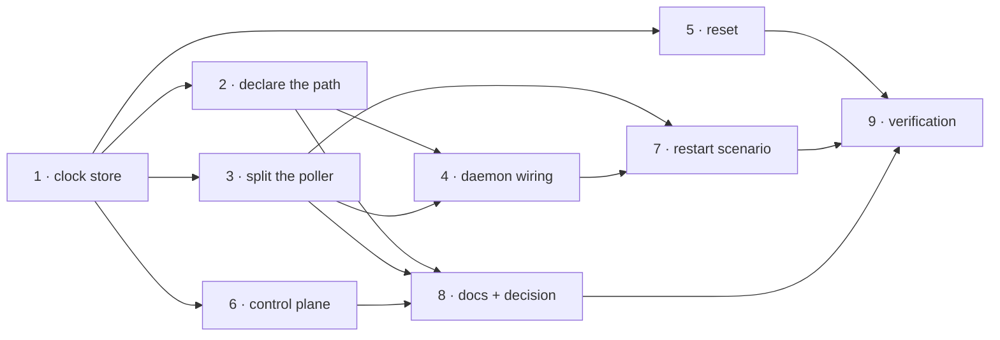

<!-- Authored per the the-loop:writing skill. -->

# Tasks: the poll clocks are this machine's, not the repository's

> The last spec artifact (requirements → design → testing plan → tasks). Derived
> mechanically from `design.md` and `testing-plan.md`; it has no approval gate.

## Task list

- [ ] 1. The machine-local clock store
  - `cli/the_loop/pollclocks.py`: `CLOCK_KEYS`, `PollClockStore` with `beside`, `get`,
    `put`, `forget`, `all`; atomic write, best-effort on every fault.
  - _Depends on:_ none
  - _Requirements:_ R1.1, R2.5, abuse 2–3
  - _Test:_ T1/T7 — `pytest cli/tests/test_pollclocks.py` (red→green)
- [ ] 2. Declare the new path
  - `StateLayout.poll_clocks` = `<root>/local/poll-clocks.json`, plus its
    `GENERATED_PATHS` entry (`portable=False`, `holds`, `why`); pin `beside()` against it.
  - _Depends on:_ 1
  - _Requirements:_ R3.1
  - _Test:_ T6 — `pytest cli/tests/test_state_portability.py` (red→green: S1 fails on an
    unclassified path)
- [ ] 3. Split the poller's storage boundary
  - `PollState.__init__` takes the clock store; `_load` merges (local wins, the record's
    own value is the upgrade fallback); `_store_ledger` writes the clocks first, then the
    clock-free body — and only when that body changed.
  - _Depends on:_ 1
  - _Requirements:_ R1.1–R1.6, R2.1, R2.2, R2.3
  - _Test:_ T2/T5 — `pytest cli/tests/test_poller.py` (red→green)
- [ ] 4. Feed the daemon the declared path
  - `PollerOptions.clock_file` from `StateLayout.poll_clocks`, passed into `PollState`.
  - _Depends on:_ 2, 3
  - _Requirements:_ R1.1
  - _Test:_ T2 — `pytest cli/tests/test_poller_daemon.py cli/tests/test_poller.py`
- [ ] 5. The clocks go with a reset
  - `reset_work_item` drops the ref's clocks on a real run.
  - _Depends on:_ 1
  - _Requirements:_ R1.5
  - _Test:_ T3 — `pytest cli/tests/test_reset.py` (red→green)
- [ ] 6. Re-join the halves for the control plane
  - `core.workitems` merges this machine's clocks into the `poll` section and each
    `pullRequests` ledger it serves.
  - _Depends on:_ 1
  - _Requirements:_ R2.4
  - _Test:_ T3 — `pytest cli/tests/test_core_workitems.py cli/tests/test_core_attention.py`
    (red→green)
- [ ] 7. The restart scenario
  - A Gherkin-documented integration scenario: a poller restarted after a cycle does not
    re-ask about the item it just polled, and the record it left is clock-free.
  - _Depends on:_ 3, 4
  - _Requirements:_ R1.1, R2.1
  - _Test:_ T4 — `pytest cli/tests/test_poller_integration.py`
- [ ] 8. Documentation and the durable record
  - `docs/cli/state.md` (the classification table, the `poll` section, the attribute
    table, the new file's own section), `docs/capabilities/webhook-triggers.md` and
    `docs/capabilities/control-plane.md`, `ui/src/api/types.ts`'s comment, and
    `docs/decisions/decision-131.md`.
  - _Depends on:_ 2, 3, 6
  - _Requirements:_ R3.1, R3.2, R3.3
  - _Test:_ T6/T8 — `pytest cli/tests/test_state_portability.py` then `make check`
- [ ] 9. Verification
  - Execute `testing-plan.md`: run every activity, tick it, record command/outcome/evidence.
  - _Depends on:_ 1–8
  - _Requirements:_ all
  - _Test:_ T8/T14 — `make check`, then two `poll --once` cycles over this checkout

## Dependency graph (DAG)

## Checkpoints

After tasks 1, 3, 6 and 8 the affected suites run; after task 9, `make check` and the
manual dogfood. Each task's red→green transition is recorded in the commit that carries
it — no progress log (issue-365).

## Review comments

> Appended by the-loop's `record-feedback` hook when a human gate approves with comments.
