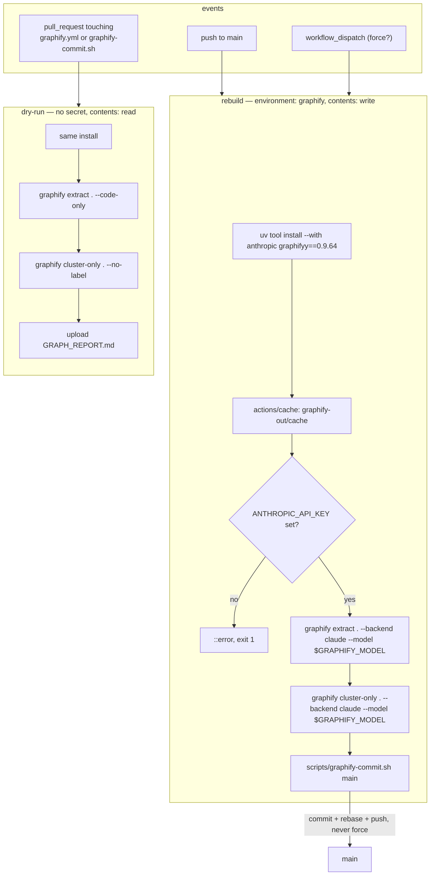

<!-- Authored per the the-loop:writing skill. -->

# Design: the repository carries its own knowledge graph, rebuilt on every merge

> Phase 2 of 4 (requirements → design → testing plan → tasks). Derives from the approved
> requirements. MUST be reviewed and approved before moving to tasks breakdown.

## Overview

**One workflow with two jobs that never run together, one shell script that is the only
thing touching git, and three ignore rules.** No Python in the CLI changes; the whole
delivery is `.github/workflows/graphify.yml`, `scripts/graphify-commit.sh`, `.gitignore`,
`.markdownlint-cli2.jsonc`, a `make graph` target and the docs. graphify itself is
installed from PyPI at a pinned version with the Anthropic SDK beside it (`uv tool
install --with anthropic "graphifyy==0.9.64"` — the tool has no extra that pulls the SDK,
and its `claude` backend imports it).

The three questions the ticket asked, answered by the design:

| Question | Answer | Where |
|---|---|---|
| how do I install Claude/Codex in CI | you don't: `graphify extract . --backend claude` is the library's own headless mode and calls the Messages API through the SDK | `rebuild` job, step *Extract* |
| how do I provide my token | `ANTHROPIC_API_KEY`, a secret on the `graphify` GitHub environment, exposed to that one step of that one job | `rebuild` job, `environment: graphify`, `env:` on the step |
| how do the artifacts get back into the repo | the job commits `graphify-out/` and pushes to `main` with `GITHUB_TOKEN`, rebasing past the release workflow's `bump:` if it landed meanwhile | `scripts/graphify-commit.sh` |



## Architecture

| Component | Role |
|---|---|
| `.github/workflows/graphify.yml` **(new)** | the pipeline: triggers, the two jobs, the pinned tool, the model, the secret's scope, the cache, the commit step |
| `scripts/graphify-commit.sh` **(new)** | commits `graphify-out/` if it changed, rebases onto the remote tip, pushes with bounded retries, fails closed |
| `graphify-out/` **(new, generated on `main`)** | the asset: `graph.json`, `GRAPH_REPORT.md`, `graph.html`, `manifest.json`, `.graphify_labels.json` + `.sig` |
| `.gitignore`, `.markdownlint-cli2.jsonc` | keep the cache, the sidecars and the backups out of git; keep the generated report out of lint |
| `Makefile` `graph` target | the no-model half, locally, from the root |
| `cli/tests/test_graphify_workflow.py` **(new)** | the workflow's invariants, read from the YAML |
| `cli/tests/test_graphify_commit_integration.py` **(new)** | the script, driven against a bare repository |

Nothing in `cli/the_loop/` changes. This is a repository capability, not a CLI one.

## Components & interfaces

### The workflow

- **Triggers.** `push: branches: [main]`; `workflow_dispatch` with a boolean `force`
  input; `pull_request` filtered to `paths: [.github/workflows/graphify.yml,
  scripts/graphify-commit.sh]`. Nothing else starts it.
- **Concurrency.** `cancel-in-progress: false`, and a group **per event** —
  `graphify-main` for pushes and dispatches, `graphify-pr-<n>` for a pull request. A
  cancelled run would throw away the tokens it had spent. GitHub keeps at most one
  *pending* run per group and replaces it with a newer arrival: on `main` that is right
  (the newest tree covers every merge in between); across events it would let a
  pull-request rehearsal take a pending rebuild's slot, which the per-event group
  prevents (graphify-labs review on PR #386).
- **Permissions.** Top level `contents: read`. The `rebuild` job alone declares
  `contents: write`.
- **Environment variables** (workflow level): `GRAPHIFY_VERSION` (`0.9.64`),
  `GRAPHIFY_MODEL` (`claude-opus-5`), `GRAPHIFY_NO_BACKUP=1` (no dated copy of a 30 MB
  file per run), `GRAPHIFY_NO_TIPS=1`.
- **`rebuild`** (`if: github.event_name != 'pull_request'`, `environment: graphify`,
  `timeout-minutes: 90`): checkout with `persist-credentials: false`; `setup-uv`; install graphify and
  put `uv tool dir --bin` on `GITHUB_PATH`; restore `graphify-out/cache` from the Actions
  cache (`key: graphify-cache-<sha>`, `restore-keys: graphify-cache-`); the extract step
  with `ANTHROPIC_API_KEY` from `secrets` and `GRAPHIFY_FORCE` from the `force` input,
  failing first with a named error if the key is empty; then the commit step, the only
  one that holds `GITHUB_TOKEN` — it writes the token into the remote URL
  (`x-access-token:…@github.com/<repo>`) and runs the script, so no third-party tool
  ever runs with a write-scoped token on disk (graphify-labs review on PR #386).
- **`dry-run`** (`if: github.event_name == 'pull_request'`, `timeout-minutes: 20`):
  checkout with `persist-credentials: false`; same install; `graphify extract . --code-only` and `graphify cluster-only .
  --no-label`; upload `GRAPH_REPORT.md` as a 7-day artifact. No `environment`, no
  `permissions`, no `secrets.` anywhere in it.

### `scripts/graphify-commit.sh [branch]`

```text
git add -A -- graphify-out
nothing staged?                      -> "nothing changed", exit 0
git commit -m "chore(graphify): rebuild the knowledge graph for <sha7>" -- graphify-out
for attempt in 1..5:
  git fetch origin <branch>
  git rebase --autostash FETCH_HEAD  -> conflict? abort, exit 1 (never --force)
  git push origin HEAD:refs/heads/<branch> -> ok? exit 0
  sleep backoff * 2^(attempt-1)      (GRAPHIFY_PUSH_BACKOFF, default 2 s; 0 in tests)
exit 1
```

- The identity is `github-actions[bot]`, the one the release workflow commits under,
  set through git's own `GIT_AUTHOR_*`/`GIT_COMMITTER_*` variables with `:-` defaults so
  a test can run it under another name.
- `<sha7>` is `GITHUB_SHA` when set (the commit the run was started for) and `HEAD`
  otherwise, captured **before** the commit is made.
- `-- graphify-out` on the commit scopes it: anything the build left modified elsewhere
  is neither committed nor allowed to block the rebase (`--autostash`).
- `--autostash`, `FETCH_HEAD` and `HEAD:refs/heads/<branch>` work on the depth-1 checkout
  Actions makes by default (proved by a scenario).

### The tracked set and the ignore rules

| Path | Tracked? | Why |
|---|---|---|
| `graphify-out/graph.json` | yes | the graph; the next run's baseline |
| `graphify-out/GRAPH_REPORT.md` | yes | the human-readable output |
| `graphify-out/graph.html` | yes | the interactive view (aggregated above 5,000 nodes) |
| `graphify-out/manifest.json` | yes | per-file hashes: what the incremental gate reads |
| `graphify-out/.graphify_labels.json`, `.sig` | yes | community names and their membership signature — reused for unchanged communities, saving naming calls |
| `graphify-out/cache/` | no (Actions cache) | AST cache regenerates in ~40 s; the semantic cache is the model's answers by content hash |
| `graphify-out/.graphify_root`, `.graphify_python`, `.graphify_analysis.json`, `.graphify_semantic_marker` | no | absolute runner paths and per-run analysis |
| `graphify-out/YYYY-MM-DD/` | no | graphify's backup copies (also disabled by `GRAPHIFY_NO_BACKUP`) |

`.gitignore` gets the `graphify-out/cache/`, `graphify-out/.graphify_*` (with the two
`!` exceptions) and the dated-directory patterns; `.markdownlint-cli2.jsonc` gets
`graphify-out/**` beside the existing generated-content ignores.

### Incremental behaviour (what was measured)

`graphify extract` reads `manifest.json` for the set of files already extracted and
their hashes. Measured on a clone of this tree against a fake Messages endpoint that
answers one node per file (so every run is deterministic and free):

| Run | Baseline | Sent to the model |
|---|---|---|
| 1 | none | 1,273 docs + 77 images in 48 chunks; 54 calls incl. community naming; 113 s |
| 2 | committed graph + manifest, cache present, 1 doc changed | 1 doc (+ the 76 images, see below); 10 calls; 26 s |
| 3 | committed graph + manifest, **cache deleted**, 1 doc changed | identical to run 2: 10 calls; 26 s |

Run 3 is the case CI is in on every run (a fresh checkout has no cache), and it shows the
committed manifest is sufficient: the cache is an optimisation, not the baseline. The
images were re-sent on every run because the fake returns no node for an image and
graphify stamps only files that produced output; a real model returns nodes for images,
so they stamp like documents. If a job log shows `76 images changed` on a run that
changed none, `--exclude 'docs/specs/*/evidence/**'` on the extract line is the fix.

### The model

`GRAPHIFY_MODEL=claude-opus-5`, passed as `--model` to both commands. graphify's `claude`
backend builds `anthropic.Anthropic(api_key, base_url, timeout, max_retries)` and calls
`messages.create(model, max_tokens=16384, system, messages)` — no `temperature`, so the
request is valid for the Claude 5 family. `ANTHROPIC_BASE_URL` is honoured, which is
how the fake endpoint drove the measurements above.

## UI/UX design

N/A — no user-facing surface; the output is files in the repository and a workflow.

## Data models

None in the CLI. The workflow's contract with the script is the argument (`main`), the
`GITHUB_SHA` variable and the working tree.

## Error handling

| Failure | Behaviour |
|---|---|
| `ANTHROPIC_API_KEY` unset or empty | the extract step exits 1 with `::error::` naming the secret and the environment page, before any extraction |
| the model returns unusable answers for a chunk after graphify's retries | graphify marks the files unstamped for the next run; if the resulting graph is smaller than the committed one, graphify refuses to write it (shrink guard, `--allow-partial` not passed) and exits 1 — nothing is committed |
| nothing under `graphify-out/` changed | exit 0, no commit |
| the release workflow's `bump:` landed on `main` during the build | rebase, push; disjoint paths, so no conflict |
| a different `graphify-out/` was committed to `main` by hand meanwhile | rebase conflict → abort, exit 1, log says so; `main` untouched |
| the push is rejected five times | exit 1 after 2+4+8+16+32 s of backoff |
| the tool's PyPI version disappears | the install step fails; bump `GRAPHIFY_VERSION` deliberately |
| a run exceeds 90 minutes | GitHub cancels it; the Actions cache still carries what was extracted (it is saved only on success — so nothing, on the first such failure; the next run starts from the committed manifest) |

## Security design

- **AuthN/AuthZ:** the Anthropic key is a GitHub environment secret, readable by a job
  that runs on `push`/`workflow_dispatch` only, exposed to one step's `env:`. Write to
  `main` is `GITHUB_TOKEN` with `contents: write` on that job only; the platform
  additionally withholds secrets from fork pull requests and withholds `write` from them.
  Restricting the `graphify` environment to `main` deployments (an owner action, in
  Settings → Environments) closes the remaining case — a maintainer dispatching the
  workflow on another branch.
- **Input validation & injection surfaces:** every file goes to the model wrapped in an
  `<untrusted_source path sha256>` block with chat-template sentinels neutralised
  (graphify's own defence, `llm.py`); the model's answer is parsed as JSON into nodes and
  edges and written under `graphify-out/`. No step reads the graph back to decide
  anything; no hook, test or workflow executes it. The commit message carries only a
  short SHA the runner computed.
- **Secrets handling:** the key is never echoed (`set -x` is not used; graphify does not
  log headers); the job log carries token counts and a cost estimate. `.gitignore` is
  honoured by graphify and files that look like credentials are skipped by name before
  they can be sent. The sidecar with the runner's absolute path is ignored.
- **Least privilege:** `contents: read` at the top; `write` on one job; no `id-token`, no
  `pull-requests`, no `issues`. Within that job the token is on disk for the commit step
  only: both checkouts persist no credentials, so graphify — a third-party tool with the
  repository's own key in its environment — runs with nothing that could push.
- **Fail-closed behaviour:** missing key → fail before extraction; partial extraction →
  graphify refuses to shrink the graph, job red; push rejected → bounded retries then
  red; rebase conflict → red; in every case `main` is untouched and the next merge
  retries. There is no path on which a red job leaves a half-written graph on `main`.
- **Abuse-case coverage:**

  | Abuse case (requirements) | Mechanism | Negative test |
  |---|---|---|
  | 1 — a pull request edits the workflow to read the key | the `rebuild` job's `if`, the `dry-run` job referencing no `secrets.` | `test_the_api_key_reaches_exactly_the_rebuild_job` |
  | 2 — prompt injection through a document | graphify's `<untrusted_source>` wrapping; output is data | by construction (documented; no code of ours parses the graph) |
  | 3 — the push races the release | rebase + bounded retry, never force, conflict aborts | `test_a_commit_that_landed_meanwhile_is_rebased_past`, `test_a_rebase_conflict_is_reported_not_forced` |
  | 4 — the bot commit re-triggers a rebuild | `GITHUB_TOKEN` pushes start no workflow | platform rule (release.yml relies on the same) |
  | 5 — a bad model answer replaces the graph | shrink guard left armed | by construction; `--allow-partial` absent from the workflow (`test_the_rebuild_extracts_with_claude_then_names_the_communities` pins the exact command line) |

## Testing strategy

Two suites carry the deliverable. `test_graphify_workflow.py` reads the YAML and pins the
triggers, the two jobs' conditions, where the secret and the write grant appear, the
pinned install, the exact command lines, the ignore rules and the `make graph` target — a
workflow has no other test, and these are the properties a reviewer would otherwise
re-read on every change. `test_graphify_commit_integration.py` runs the real script
against a bare repository: unchanged graph, changed graph, a concurrent commit to rebase
past, a depth-1 clone, a remote that rejects every push, and a conflicting remote
commit — each with a Gherkin docstring. The LLM path cannot run in this container (no
key); it was exercised against a fake Messages endpoint on a clone, three runs, recorded
under `evidence/`, and its first real run is the `workflow_dispatch` on `main` after the
secret is set — recorded as unexecuted in the testing plan, with the reason. The
executable detail is `testing-plan.md`.

## Trade-offs & decisions

| Decision | Alternative | Why |
|---|---|---|
| headless CLI in the job | install Claude Code and run `claude -p "/graphify ."` | same library, one process, one credential, exit codes; the agent path is recorded in decision-133 with its install/auth recipe |
| the asset on `main` | an orphan branch, Pages, an artifact | what the ticket asked; the graph in every checkout is what `graphify query` and the skill's fast path expect; ~0.4 MB of pack per rebuild is the accepted cost, the orphan branch the fallback |
| a script, not inline `run:` steps | inline git in the workflow | a script can be driven by a test against a bare repo; the workflow cannot |
| never cancel; one group per event | cancel in progress; one group | spent tokens are not thrown away; a pull-request rehearsal cannot displace a pending `main` rebuild |
| the write token in the commit step only | `actions/checkout`'s persisted credential | a third-party tool never runs with a token that could push to `main` |
| rehearse on pull requests that touch the pipeline only | rehearse on every pull request | forty seconds per PR to prove nothing new |
| Actions cache for the semantic cache | commit it / drop it | 4 MB of model answers per run is not a commit; measured: the manifest alone is sufficient, the cache is a saving |
| explicit `claude-opus-5` | graphify's default | a reviewed one-line pin; Sonnet 5 is the same edit at a third of the cost — the owner's call, asked in the requirements |

Durable record: [decision-133](../../decisions/decision-133.md).

## Open questions

- The model (Opus 5 vs Sonnet 5) and the environment restriction — both owner actions
  named in `requirements.md`.

## Review comments

> Appended by the-loop's `record-feedback` hook when a human gate approves with comments.
