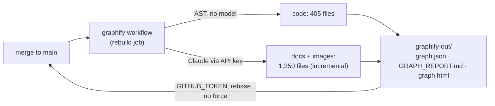

<!-- Authored per the the-loop:writing skill. -->

# Requirements: the repository carries its own knowledge graph, rebuilt on every merge

> Phase 1 of 4 (requirements → design → testing plan → tasks). Following the Kiro spec
> approach (<https://kiro.dev/docs/specs/>). This phase MUST be reviewed and approved by
> the required collaborators before moving to design.

## Introduction

**Every merge to `main` should leave behind a current, queryable map of the repository,
and nobody should have to run anything to get it.**
[Issue-385](https://github.com/MadaraUchiha-314/the-loop/issues/385) asks for
[graphify](https://github.com/Graphify-Labs/graphify) to be installed in this repository
and run "when we change any code (merge to main)", with "the new version of the asset
generated by `/graphify .`" pushed back — and asks three questions on the way: how an LLM
gets into a GitHub Actions job, how the token is provided, and how the generated files get
back into the repository.

graphify builds a knowledge graph of a tree — a `graph.json` of nodes and edges, a
`GRAPH_REPORT.md` a person can read, and an interactive `graph.html` — from two kinds of
extraction: **tree-sitter AST parsing for code**, which needs no model, and **LLM
extraction for documents and images**, which does. This repository is mostly documents:
graphify sees 405 code files and 1,273 documents (2.4 million words) plus 77 images. So
the LLM half is not optional here, which is the premise of the ticket. The three questions
have concrete answers, established by reading graphify 0.9.64's source rather than its
README (the two disagree on what exists):

- graphify has a **headless CLI** (`graphify extract`) with a `claude` backend that calls
  the Anthropic Messages API through the official SDK. **No Claude Code or Codex CLI
  needs to be installed** in the job; the `/graphify .` skill is the interactive front
  for the same library.
- the token is **`ANTHROPIC_API_KEY`**, which GitHub Actions supplies from a secret — and
  the secret can be confined to one job that never runs for a pull request.
- the generated files are **committed back to `main` by the job itself**, with the
  repository's own `GITHUB_TOKEN`, the way the release workflow already commits its
  `bump:` — and a push made with that token starts no workflow, so nothing loops.

What this work item delivers is that pipeline, with the spec that makes its trade-offs
inspectable: the asset is large (a 19–32 MB `graph.json` that changes on every run), the
LLM pass costs real money, and a workflow holding a paid credential and write access to
`main` is a sensitive path by this repository's own rule.

## Requirements

### Requirement 1 — the graph is rebuilt and committed on every merge to `main`

**User story:** As the owner, I want the knowledge graph rebuilt whenever `main` changes
and the result committed, so that the map of the repository is never older than the
code and nobody runs graphify by hand.

#### Acceptance criteria (EARS)

1. WHEN a commit is pushed to `main` by a person or a merge THEN the system SHALL run
   graphify over the whole repository and produce `graphify-out/graph.json`,
   `graphify-out/GRAPH_REPORT.md`, `graphify-out/graph.html`,
   `graphify-out/manifest.json` and the community labels.
2. WHEN the rebuild runs THEN the system SHALL use one pinned graphify version, with the
   Anthropic SDK installed beside it, so that two runs a month apart produce the same
   file formats.
3. WHEN a pull request changes the pipeline itself (the workflow or the commit script)
   THEN the system SHALL rehearse the no-model half of the pipeline on that pull request
   — install, AST extraction, clustering and the report — without any secret and without
   pushing anything; a pull request that changes anything else SHALL NOT run graphify.
4. WHEN a rebuild is already running and another commit lands on `main` THEN the system
   SHALL queue the second run rather than cancel the first.
5. WHEN the rebuild finishes THEN the system SHALL commit only the files under
   `graphify-out/`, as one Conventional Commits `chore(graphify):` commit under the
   `github-actions[bot]` identity, and push it to `main` **without force**, rebasing
   onto whatever landed on `main` meanwhile; IF nothing under `graphify-out/` changed
   THEN the system SHALL make no commit; IF the rebase conflicts or the push keeps being
   rejected THEN the system SHALL fail the job rather than force or retry forever.
6. WHILE the graph is committed, the system SHALL keep graphify's regenerable AST cache,
   its machine-naming sidecars and its dated backup copies out of git, and SHALL keep the
   generated `GRAPH_REPORT.md` out of markdownlint (the source is linted, not the
   output).
7. WHEN a commit made by the pipeline lands on `main` THEN the system SHALL NOT trigger
   the pipeline again, nor CI, nor the release workflow (no build loop).

### Requirement 2 — documents and images are extracted by Claude, incrementally

**User story:** As the owner, I want the docs — the bulk of this repository — in the
graph and not only the code, at a cost proportional to what a merge changed.

#### Acceptance criteria (EARS)

1. WHEN the rebuild runs THEN the system SHALL extract documents and images with
   graphify's `claude` backend against the Anthropic Messages API, using one explicitly
   named model, and SHALL name the graph's communities with the same backend.
2. WHEN a committed `graph.json` and `manifest.json` exist at the branch tip THEN the
   system SHALL re-extract only the documents that changed since they were written, and
   merge the result into the existing graph, so that a merge touching three documents
   sends three documents to the model.
3. WHEN no baseline exists, or a manual run asks for `force` THEN the system SHALL
   extract everything.
4. IF the model returns an unusable answer for a chunk after graphify's own retries THEN
   the system SHALL NOT overwrite a larger committed graph with the smaller partial one
   (graphify's shrink guard, left on), and the job SHALL fail visibly so the next merge
   retries.

### Requirement 3 — the credential is confined

**User story:** As the owner, I want my API key usable by exactly the job that needs it,
so that a pull request — mine or a fork's — can never spend or read it.

#### Acceptance criteria (EARS)

1. WHEN the workflow runs for a `pull_request` event THEN the system SHALL NOT reference
   any secret; the job that reads `ANTHROPIC_API_KEY` SHALL be conditioned to `push` and
   `workflow_dispatch` events only.
2. WHEN the rebuild job reads the key THEN the system SHALL read it from a secret bound
   to a GitHub environment named `graphify`, so the owner can restrict which branches may
   deploy to it, and SHALL expose it to the one step that calls graphify.
3. WHILE the workflow runs, `contents: write` SHALL be granted to the rebuild job and to
   nothing else; the workflow default SHALL be `contents: read`.
4. IF `ANTHROPIC_API_KEY` is empty when the rebuild starts THEN the system SHALL fail
   immediately with a message naming the secret and where to set it.

### Requirement 4 — the answers are written down

**User story:** As the owner, I want the three questions in the ticket answered in the
repository, not only in a chat, so the next person who asks finds them.

#### Acceptance criteria (EARS)

1. WHEN this work item lands THEN a capability doc SHALL describe the knowledge graph:
   what is committed, what it costs, how to refresh it locally, and how the model, the
   token and the push-back work.
2. WHEN this work item lands THEN a decision record SHALL state why the headless CLI is
   used instead of installing Claude Code in CI, why the asset lives on `main`, and what
   each choice costs — including the alternative of running the `/graphify` skill through
   `claude -p`, with the install and authentication recipe for anyone who wants that path.
3. WHEN this work item lands THEN `docs/contributing.md` and `README.md` SHALL tell a
   contributor that the graph exists and how to refresh it without a model.

## Non-functional requirements

- **Cost.** The first full run over this tree is roughly 2–3 million input tokens for
  the documents plus a few hundred thousand output tokens — about $20–30 on Claude Opus 5,
  a third of that on Sonnet 5 — and the model is one env-var change in the workflow.
  Incremental runs cost the changed documents. graphify's own estimate is printed at the
  end of every run and lands in the job log.
- **Time.** The AST half takes about 40 seconds on this tree; the first LLM pass is
  bounded by the model's latency over ~48 chunks at four in flight (expect 10–15
  minutes); the job has a 90-minute ceiling.
- **Repository size.** `graph.json` is 19–32 MB uncompressed and 1.9 MB in git's pack;
  each rebuild adds about 0.4 MB to the pack, because community detection renumbers on
  every run. This is the accepted cost of the ticket's "push it into the repo"; the
  alternatives are in `design.md`.
- **Observability.** Every run's log carries graphify's incremental summary (files
  cached, re-extracted, deleted) and token estimate; the commit message names the
  built-from commit; `GRAPH_REPORT.md` names it too.

## Security considerations

> Threat-model-lite, captured with the requirements (always required).

- **Actors & trust:** the owner (configures the secret, merges); GitHub Actions running
  this repository's workflow files; the Anthropic API (receives every document and image
  in the tree — all of it public already); anyone who can open a pull request, including
  from a fork (**untrusted**); the release workflow, which pushes to `main` concurrently.
- **Trust boundaries & data:** the boundary is the `ANTHROPIC_API_KEY` secret and the
  `contents: write` grant, both confined to the `rebuild` job that runs only on `push` to
  `main` and manual dispatch. The data leaving the repository is the repository itself;
  graphify skips files that look like credentials (`.env`, keys, `*secret*`) and honours
  `.gitignore`, and the tree carries no secret to begin with. What comes back is JSON
  written under `graphify-out/` — data, executed by nothing.
- **Abuse cases (EARS):**
  1. WHEN a pull request — from a fork or not — edits the workflow to print or exfiltrate
     the secret THEN the system SHALL run only the secret-free `dry-run` job for that
     event; the `rebuild` job's condition excludes `pull_request`, and GitHub's own rule
     that a fork's pull request receives no secrets stands behind it. The merged
     workflow is reviewed like code (this repository's rule for `.github/workflows/**`).
  2. WHEN a document in the tree contains prompt-injection text aimed at the extraction
     model THEN the system SHALL treat the model's answer as graph data only: graphify
     wraps every file in an `<untrusted_source>` block, neutralises chat-template
     sentinels, and the output is JSON under `graphify-out/` that no workflow, hook or
     test executes. A corrupted graph is a bad map, not a compromised repository.
  3. WHEN the pipeline's push races the release workflow's `bump:` push THEN the system
     SHALL rebase and retry with bounded backoff, never force, and SHALL fail on a real
     conflict — `main`'s history is appended to, never rewritten.
  4. WHEN the pipeline's own commit lands on `main` THEN the system SHALL NOT start
     another run (a `GITHUB_TOKEN` push triggers no workflow), so a rebuild can never
     chain into a token-spending loop.
  5. WHEN the model's answer is unusable THEN the system SHALL NOT replace the committed
     graph with a smaller one (graphify's shrink guard is left armed; `--allow-partial`
     is not passed) and SHALL fail the job.
- **Fail closed:** a missing secret fails the job before any extraction; a rejected push
  fails the job after five attempts; a rebase conflict fails the job; a partial
  extraction fails the job. In every case `main` is untouched and the next merge
  retries.

## Out of scope

- Publishing `graph.html` on the documentation site (GitHub Pages). It is committed and
  can be opened from a checkout; putting it at `/the-loop/graph/` is a follow-up.
- Querying the graph from the-loop's own sessions (graphify's `/graphify query` fast
  path already works on any checkout that has `graphify-out/graph.json`).
- Running graphify on pull-request branches or on every push; the asset tracks `main`.
- Installing Claude Code or Codex in CI. The recipe is recorded in the decision for
  anyone who wants the skill-driven path, but this work item does not use it.

## Open questions

- **Which model.** The workflow pins `claude-opus-5` and the cost estimate above is for
  it. Sonnet 5 is a one-line change (`GRAPHIFY_MODEL` in the workflow) at roughly a
  third of the cost per run; the owner decides.
- **The environment.** The secret is read from a GitHub environment named `graphify`,
  which GitHub creates on first use; restricting it to `main` and adding the secret are
  owner actions this pull request cannot perform.

## Review comments

> Appended by the-loop's `record-feedback` hook when a human gate approves with comments.
