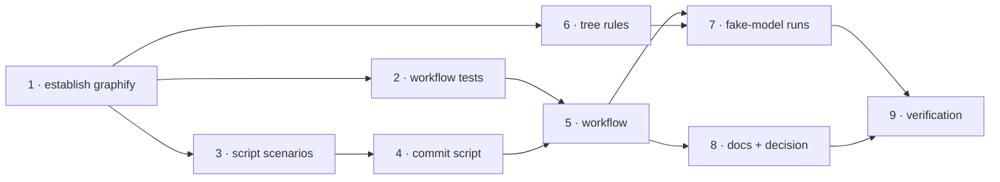

<!-- Authored per the the-loop:writing skill. -->

# Tasks: the repository carries its own knowledge graph, rebuilt on every merge

> The last spec artifact (requirements → design → testing plan → tasks). Derived
> mechanically from `design.md` and `testing-plan.md`; it has no approval gate.

## Task list

- [x] 1. Establish what graphify can do, on this tree
  - Install `graphifyy` 0.9.64, read `cli.py`/`llm.py` for the headless path and the
    `claude` backend, run `graphify update .` and `graphify extract . --code-only` on a
    clone, measure sizes and pack growth.
  - _Depends on:_ none
  - _Requirements:_ introduction, non-functional
  - _Test:_ T5 (the measurements are the evidence)
- [x] 2. The workflow's invariants, red
  - `cli/tests/test_graphify_workflow.py`.
  - _Depends on:_ 1
  - _Requirements:_ R1.1–R1.4, R1.6, R2.1, R3.1–R3.4
  - _Test:_ T1 (red→green)
- [x] 3. The commit script's scenarios, red
  - `cli/tests/test_graphify_commit_integration.py` with Gherkin docstrings.
  - _Depends on:_ 1
  - _Requirements:_ R1.5
  - _Test:_ T2 (red→green)
- [x] 4. `scripts/graphify-commit.sh`
  - Scoped commit, bot identity, rebase with autostash, bounded retry, fail closed.
  - _Depends on:_ 3
  - _Requirements:_ R1.5
  - _Test:_ T2
- [x] 5. `.github/workflows/graphify.yml`
  - Two jobs, the pinned install, the model, the secret's scope, the cache, the commit
    step; the `dry-run` rehearsal.
  - _Depends on:_ 2, 4
  - _Requirements:_ R1.1–R1.4, R1.7, R2.1–R2.4, R3.1–R3.4
  - _Test:_ T1, T6
- [x] 6. The tree's rules
  - `.gitignore` (cache, sidecars, backups), `.markdownlint-cli2.jsonc`
    (`graphify-out/**`), `Makefile` `graph` target.
  - _Depends on:_ 1
  - _Requirements:_ R1.6
  - _Test:_ T1, T3
- [x] 7. The pipeline against a fake model
  - `fake_anthropic.py`; three runs on a clone; record counts, timings, the tracked set.
  - _Depends on:_ 5, 6
  - _Requirements:_ R2.1–R2.3
  - _Test:_ T5
- [x] 8. Documentation and the durable record
  - `docs/capabilities/knowledge-graph.md` (+ index, sidebar), `docs/contributing.md`,
    `README.md`, `docs/decisions/decision-133.md` (+ index) with the Claude-Code-in-CI
    recipe as the recorded alternative.
  - _Depends on:_ 5
  - _Requirements:_ R4.1–R4.3
  - _Test:_ T8
- [x] 9. Verification
  - Execute `testing-plan.md`: run every activity that can run here, tick it, record
    command/outcome/evidence; record T6/T7 as pending with the owner's step.
  - _Depends on:_ 1–8
  - _Requirements:_ all
  - _Test:_ T8

## Dependency graph (DAG)

## Checkpoints

After tasks 4 and 5 the two new suites run; after task 8, `make check`. Each task's
red→green transition is recorded in the evidence — no progress log (issue-365).

## Review comments

> Appended by the-loop's `record-feedback` hook when a human gate approves with comments.
