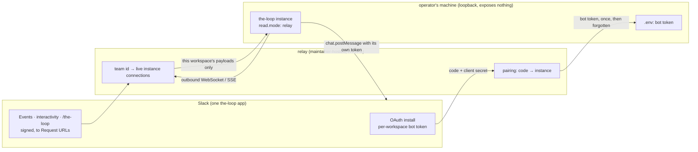

# Brainstorm: a the-loop Slack app anyone can install

> Phase 0, the root artifact for
> [issue #387](https://github.com/MadaraUchiha-314/the-loop/issues/387): "create a slack
> app using the manifest and publish to marketplace so that anyone can install the slack
> app and use it". Nothing here is a commitment; the direction converges on the ticket.

## Problem / opportunity

Today every operator creates **their own** Slack app. The setup in
[`docs/guide/slack.md`](../../guide/slack.md) is: import the checked-in manifest at
api.slack.com, install the app to the workspace for the bot token, mint an app-level
token for Socket Mode, export both, configure `channels.slack`, run `the-loop start`.
It works, it is documented, and it takes a person with admin rights fifteen minutes and
two browser detours before the first message lands.

The ticket asks for the other end of the spectrum: **one** the-loop app, published in
the Slack Marketplace, that anyone can add to their workspace with a click. The itch is
either *setup friction* or *discoverability*, and the two have very different costs. That
is the first open question below.

## Context & constraints

Three facts decide the shape of every option. Two are Slack's rules as documented on
docs.slack.dev in September 2026; the third is the-loop's own design.

1. **Socket Mode apps cannot be listed in the Slack Marketplace.** Slack's Socket Mode
   page says so verbatim ("Apps using Socket Mode are not currently allowed in the public
   Slack Marketplace"). the-loop's channel is built on Socket Mode by decision
   ([decision-094](../../decisions/decision-094.md) D6,
   [decision-116](../../decisions/decision-116.md) D1 and D5,
   [decision-117](../../decisions/decision-117.md) D3): buttons, the `/the-loop` command
   and instant reads all depend on it. A Marketplace app must receive events, interactive
   payloads and slash commands at public HTTPS Request URLs.
2. **A distributed app is one app owned by one party.** Installing it into a workspace
   produces a **per-workspace** bot token, delivered by OAuth to the app owner's HTTPS
   redirect URL and exchanged with the app's client secret. `redirect_uri` must be HTTPS;
   localhost is not an option. So whoever publishes the app runs a server that receives
   every workspace's bot token at install time. The **app-level** token Socket Mode uses
   is per app, not per workspace: one shared app on Socket Mode would stream every
   customer's events into one connection, which rules Socket Mode out for a shared app
   regardless of the listing rule.
3. **the-loop's instance exposes nothing.** The control plane binds loopback and refuses
   a non-loopback bind without `service.exposed`; the Slack channel exists precisely so
   that no endpoint has to be exposed; tokens live in the operator's env file and never
   appear in config, state or logs. Decision-116 D5 refused an HTTP Slack receiver
   outright, and decision-094 listed "a Slack Events-API HTTP receiver" as rejected.

Put together: "publish to the Marketplace" is not a packaging task like the Claude Code
and Cursor plugin manifests ([distribution](../../capabilities/distribution.md)). It
requires a **maintainer-hosted, multi-tenant service between Slack and every operator's
instance**, a different manifest from the one we ship, and a change to the instance's
trust boundary.

Other constraints worth having on the table:

- Slack's Marketplace review guide asks that the app already be installed on **ten or
  more active workspaces**, be fully functional and publicly available, request the
  fewest and least permissive scopes, and come with listing information, documentation
  and support links. The history scopes (`channels:history`, `groups:history`,
  `im:history`, `mpim:history`) will need a justification.
- Scopes on a distributed app are **cumulative per install**: a scope added later needs
  every workspace to re-authorize. Today the same thing is one operator replacing their
  own manifest (the guide's "Upgrading the app you already have").
- `read.mode: poll` already exists and needs only the bot token: thread replies and
  kickoffs work on the daemons' poll cycle, but no button is rendered and no command can
  arrive ([decision-117](../../decisions/decision-117.md) D3).
- Several instances may watch one workspace ([instances](../../capabilities/instances.md));
  anything that fans events out per workspace has to let each instance judge its own
  scope, as the ledger's ingress does today.
- Slack offers two low-cost helpers for the bring-your-own-app path: a **share link**
  that pre-fills the create-from-manifest form
  (`https://api.slack.com/apps?new_app=1&manifest_yaml=<url-encoded>`), and the
  **Manifest API** (`apps.manifest.create` with an app configuration token) that creates
  the app programmatically.

## Ideas & options

- **Option A: keep bring-your-own-app, make it a one-click.** A `the-loop channels setup`
  that opens the pre-filled create-from-manifest link (or, given a configuration token,
  creates the app through the Manifest API and prints the install URL), then walks the
  two token mints and writes the env file the CLI config names. A README "create the
  app" button pointing at the same link.
  *Pros:* no hosting, no secrets custody, no review, Socket Mode and every current feature
  stay intact, ships as one small change.
  *Cons:* not "anyone installs from the Marketplace". Each workspace still owns its copy
  of the app, and a scope change stays a per-workspace reinstall.

- **Option B: public distribution without a listing, poll mode only.** Enable "Add to
  Slack" on one app. A tiny hosted function holds the client secret, exchanges the OAuth
  code, and hands the bot token to the operator once through a pairing code the CLI
  printed, storing nothing. The instance then runs `read.mode: poll`.
  *Pros:* near-zero hosting, one shared app, a real install button.
  *Cons:* buttons and `/the-loop` are lost, since interactivity must go to a Request URL.
  Poll mode is documented as the degraded mode. A step backwards for anyone who already
  has a Socket Mode app. **Struck**: it trades working features for a button.

- **Option C: a hosted relay, the-loop's own Socket Mode.** A maintainer-run edge
  service: OAuth install with pairing; Slack's Request URLs for events, interactivity and
  commands; signing-secret verification; a map from Slack team id to the paired
  instances. Each instance opens an **outbound** connection to the relay under a new
  `read.mode: relay`, receives exactly its workspace's payloads, and posts back to Slack
  directly with its own bot token. The relay can be designed to hold no long-lived Slack
  credentials: it hands the bot token over at pairing and forgets it, keeping only its
  client secret, its signing secret and the live connection map.
  *Pros:* the only shape a Marketplace listing can sit on; every current feature
  survives; the instance still exposes nothing; multi-instance fan-out by team id
  composes with the scoping rules the instances work already established.
  *Cons:* someone runs and is on call for a public service; every customer's message
  content transits it, which needs a privacy policy, support URL and uptime; the ten
  active installs must exist before a listing can even be submitted; and it contradicts
  the letter of "nothing hosted", if not the instance's own boundary.

- **Option D: Slack workflow apps or Workflow Builder.** Already rejected in
  [decision-116](../../decisions/decision-116.md): they run on Slack's infrastructure and
  can only reach an HTTP endpoint, which lands back at Option C's relay. **Struck.**

## Sketches & notes

The relay shape, if Option C is ever pursued:

Pairing flow, in words: the operator runs `the-loop channels pair`, which prints a code
and opens the relay's install page with it. Add to Slack, OAuth completes at the relay,
the relay pushes the bot token down the connection identified by the code, the instance
writes it to its env file, and the relay forgets it. A second instance for the same
workspace pairs the same way; the relay fans out and each instance applies its own
`instance` scope.

What would change in the-loop for Option C, as a rough inventory: a `relay` read mode
beside `poll` / `socket` / `off`; the app-level token replaced by a pairing credential;
`channels status` rows for the relay and the pairing; and a **second manifest** for the
distributed app with `oauth_config.redirect_urls`, Request URLs on events, interactivity
and the slash command, `socket_mode_enabled: false` and `token_rotation_enabled: true`.
Keep the two manifests separate rather than templating one: `channels status` today
explains exactly which Slack setting is missing and why, and a dual-purpose manifest
would muddle that.

What Option A would touch: `channels/commands.py` (the manifest print grows a setup
verb), the Slack guide's step 1 and 2, and `docs/capabilities/channels.md`.

## Open questions

Questions only the owner can answer, each raised on the ticket for the paper trail:

1. **Is the goal setup friction or discoverability?** Friction is answered by Option A
   with no listing. Discoverability in the Marketplace is answered only by Option C.
2. **Who owns the app, its client secret and signing secret, and who is on call?** A
   Marketplace app is an operated product, a different commitment from a plugin repo.
3. **Is relaying message content through a maintainer-run service acceptable** against
   the-loop's stated stance that nothing is exposed and tokens stay local? The relay can
   be token-free after pairing, but not content-free.
4. **Where would the relay run and who pays?** A workers-plus-durable-objects or a small
   VM both fit; the cost is mostly operational, not compute.
5. **Listing prerequisites at submission time.** Ten active workspaces, privacy policy,
   support links, scope justification, review turnaround. Re-verify Slack's rules when
   the time comes; they move.

## Leaning / working hypothesis

Sequence it, and decide the two halves separately.

- **Now: Option A.** Cheap, captures most of "anyone can install", and is a prerequisite
  for any later path because the same manifest and token handling feed a relay. The
  hypothesis is that friction, not discoverability, is the real itch, and that a
  pre-filled create link plus a guided token setup removes most of it.
- **Later, as its own ticket and decision: Option C.** It introduces hosted infrastructure
  and a new trust boundary, and it is the only route to a listing. It should not ride on
  this ticket, and it should not start until question 1 has been answered "discoverability"
  on the record.
- **Never: Option B and Option D.**

## Hand-off → requirements

If the owner confirms the lean, `requirements.md` for this ticket asserts Option A only:

- A `the-loop channels setup` (name to be settled) that opens the pre-filled
  create-from-manifest link, optionally creates the app through the Manifest API when an
  app configuration token is supplied, and guides the bot-token and app-token export into
  the env file the CLI config names. No token ever printed, logged or stored outside that
  file, matching today's rule.
- A README and guide entry point that is one link, not a page of steps.
- `channels status` unchanged in meaning: it still names the exact Slack setting that is
  missing.
- Security considerations: the configuration token is a write credential over the
  operator's own Slack apps; it is read from an env var, never a flag, and never stored.

Option C's requirements, if it is ever chosen, start from the sketch above and from the
constraints section, and open with a decision record superseding the relevant parts of
decision-094 and decision-116.

## Review comments

> Appended by the-loop's `record-feedback` hook when a human gate approves with
> comments (issue-109). Append-only and attributed.
