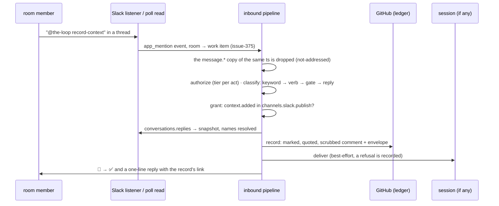

# Brainstorm: a room that talks to the-loop only when it is addressed

> Phase 0, the root artifact for
> [issue #389](https://github.com/MadaraUchiha-314/the-loop/issues/389): a multi-party
> collaboration experience when a Slack channel is dedicated to a work item. Nothing here
> is a commitment; the direction converges on the ticket.
>
> **Converged 2026-09-19.** The owner's review on
> [PR #390](https://github.com/MadaraUchiha-314/the-loop/pull/390) decided Q1 to Q5
> (each section opens with the decision) and said *go ahead with requirements keeping in
> mind the review comments*. `requirements.md` is derived from this file as it stands;
> the questions still open are carried there as recorded assumptions.

## Problem / opportunity

A dedicated room today is a firehose in both directions. Since
[issue-375](https://github.com/MadaraUchiha-314/the-loop/issues/375) and
[issue-378](https://github.com/MadaraUchiha-314/the-loop/issues/378) an authorized user
can declare `the-loop add-channel slack@#tmp-issue-389`, and from then on **every message
an authorized member types in that room is a message on the work item**: mirrored onto
the ticket as a marked comment and typed into the session's pane. That was the right
first step (a room never opens a second issue, and nothing said there is lost), and it
is the wrong steady state for a room with six people in it. Most of what they say is to
each other. The agent is interrupted by all of it, the ticket fills with it, and anyone
not on `routing.authorizedUsers` is dropped in silence, so the stakeholders the room
exists for cannot address the-loop at all.

The ticket names the two acts people actually want from the loop in a room, and neither
exists today:

| People want to say | What the-loop offers today |
|---|---|
| "this thread is context for the work" | nothing; the thread is either firehosed in message by message (authorized members) or invisible (everyone else) |
| "we decided X" (product, design, tech) | nothing outside a phase gate; a decision typed mid-flight is one more `work-item.reply` and lands nowhere a later reader looks |
| address the-loop at all | `/the-loop`, which has no thread and reads as an operator command, not a conversation |

The opportunity is a third shape of conversation. The central channel's threads
(the-loop opened them, so every reply is addressed to it) and the operator's DM stay as
they are. A **room** listens only when it is addressed, and what it is asked for is a
small set of acts each with a durable record.

## Context & constraints

Five things fix the shape of every option below.

1. **Through the ledger, never around it**
   ([decision-103](../../decisions/decision-103.md)). Whatever a mention becomes is a
   ledger record first: an event type from the one catalog (`channels/events.py`),
   granted per channel in `channels.slack.publish`, recorded on the ticket with an
   envelope naming the person, and only then delivered. A new act is a new catalog row,
   not a new path.
2. **No model in the channel** ([decision-118](../../decisions/decision-118.md)). The
   pipeline classifies by grammar: control keyword → open gate → reply. The session is
   the only model in the system. So an act a room asks for is either a fixed grammar
   the channel parses, or free text handed to a session that may not be running.
3. **A session is not always there.** An armed work item parks at `phase-selection`
   with no session ([issue-358](https://github.com/MadaraUchiha-314/the-loop/issues/358));
   a machine can be lost ([issue-363](https://github.com/MadaraUchiha-314/the-loop/issues/363));
   the window is cleared at every phase boundary (`reference/context.md`). A pane
   delivery is ephemeral; the ledger record is the copy that survives, and a file under
   `docs/specs/<id>/` is the copy the next session reads.
4. **Who may speak is decided once, and narrowly.** `routing.authorizedUsers` (GitHub
   login plus Slack id) may command, answer gates and reply. A work-item collaborator
   ([issue-307](https://github.com/MadaraUchiha-314/the-loop/issues/307)) is a GitHub
   login granted *input* on one item, with no Slack id. A room has people who are
   neither, and the security posture is that an unlisted member is dropped in silence
   and never told what exists ([issue-341](https://github.com/MadaraUchiha-314/the-loop/issues/341)).
5. **What Slack can deliver over the connection the-loop already holds.** Socket Mode
   with interactivity on, both transports reading `message.channels` / `message.groups`
   whose text carries a mention as `<@U0BOT>` (the bot's own id is already read via
   `auth.test`). Available with a manifest change: the `app_mention` event
   (`app_mentions:read`), **message shortcuts** (the ⋯ menu on any message, a
   `message_action` payload carrying the message, its channel, its `thread_ts` and a
   `trigger_id`), **modals** (`views.open` on that trigger, `view_submission` back),
   reaction events (`reactions:read`), and `chat.getPermalink`. Thread history is
   already read with `conversations.replies`. Verify each against Slack's docs at
   requirements time; they move.

Two existing shapes are the nearest prior art and are reused rather than reinvented:
a button is exactly the typed keyword ([decision-117](../../decisions/decision-117.md)),
so a shortcut can be exactly the typed mention; and the phase gates already append a
human's feedback into the artifact it concerns (`record-feedback`), so a decision has a
place to be folded into.

Adjacent, and out of scope here: the noise in the *other* direction (every subscribed
event as a top-level message in the room) is a rendering question for the room, not an
addressing one, and Slack's "Agents & AI Apps" split-pane surface is a different
conversation shape from a shared room.

## Ideas & options

Five questions, each with its options. The lean per question is in the working
hypothesis.

### Q1. When does a room reach the-loop?

**Decided by the owner on PR #390
([one](https://github.com/MadaraUchiha-314/the-loop/pull/390#discussion_r4054035903),
[two](https://github.com/MadaraUchiha-314/the-loop/pull/390#discussion_r4054039499),
2026-09-19): any message meant for the-loop, in a room, in a thread or in the
operator's private channel, carries the `@the-loop` mention, and every other message
is ignored. The mention arrives as Slack's `app_mention` event, never by matching
text. One exception exists as an option ([three](https://github.com/MadaraUchiha-314/the-loop/pull/390#discussion_r4054041788)): an authorized user, never a
collaborator, may switch a single room to hear every message.** The options stay
below as the record of what was weighed.

- **Option 1A: every message** (today). *Struck by the ticket.*
- **Option 1B: only when addressed, with the room as the only gated shape.** The gate
  survived; its scope did not. The owner widened it to every conversation shape, so a
  reply under one of the-loop's own messages (an approval request, a question) needs
  the mention too, and the exemption this option proposed is struck. Nothing is
  addressed by construction any more; the mention is the address.
- **Option 1C: a per-room switch.** *Kept as an option, by the owner
  ([review](https://github.com/MadaraUchiha-314/the-loop/pull/390#discussion_r4054041788)).* Mention-only is the default for every shape; an authorized user
  may switch one room to hear every message (`the-loop add-channel slack@#room
  --listen all`, the declaration being authorized-only already, issue-375 R1.1). A
  collaborator cannot exercise it. In `all` mode the room's `message.*` events are
  input as they are today and the `app_mention` copy is the one deduplicated; it is
  also the one place the poll transport still hears a room.
- **Option 1D: the `app_mention` event.** *Chosen.* The first draft struck it for
  delivering the same message twice and costing a scope; the owner ruled that matching
  `<@U0BOT>` in message text is not the way, and that a manifest change is acceptable.
  Three consequences follow:
  - `app_mentions:read` and the `app_mention` bot event join the manifest, so an
    existing install re-installs, as issue-375's scopes required.
  - The listener acts on `app_mention` and treats the `message.*` copy of the same
    message (same channel, same `ts`) as not input. That is the whole of the
    deduplication, and it is also what turns every un-mentioned `message.*` event into
    the silent `not-addressed` drop the decision asks for.
  - Addressed messages are **socket-only**. `app_mention` is an event; the poll
    transport reads history through an API whose only trace of a mention is the text
    the owner ruled out. In `read.mode: poll` a room says nothing to the-loop, and
    `channels status` says so, as it does for buttons and the slash command.

Two things the rule reaches that the ticket did not name, for the owner to confirm:

- A **typed** gate answer (`approved`) or control keyword in a thread now needs the
  mention. A button press does not change: a press is addressed by construction and
  carries no text to gate.
- A **kickoff** (a top-level message that becomes an issue) is a message forwarded to
  the-loop, so by the rule it becomes `@the-loop <repo>: <title>`. The `message.*`
  events then serve nothing but the deduplication above.

### Q2. What can a mention ask for?

**Decided by the owner on PR #390 ([one](https://github.com/MadaraUchiha-314/the-loop/pull/390#discussion_r4054051665), [two](https://github.com/MadaraUchiha-314/the-loop/pull/390#discussion_r4054063430), 2026-09-19): the
fixed grammar (Option 2A), with natural language as the fallthrough, and the
vocabulary is taught rather than hidden. Reactions as verbs (Option 2D) are struck
([three](https://github.com/MadaraUchiha-314/the-loop/pull/390#discussion_r4054060539)). Whether the shortcuts (Option 2B) ride in this work item is still
open question 6.**

- **Option 2A: a small fixed grammar after the mention, with a fallthrough.** *Chosen.*
  `@the-loop record-context` (in a thread: this thread; top-level: this message);
  `@the-loop record-decision <text>`; `@the-loop <control keyword>` (`start`, `execute`, …,
  the keywords a thread already accepts); and **anything else is a reply** to the
  session, exactly today's `work-item.reply`, so `@the-loop what is blocking you?`
  still reaches the agent. No model, no manifest change beyond 1D's.
  *Cost:* a vocabulary to learn, which the owner wants taught: `@the-loop help` in any
  conversation, the same help ephemerally on an unrecognised verb, the gesture table
  in the guide, and a one-line hint in the message that opens a room.
  **Every verb ends in the session** (the owner's question, answered): the channel
  does the durable part first, the thread fetched and the record written on the
  ledger, then delivers into the session with a **preset prompt per verb** naming
  the act and linking the record, so the session folds it in (Q3, Q4). The
  fallthrough delivers the member's text itself. A verb with no session running
  still leaves its record; the next session reads it from the ticket.
- **Option 2B: message shortcuts and a modal.** *Add as context* and *Record a decision*
  in the ⋯ menu of any message. The context shortcut acts at once; the decision shortcut
  opens a modal (kind: product / design / tech; a one-line summary pre-filled from the
  message; rationale; the thread as the discussion link). Each is **exactly the typed
  mention** entering the same pipeline, so it adds no authority. Socket-only, like the
  buttons, and `channels status` says so.
  *Cost:* manifest change (`features.shortcuts`), two new interactive payload types in
  the listener, the modal round-trip, a `trigger_id` that expires in three seconds.
- **Option 2C: free text only, the session decides.** The mention is delivered whole
  and the agent works out whether it was context, a decision or a question. *Struck as
  the only path:* the record then depends on an agent that may not be running, and the
  no-model rule in the channel was chosen deliberately. It survives as 2A's
  fallthrough.
- **Option 2D: reactions as verbs** (📌 for context). *Struck by the owner
  ([review](https://github.com/MadaraUchiha-314/the-loop/pull/390#discussion_r4054060539)):* harder to learn than a word, and it depends on which emoji the
  workspace has installed. The first draft had kept it in reserve for context.

### Q3. What is "context", and where does it live?

**Decided by the owner on PR #390 ([review](https://github.com/MadaraUchiha-314/the-loop/pull/390#discussion_r4054071681), 2026-09-19): every work item gets
a `context.md` beside `requirements.md` and `design.md`, holding each piece of context
with its provenance (who added it, when, and the link to the channel, message or
thread). The principle is auditability.**

- **What is captured.** The thread the mention sits in, as a **snapshot**: every
  message so far, author resolved through the directory (`<@U…>` drawn as a name),
  time, the permalink, and who asked. A second `record-context` on the same thread appends
  only what is new. Following a thread after the snapshot ("subscribe") is a different
  act and is not proposed.
- **Option 3A: a ledger record only.** A `context.added` row in the catalog, recorded
  as a marked, quoted, scrubbed comment on the ticket (broadcasts neutralised, markers
  defanged, the same scrub a reply mirror gets), delivered into the session when one
  is running. *Cost:* a session spawned later must read the ticket to find it. The
  skill already says the ticket is read at the start of a work item, and the gates
  re-read the thread.
- **Option 3B: the record plus a file the session keeps.** *Chosen, with the file
  named.* Same record; the session that receives or reads a `context.added` record
  appends it to `docs/specs/<id>/context.md`, a fifth artifact of the chain from a
  bundled template: one entry per record with the asker, the time, the permalink and
  the snapshot itself, so a reader audits what the loop was told without leaving the
  repository. The first draft proposed a list of links inside the phase artifact; the
  owner wants the content, with provenance, in a file of its own.
- **Option 3C: the channel writes the file itself.** *Struck:* the daemon never writes
  into a repository's spec tree on a channel's behalf; that is the session's job and
  keeps the "through the ledger" rule literal.
- **A cap, not a digest.** GitHub's comment limit and the reader's patience both argue
  for a ceiling on the snapshot (messages and characters) with the permalink for the
  rest, decided at requirements time. No model summarises.

### Q4. What is a decision, and where does it live?

- **Option 4A: a `decision.recorded` row, attributed to the person.** Kind, text,
  rationale when given, the thread permalink, the room, who and when. Recorded on the
  ticket **unmarked** and enveloped, like `gate.feedback`, so the ledger's ingress
  reads it as *that person's* comment: it forwards it into a running session as their
  input (and never mirrors it back to Slack, the cross-channel loop rule), and a gate
  that later reads the thread sees a human's decision rather than the bot's echo.
  *Cost:* the envelope must carry the type, and a gate's classifier must read that
  type before it reads the words, so decision text never passes for an approval.
- **Where it lands in the repository.** *Decided by the owner
  ([review](https://github.com/MadaraUchiha-314/the-loop/pull/390#discussion_r4054074775)): reuse the decision log the loop already keeps.* The session
  records every `decision.recorded` it receives or reads as
  `docs/decisions/decision-<nnn>.md` from the bundled template, with the person as
  decider, the work item, and the Slack permalink as provenance, plus a row in
  `docs/decisions/decisions.md`. The first draft proposed a per-work-item
  `decisions.md` with promotion left to the design phase; that second file is struck.
  The conflict log stays what it is (the agent's own assumptions).
- **Who may record one.** Lean: the same people who may answer a gate, since a decision
  binds the work the way an approval does. A later refinement could map kinds to roles
  (`product` → `product-manager`, …) from `collaborators.yaml`, but nothing today
  reads roles at the channel, and that is YAGNI until a room disputes a decision.
- **Text is required.** With no model to summarise a thread, `@the-loop record-decision`
  with nothing after it is refused with the grammar shown, ephemerally.

### Q5. Who may address the-loop in a room?

**Decided by the owner on PR #390 ([review](https://github.com/MadaraUchiha-314/the-loop/pull/390#discussion_r4054082699), 2026-09-19): two tiers (Option
5B), and a collaborator is added from the room itself with
`@the-loop add-collaborator @member`.**

- **Option 5A: `routing.authorizedUsers` only** (today). *Cost:* the room's stakeholders
  mention the-loop and get silence, which reads as broken, not as safe.
- **Option 5B: two tiers.** Context and replies are *input*, which is what a work-item
  collaborator is already defined to give; decisions and control keywords need an
  authorized user. To make 5B real, the collaborator roster (issue-307) has to carry a
  Slack id beside the GitHub login, as `routing.authorizedUsers` entries do since
  issue-309. *Chosen.* The owner adds the gesture: `@the-loop add-collaborator
  @member` in the room (and `remove-collaborator`), which is the issue-307 control
  keyword addressed by mention, so it stays an authorized user's act and lands on the
  ledger as every keyword does. Two consequences: the roster entry is written with the
  Slack member id the mention carries, and a collaborator may therefore be known by
  Slack id alone, with no GitHub login, which is enough for input and nothing else.
- **Option 5C: anyone in the room.** The room is the work item's by declaration, so
  membership is the allow-list. *Struck:* Slack membership is not an identity the-loop
  can name on the ledger, and a record must name a person (decision-103).
- **Unlisted mention.** Silence stays the rule for a stranger. Whether a room member who
  is *not* on any roster should get an ephemeral "ask an authorized user to add you" is
  an open question: it is friendlier, and it reveals that a roster exists.

## Sketches & notes

The room's inbound path with the mention as the address and the two new acts,
everything after the deduplication being the pipeline that exists:

The grammar, as it would read in `docs/guide/slack.md`:

| In a room, type | It becomes | Grant | Needs |
|---|---|---|---|
| `@the-loop record-context` (in a thread) | `context.added`, the thread snapshotted onto the ticket and into `context.md` | `context.added` | socket |
| `@the-loop record-decision <text>` | `decision.recorded`, unmarked, attributed to you; a `decision-<nnn>.md` follows | `decision.recorded` | socket |
| `@the-loop add-collaborator @member` | `control.command`, the issue-307 keyword with a Slack member; `remove-collaborator` likewise | `control.command` | socket |
| `@the-loop <keyword>` | `control.command`, as in a thread today | `control.command` | socket |
| `@the-loop <anything else>` | `work-item.reply`, delivered to the session | `work-item.reply` | socket |
| ⋯ → *Add as context* / *Record a decision* | exactly the typed mention above | the same | socket |
| any message without the mention | nothing: `not-addressed`, no record, no reaction (unless an authorized user switched this room to `all`) | — | — |

What this touches, as a rough inventory: `channels/events.py` (two rows),
`channels/inbound.py` (the `app_mention` entry, the `message.*` deduplication, two verb
handlers, the tier check), `channels/slack.py` (the `app_mention`, shortcut and
`view_submission` branches, the modal, the snapshot renderer, the confirmation reply),
`channels/github.py` (two record shapes), the app manifest (`app_mentions:read`, the
`app_mention` event, `features.shortcuts`), the CLI config schema (`publish` grants),
`channels status`, `docs/guide/slack.md` (the upgrade table gains a row),
`docs/capabilities/channels.md`, a `templates/context.md`, the collaborator roster
(a Slack id per entry, `add-collaborator` accepting a member mention), and the
operating-model skill (the fifth artifact, and the fold-in rule for a Slack-born
decision record).

## Open questions

Raised on the ticket for the paper trail; the owner's answers converge this brainstorm.

1. ~~Does the mention gate exempt the-loop's own threads in a room?~~ **Answered on
   PR #390: no.** Every message meant for the-loop carries the mention, a reply under
   its own message included.
2. ~~Mode 1 stays as it is?~~ **Answered on PR #390: no.** The rule is universal: a
   room, a thread and the operator's private channel alike. Mode 1 is not retired by
   this work item, but it listens the same way.
3. ~~Who may add context, and who may record a decision?~~ **Answered on PR #390:
   two tiers.** Context and replies for authorized users and the work item's
   collaborators, who gain a Slack id and can be added from the room; decisions and
   keywords for authorized users only.
4. **Is a verbatim thread snapshot acceptable?** It copies other people's words, some
   from people on no roster, onto a ticket that may be public and, since Q3's
   decision, into `context.md` in the repository. The alternative is a record of
   permalink plus the asker's own words only, which makes the context useless to a
   session that cannot read Slack.
5. ~~Where does a decision live in the repository?~~ **Answered on PR #390:** the
   existing decision log, `docs/decisions/decision-<nnn>.md` plus its index row.
6. **Grammar first and shortcuts second, or both in this work item?** The grammar is the
   floor (works in poll mode, no manifest change); the shortcuts and modal are the
   "user friendly" bar the ticket sets. Lean: both, sequenced within one work item, the
   shortcut being exactly the typed mention.
7. **Unrecognised or unauthorized mention: silence or an ephemeral nudge?** Silence is
   today's posture for strangers. A room member on no roster is a different case.
8. **Does the rule reach kickoffs and typed gate answers?** Read literally it does:
   `@the-loop <repo>: <title>` opens a work item, `@the-loop approved` answers a gate,
   a button press is unchanged. Lean: yes, one rule with no exceptions; the `message.*`
   events then exist only to be deduplicated against.

## Leaning / working hypothesis

- **Every conversation listens only when addressed, and the address is the
  `app_mention` event** (the owner's decision on PR #390). A `message.*` event is
  input nowhere; it is dropped as `not-addressed` once the mention copy of the same
  `ts` is accounted for. Three ways in: a mention, a button press, a slash command.
  Socket-only, with `channels status` naming the manifest step. One switch, for an
  authorized user only: a room declared with `--listen all` hears everything, as today.
- **A fixed grammar, taught, with natural language as the fallthrough** (the owner's
  decision on PR #390). `record-context`, `record-decision <text>`,
  `add-collaborator @member`, a control keyword, `help`; anything else is a reply. Every verb ends in the session with a preset prompt
  naming the act and linking its record.
- **Two new acts, two catalog rows.** `context.added` (marked, quoted snapshot of the
  thread, delivered) and `decision.recorded` (unmarked, attributed, enveloped). Both
  recorded on the ticket, both grantable in `publish`, both subscribable so every
  channel hears a decision. Everything else after a mention is a keyword or a reply,
  as today.
- **A shortcut is exactly the typed mention.** Decision-117's pattern, socket-only,
  with a modal for the decision's fields and `channels status` naming the steps.
- **The session keeps the auditable view** (the owner's decisions on PR #390):
  `docs/specs/<id>/context.md`, a fifth artifact with every piece of context and its
  provenance, and the existing `docs/decisions/` log for every decision. The ledger
  record is the copy; the files are what a reader audits.
- **Two tiers of speaker** (the owner's decision on PR #390). Input for collaborators
  and authorized users, acts that bind for authorized users only. Collaborators gain a
  Slack id and are added from the room with `@the-loop add-collaborator @member`.

## Hand-off → requirements

If the owner confirms the lean, `requirements.md` asserts:

- **R-gate:** a message reaches the pipeline only as an `app_mention` event, in every
  conversation shape (room, thread, the operator's channel); every `message.*` event
  is `not-addressed`, dropped with no record and no reaction, its mention copy having
  carried the input. Pinned by tests for each shape, and for the deduplication. A
  room declared with `--listen all` by an authorized user hears every message as
  today; a collaborator's attempt is refused.
- **R-manifest:** `app_mentions:read` and the `app_mention` bot event in the shipped
  manifest; the guide's upgrade table names them; `channels status` reports a `poll`
  read mode as one where nothing addressed can arrive.
- **R-context:** `@the-loop record-context` snapshots the thread onto the ticket as a
  marked, scrubbed, capped record naming the asker, with the permalink; idempotent per
  thread; delivered best-effort; refusals recorded and reacted ⚠️. The session keeps
  `docs/specs/<id>/context.md` (a bundled template; one entry per record with who
  added it, when, the link and the snapshot), an artifact the loop's gates can read.
- **R-decision:** `@the-loop record-decision <text>` records an unmarked, enveloped,
  attributed comment typed `decision.recorded`, with kind and rationale when given;
  refused with the grammar when the text is empty; never classified as a gate answer.
  The session records it as `docs/decisions/decision-<nnn>.md` plus its index row,
  the person as decider and the Slack permalink as provenance.
- **R-shortcuts:** *Add as context* and *Record a decision* message shortcuts, socket
  only, each entering the pipeline as the equivalent typed mention; a modal for the
  decision; the outcome written back to the member ephemerally.
- **R-speakers:** the tier per act; collaborators carry an optional Slack id and are
  added or removed from the room by mention; every refusal below the allow-list.
- **R-verbs:** the grammar (`record-context`, `record-decision <text>`,
  `add-collaborator @member` / `remove-collaborator @member`, a control keyword,
  `help`, else a reply; the verb names are the owner's, PR #390); every verb's delivery into the session carries a preset prompt naming
  the act and its record; `help` answers ephemerally, and so does an unrecognised verb.
- **R-fold-in:** the operating-model rule for `context.md` (template, gate, the skill's
  artifact list) and for a Slack-born decision record, and the guide's table of
  gestures.
- **Security considerations:** a mention from a stranger; a crafted `message_action`
  payload; a thread carrying secrets or a broadcast; decision text carrying an approval
  keyword; injection through snapshotted content (delivered as data, never as
  instructions, as the event prompt already says); the roster growing a second id.

Left behind, as the record of what was considered: listening to every message by
default, matching the mention in message text, an exemption for the-loop's own
threads, reactions as verbs, the channel writing spec files, a list of context links
inside the phase artifact, a per-work-item decisions log, room membership as an
allow-list, a model summarising a thread.

## Review comments

> Appended by the-loop's `record-feedback` hook when a human gate approves with
> comments (issue-109). Append-only and attributed.
