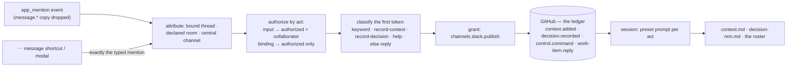

<!-- Authored per the the-loop:writing skill. -->

# Requirements: a Slack conversation reaches the-loop only when addressed, and can hand it context, decisions and collaborators

> Phase 1 of 4 (requirements → design → testing plan → tasks). Following the Kiro spec
> approach (<https://kiro.dev/docs/specs/>). This phase MUST be reviewed and approved by
> the required collaborators before moving to design. Derived from
> [`brainstorm.md`](brainstorm.md), converged on
> [PR #390](https://github.com/MadaraUchiha-314/the-loop/pull/390).

## Introduction

[Issue-389](https://github.com/MadaraUchiha-314/the-loop/issues/389): *"the-loop
shouldn't be triggered by every message on the slack channel … only when someone
mentions it using `@the-loop` … Add a certain thread as context … Record any decisions
… using a `/the-loop` command is not the best user experience."*

Since [issue-375](https://github.com/MadaraUchiha-314/the-loop/issues/375) and
[issue-378](https://github.com/MadaraUchiha-314/the-loop/issues/378) a work item can
have a room of its own, and the room is a firehose in both directions: every message an
authorized member types there is mirrored onto the ticket and typed into the session,
everyone else is dropped in silence, and there is no gesture for the two things a room
actually wants from the loop.

| Today | Consequence |
|---|---|
| A room's every `message.*` event from an authorized member is a `work-item.reply` | The ticket fills with talk meant for other people, and the agent is interrupted by all of it |
| Who may speak is `routing.authorizedUsers` alone; a work-item collaborator (issue-307) is a GitHub login with no Slack id | The stakeholders a room exists for cannot address the-loop at all |
| The only acts a message can be are a reply, a gate answer or a control keyword | "This thread is context" and "we decided X" have no gesture and no record |
| `/the-loop` is the way to address the-loop outside a thread | It carries no thread and reads as an operator command in a room |

**The unit of the change is one rule and three acts.** The rule, decided by the owner on
PR #390: a message meant for the-loop carries the `@the-loop` mention, delivered as
Slack's `app_mention` event, and every other message is ignored, in every conversation
shape, with one authorized-only switch per room. The acts: `record-context`,
`record-decision` and `add-collaborator`, each a ledger record first, each ending in the
session with a preset prompt, each also reachable as a message shortcut.

## Requirements

### R1 — a conversation reaches the-loop only when it is addressed

**User story:** As a member of `#tmp-issue-389`, I want the-loop to act only on messages
that name it, so that the room stays a room for people and the ticket a record of the
work.

#### Acceptance criteria (EARS)

1. WHEN Slack delivers an `app_mention` event in a conversation the-loop attributes to a
   work item (a bound thread, a declared room, the central channel) THEN the system SHALL
   process it through the inbound pipeline as that member's message on that work item,
   with the `<@bot>` token removed from the text wherever it sits, and SHALL process it
   **once**: the `message.*` event Slack delivers for the same channel and `ts`, in
   either order, SHALL be dropped as `duplicate`.
2. WHEN a `message.*` event arrives in a channel or thread and no `app_mention` accompanies
   it THEN the system SHALL drop it as `not-addressed`: no ledger record, no delivery, no
   reaction, no reply.
3. R1.2 SHALL hold in every conversation shape: a declared room, a thread the-loop opened
   in the central channel (its questions and approval requests included), and the
   central channel's top-level messages. A reply typed under the-loop's own question
   without the mention is ignored.
4. WHEN a typed gate answer (`approved`, `changes requested`) or a control keyword carries
   the mention THEN the system SHALL classify it exactly as the same text typed in a
   thread today (`gate.feedback`, `control.command`); WHEN it does not THEN R1.2 applies.
   A button press and a slash command SHALL be unchanged: neither is a message.
5. WHEN a top-level message in the central channel carries the mention AND the channel
   holds `work-item.create` THEN the system SHALL treat the text after the mention as a
   kickoff, with the `<repo>:` prefix grammar unchanged; WHEN it does not carry the
   mention THEN R1.2 applies and nothing is created.
6. WHEN the conversation is a **direct message with the bot** (`D…`) THEN the system SHALL
   keep `message.im` as its input, mention or not: Slack does not deliver `app_mention` in
   a direct message, and a DM with the bot is addressed by construction.
7. WHEN `channels.slack.read.mode` is `poll` THEN the system SHALL read no channel or
   thread message as input (a DM's, and an `all` room's under R2, excepted), because the
   poll transport has no mention event, and `channels status` SHALL say that the mention
   rule needs `read.mode: socket`.
8. The shipped app manifest SHALL carry the `app_mentions:read` bot scope and the
   `app_mention` bot event; `channels status --probe` and the listener's connect-time probe
   SHALL report a granted-scope set missing `app_mentions:read` as a finding naming the
   consequence (nothing typed reaches the-loop); the Slack guide's upgrade table SHALL
   name both.
9. WHEN a mention arrives in a channel the-loop cannot attribute (neither declared, nor
   the central channel, nor a bound thread) THEN the system SHALL drop it as `unmapped`,
   as it does today.

### R2 — a room can be switched to hear everything, by an authorized user only

**User story:** As an authorized user running a small, focused room, I want to opt one
room back into hearing every message, so that the mention rule is a default and not a
cage.

#### Acceptance criteria (EARS)

1. `the-loop add-channel <type>@<target> [--listen mentions|all]` — on the ticket, from
   the terminal, and by mention (R3.4) — SHALL record the listen mode in the work item's
   collaboration-channel declaration with the same provenance the declaration carries
   (who, when, through which surface); the default SHALL be `mentions`; re-declaring
   SHALL replace the mode.
2. WHEN a room's mode is `all` THEN the system SHALL treat the room's `message.*` events
   as input exactly as before this work item (a top-level message and a reply in any
   thread there are messages on the work item), and the `app_mention` copy of a
   mentioned message SHALL be the one dropped as `duplicate`.
3. The switch SHALL be an act only `routing.authorizedUsers` may perform, as the
   declaration already is (issue-375 R1.1); a work-item collaborator's attempt SHALL be
   refused as `control.rejected` and change nothing.
4. `the-loop channels threads` and `channels status` SHALL show a room's listen mode.

### R3 — the grammar after the mention

**User story:** As a room member, I want a handful of words I can learn, and plain
language when none fits, so that I never have to look up a command.

#### Acceptance criteria (EARS)

1. The system SHALL read the **first token** after the mention and classify the message
   as exactly one of: a configured control keyword's last word (`start`, `execute`,
   `add-collaborator`, `add-channel`, …), `record-context` (R4), `record-decision` (R5),
   `help`, or — for any other first token, or none — a `work-item.reply` delivered to the
   session as today. Classification SHALL use no model.
2. WHEN the token is `help` THEN the system SHALL answer the member **ephemerally** with
   the grammar and the grants this channel holds, and SHALL record nothing.
3. Every message that opens a room conversation (issue-378 R5.1) SHALL carry a one-line
   hint naming the mention and `help`; the Slack guide SHALL carry the gesture table.
4. WHEN the token is a control keyword THEN the system SHALL publish `control.command`
   with a line composed from the **configured** keyword and the validated remainder,
   exactly as the slash command composes it (issue-334), recorded unmarked on the ledger
   for the ledger's ingress to execute.
5. WHEN the token is `add-collaborator` or `remove-collaborator` THEN the remainder SHALL
   accept a Slack member mention (`<@U…>`), a GitHub `@login`, or both, and the roster
   entry written SHALL carry whichever ids were given (R7.1).
6. Every accepted mention SHALL be acknowledged on the message with the issue-325
   reactions (👀, then ✅ or ⚠️), and every act that writes a record (R4, R5, a keyword)
   SHALL be answered with one reply in the message's thread carrying the record's link.
7. **Every act ends in the session.** WHEN an act's record has been written THEN the
   system SHALL deliver into the work item's session a **preset prompt for that act**
   naming what was recorded, the person, the record's URL and the file the session is to
   update (R4.7, R5.6); delivery SHALL be best-effort (a refusal is `channel.dropped` /
   `undeliverable` and reacted ⚠️) and the record SHALL stand regardless.

### R4 — `record-context`: a thread becomes auditable context

**User story:** As a room member, I want to point the-loop at a thread and say "this is
context", so that the agent works from the conversation we actually had, and a later
reader can see who told it what.

#### Acceptance criteria (EARS)

1. WHEN an authorized user or a collaborator of the work item mentions `record-context`
   **in a thread** THEN the system SHALL read that thread's messages (the root and every
   reply so far), render each with the author's name resolved through the directory,
   its time and the message's permalink, and record the snapshot on the ticket as a
   **marked**, enveloped `context.added` comment quoting the text, naming the asker and
   the thread's permalink.
2. WHEN the mention is a top-level message with no thread THEN the snapshot SHALL be that
   message alone.
3. The record SHALL be scrubbed as a reply mirror is (issue-309): broadcast sequences
   neutralised, the-loop's markers and envelopes defanged, HTML comments removed, member
   ids drawn as names.
4. WHEN `record-context` is mentioned again on a thread already recorded THEN the system
   SHALL record only the messages newer than the last snapshot; WHEN there are none THEN
   it SHALL answer ephemerally that nothing is new and record nothing.
5. The snapshot SHALL be **capped** (messages and characters, values fixed in design) with
   the thread's permalink for the rest, and SHALL never be summarised by a model.
6. `context.added` SHALL be a catalog row: publishable (granted in `channels.slack.publish`),
   recorded, and subscribable so any channel may hear that context was added; without the
   grant the mention SHALL be dropped as `unpublishable-event`.
7. The operating model SHALL gain a fifth artifact, **`docs/specs/<id>/context.md`**, from
   a bundled template: WHEN a session receives or reads a `context.added` record THEN it
   SHALL append one entry — who added it, when, from which channel and thread (link),
   the record's URL, and the snapshot — so the file audits everything the loop was told;
   the skill and the workflow reference SHALL name it beside the other artifacts, and
   `/the-loop:work-on` SHALL read it at the start of every phase.

### R5 — `record-decision`: a human's decision is a decision record

**User story:** As an authorized user, I want to say "we decided X" in the room and have
it land in the same decision log every other decision lives in, so that a decision made
in a conversation is not lost when the conversation is.

#### Acceptance criteria (EARS)

1. WHEN an authorized user mentions `record-decision <text>` THEN the system SHALL record
   on the ticket an **unmarked**, enveloped comment typed `decision.recorded` carrying the
   text, the person, the time, the thread or message permalink and, when given, a kind
   (`product` | `design` | `tech`) and a rationale.
2. WHEN the text after `record-decision` is empty THEN the system SHALL refuse
   ephemerally, showing the grammar, and record nothing.
3. WHEN a collaborator who is not an authorized user attempts it THEN the system SHALL
   refuse (⚠️, an ephemeral line saying the act needs an authorized user) and record
   nothing.
4. The ledger's ingress SHALL treat an enveloped `decision.recorded` record as **input**
   for the work item's session and never as a gate answer or a control command, whatever
   words the text contains and whether or not a gate is open; a decision recorded at an
   open gate SHALL leave the gate as it was.
5. `decision.recorded` SHALL be a catalog row: publishable (granted), recorded,
   subscribable.
6. WHEN a session receives or reads a `decision.recorded` record THEN it SHALL write
   `docs/decisions/decision-<nnn>.md` from the bundled template — the person as decider,
   the work item, the Slack permalink and the record's URL as provenance, the text as the
   decision — and a row in `docs/decisions/decisions.md`, committed with the work item;
   the skill SHALL say so.

### R6 — the same acts as message shortcuts, with a modal for a decision

**User story:** As a room member on a phone, I want *Add as context* and *Record a
decision* in a message's ⋯ menu, so that the act is one tap and the decision has a form.

#### Acceptance criteria (EARS)

1. The shipped manifest SHALL declare two **message shortcuts** with fixed callback ids;
   the listener SHALL handle the `message_action` and `view_submission` interactive
   payloads over Socket Mode and acknowledge each within Slack's three-second window
   before doing any work.
2. WHEN the context shortcut is used on a message THEN the system SHALL process it exactly
   as `@the-loop record-context` typed by that member on that message (R4), through the
   same pipeline, authorization and grant.
3. WHEN the decision shortcut is used THEN the system SHALL open a modal on the payload's
   `trigger_id` with the decision text pre-filled from the message, a kind select and an
   optional rationale; WHEN the modal is submitted THEN the system SHALL process it
   exactly as `@the-loop record-decision` typed by the submitting member on that message,
   with the kind and rationale carried (R5).
4. A shortcut SHALL be authorized, classified and granted as the typed form is; a crafted
   `message_action` or `view_submission` payload SHALL buy nothing a typed mention would
   not.
5. WHEN the outcome is known THEN the member SHALL be answered ephemerally with the
   record's link or the refusal, and the thread SHALL get the one-line reply of R3.6; a
   shortcut acts once per `trigger_id`.
6. Shortcuts SHALL be rendered and handled only with `read.mode: socket`; `channels status`
   SHALL name them and the manifest step an installation still needs.

### R7 — who may address the-loop, per act

**User story:** As an authorized user, I want to let a room's stakeholder feed the loop
without letting them steer it, so that input and authority stay two different grants.

#### Acceptance criteria (EARS)

1. A work-item collaborator entry (issue-307) SHALL carry an optional Slack member id
   beside the optional GitHub login, at least one of the two; `add-collaborator` SHALL
   accept either or both (R3.5), and the CLI form SHALL accept a `--slack <id|@handle>`
   with the same resolution rules names have (issue-375).
2. **Input** — `record-context`, the reply fallthrough and `help` — SHALL be accepted from
   `routing.authorizedUsers` and from that work item's collaborators (by Slack id).
   **Binding acts** — `record-decision`, every control keyword, `add-channel --listen` —
   SHALL be accepted from `routing.authorizedUsers` only.
3. WHEN a member on neither list mentions the-loop THEN the system SHALL drop the message
   in silence, with no reaction and no reply, as it drops a stranger's message today.
4. A collaborator's ledger record SHALL name them by the ids the roster holds (Slack id,
   and login when known), resolved from the roster, never from the message.
5. The collaborator roster's reading SHALL be by work item: the message is attributed to
   a work item first (R1.1), and only that item's roster widens who may speak on it.

### R8 — the change ships with its documentation

1. The channels options page's catalog table, the schema's `publish` description (both
   copies), the shipped config template and this repository's config comment SHALL list
   `context.added` and `decision.recorded`; the catalog-to-docs test SHALL pass.
2. `docs/capabilities/channels.md` SHALL describe the mention rule, the listen switch,
   the grammar, the two acts and the shortcuts in *Current behaviour*, with a history
   row; the capability doc that describes work-item collaborators SHALL describe the
   Slack id.
3. The Slack guide SHALL carry the gesture table, the mention rule in the modes table,
   the room section, the upgrade table (scope, event, shortcuts) and the poll-mode limit.
4. `skills/the-loop/SKILL.md`, `reference/workflow.md` and `reference/collaboration.md`
   SHALL name `context.md` as an artifact and the Slack-born decision record; the
   templates directory SHALL gain `context.md`.

## Non-functional requirements

- **Cost.** `record-context` is one `conversations.replies` call plus directory lookups
  the cache already serves; `record-decision` is one ledger write; the mention gate adds
  no call, since the drop happens before any lookup.
- **Observability.** `channel.dropped` gains the reasons `not-addressed`, `duplicate`
  (existing) and `unauthorized-act`; new events `channel.context_recorded`,
  `channel.decision_recorded`, `channel.shortcut_received`, `channel.view_submitted`;
  payloads carry ids, event types and counts, never text.
- **Compatibility and upgrade.** No config version bump: two enum values are added to
  `publish`, nothing renamed. An installation whose Slack app lacks the new scope and
  event hears nothing typed after upgrading; `channels status` and the connect-time probe
  SHALL name that state (R1.8), and the release notes SHALL call the manifest step out.
  A conversation record without a listen mode is `mentions`.

## Security considerations

Two boundaries widen (who may speak on a work item, and what a message may become) and
one new kind of data crosses into the repository (other people's words). Every mitigation
sits on an existing guard.

- **Actors & trust.** Authorized users; work-item collaborators (input only); room members
  on no list; strangers who reach a channel the bot is in; Slack's payloads
  (`app_mention`, `message_action`, `view_submission`), all untrusted; the-loop's own bot
  user, whose messages are dropped as its own.
- **Trust boundaries & data.** A mention's text, a thread's content and a modal's fields
  are untrusted input crossing into a ledger record, into the session (as data, under the
  event prompt's existing "untrusted" framing) and into `context.md` in a repository that
  may be public. Member ids in a record come from config or the roster, never from the
  message. The bot token stays in the environment; no new secret.
- **Abuse cases (EARS)** — each becomes a negative test:

| # | Abuse case | Requirement |
|---|---|---|
| A1 | WHEN a stranger mentions the-loop in a room THEN the system SHALL drop the message in silence and reveal nothing (no reaction, no help text) | R7.3 |
| A2 | WHEN a collaborator mentions `record-decision`, a control keyword or `add-channel --listen` THEN the system SHALL refuse and change nothing; only `routing.authorizedUsers` bind the work item | R2.3, R5.3, R7.2 |
| A3 | WHEN a crafted `message_action` or `view_submission` payload names a member, a channel or a message THEN the system SHALL authorize the payload's own user id against the same lists and classify and grant the act as a typed mention, so a forged payload gains nothing | R6.4 |
| A4 | WHEN a snapshotted thread or a decision text contains instructions addressed to the agent THEN the system SHALL deliver it as data inside the preset prompt's untrusted block, never as an instruction, and the session's rules SHALL be unchanged by it | R3.7 |
| A5 | WHEN a snapshotted thread contains `<!channel>`, the-loop's marker, an envelope or an HTML comment THEN the record SHALL neutralise or defang each before it is written, so a snapshot can neither broadcast nor forge a record | R4.3 |
| A6 | WHEN decision text contains an approval word while a gate is open THEN the ingress SHALL treat the enveloped record as input only, and the gate SHALL stay as it was | R5.4 |
| A7 | WHEN `message.*` and `app_mention` for one message arrive in either order, or Slack redelivers one THEN the system SHALL act once | R1.1 |
| A8 | WHEN a mention arrives in a channel the-loop cannot attribute THEN it SHALL be dropped as `unmapped` and nothing SHALL be recorded anywhere | R1.9 |
| A9 | WHEN a thread contains a token, a credential or personal data THEN the snapshot SHALL pass the same redaction the ledger record already applies to mirrored text, and a snapshot that cannot be redacted SHALL be refused with an ephemeral reason rather than written | R4.3 |
| A10 | WHEN a `message.*` event carries no mention in a room switched to `mentions` THEN nothing about it SHALL be recorded, delivered or reacted to, so an unaddressed conversation leaves no trace on the ticket | R1.2 |
| A11 | WHEN the roster gains a Slack id that does not resolve, or a handle two members could hold THEN the entry SHALL authorize nobody (fail closed as `authorizedUsers` does) | R7.1 |
| A12 | WHEN a listen mode is present in a forged or hand-edited declaration THEN it SHALL be honoured only if the declaration itself is valid under issue-375's rules; an invalid declaration is refused whole | R2.1 |

- **Fail closed.** No `app_mentions:read` → nothing typed is heard, and `status` says so;
  no grant → the act is dropped as `unpublishable-event`; an empty allow-list and an
  empty roster → nobody speaks; an unresolvable id → nobody; a `trigger_id` already used
  or expired → the shortcut does nothing and says so; a record the ledger refuses → no
  delivery, ⚠️ on the message.

## Out of scope

- Following a thread after its snapshot (a subscription). A second `record-context`
  appends what is new.
- A model summarising a thread or classifying a message (decision-118 stands).
- Mapping decision kinds to `collaborators.yaml` roles; a decision needs an authorized
  user, whatever its kind.
- Retiring the operator's central channel and DM (the ticket's "mode 1"); they keep
  working, under the mention rule where Slack delivers mentions.
- Mention gating in a direct message with the bot (R1.6): Slack offers no event for it.
- The room's outbound noise (every subscribed event as a top-level message); a rendering
  question for another work item.
- A Jira or other channel type.

## Open questions

Four brainstorm questions were still open when the owner said "go ahead with
requirements"; each is taken as an **assumption**, recorded in
[`docs/decisions/conflicts.md`](../../decisions/conflicts.md) and on the
[ticket](https://github.com/MadaraUchiha-314/the-loop/issues/389), for
`requirements-approval` to confirm or overturn:

1. A thread snapshot is copied **verbatim** onto the ticket and into `context.md` (R4.1),
   other people's words included, with A5 and A9 as the guards.
2. The shortcuts and the modal ride in **this** work item (R6).
3. A room member on no list is dropped in **silence** (R7.3); the friendlier nudge was
   left out because it reveals that a roster exists.
4. The mention rule reaches typed gate answers and kickoffs (R1.4, R1.5); button presses
   and slash commands are unchanged.
5. Slack delivers no `app_mention` in a DM with the bot, so the DM keeps `message.im` as
   its input (R1.6).

## Review comments

> Appended by the-loop's `record-feedback` hook when a human gate approves with
> comments (issue-109).

- **2026-09-19 · MadaraUchiha-314 (owner) · approved** —
  [review on PR #390](https://github.com/MadaraUchiha-314/the-loop/pull/390#pullrequestreview-5257062686):
  *"approved. go ahead with design and implementation"*. Recorded by the session because
  no daemon runs the `requirements-approval` gate for this repository's cloud sessions;
  the five assumptions under *Open questions* stand as approved.
