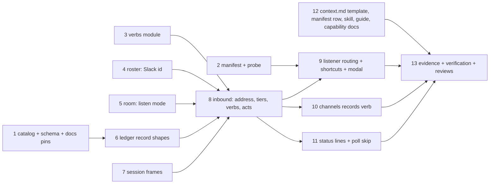

<!-- Authored per the the-loop:writing skill. -->

# Tasks: the mention is the address, and three acts each end in the session

> Phase 4 of 4. Derived mechanically from the approved [`design.md`](design.md) and
> [`testing-plan.md`](testing-plan.md); each task names the requirement it satisfies and
> the matrix row that proves it. No approval gate (issue-281). Test-first per task: a
> failing test motivates the code, and the commit message records the red→green command.

## Tasks

- [x] **1. Catalog rows, schema text, docs pins.** `channels/events.py` gains
  `context.added` and `decision.recorded` (origin channel, publishable, recorded, not
  subscribable); both `cli-config.schema.json` copies' `publish` description, the
  channels options page's grant table and the shipped `cli-config.yaml` comment name
  them; `test_bus.py`'s pinned sets grow by two. _Req:_ R4.6, R5.5, R8.1 (design §8).
  _Test:_ T1 (`test_bus.py`), T10 (`test_docs_parity.py`, `test_config_schema_parity.py`),
  `test_the_docs_list_every_publishable_event`.
- [x] **2. Manifest and probe.** `slack-app-manifest.yaml` gains `app_mentions:read`, the
  `app_mention` bot event and the two message shortcuts; the guide's fenced copy is
  byte-equal; `subscription_findings` measures `app_mentions:read` and names the
  consequence; the connect-time probe and `channels status --probe` report it. _Req:_
  R1.8, R6.1 (design §1, §6, §8). _Test:_ T6 (`test_channels_dm.py`,
  `test_channels_commands.py`), T10.
- [x] **3. `channels/verbs.py`.** `strip_mention`, `parse_verb`, `compose_keyword`,
  `help_text`. _Req:_ R3.1, R3.2, R3.4 (design §3). _Test:_ T1 (`test_channels_verbs.py`).
- [x] **4. Roster: a Slack id.** `CollaboratorRecord.slack`, `login` optional when
  `slack` is set, fail-closed `from_dict`; `parse_subjects` (`@login`, `slack:U…`);
  `slack_ids()`, `is_collaborator_slack()`; `add(login=, slack=)`; the dispatcher's
  `_apply_collaborator` and `command_comment` speak both; the CLI's `--slack` resolves a
  handle through the directory. _Req:_ R3.5, R7.1, R7.4 (design §5). _Test:_ T1
  (`test_collaborators.py`), T2 (`test_collaborators_cli.py`), T8 A11, T10.
- [x] **5. Room: the listen mode.** `CollaborationChannel.listen` with the two-value
  guard; `control._parse_channels` reads `--listen`; `store.add(listen=)`; the
  dispatcher's `_apply_channel` and the CLI's `--listen`; `command_comment` spells it
  back; `ChannelStores.listen_mode`; `channels threads` prints it. _Req:_ R2.1, R2.3,
  R2.4 (design §2). _Test:_ T1 (`test_workchannels.py`), T2 (`test_workchannels_cli.py`),
  T8 A12, T10.
- [x] **6. Ledger record shapes.** `GitHubLedger.record` mirrors `context.added` and
  `decision.recorded` as marked, quoted, scrubbed, defanged, enveloped comments whose
  visible line names the act and the person. _Req:_ R4.1, R4.3, R5.1, R5.4 (design §4).
  _Test:_ T1 (`test_channels.py`), T8 A5, A6.
- [x] **7. Session frames.** `reply_session(kind=)` with the `context` and `decision`
  frames composed from fixed words, the ref, counts and URLs, naming the text untrusted.
  _Req:_ R3.7 (design §4). _Test:_ T1 (`test_channels_mentions.py`), T8 A4.
- [x] **8. Inbound: the address, the tiers, the verbs, the acts.**
  `handle_socket_event(addressed=)` and the §1 input table (DM, `all` room, everything
  else) with the `not-addressed` and `duplicate` drops; `speaker_for` and the act table;
  `_classify` step zero; `help` ephemeral; `record-context` through
  `SlackBotChannel.snapshot_thread` (cap, links, names, scrub order, `snapshots` state
  under the lock, nothing-new answer, size refusal); `record-decision` (empty refusal,
  kind and rationale); `_DELIVERED`; the thread reply with the record's link; the
  kickoff by mention. _Req:_ R1.1–R1.6, R1.9, R2.2, R3.1–R3.7, R4.1–R4.5, R5.1–R5.4,
  R7.2–R7.5 (design §1, §3, §4, §5). _Test:_ T1, T2 (`test_channels_mentions_integration.py`),
  T8 A1–A10.
- [x] **9. Listener routing, shortcuts, modal.** `handle` routes `app_mention`,
  `message_action`, `view_submission`; `handle_message_action` and
  `handle_view_submission`; `decision_view`; `views_open`; `post_ephemeral`; `once.py`
  ring shared with the slash command. _Req:_ R1.1, R6.1–R6.6 (design §1, §6). _Test:_ T2
  (`test_channels_shortcuts_integration.py`), T6 (`test_channels_shortcuts.py`), T8 A3.
- [x] **10. `the-loop channels records`.** A read-only verb listing a work item's
  enveloped `context.added` / `decision.recorded` records (url, actor, ts, body) as json
  or markdown. _Req:_ R4.7, R5.6 (design §7). _Test:_ T2
  (`test_channels_records_integration.py`).
- [x] **11. Status lines and the poll skip.** `channels status` prints `mentions:`,
  `shortcuts:` and the `all`-room count; `fetch_replies` / `fetch_channel_messages` skip
  mention-gated conversations and move no cursor. _Req:_ R1.7, R2.4, R6.6, R1.8 (design
  §1, §8). _Test:_ T2, T6.
- [x] **12. The operating model and the docs.** `templates/context.md`; the
  `workItemArtifacts` row; `interaction._ARTIFACT_RULE`; `SKILL.md`, `workflow.md`,
  `collaboration.md`; `docs/guide/slack.md` (modes table, _Addressing the-loop_, the
  room, upgrade table, limits, downtime); `docs/capabilities/channels.md` and
  `webhook-triggers.md` with history rows; `routing-options.md` for `--listen`;
  `evidence/documentation.md`. _Req:_ R4.7, R5.6, R8.2–R8.4 (design §7, §9). _Test:_ T10
  (`test_graph_parity.py`, `test_interaction.py`), T12.
- [x] **13. Verification, reviews, evidence.** Run the plan (T1, T2, T6, T8, T10, T12;
  T11 recorded as not executable here, no workspace), fill _Verification results_, write
  `evidence/*.md`, the self-review and critic-review records, the security review, the PR
  briefing. _Req:_ all. _Test:_ the plan's activities.

## Notes

- Tasks 1–7 are independent of each other; 8 depends on all of them; 9–11 on 8; 12 on
  the design alone; 13 last.
- Every commit: `<type>(issue-389): …` with the test command and its red→green line.
