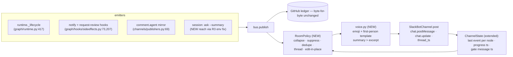

<!-- Authored per the the-loop:writing skill. -->

# Design: the Slack room becomes a colleague — five e2e bugs, the message rework, and deployment self-service

> Phase 2 of 4 (requirements → design → testing plan → tasks). Derives from the approved
> [`requirements.md`](requirements.md). Reviewed together with
> [`testing-plan.md`](testing-plan.md) at the `design-approval` gate.

## Overview

**One new seam carries most of the work: a room-delivery policy between the event bus
and the Slack renderer.** Today four independent emitters (`Runtime._lifecycle`, the
`notify`/`request-review` hooks, the GitHub→room `comment.agent` mirror, and
`announce.py`) each compose finished text and hand it to `SlackBotChannel.post`, which
posts everything, top-level, with a fixed header. The rework (R6, R7, R10, R11, R12)
does not touch the event vocabulary or the GitHub ledger: it inserts a **RoomPolicy**
that decides, per event and per work item, *post / suppress / edit-in-place / thread*,
and a **voice layer** that renders the surviving events in first person with one state
emoji. The bug fixes are the policy's foundation: B6 (R3) makes session events reach
the bus at all; B8 (R4) makes the gate hear its first answer; B1 (R1), B3+F2 (R2) and
B9 (R5) are contained fixes in the directory, diagnostics and critic wrapper. F3 (R13)
gives the daemon label-ensuring on first contact.

## Architecture

### Track A — bug fixes

**B1 / R1 — membership-first name resolution** (`channels/directory.py`).
`_read_conversations` pages `conversations.list` up to `_MAX_PAGES = 20`
(directory.py:305, 337, 443); in a large workspace the cache holds thousands of names,
zero private channels, and resolution fails for the bot's own rooms. Change
`SlackDirectory` resolution order:

1. `users.conversations` (`types=public_channel,private_channel`) — the conversations
   the bot is a *member* of: small, complete, includes private. New method
   `_read_memberships`, cached beside the workspace listing with its own fetched-at.
2. Fall back to the existing workspace listing for public channels the bot has not
   joined.
3. The listing records `truncated: true` when the page cap ended it; a name miss over a
   truncated listing refuses with "listing truncated at N conversations — use the
   conversation id" (R1.4), never `missing-channel`'s "no such name". Refusals name the
   paths tried (R1.5).

**B3 + F2 / R2 — deployment diagnostics** (`channels/slack.py`,
`commands/channels_cmd.py`, `commands/diagnose_cmd.py`).
- The Socket Mode listener (slack.py:2477–2549) acks then dispatches; unhandled
  envelope types and unmapped channels return silently. Add one debug log per ignored
  envelope: type, subtype, channel, reason (R2.4). `channel.dropped` emissions
  (inbound.py:386, 825, 835) already log — the gap is only the listener's early
  returns.
- `probe_subscription` (slack.py:344–443) gains: read the expected bot-event list from
  the in-repo `channels/slack-app-manifest.yaml`, print it beside the scope probe with
  the fixed caveat "event subscriptions are not verifiable via the API — test with a
  mention" (R2.1).
- New `the-loop doctor slack` (join `diagnose_cmd.py`): (a) **second-consumer probe** —
  post a nonce heartbeat to the bot's own channel (or a self-DM) and wait for the own
  listener to receive it; a missing echo within the window ⇒ "another Socket Mode
  consumer may hold this app's connection — Slack splits events across connections"
  (R2.2; Slack exposes no connection-listing API, so the probe is evidence, not proof,
  and says so); (b) verify each declared channel id/name resolves in the directory
  (R2.3).
- Refused control keywords / binding acts post a marked reply with reason + remedy at
  the attempt site (R2.5): extend the `control.rejected` path to reuse the resolver's
  existing remedy text — the Slack ephemeral variant already exists; add the
  ticket-thread variant.

**B6 / R3 — the session inherits the daemon's bus** (`runner.py`, `commands/ask_cmd.py`).
The tmux spawn env (runner.py:379–390) exports `INSTANCE_ENV_VAR` and
`WORK_ITEM_ENV_VAR` only. Add `(CLI_CONFIG_ENV, <daemon's resolved config path>)`
(`cli_config.py:42` — already honoured at `--config` priority), threaded from the
spawner's caller which owns the resolved path; skipped when the pair's value is empty
or the variable is already present in the inherited environment (R3.4). `ask` (and the
shared publish helper) prints and posts a one-line warning when the resolved bus names
no channels (R3.2): "publishing to a bus with no channels — this question will reach
GitHub only; check THE_LOOP_CLI_CONFIG/--config".

**B8 / R4 — park at publish** (`graphlink.py`).
`RuntimeNode.at_human_gate` (graphlink.py:274) is `actor == "human" and status in
("waiting", "parked")`, and the status is set only on a later evaluation
(graphlink.py:1175) — so entering a human node via the session's `graph complete`
publishes `phase-approval-pending` while `at_human_gate` still answers `False`, and the
first Slack answer is classified a reply (inbound.py:157 `_at_human_gate` reads this
exact property). **Fix at the single writer:** when node entry publishes the approval
request for a human-actor node, set the node's status to `waiting` in the same step and
persist `work-item-state.json` before the publish returns. `_at_human_gate` and its
three-valued contract (issue-321) stay untouched; the state it reads simply becomes
true at the moment the room is asked. Differentiated acknowledgement (R4.3) is
delivered by R10.1: a consumed gate answer gets the threaded "locked, moving on" reply;
a message recorded as a mere reply does not.

**B9 / R5 — the wrapper is innocent; make it impatient-proof** (`critics.py`,
`commands/critic_cmd.py`).
Current source honours `--timeout` end-to-end (critic_cmd.py:137→236 →
critics.py `run_critic`: `limit = timeout if timeout is not None else
critic.timeout_seconds`, default `DEFAULT_TIMEOUT_SECONDS = 900.0`, critics.py:67), and
the flag has existed since v10. The observed ~120 s death matches an **external
caller-side cap** (an agent harness's default shell-tool timeout), which no in-process
timeout can fix. Design:
1. A regression test pins the threading (`--timeout 300` reaches `subprocess.run`
   verbatim) so R5.1 is *proven*, not asserted.
2. `critic run --detach`: spawn the critic detached (double-fork/`start_new_session`),
   write pid + JSON envelope to `.the-loop/critic-rounds/<round>.json`, return
   immediately; `critic collect <round>` polls/reaps — the JSON output contract
   (`--output-file`) is preserved, and a 120 s-capped caller can now run any-length
   rounds (R5.1's spirit: no cap short of the operator's).
3. `critic policy` prints the effective timeout per critic (R5.3).
4. The timeout error gains the remedy: `"…timed out after {limit}s; raise with
   --timeout or the critic's timeoutSeconds"` (R5.4). The skill's execute-tasks
   guidance names `--detach` for harnesses with tool timeouts.

### Track B — the room rework (R6–R12)

**RoomPolicy** (new module `channels/room_policy.py`), consulted by
`SlackBotChannel.post` for every event bound to a room; GitHub delivery never passes
through it (R6.5). Decisions, in order:

| Rule | Trigger | Action | Req |
|---|---|---|---|
| dedupe | same event type + node already delivered for the item | drop, debug log | R6.4 |
| gate-collapse | `phase.started`/`comment.agent` mirror for a node whose `*-pending` was posted ≤ the same gate | drop, debug log | R6.2 |
| transition-collapse | `phase.completed` immediately followed by `phase.started` (successor) | render as one transition line | R6.1 |
| progress-edit | stage events within one autonomous phase | `chat.update` the phase's progress message | R6.3 |
| ack-thread | gate answer consumed | thread reply under the stored gate message ts | R10.1 |
| session-wins | session-authored message for a moment a template would also announce | template dropped | R12.3 |
| operator-docs | tmux/announce content | ticket only, never the room | R11.3 |

Every drop/edit decision emits one debug log naming the rule (NFR observability).

**ChannelState extensions** (`channels/state.py`, persisted per work item; `post()`
already locks per item): `last_delivered {node, event_type, ts}`, `progress_ts` per
phase, `gate_ts` per gate node, `phase_selection_ts`. Crash-safe: a lost state file
degrades to today's behaviour (post everything top-level) — never to silence.

**voice.py** (new module `channels/voice.py`): a single table mapping event kind →
(emoji, first-person template). Kickoff 🚀, question 🤔, artifact-ready 📋, locked ✅,
progress 🔨, PR-ready 👀, done 🎉, warning ⚠️. Replaces the header block for room-bound
messages (render_blocks, slack.py:909–917): rooms get no header (R7.1); shared/central
channels get `#<n> <title>` linked, not the 50-char ref (R7.2). The mirrored-comment
signature renders once (strip the second stamp at render, `authz.py:74` marking for
GitHub unchanged) (R11.2).

**Summaries** (R8, R12): `the-loop ask --summary "…"` and the approval-submission path
(`graph complete` for gate-feeding artifacts) accept an agent-authored 2–3 sentence
summary, carried as a new optional `Event.summary` field through `bus.publish` into
`render_blocks`; when present it replaces the digest excerpt (fallback to today's
`_excerpt`, sideeffects.py:167–195, when absent — R8.2). The PR-review gate message
names PR number/title/link/diffstat from the linked PR (`graph.pull_request_linked`
record) and leads with the briefing's first lines; its button opens the PR (R8.3).
Digest truncation never cuts an unanswered question/control: `fit` (digest.py:500–514)
gains a protected-region mark the emitters set around questions; if the region cannot
fit, the message says what was cut and links it (R8.4).

**Phase selection** (R9): `selection.py`'s checklist (485–560) gains a Slack rendering
as in-message Block Kit `checkboxes` elements (phases pre-checked; the codebase's first
checkboxes — buttons/`static_select`/modal plumbing exists: `ACTION_PREFIX` handlers,
slack.py:983–1014) with the outer-loop question as its own element in the same message
(R9.2), plus Execute. Submission composes the identical signed execute the GitHub
checklist path produces, attributed to the submitting Slack user and authorized like
the typed keyword. Typed fallback grammar in `verbs.py`: `execute without <n,…>` /
`skip <phase>` (R9.3, F1). No interactivity grant ⇒ the message says "edit the
checklist on GitHub" with the link (R9.4). The adversarial copy goes (R9.5).

**Threading** (R10): `post()` (slack.py:1490–1543) posts to the bound
`(channel_id, thread_ts)`; a channel-bound room has `thread_ts=""` so everything is
top-level. Acks pass an explicit `thread_ts` — the stored `gate_ts` (R10.1/R10.3).
Progress messages use `chat.update` (precedent: `report_press`, slack.py:1816) — one
message per phase, edited within it (owner decision).

**Session voice** (R12): with R3 fixed, `session.awaiting_input` reaches the bus; its
room message carries the question, options, stated default and a "Defaults are fine"
button whose press delivers the default as the reply (R12.1). The artifact-ready
announcement is the session's summary (R12.2); `session-wins` suppresses the template
(R12.3).

**Config**: new `channels.slack.room.style: agentic | classic` (default `agentic`).
`classic` restores today's rendering wholesale (one switch, not per-rule knobs).
Existing `verbosity`/`maxChars`/subscription config keeps its meaning in both styles.

### Track C — F3 / R13 — the daemon owns repository setup

`set-phase-label` (sideeffects.py:51–70) currently warns and degrades when a label is
missing. Add `ensure_labels(repo, labels)` in the github integration: on the daemon's
first contact with a declared repository (poller arming check and the dispatcher's
spawn path — one guard, cached per repo per daemon lifetime), create the `loop:*` set
and the configured auto-execute labels (R13.1). `set-phase-label` creates-and-retries
once on a missing label (R13.2). Failures post once on the ticket (R13.3). The ensure
path takes the repository from the daemon's `repositories` config only — an undeclared
repo is never touched (R13.4, fail closed).

## Components & interfaces

| Component | Responsibility | Interface / contract |
|---|---|---|
| `channels/room_policy.py` (new) | per-event room delivery decision | `decide(event, state) -> Post \| Drop(rule) \| Edit(ts) \| Thread(ts)`; pure function over (event, ChannelState) — unit-testable without Slack |
| `channels/voice.py` (new) | room rendering: emoji + first-person text | `render(event, decision) -> blocks`; one table, no I/O |
| `SlackDirectory._read_memberships` (new) | bot-membership channel listing | same cache shape as `_read_conversations` + `truncated` flag |
| `Event.summary` (new field) | agent-authored summary transport | optional str, escaped/capped at render; absent ⇒ digest fallback |
| `critic run --detach` / `critic collect` | timeout-proof critic rounds | round state under `.the-loop/critic-rounds/`; JSON envelope unchanged |
| `github.ensure_labels` (new) | first-contact label creation | idempotent; declared repos only; cached per daemon lifetime |
| `runner` spawn env | daemon config propagation | adds `THE_LOOP_CLI_CONFIG` when known and not already set |
| `doctor slack` (new subcommand) | deployment-wide diagnosis | text report; heartbeat probe is labelled evidence, not proof |

## UI/UX design

| Artifact | Type | Location / link | Covers (screen · requirement) | Status |
|----------|------|-----------------|-------------------------------|--------|
| `design/slack-room-redesign.html` | html-prototype | [design/slack-room-redesign.html](design/slack-room-redesign.html) | the room, before/after · R6–R12 | draft |

- **Flows & states:** kickoff (checkboxes + outer-loop + Execute) → question (default
  button) → gate (summary + buttons, threaded ack) → per-phase progress
  (edited-in-place, history strip) → PR-ready → done; error state (channel-not-found
  refusal with remedy).
- **Design system / tokens:** Slack-native surface — Block Kit only; the mockup uses a
  Slack-like neutral rendering, system fonts, emoji glyphs.
- **Accessibility & responsiveness:** phone-width (~400 px) stacked and desktop
  side-by-side; every control also reachable by typed grammar (R9.3) for
  connectors/readers that cannot press buttons.
- **Evidence:** screenshots of the locked mockup at both widths captured at
  verification (`design.uiArtifacts.screenshotEvidence`).

## Data models

- `ChannelState` (persisted, per work item): `+ last_delivered {node, event_type, ts}`,
  `+ progress_ts: {phase: ts}`, `+ gate_ts: {node: ts}`, `+ phase_selection_ts`.
  Backward compatible: absent keys ⇒ classic behaviour.
- `Event`: `+ summary: str = ""` (optional; never required by any consumer).
- Critic round state: `.the-loop/critic-rounds/<round>.json` — `{pid, started, argv,
  output_file, status}` (local/ tree, never committed).
- Config schema: `channels.slack.room.style` enum (`agentic` default, `classic`);
  schema + docs updated in the same PR.

## Error handling

- Lost/corrupt `ChannelState` ⇒ classic delivery (post everything), warn once per item.
- `chat.update` failure (message deleted, ts stale) ⇒ post a fresh message, adopt its ts.
- Checkbox submission from an unauthorized user ⇒ ephemeral refusal, selection
  unfrozen, log line (abuse case 2).
- Summary validation failure (oversized, markup) ⇒ digest fallback + debug log (R8.2).
- `users.conversations` API failure ⇒ fall through to workspace listing (today's path).
- Detached critic orphaned (pid gone, no envelope) ⇒ `collect` reports `crashed`, names
  the log.
- `ensure_labels` API failure ⇒ once-per-item ticket comment + degraded hook result
  (today's warn), never a crash.
- Every RoomPolicy suppression is a debug log naming the rule — a "missing" message is
  diagnosable from the daemon log alone.

## Security design

- **AuthN/AuthZ:** unchanged mechanisms. R4 moves *when* gate state is readable, never
  *who* may answer: the answer's author passes the same authorization as today
  (inbound.py's authorized/collaborator checks). R9's checkbox submission is
  attributed to the Slack `user.id` in the signed interactive payload (Slack signature
  verification unchanged) and passes the same authorization as the typed `execute`;
  the composed execute is recorded with that attribution.
- **Input validation & injection surfaces:** `Event.summary` is untrusted-adjacent
  (agent-authored): rendered as escaped mrkdwn text, mentions neutralised
  (`<@…>`/`<!here>` stripped to plain text), capped (abuse case 3). `skip <phase>`
  grammar validates the phase name against the graph's phase set; unknown/unskippable ⇒
  refusal with reason, no partial freeze (abuse case 4). The heartbeat probe posts a
  fixed-format nonce, never config content.
- **Secrets handling:** doctor and refusal messages print ids and channel names only —
  never tokens; the probe reuses the existing client (tokens stay in env/config as
  today). Detached-critic envelopes carry argv with env *names*, not values.
- **Least privilege:** `users.conversations` needs no new scope beyond the installed
  `channels:read`/`groups:read`; `ensure_labels` uses the existing gh identity and
  touches declared repositories only (R13.4).
- **Fail-closed:** unauthorized gate answer ⇒ reply (unchanged); unverifiable
  interactive payload ⇒ dropped + log; summary invalid ⇒ excerpt fallback; doctor
  cannot verify subscriptions ⇒ "unverifiable", never "ok"; undeclared repo ⇒ no label
  writes.
- **Abuse-case coverage:** each of the five abuse cases in `requirements.md` maps to a
  named negative test in `testing-plan.md` (unauthorized gate answer; unauthorized
  checkbox submit; hostile summary; hostile skip-grammar; undeclared-repo labels).

## Testing strategy

Unit tests pin the pure seams: RoomPolicy decisions (one test per rule row), voice
table rendering, directory membership-first resolution + truncated refusals, the
critic timeout threading regression, `Event.summary` escape/cap, skip-grammar parsing.
Integration tests (Gherkin-docstringed, `cli/tests/test_*_integration.py`) cover the
routing scenarios: *"Scenario: the first authorized answer after a gate publishes
advances the gate"* (B8 — reproduces the e2e sequence: `graph complete` into a human
node, then one inbound answer), *"Scenario: a spawned session publishes to the daemon's
bus"* (B6 — spawn env carries the config path; `ask` warns on a channel-less bus),
*"Scenario: a gate's mirror and lifecycle lines are suppressed after its pending
message"* (R6.2), *"Scenario: progress edits in place within a phase"* (R6.3/R10.2),
*"Scenario: checkbox submission composes the signed execute"* (R9), and the five
negative abuse-case scenarios. The existing outbound suites
(`test_channels_digest.py`, `test_channels_buttons.py`, `test_channels.py`,
`test_channels_integration.py`) are extended, not replaced; `classic` style must keep
them green unchanged. Acceptance evidence is the live e2e re-run of the report's
timeline (environment and redaction rules in `testing-plan.md`), recording the room's
message count as trend evidence (no numeric gate, owner decision).

## Trade-offs & decisions

1. **Park-at-publish over widening `at_human_gate`** (B8): fixes the race at its single
   writer and keeps issue-321's three-valued read contract; the alternative (also
   accepting `pending`/`in-progress` human nodes at read time) would make the reader
   guess about state the writer hadn't committed. Durable — log under
   `docs/decisions/`.
2. **Policy layer at delivery, not at the emitters** (R6): emitters stay
   event-complete (GitHub ledger untouched by construction); one module owns every
   collapse rule; the cost is ChannelState growing delivery memory.
3. **`--detach` over raising in-process limits** (B9): no in-process timeout survives
   an impatient caller; detaching makes the round caller-timeout-proof while keeping
   the JSON contract. The regression test proves the flag was never the culprit.
4. **One `style` switch over per-rule knobs**: `agentic` is the product; `classic` is
   the escape hatch and the compatibility proof for existing tests.
5. **Heartbeat probe labelled as evidence** (F2): Slack has no connection-listing API;
   an honest "may be split" beats a false "ok".
6. **In-message checkboxes over modal** (R9): owner decision at the requirements gate.

## Open questions

None open — the three requirements-gate questions were resolved by the owner
(2026-09-19) and are folded in above.

## Review comments

> Appended by the-loop's `record-feedback` hook when a human gate approves with
> comments (issue-109).
