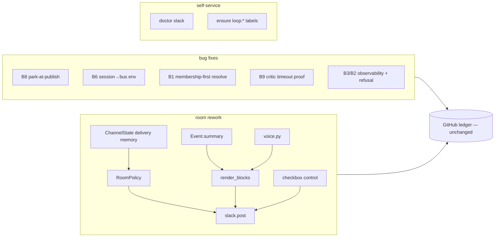

<!-- the-loop PR briefing (R10). This IS the PR description / top-comment. -->

# The Slack room becomes a colleague (issue-393) — reviewer briefing

## TL;DR

Fixes the five bugs the end-to-end Slack test found (B1, B3, B6, B8, B9) and does
the rework the run actually asked for: the room goes from 41 templated messages to
one message per meaningful moment in the-loop's own voice, phase selection becomes
a real Slack control, and the deployment can diagnose itself. The GitHub ledger is
untouched — every collapse and suppression is a room-delivery policy, so the whole
run is still reconstructable from the ticket.

## Where to focus (in this order)

1. **The gate race fix (B8)** — `cli/the_loop/graph/runtime.py` (park-at-publish) +
   the regression in `cli/tests/test_graph_drive.py`. This changes *when* a human
   node is considered "at a gate"; confirm it parks in the same advance that
   publishes the request and that `at_human_gate`'s three-valued contract is
   untouched. The highest-consequence behavioural change.
2. **The delivery seam (B3-rework, B5)** — `cli/the_loop/channels/room_policy.py`
   (pure decision, one test per rule) and its application in
   `cli/the_loop/channels/slack.py` `post()`. Check that a non-room / classic path
   is byte-for-byte the old behaviour, and that a lost delivery memory degrades to
   classic, never to silence.
3. **The checkbox Execute (B6)** — `cli/the_loop/channels/slack.py` +
   `inbound.py`. The press reconstructs a checklist body and reuses the gate's
   existing `_parse_selection` freeze — confirm no *new* freeze path was
   introduced and that an unauthorized submit freezes nothing.
4. **Session env inheritance (B6-bug)** — `cli/the_loop/runner.py`: the spawn
   exports the daemon's resolved config path, skipped when already set. Confirm it
   never overrides an explicit value.
5. **Skim:** the label create-and-retry (`sideeffects.py`), the doctor
   (`channels/doctor.py`, subagent-authored, 30 tests), the voice table
   (`voice.py`), the summary sanitizer (`digest.py`).

## What changed (map)

## Key decisions & why (education)

- **The room rework is a delivery policy over an unchanged ledger, and a gate
  parks when it publishes** — [decision-134](../../decisions/decision-134.md). The
  policy layer (not the emitters) owns every collapse rule, so the ledger stays
  event-complete by construction; park-at-publish fixes B8 at its single writer
  rather than making the reader guess about uncommitted state.
- **`room.style: agentic | classic`, one switch** — the product is `agentic`;
  `classic` is the escape hatch and the compatibility baseline that keeps every
  existing outbound test green.
- **B9 was not the wrapper** — the CLI has honoured `--timeout` since v10; the
  ~120 s death was the caller's own tool timeout. Delivered as a regression test
  that proves the threading, plus a policy readout and a clearer error; a detached
  runner is a deferred follow-up (owner decision).
- **Edit-in-place is live end to end** (R6.3) — RoomPolicy's `progress-edit` rule
  and `chat.update` edit a phase's one message, and the runtime now emits
  `phase.progress` when the graph steps to a new node within the same phase (the
  review chain's case), so a long phase updates in place instead of going silent.
  The event is room-only (not recorded on the ledger).

## Evidence

- Automated: T1 386 passed, T2 169 passed (one pre-existing env failure,
  `test_list_reports_availability`, cursor-agent installed locally). Detail:
  [`automated-tests.md`](automated-tests.md).
- Mockup: [`../design/slack-room-redesign.html`](../design/slack-room-redesign.html)
  (before/after, both widths).
- **Live re-run is blocked on deployment** (T4/T5b/T11) — the patched build must
  reach the operator's cloud-workspace daemon; recorded, not ticked, in the
  testing plan.

## Scope (what this PR does and does not touch)

This work item is the report's **five bugs B1, B3, B6, B8, B9** plus the room
rework and the feature requests F1–F3 (owner's scoping decision at the outset),
and — because they landed in hooks this PR already touches — **B2** and **B10**:

- **B2** (a refusal left no explanation) — **fixed**: R2.5 posts the reason and
  remedy where the act was attempted.
- **B10** (`set-phase-label` never removed the previous phase label, so they piled
  up and broke the one-label-per-item dashboards) — **fixed**: setting the new
  `loop:<phase>` now removes any other `loop:*` label, leaving non-`loop:` labels
  alone (a surgical `remove-label`, not a PUT-replace that would wipe `bug` etc.).
  Same hook as C1's R13 change, so folded in.

The report's remaining bugs are **not** in this PR and stay open on issue-393:
**B5** (`read.mode` hot-reload), **B7** (stale `graph status`), **B11** (tmux
retention on close). Separable, none in a hook this PR touches.

## Open questions for the reviewer

None blocking. A possible future refinement (not required by any acceptance
criterion): `phase.progress` currently names the node the phase reached; a richer
intra-node signal ("5 tests green") could ride the same event later.
