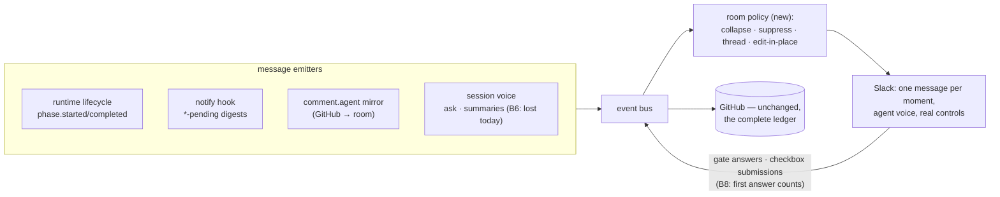

<!-- Authored per the the-loop:writing skill. -->

# Requirements: the Slack room becomes a colleague — five e2e bugs, the message rework, and deployment self-service

> Phase 1 of 4 (requirements → design → testing plan → tasks). Following the Kiro spec
> approach (<https://kiro.dev/docs/specs/>). This phase MUST be reviewed and approved by
> the required collaborators before moving to design. Derived from the end-to-end test
> report [`docs/reports/e2e-slack-test-2026-09-19.md`](../../reports/e2e-slack-test-2026-09-19.md),
> filed as [issue-393](https://github.com/MadaraUchiha-314/the-loop/issues/393).

## Introduction

[Issue-393](https://github.com/MadaraUchiha-314/the-loop/issues/393) is the report of
one work item driven end-to-end from Slack. The run **completed** — brainstorm through
merged PR in two hours — and the operator's verdict was still *"horrible; too much text;
too dry; it does not feel like an agentic experience."* The report separates what broke
(bugs), what is missing (feature requests) and what must change about the voice (the
room rework). This work item delivers all three tracks:

| Track | Today | Consequence |
|---|---|---|
| **Bugs** B1, B3, B6, B8, B9 | Channel names don't resolve in a large workspace; two listeners on one app halve inbound silently; a session's `ask` publishes to a bus nobody reads; the first answer to every gate is misread as a reply; the critic dies at 120 s regardless of `--timeout` | The operator falls back to raw channel ids, resends every approval twice, never sees the agent's questions in the room, and the review chain only works when the agent bypasses the-loop's own critic command |
| **Room rework** (report § "The Slack experience") | 41 templated messages for one small item: machine headers, triple-announced gates, 1,500-char file excerpts as digests, a tmux cheat-sheet, glyph checklists that promise controls that don't exist | A person on a phone mutes the channel; the agent's real voice (the one message that sounded like a collaborator) never reaches the room at all |
| **Self-service** F1–F3 | Phase selection is GitHub-only; no diagnostic sees the whole deployment; a repo must be `/the-loop:init`-ed before the daemon can label it | A phone-only operator cannot shape a run, cannot see why events vanish, and every fresh repo starts degraded |

**The unit of the change is one principle:** the room gets *one message per meaningful
moment, in the agent's own voice, with a control where a control is due* — and the
plumbing bugs that today prevent exactly that (a session that cannot reach the bus, a
gate that ignores its first answer) are fixed as the rework's foundation. GitHub remains
the complete ledger; Slack stops being its mirror and becomes its conversational surface.

## Requirements

### R1 — a channel name resolves wherever the bot can already speak (B1)

**User story:** As an operator declaring a room, I want `add-channel slack@#<name>` to
find any channel the bot is a member of — private ones included, in a workspace of any
size — so that I never have to dig a conversation id out of the channel-details pane.

#### Acceptance criteria (EARS)

1. WHEN a channel name is resolved THEN the system SHALL consult the conversations the
   bot is a member of (public and private) before any workspace-wide listing.
2. IF the bot is a member of the named channel THEN resolution SHALL succeed regardless
   of workspace size or the workspace-wide listing's page cap.
3. IF the name is not among the bot's conversations THEN the system SHALL fall back to
   the workspace-wide public listing.
4. WHEN the workspace-wide listing ends because the page cap was reached (rather than
   because the listing was exhausted) THEN the refusal SHALL say the listing was
   truncated and suggest the conversation id — never claim the channel does not exist.
5. WHEN any resolution path refuses THEN the refusal SHALL name the paths tried and the
   remedy (spelling, invite the bot, use the id).

### R2 — the deployment can diagnose itself, and a refusal explains itself (B3, F2)

**User story:** As an operator running more than one instance, I want the-loop to tell
me when events are being split, dropped or unverifiable — in the diagnostic command and
at the moment of failure — so that a silent half-loss of inbound traffic costs minutes,
not an evening of log archaeology.

#### Acceptance criteria (EARS)

1. WHEN the Slack status/probe diagnostic runs THEN it SHALL print the event
   subscriptions the app manifest is expected to carry next to the scope probe, and
   SHALL state plainly that event subscriptions cannot be verified through the API and
   how to test them (send the bot a mention).
2. WHEN a deployment-level doctor runs THEN it SHALL detect a second live consumer on
   the same Slack app token and report that Slack splits Socket Mode events across
   connections, halving inbound for both.
3. WHEN the doctor runs THEN it SHALL verify the daemon's own declared channels are
   present in its resolved directory (the B1 failure class) and report each miss.
4. WHEN the Socket Mode listener ignores an envelope (unhandled type, unmapped channel)
   THEN it SHALL log the envelope type and reason at debug level — never discard
   silently.
5. WHEN a control keyword or binding act is refused THEN the refusal reason and remedy
   SHALL be posted as a marked reply where the act was attempted (the ticket thread or
   the room), not only to the daemon log.

### R3 — what the session publishes reaches the bus the daemon owns (B6)

**User story:** As a person following a work item in its room, I want the agent's own
questions and waits to arrive as messages, so that "the loop is waiting on you" is
something the room tells me rather than something I discover on GitHub.

#### Acceptance criteria (EARS)

1. WHEN the daemon spawns a session THEN the session's environment SHALL carry the
   daemon's resolved CLI-config path, so every `the-loop` invocation inside the session
   resolves the same config, state root and event bus as the daemon.
2. WHEN `the-loop ask` (or any session-side publisher) publishes to a bus whose
   configuration names no channels THEN it SHALL say so in its own output and on the
   ticket, so a mis-wired session is visible at the moment it goes quiet.
3. WHEN a session asks a question and enters its wait THEN the room SHALL receive one
   message carrying the question (see R8 for its shape).
4. IF the spawn environment already names a CLI config THEN the spawner SHALL NOT
   override it.

### R4 — the first answer to a gate counts (B8)

**User story:** As an approver answering "reply with an approval" in the room, I want my
first authorized answer to advance the gate, so that the ✅ reaction never lies to me
about what my message did.

#### Acceptance criteria (EARS)

1. WHEN a human gate has published its approval request THEN the system SHALL treat the
   work item as *at a human gate* from that moment — derived from the current node's
   actor in the work item's state, not from a parked/waiting status that only a later
   evaluation sets.
2. WHEN the first authorized answer arrives after the approval request is published —
   top-level or thread reply, first ingress event or not — THEN it SHALL be classified
   as gate feedback and advance or return the gate accordingly.
3. WHEN a message is acknowledged with ✅ THEN that acknowledgement SHALL reflect what
   the message actually did (a gate answer that was recorded as a mere reply SHALL NOT
   receive the same acknowledgement as one that counted).
4. WHILE no approval request has been published for the current node, an authorized
   member's message SHALL keep its current classification (reply or keyword) — the fix
   widens gate detection to the publish moment, not to the whole phase.

### R5 — the critic runs as long as the operator allows (B9)

**User story:** As an operator configuring a high-reasoning critic, I want
`the-loop critic run --timeout` honoured, so that the configured review chain completes
through the-loop's own command instead of depending on the agent noticing the wrapper
died and bypassing it.

#### Acceptance criteria (EARS)

1. WHEN `--timeout` is passed to `critic run` THEN the effective process timeout SHALL
   be that value — no fixed cap short of it anywhere in the wrapper.
2. WHEN no timeout is passed THEN the default SHALL accommodate a harness that spawns a
   full agent (well above 120 s), and the chosen default SHALL be documented.
3. WHEN `the-loop critic policy` prints THEN it SHALL include the effective timeout per
   critic.
4. WHEN the critic is cut off by the timeout THEN the failure SHALL say the timeout was
   the cause and name the flag that raises it.

> **Implementation note (2026-09-19).** Investigation found the CLI has honoured
> `--timeout` end-to-end since v10 (default 900 s); the ~120 s death the e2e run hit was
> the *caller's* own tool timeout, not the wrapper. R5.1–R5.4 are delivered as: a
> regression test pinning the threading, `critic policy` surfacing each critic's
> effective timeout, and a timeout error that names whose limit was hit and how to raise
> it. A detached `critic run --detach` / `critic collect` (so a tool-timeout-capped
> caller can run any-length rounds) realises R5.1's *spirit* for such callers and is
> **deferred to a follow-up** (owner decision) — the core bug is already satisfied and
> the error points at the real cause.

### R6 — one message per meaningful moment (rework rules 1, 3)

**User story:** As a person in the room, I want the lifecycle collapsed — one message
per transition, one announcement per gate, long phases as one message edited in place —
so that following a work item on a phone is reading a conversation, not a log.

#### Acceptance criteria (EARS)

1. WHEN a node completes and its successor starts THEN the room SHALL receive at most
   one message for the transition — never a `phase.completed` / `phase.started` pair.
2. WHEN an approval request (`*-pending`) is posted for a node THEN the mirrored
   "ready for review" comment and the lifecycle line for the same node SHALL be
   suppressed on Slack (the ticket keeps all of them).
3. WHILE an autonomous phase runs with nothing to ask, the room SHALL see one message
   for that phase, edited in place as the phase progresses — never a stream of updates
   as separate messages (owner decision, 2026-09-19: one message per phase, edits
   within it).

   > **Implementation note.** Delivered end to end. RoomPolicy's `progress-edit`
   > rule and the channel's `chat.update` path edit a phase's one message on a
   > `phase.progress` event, and the runtime now **emits** one: when the graph
   > advances to a new node whose phase label did not change (the review chain
   > walking self-review → critic-review → security-review — the report's
   > 55-minute-silence case), `_lifecycle` publishes `phase.progress` instead of
   > nothing. So a long phase edits its one room message in place as it steps
   > through its sub-nodes, rather than going quiet until the phase ends. The event
   > is not recorded on the ledger (room-only). What a `phase.progress` names is the
   > node reached; a richer intra-node signal ("5 tests green") would ride the same
   > event and is the only piece left as a possible future refinement.
4. WHEN an event has already been posted to the room THEN an identical event for the
   same work item and node SHALL NOT be posted again.
5. WHEN Slack delivery collapses or suppresses a message THEN the GitHub ledger SHALL
   remain complete and unchanged — collapse is a delivery policy, not an event-bus
   change.

### R7 — the sentence leads, the header goes (rework rule 2)

**User story:** As a person in the room, I want each message to open with what happened,
so that the fixed machine preamble (raw event type + 50-character ref) stops burying the
one line that matters.

#### Acceptance criteria (EARS)

1. WHEN a message is posted into a work item's own room THEN it SHALL NOT carry the
   event-type/ref header — the room's binding already says which item it is.
2. WHEN a message is posted into a shared/central channel THEN it SHALL identify the
   work item by its short id and title with a link — not by the full ref string.
3. WHEN a message is rendered THEN it SHALL open with one state-carrying emoji and a
   first-person sentence (see R11 for voice).

### R8 — a gate message carries the agent's summary, not the file's first 1,500 characters (rework rule 4; O2, O8)

**User story:** As an approver on a phone, I want the approval request to tell me what
the agent decided and what it is unsure about, with the buttons and the link, so that I
can approve from the room without reconstructing the document from its truncated front
matter.

#### Acceptance criteria (EARS)

1. WHEN a session submits an artifact toward a human gate THEN it SHALL be able to
   attach its own 2–3 sentence summary (what was decided, what is least certain), and
   the approval request SHALL lead with that summary instead of a file excerpt.
2. IF no summary was attached THEN the approval request SHALL fall back to the digest
   excerpt (today's behaviour), never to nothing.
3. WHEN the PR-review gate publishes THEN its message SHALL name the pull request —
   number, title, link, diffstat — and lead with the reviewer briefing's summary; its
   primary link SHALL open the PR, not the issue.
4. WHEN a digest excerpt is truncated THEN the cut SHALL never remove an unanswered
   question or unchecked control the message asks the reader to act on; if it cannot
   fit, the message SHALL say what was cut and link to it.

### R9 — phase selection is a control, not a picture of one (rework rule 5; F1, O3)

**User story:** As a phone-only operator, I want to shape the run from Slack — untick
phases, answer the outer-loop question, then execute — so that the checklist stops
promising edits ("untick right here") that Slack cannot perform.

#### Acceptance criteria (EARS)

1. WHEN phase selection is announced in a room THEN the message SHALL present the
   phases as in-message Block Kit checkboxes (owner decision, 2026-09-19: checkboxes,
   not a modal) whose Execute submission composes the same signed execute the GitHub
   checklist path produces.
2. WHEN the control renders THEN the outer-loop placement question SHALL be presented
   in the same message as its own element — never cut off by a digest cap.
3. WHEN a person types `execute without <n, …>` / `skip <phase>` as a message THEN the
   named phases SHALL be unticked before the freeze, recorded as the same signed
   execute (F1's reply grammar, for connectors that cannot press buttons).
4. IF the interactive control cannot be posted (no interactivity grant) THEN the
   message SHALL say the checklist is edited on GitHub and link it — never instruct
   "untick right here" where nothing can be unticked.
5. WHEN the selection copy renders THEN it SHALL drop the adversarial framing (no
   "recorded against your name"); the record of who chose what remains in the ledger.

### R10 — acknowledgements thread, progress edits in place (rework rules 6, and 1's edit rule)

**User story:** As a person in the room, I want the-loop's acknowledgements to land as
thread replies under the message they answer, and running phases to update one progress
message, so that the channel keeps one message per moment.

#### Acceptance criteria (EARS)

1. WHEN an approval is received THEN the acknowledgement ("locked, moving on") SHALL be
   a thread reply under the approval request, not a new top-level message.
2. WHILE a long autonomous stretch runs (build → verify → self-review → critic), the
   room SHALL see one message edited in place through the stages, with a note when a
   stage is expected to be slow.
3. WHEN a room is bound at channel level (no thread) THEN the-loop SHALL still thread
   its own acknowledgements under its own messages.

### R11 — the-loop writes like a colleague (rework rule 7)

**User story:** As a person in the room, I want messages in the first person, present
tense, one state-carrying emoji, so that reading the room feels like working with
someone rather than tailing a log.

#### Acceptance criteria (EARS)

1. WHEN any room message renders THEN it SHALL be first-person and present-tense, with
   exactly one state emoji (🚀 🤔 📋 ✅ 🔨 👀 🎉 ⚠️ or equivalent mapping) chosen by
   message kind.
2. WHEN a mirrored agent comment reaches the room THEN the robot-face self-attribution
   SHALL appear at most once, never stamped top and bottom.
3. WHEN a message renders THEN it SHALL contain no policy or process boilerplate (no
   spec-workflow preamble, no threat clauses); operator documentation (tmux tables,
   shell blocks) SHALL NOT be posted to a room — it stays on the ticket.
4. WHEN the work item completes THEN the room SHALL receive one closing message with
   the outcome, the artifact of record (PR), and the elapsed shape of the run.

### R12 — the session's voice is the room's content (rework rule 8; depends on R3)

**User story:** As a person in the room, I want the agent's own words — its questions,
its summaries, its "here is what I built" — to be what the room carries, so that the
most interesting content of the run stops being the one thing Slack never shows.

#### Acceptance criteria (EARS)

1. WHEN the session asks a question THEN the room message SHALL carry the question text,
   its options and the stated default, with a one-tap affirmative where the default
   exists ("Defaults are fine").
2. WHEN the session summarises a completed artifact (R8's summary) THEN that summary
   SHALL be the room's announcement of the artifact.
3. WHEN both a session-authored message and a runtime template could announce the same
   moment THEN the session's words SHALL win and the template SHALL be suppressed.

### R13 — the daemon owns repository setup (F3; subsumes B4)

**User story:** As an operator pointing the daemon at a fresh repository, I want the
labels the graph needs (`loop:*`, and the arming labels) created on first contact, so
that a repo works without a manual `/the-loop:init` and the phase label — the position
marker every dashboard reads — is never silently absent.

#### Acceptance criteria (EARS)

1. WHEN the daemon first works a repository (spawn or arming check) THEN it SHALL
   ensure the `loop:*` label set and the configured auto-execute labels exist, creating
   the missing ones.
2. WHEN `set-phase-label` targets a label that does not exist THEN the hook SHALL
   create it and retry once before degrading.
3. WHEN label-ensuring fails (permissions, API) THEN the degradation SHALL be posted
   once on the ticket — not only to the daemon log.
4. WHILE ensuring labels, the daemon SHALL touch only repositories declared in its
   configuration.
5. WHEN `set-phase-label` sets the new `loop:<phase>` THEN it SHALL remove any OTHER
   `loop:*` label the item carries, leaving every non-`loop:` label untouched, so the
   position marker is exactly one label per item and a board shows the item in one
   column (**B10**). This tidy is best-effort: a failure to remove a stale label SHALL
   NOT prevent the new label being set — the marker a reader needs is the new label
   present, not the old ones gone.

   > **Implementation note.** The removal is surgical (a `remove-label` op that deletes
   > one label), never a wholesale replace: GitHub's `PUT …/labels` would also wipe
   > non-`loop:` labels (`bug`, the arming labels), and the two transports already
   > differed (the API `set-labels` PUTs/replaces, `gh` `--add-label` adds), so B10 is
   > fixed by removing only the stale `loop:*` set and adding the new one.

## Non-functional requirements

- **Message budget.** No numeric contract (owner decision, 2026-09-19: no hard
  target). The direction is the report's 9-message redesign table: one message per
  meaningful moment. Verification observes and records the reference run's top-level
  message count as evidence of the trend (41 → single digits), not as a pass/fail
  gate.
- **The ledger is untouched.** Every event, mirror and record on GitHub remains exactly
  as today; all collapse/suppression/voice changes are Slack delivery policy. An
  operator can reconstruct the full run from the ticket alone, as now.
- **Config compatibility.** Existing channel configuration (verbosity, digests,
  `maxChars`, subscriptions) keeps working; the rework's policies have documented
  defaults and are tunable where they replace an existing knob.
- **Public-repository hygiene.** Everything this work item commits — code, specs,
  evidence, messages quoted in docs — carries no internal hostnames, organization or
  repository names, usernames, Slack/user ids, or non-public registry URLs; live-run
  evidence is redacted to the placeholder convention of the e2e report before it is
  written under `docs/specs/issue-393/evidence/`.
- **Observability.** Every new suppression/collapse decision is a debug-level log line
  naming the rule that fired, so a "missing" message is diagnosable in minutes.

## Security considerations

- **Actors & trust:** room members (mixed trust — only some are authorized approvers),
  GitHub commenters (untrusted), Slack interactive payloads (untrusted transport,
  Slack-signed), the daemon (trusted), spawned sessions (trusted, but their environment
  is now partially daemon-controlled — R3). The doctor (R2) reads deployment state; it
  must not print tokens.
- **Trust boundaries & data:** R4 moves the *when* of gate detection, not the *who* —
  authorization of the answerer is unchanged and stays mandatory. R9's control
  submission crosses from Slack into the signed-execute path: the submission must be
  attributed to the pressing/submitting Slack user and pass the same authorization as
  the typed keyword. R3 injects a config path into session environments: the path is
  the daemon's own resolved config, never derived from work-item content. No new
  secrets are stored; the doctor and refusal messages must quote ids, never tokens.
- **Abuse cases (EARS):**
  1. WHEN an unauthorized member answers an open gate THEN the system SHALL record it
     as a reply/feedback without advancing the gate, exactly as before R4.
  2. WHEN an unauthorized member submits the phase-selection control THEN the system
     SHALL refuse with an explanation and SHALL NOT freeze the selection.
  3. WHEN a session-authored summary (R8/R12) contains markup, mentions or oversized
     content THEN the renderer SHALL treat it as text (escaped, capped) — a summary can
     ping no one and impersonate nothing.
  4. WHEN a `skip <phase>` grammar names a phase the sender may not skip (or that does
     not exist) THEN the system SHALL refuse with the reason rather than silently
     freezing a different selection.
  5. WHEN label-ensuring (R13) is triggered by activity on an undeclared repository
     THEN the daemon SHALL NOT create labels there (fail closed to declared repos).
- **Fail closed:** a gate answer whose author cannot be authorized is a reply; a control
  submission without a verifiable Slack user is dropped with a log line; a summary that
  fails validation falls back to the digest excerpt; a doctor that cannot verify event
  subscriptions says "unverifiable", never "ok".

## Out of scope

- **B5, B7, B11** as standalone fixes — hot-reload of `read.mode`, stale
  `graph status`, tmux retention on close — are real but separable and stay on
  issue-393 for follow-up items. (**B2**'s essence — a refusal explains itself — is
  delivered by R2.5, and **B10** — the phase label never removing the previous one —
  was folded in alongside R13 since it is the same `set-phase-label` hook; see the note
  under R13.)
- **O1, O4, O5, O7, O9** — observations without a requested change (room-declaration
  confirmation, ephemeral help, connector signature line, phantom prompt text, the
  merge-on-approval knob). O7 deserves its own investigation ticket.
- Per-person notification routing (explicitly not built — decision-035 lineage).
- Any change to the GitHub ledger's content or the event bus's event vocabulary.

## Open questions

All three questions raised at the requirements gate were answered by the owner
(@MadaraUchiha-314) on 2026-09-19, in-session (paper trail carried here and on the spec
PR, since ticket-comment posting from this environment is not authenticated for the
public repository):

1. **R6.3/R10.2 edit-in-place cadence** — *resolved:* one message per phase, edited in
   place within the phase (not one message spanning the whole autonomous stretch).
2. **R9 control shape** — *resolved:* in-message Block Kit checkboxes with the
   outer-loop question as its own element in the same message; no modal.
3. **Message budget** — *resolved:* no hard numeric target; the 9-message redesign
   table is direction, and the reference run's count is recorded as evidence only.

## Review comments

> Appended by the-loop's `record-feedback` hook when a human gate approves with
> comments (issue-109).
