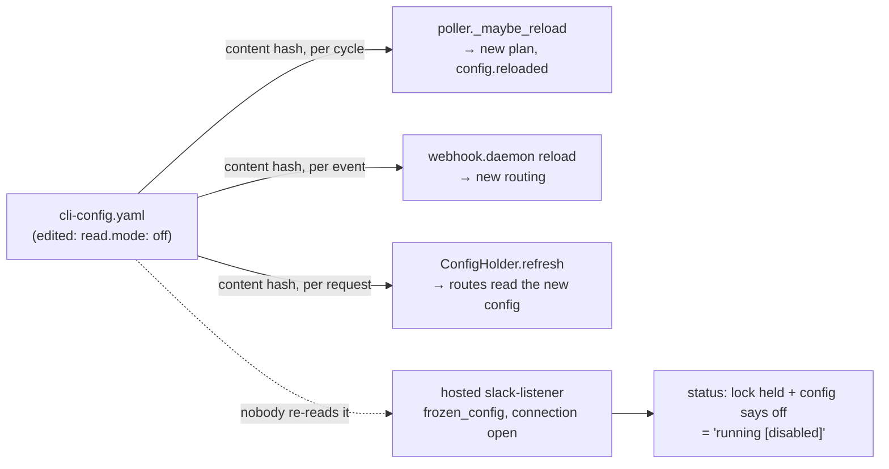

<!-- Authored per the the-loop:writing skill. -->

# Bugfix spec: `channels.slack.read.mode` is hot-reloaded in the config but not in the running process

> Phase 1 of 4 (bugfix → design → testing plan → tasks). Source: the 2026-09-19 e2e
> Slack run's **B5**
> ([`docs/reports/e2e-slack-test-2026-09-19.md`](../../reports/e2e-slack-test-2026-09-19.md)),
> left out of issue-393 and filed as
> [issue-395](https://github.com/MadaraUchiha-314/the-loop/issues/395).

## Summary

**The set of ingresses the service hosts is decided once, at boot; the config that
decides it is re-read forever.** Every long-lived process re-reads the CLI config from
its content hash — the poller before each cycle, the receiver on each event, the
service once per request — and each applies what it can: sources, intervals, routing,
grants. But *which ingresses run inside the service* (the poller, the webhook receiver
and, since issue-334, the Slack Socket Mode listener) is composed by
`start_hosted_ingresses` in the lifespan's first line and never revisited. So when an
operator sets `channels.slack.read.mode` from `socket` to `off`:

- the poller's reload fires `config.reloaded` — the file did change;
- the hosted listener keeps its Socket Mode connection and keeps consuming events;
- `the-loop status` reads the config (`enabled: false`) and the lock (held by the
  service's pid) and prints the contradiction:
  `slack-listener running (hosted in the service, pid …) [disabled]`.

This matters most for the B3 workaround: two instances sharing one Slack app split
Socket Mode events across their connections, and the way to stop the second one
stealing half the traffic is to turn its listener `off` — which, today, does nothing
until the whole service is restarted.

## Steps to reproduce

1. `channels.slack.enabled: true`, `read.mode: socket`, both tokens exported,
   `service.hostIngresses` at its default; `the-loop start`.
2. `the-loop status` → `slack-listener running (hosted in the service, pid N) [enabled]`.
3. Edit the config: `read.mode: off`. Wait for `config.reloaded` in `the-loop events`.
4. `the-loop status`.

## Expected vs actual

- **Expected:** the listener has closed its connection and released its lock;
  `status` prints `slack-listener not running [disabled]`.
- **Actual:** `slack-listener running (hosted in the service, pid N) [disabled]`; a
  mention in the room is still acknowledged by this instance; `the-loop restart` is the
  only way out.

## Root cause (confirmed)

`api/lifespan.py` calls `ingress.start_hosted_ingresses(cli_config)` once and holds the
returned list until shutdown. Nothing in the process compares that list with what the
current config asks for. The listener itself (`run_socket_listener`) freezes the config
it was started with, by design — its per-message pipeline must not change under it —
so the decision to stop or start it can only be taken *outside* it, by whatever owns
its thread and lock: the hosting.

## Requirements

### Requirement 1 — the hosted ingress set follows the config without a restart

**User story:** As an operator, I want a change to what the config enables to take
effect in the running service the way every other config change does, so that turning
a listener `off` stops it consuming events, and turning it back on brings it back.

#### Acceptance criteria (EARS)

1. WHEN the CLI config file changes so that an ingress the service hosts is **no longer
   enabled** (the Slack listener: `channels.slack.enabled` false or `read.mode` not
   `socket`; the poller: `polling.enabled` false; the receiver:
   `webhooks.ghWebhook.enabled` false) THEN the service SHALL stop that hosted ingress
   — its run loop ended through its stop event, its pidfile lock released — within the
   supervisor's check interval, with no restart.
2. WHEN the CLI config file changes so that an ingress the service does **not** host is
   **newly enabled** THEN the service SHALL start it exactly as `the-loop start` would
   have — the same starter, the same lock, the same refusals (a held lock, missing
   tokens, an empty `polling.sources`) — and a refusal SHALL be recorded as
   `ingress.hosted_failed`, as at boot.
3. WHEN the file changes without changing the enabled set THEN no hosted ingress SHALL
   be stopped or started; each keeps reloading what it reloads today.
4. WHEN a change is applied THEN the service SHALL record it: `ingress.hosted_stopped`
   / `ingress.hosted` per ingress, with a `reason` naming the config change, and one
   `config.reloaded` whose `detail` names what was stopped and started.
5. IF the edited file cannot be loaded (invalid YAML, a schema or version failure) THEN
   the hosted set SHALL be left as it is, as every other reloader leaves its value.
6. WHEN the service shuts down THEN the supervisor SHALL stop first, then every hosted
   ingress, in reverse start order as today; a check that is mid-flight SHALL never
   race the shutdown.
7. The reconcile SHALL apply only under `service.hostIngresses` (a change to that key
   stays `restartRequired`); a foreground `the-loop channels listen` is not the
   service's to stop.
8. The fix SHALL include regression tests that fail before the fix and pass after: the
   listener stops when `read.mode` leaves `socket`, starts again when it returns, and is
   left alone by an unrelated edit and by an unparseable one.

### Requirement 2 — `status` never prints a contradiction

**User story:** As an operator reading `the-loop status`, I want a row that is running
against its own config to say what is about to happen, not to assert two opposite
things in one line.

#### Acceptance criteria (EARS)

1. WHEN a row is `running` and its config has it disabled THEN `the-loop status` SHALL
   NOT print `running … [disabled]`; the flag SHALL say the row is *disabled in the
   config and still running*, and what ends it: for a **hosted** row, the service's
   next config check; for any other, `the-loop stop`.
2. `status --format json` SHALL be unchanged: `running`, `enabled` and `hosted` already
   carry the same facts, and `ok` SHALL keep counting enabled rows only.

## Security considerations

- **Actors & trust:** the config file is already the operator's control surface: who can
  edit it can already start harness sessions, and the daemons already act on its every
  change. The supervisor reads the same file through the same loader
  (`load_cli_config(strict=True)`), so no new principal and no new input.
- **New attack surface:** none. The reconcile composes the starters `the-loop start`
  composes today, with the refusals they already make: the single-instance lock is still
  taken, a missing token is still refused by name and never by value, and the schema and
  migration gates still stand between an edit and a load.
- **Abuse / failure cases:** (1) a flapping edit (socket ↔ off every second) — each
  change stops or starts at most once per check interval, and a start that fails is
  recorded and not retried until the file changes again; (2) an unparseable edit — no
  change (R1.5); (3) the supervisor thread raising — caught per check, logged, the
  service keeps serving, exactly as a starter that raises is handled at boot.
- **Secrets / data:** none touched; the events name ingresses and key paths, never
  values.

## Out of scope

- **Reloading a running ingress's own config** (a changed Slack `channel`, grants, the
  catch-up interval). The listener freezes its config on purpose; restarting it on
  *any* Slack edit is a different trade-off (a dropped connection per keystroke) and is
  not what B5 asked for. Only the *membership* of the hosted set is reconciled.
- The foreground `the-loop channels listen`: its owner is at the terminal.
- B7 (`graph status` from a shell), filed separately.

## Open questions

None. The report offered two fixes; the design picks the first (stop/start on reload)
and takes the second's `status` wording as a guard for the check-interval window and
for a listener nobody hosts.
