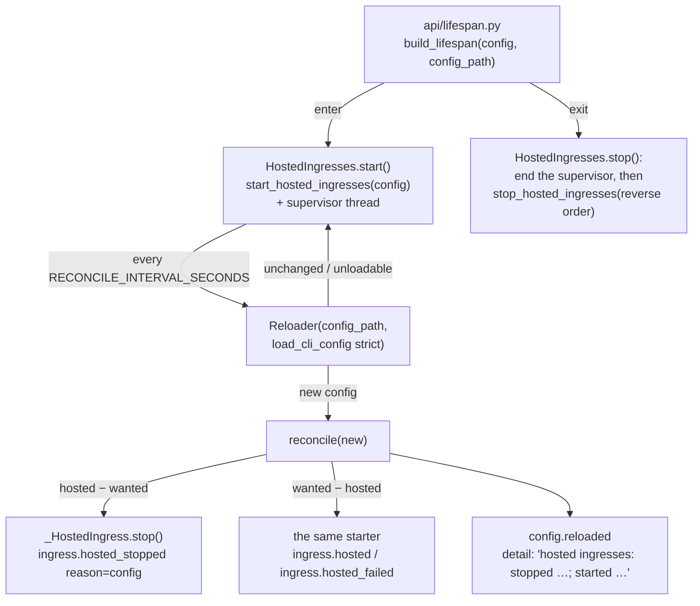

<!-- Authored per the the-loop:writing skill. -->

# Design: the hosted ingress set follows the config

> Phase 2 of 4. Derives from [`bugfix.md`](bugfix.md).

## Overview

**One new object owns what `start_hosted_ingresses` used to hand back as a bare list:
`HostedIngresses`, a supervisor that starts the set, watches the config file, and
reconciles the set on every change.** Nothing about *how* an ingress starts, runs, locks
or stops changes — the three starters, `_host`, `_HostedIngress.stop` and the lock
discipline of issue-334/339 are called as they are. What changes is that the composition
`start_hosted_ingresses` does once is now a function of the config that can be re-run:
*wanted(config) − hosted → start; hosted − wanted(config) → stop*.

## Architecture

- **Where the decision lives.** The listener freezes its config (`frozen_config`) so
  its pipeline never changes under a message; the poller and receiver reload their
  *own* plan but not their *existence*. The only place that knows which ingresses this
  process runs, and holds their threads and locks, is the hosting in `api/ingress.py`
  — so that is where "should this still be running?" is asked.
- **What "wanted" means.** `core.lifecycle.enabled_services(config)` — the one predicate
  `the-loop start` and `the-loop status` already share (`polling.enabled`,
  `webhooks.ghWebhook.enabled`, `channels.slack.enabled` with `read.mode: socket`). The
  supervisor reads it rather than restating it, so the reconcile can never disagree
  with the two commands about what is enabled. The starters keep their own guards (a
  poll-mode listener still answers "not asked for"), which are now only a safety net.
- **How change is noticed.** A `Reloader` over the config path with the same strict
  loader `ConfigHolder` uses, polled on a daemon thread every
  `RECONCILE_INTERVAL_SECONDS` (5 s; a constructor argument for tests). A thread rather
  than the per-request refresh because a service nobody is calling must still notice;
  a `Reloader` rather than a watcher because that is what every other process uses
  (stdlib, content hash, an unloadable file keeps the previous value). The interval is
  the operator-visible latency of R1.1 and is what the `status` wording (R2) covers.
- **Membership, not contents.** A change that leaves the enabled set as it is stops
  and starts nothing (R1.3). A hosted entry whose thread has already ended on its own
  (its lock released by `_host`'s `finally`) is dropped from the set at the next
  reconcile, so a config edit can bring it back — a listener that died on a rejected
  token comes back when the operator fixes the config and the tokens.

## Components & interfaces

| Component | File | Change |
|---|---|---|
| `HostedIngresses` | `cli/the_loop/api/ingress.py` | **new.** `__init__(cli_config, config_path, *, interval=RECONCILE_INTERVAL_SECONDS)`, `start()`, `stop()`, `reconcile(config)`, `hosted` (read-only list). `start()` calls `start_hosted_ingresses` then starts the thread; `stop()` sets the thread's stop event, joins it, then `stop_hosted_ingresses`. |
| `_wanted(config)` | `cli/the_loop/api/ingress.py` | **new (private).** `[(name, starter)]` for every ingress `enabled_services(config)` reports on, in the boot order. `start_hosted_ingresses` is refactored onto it, so boot and reconcile compose the same list. |
| `_HostedIngress.stop(reason)` | `cli/the_loop/api/ingress.py` | gains an optional `reason` (`shutdown` today, `config` from the reconcile), carried on `ingress.hosted_stopped`. |
| `build_lifespan(..., config_path=None)` | `cli/the_loop/api/lifespan.py` | holds a `HostedIngresses` instead of a list; `config_path` defaults to `default_cli_config_path()`. `create_app` passes the path it already resolves; the SDK's `TheLoop.lifespan` passes its own. |
| `status` rendering | `cli/the_loop/commands/lifecycle_cmd.py` | the flag for a `running and not enabled` row: `[disabled in config — still running; the service stops it on its next config check]` when hosted, `[disabled in config — still running; \`the-loop stop\` ends it]` otherwise. |
| event catalogue | `cli/the_loop/eventlog.py` | `ingress.hosted`, `ingress.hosted_stopped`, `config.reloaded` descriptions mention the reconcile; no new event type. |

## Data models

No config key, schema, state file, lock or event type changes. `ingress.hosted_stopped`
gains one optional field (`reason`); `ingress.hosted` the same.

## Error handling

| Where | Failure | Behaviour |
|---|---|---|
| supervisor tick | the file is unloadable (YAML, schema, version) | `Reloader` logs and returns `None`; nothing changes (R1.5) |
| supervisor tick | `reconcile` raises | caught, `logger.exception`, the tick ends; the next tick runs — the service never loses its supervisor to one bad reconcile |
| reconcile → start | a starter refuses or raises | as at boot: `ingress.hosted_failed` with the reason; not retried until the file changes again |
| reconcile → stop | the loop does not end within `_JOIN_TIMEOUT_SECONDS` | as at shutdown: warning, lock released anyway |
| shutdown | a tick is mid-flight | `stop()` sets the stop event and **joins the supervisor before** stopping the ingresses, under the same lock `reconcile` takes, so a stop and a reconcile never interleave (R1.6) |
| `hostIngresses: false` | — | no supervisor is built at all (R1.7) |

## Security design

The trust boundary is unchanged: the config file, loaded by the same strict loader the
service already reloads through. The reconcile grants nothing the boot did not — the
same starters, the same lock, the same by-name token refusal. The events carry ingress
names and a `reason` string composed by the-loop, never a config value. See
[`bugfix.md`](bugfix.md) § Security considerations.

## Testing strategy

Unit tests at the one seam the hosted-listener tests already fake
(`run_socket_listener`, and `poller.daemon._run_locked` for the poller case): a real
config file in `tmp_path`, a `HostedIngresses` with a short interval, the file rewritten,
and the lock, thread and emitted events asserted. `status` wording through the command's
existing report fake. Detail in [`testing-plan.md`](testing-plan.md).

## Trade-offs & decisions

- **Reconcile membership, not contents.** Restarting the listener on every Slack edit
  would drop the connection for a typo fix; the daemons that reload contents do so
  in-place. Recorded in `bugfix.md` § Out of scope.
- **A thread, not the request hook.** `ConfigHolder.refresh` runs per request; a
  second instance whose room nobody is calling would never reconcile. The thread costs
  one sha256 of a ~10 KB file every 5 s.
- **Reuse `enabled_services`.** One predicate for `start`, `status` and the reconcile;
  a lazy import keeps `api.ingress` free of a `core` import at module load.
- **Keep the `status` wording change.** Even with the reconcile there is a
  5-second window and a foreground listener nobody hosts; the line should never read
  as a contradiction.

## Open questions

None.
