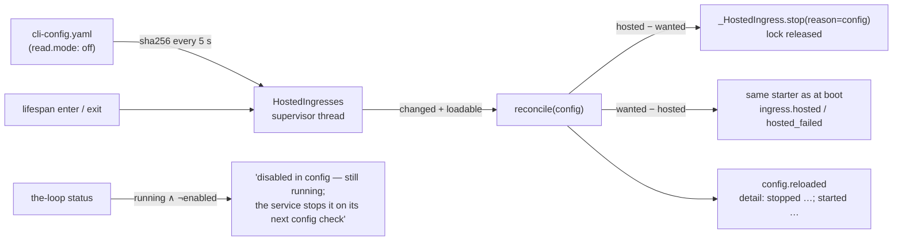

# `read.mode` takes effect in the running service (issue-395) — reviewer briefing

## TL;DR

B5 of the e2e Slack run: turning `channels.slack.read.mode` to `off` fired
`config.reloaded` but left the hosted Socket Mode listener consuming events until a
restart, and `status` printed `running … [disabled]`. The service now reconciles
*which* ingresses it hosts to the config file every five seconds — stopping what an
edit no longer enables, starting what it newly enables, through the boot-time starters
and their refusals — and `status` never prints a row as running and disabled in one
breath. No config key, schema, state or event type change.

## Where to focus (in this order)

1. **The supervisor** — `cli/the_loop/api/ingress.py` `HostedIngresses`: `start` /
   `stop` / `reconcile`, one `RLock` around reconcile-vs-shutdown, a `Reloader` on the
   config path with the strict loader. Check that `stop()` ends the supervisor before
   the ingresses and that `reconcile` only ever diffs *membership*.
2. **`_wanted` replaces the inline composition** — same file: boot and reconcile now
   compose from `core.lifecycle.enabled_services` (lazy import). Confirm you agree the
   old "listener in `starters` when `channels.slack.enabled`, declines for `poll`" and
   the new "listener wanted only with `read.mode: socket`" are the same observable
   behaviour (they are: nothing hosted, no event, in both).
3. **The wiring** — `cli/the_loop/api/lifespan.py` (`config_path=`), `api/app.py`
   (`holder.path`), `sdk/client.py` (`self.config_path`). Skim.
4. **`status` wording** — `cli/the_loop/commands/lifecycle_cmd.py`: the flag for a
   running-but-disabled row. Skim; JSON is untouched.

## What changed (map)

## Key decisions & why

- **Stop/start on reload, not `restartRequired`.** The report offered both; only the
  first makes the B3 workaround (turn the second instance's listener off) actually
  work, and it is what the poller and receiver already do for their own config.
- **Membership only.** A running listener's own config stays frozen: restarting it on
  every Slack edit would drop the connection for a typo fix. Recorded as out of scope.
- **A thread, not the per-request refresh.** A second instance nobody is calling must
  still notice. One sha256 of a ~10 KB file per five seconds.
- **`enabled_services` as the one predicate.** `start`, `status` and the reconcile
  cannot disagree about what is enabled.
- **Keep the `status` wording too.** There is a five-second window, and a foreground
  `channels listen` nobody hosts; the line should never read as a contradiction.

## Evidence

`docs/specs/issue-395/evidence/automated-tests.md`: eight new Gherkin-docstringed
scenarios in `tests/test_hosted_reconcile.py` (red before the fix), one `status` test,
the full suite, ruff and pyright.

## Open questions for the reviewer

None. Tier 3: this PR's approval is the human gate; the spec chain under
`docs/specs/issue-395/` is `in-review` until then.
