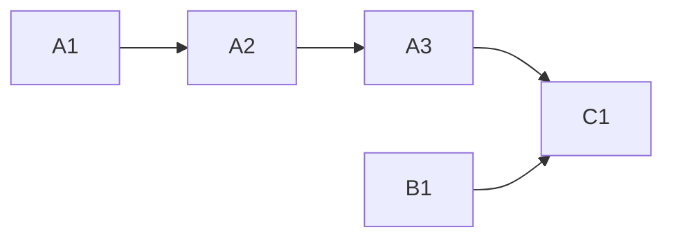

<!-- Authored per the the-loop:writing skill. -->

# Tasks: the hosted ingress set follows the config

> Phase 4 of 4. Each task names the requirement it satisfies and the testing-plan row
> that proves it; the test lands with the change (red first).

## Task list

- [x] **A1 — `_wanted(config)` and `start_hosted_ingresses` on it.** The starter list
      composed from `core.lifecycle.enabled_services`, in boot order; the boot path
      unchanged in behaviour. *Req:* R1.2, R1.3 · *Test:* T1.
- [x] **A2 — `HostedIngresses`.** `start`/`stop`/`reconcile`, the supervisor thread on a
      `Reloader`, the lock around reconcile-vs-stop, `reason` on
      `_HostedIngress.stop` and the two events, `config.reloaded` with a detail. *Req:*
      R1.1, R1.2, R1.4–R1.6 · *Test:* T2, T8. *Deps:* A1.
- [x] **A3 — the lifespan holds the supervisor.** `build_lifespan(config_path=…)`;
      `create_app` and `TheLoop.lifespan` pass their paths; `hostIngresses: false`
      builds nothing. *Req:* R1.6, R1.7 · *Test:* T12. *Deps:* A2.
- [x] **B1 — `status` wording.** The running-but-disabled flag, hosted and standalone.
      *Req:* R2.1, R2.2 · *Test:* T7.
- [x] **C1 — catalogue and docs.** `eventlog.EVENT_TYPES` descriptions;
      `docs/capabilities/control-plane.md` (hot-reload requirement, history row);
      `docs/capabilities/channels.md` (hosted-listener bullet, history row);
      `docs/cli/supervision.md` and `docs/guide/slack.md` (a saved `read.mode` change
      takes effect without a restart); the e2e report's B5 links the issue; evidence
      files. *Deps:* A1–B1.

## Dependency graph (DAG)

## Checkpoints

- After A2: `tests/test_hosted_reconcile.py` green; `tests/test_hosted_listener.py`
  still green.
- After A3: `tests/test_hosted_ingress_integration.py`, `tests/test_sdk*.py` green.
- After C1: full suite, ruff, pyright, markdownlint.

## Review comments

*None yet.*
