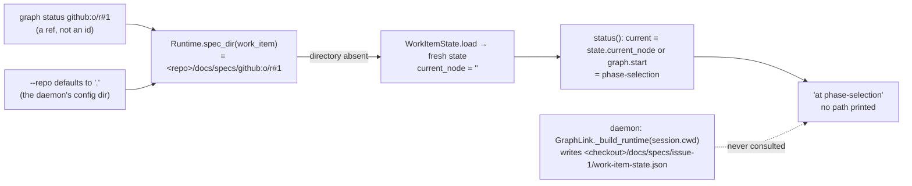

<!-- Authored per the the-loop:writing skill. -->

# Bugfix spec: `the-loop graph status <ref>` reports a stale node for a daemon-run item

> Phase 1 of 4 (bugfix → design → testing plan → tasks). Source: the 2026-09-19 e2e
> Slack run's **B7** and **O6**
> ([`docs/reports/e2e-slack-test-2026-09-19.md`](../../reports/e2e-slack-test-2026-09-19.md)),
> left out of issue-393 and filed as
> [issue-396](https://github.com/MadaraUchiha-314/the-loop/issues/396).

## Summary

**`graph status` never read the state file at all, and said nothing about it.** Two
independent misses, each of which lands the command on the same silent fallback:

1. **The command names a work item by its spec-directory id, never by its ref.** The
   report ran `graph status github:…#1`. The runtime built the spec directory from the
   argument verbatim — `docs/specs/github:…#1/` — a directory that does not exist, so
   `WorkItemState.load` returned a *fresh* state and the pointer fell back to the
   graph's start node, `phase-selection`. This is why the answer was wrong **even from
   inside the work item's own checkout**, where `docs/specs/issue-1/work-item-state.json`
   was current: the file was one directory over from where the command looked.
2. **`--repo` defaults to `.`** From the daemon's config directory (O6) there is no
   `docs/specs/issue-1/` at all, so the same fallback fires with a bare id too.

In both cases the output is indistinguishable from a work item that genuinely sits at
`phase-selection`. The daemon, meanwhile, writes the state file into the **session's
checkout** (`GraphLink._build_runtime` roots the runtime at the session's `cwd`, a
per-work-item worktree under `routing.workspace`) — the one place `graph status` had no
way to find from another directory.

## Steps to reproduce

1. Drive a work item through the daemon until `graph.advanced` records a node past
   `phase-selection` (any node will do).
2. From the daemon's config directory: `the-loop --config <daemon config> graph status
   github:<owner>/<repo>#<n>`.
3. From inside the work item's checkout: the same command.

## Expected vs actual

- **Expected:** both print the node the runtime last wrote, and say which
  `work-item-state.json` they read.
- **Actual:** both print `at phase-selection · waiting for an authorized user to choose
  the phases`, with no path and no hint that nothing was read.

## Root cause (confirmed)

- `core.graphs.check` → `Runtime.status(work_item_id)` → `WorkItemState.load(...)`
  returns `WorkItemState(work_item=…)` with an empty `current_node` when no file exists;
  `status` then substitutes `graph.start`. Correct for a fresh item, silent for a wrong
  path.
- `graphlink.spec_id_for` is the only ref → id translation in the tree and it runs on the
  ingress path alone; the CLI's positional argument is passed through untranslated.
- The session registry (`<state.root>/local/<slug>.json`) records each work item's
  session `cwd` — the checkout the daemon drives — and `sessions list` reads it; `graph
  status` did not.

## Requirements

### Requirement 1 — the position reported is the one the runtime wrote

**User story:** As an operator debugging from a shell, I want `graph status <ref>` to
report the node the daemon's runtime last recorded, from whichever directory I run it,
so that the one read-only view of "where is this item" is not misleading.

#### Acceptance criteria (EARS)

1. WHEN `graph status` or `check` is given a work-item **ref** (`github:<owner>/<repo>#<n>`,
   optionally host-qualified) THEN the CLI SHALL address the same spec directory the
   daemon does for that ref (`issue-<n>`), exactly as `graphlink.spec_id_for` derives
   it; a bare id SHALL keep working unchanged, and a ref of another provider SHALL be
   passed through as it is today.
2. WHEN `graph status <ref>` or `check <ref>` is run **without** `--repo` from a directory
   that holds no spec directory for the work item, AND the session registry the CLI
   config resolves (`routing.registryDir`, else `<state.root>/local/`) records a session
   for that ref whose `cwd` is a directory THEN the command SHALL evaluate the work item
   in that checkout and SHALL print the checkout it resolved, naming the registry as its
   source.
3. WHEN `--repo` is given THEN it SHALL be used verbatim; the registry SHALL NOT be
   consulted. WHEN the current directory holds the spec directory THEN it SHALL be used;
   the registry SHALL NOT be consulted.
4. The same translation (R1.1) SHALL apply to every graph verb that takes the positional
   work item (`advance`, `complete`, `run`, `skip`, `force`, `repos`), so a ref names
   one directory everywhere. The checkout resolution (R1.2) SHALL apply to the **read**
   verbs only — `graph status` and `check` — because a mutating verb writes into the
   checkout it is pointed at, and that choice stays the operator's (`--repo` or the
   working directory).

### Requirement 2 — a wrong answer is diagnosable

**User story:** As an operator, when the command could not find the state file, I want
it to say which path it looked at, so that a stale answer is visible as one.

#### Acceptance criteria (EARS)

1. WHEN `graph status` or `check <work item>` renders its table THEN it SHALL print one
   `state:` line naming the `work-item-state.json` it read; WHEN no such file exists
   THEN the line SHALL say `not found` and, when the work item's state directory itself
   is absent, SHALL say so and point at `--repo` / the work item's checkout.
2. The core `check` report (and so `POST /api/v1/graph/check` and the `check_work_item`
   MCP tool) SHALL carry `statePath` (the file read, else the path that was looked for)
   and `stateFound` (boolean) beside its existing keys — **additive**; the
   position-unknown answer of issue-238 (`repoResolved: false`) SHALL stay exactly the
   six keys it has, naming no path.
3. `--format json` of `check` SHALL carry the two fields; `check --all` SHALL NOT gain a
   per-item `state:` line (its table is a drift summary).
4. The fix SHALL include regression tests that fail before the fix and pass after: a
   ref resolves to the daemon's spec directory; the report names the state file; a
   ref from a foreign directory resolves the checkout through the registry; a bare id
   from a foreign directory prints the not-found path with its hint.

## Security considerations

- **Actors & trust:** the operator at a shell, on the machine that holds the CLI config
  and the session registry. `check`/`status` stay **pure** (no network, no subprocess,
  no mutation): the registry read is a JSON file the same process already reads for
  `sessions list`, through the same `SessionRegistry`.
- **New attack surface:** none. The ref → id translation goes through
  `WorkItemRef.parse` (an `int` number) and `spec_id_for`, so a crafted argument cannot
  name a path segment it could not name before — the derived id is `issue-<int>`. The
  registry's `cwd` is a path this machine's daemon recorded when it spawned the session
  (already trusted by `sessions resume`/`attach`); it is used only if it is an existing
  directory, and `resolve_repo` re-vets it at core's boundary as it vets `--repo`.
- **Information disclosure:** `statePath` is a path under a repository the caller named
  (or the registry resolved for them); the issue-238 rule — a repo that does not
  resolve is answered with no path at all — is unchanged and pinned by its existing
  test. The API's caller is on the loopback the service already answers with checkout
  contents.
- **Fail-closed:** an unparsable ref, a missing registry, an unreadable record or a
  `cwd` that is not a directory all fall through to today's behaviour — the current
  directory — now with the `state:` line making the miss visible.

## Out of scope

- Reading a **portable** record or the daemon's `state.root` for the graph pointer:
  neither holds it (issue-368 moved the graph section out of the portable record;
  `work-item-state.json` in the checkout is the one record).
- Resolving the checkout for the **mutating** verbs (R1.4 says why).
- A GitHub **URL** as the positional (`instance.scope.workItems` accepts one); the
  report used a ref, and the URL form is a separate convenience.

## Open questions

None.
