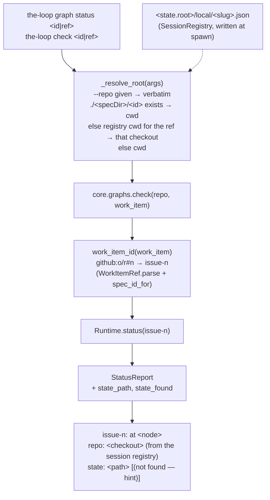

<!-- Authored per the the-loop:writing skill. -->

# Design: `graph status` reads the state file the runtime wrote, and says which

> Phase 2 of 4. Derives from [`bugfix.md`](bugfix.md).

## Overview

**Three small additions on the existing read path, no new object.** (1) Core translates
a ref to the spec id once, at the top of every graph verb, with the translation the
daemon already uses. (2) The runtime's `StatusReport` learns which state file it read,
and the CLI prints it. (3) The two read verbs, when given no `--repo` and standing in a
directory without the work item, ask the session registry where the daemon put the
checkout.

## Architecture

- **Where the translation lives.** `core.graphs.work_item_id` — core is the one surface
  the CLI, the API and the MCP tool all reach, so a ref works identically through all
  three. It reuses `graphlink.spec_id_for` (the daemon's translation) rather than
  restating the `issue-<n>` convention; anything that is not a parsable ref is returned
  as it came, so bare ids and other providers' refs are untouched.
- **Where the path is known.** `Runtime.status` already resolves `state_dir(item)` and
  loads from it; it now also records `WorkItemState.existing_path(state_dir)` — the
  file actually read, or `None` — on the report. The report carries the path that
  **was or would have been** read, so a miss names the place to look.
- **Where the checkout is resolved.** In the CLI (`graph_cmd._resolve_root`), not in
  core: core's `check` takes an explicit `repo` and stays a pure function of it, which
  is what the API and CI rely on. The CLI is the surface with a working directory to be
  wrong about. The registry directory is resolved as `sessions list` resolves it
  (`routing.registryDir`, else the state layout's `local_dir`, off the CLI config
  `--config` / `THE_LOOP_CLI_CONFIG` selected), and a **closed** record still counts —
  the operator asking after a finished item wants its checkout too (`sessions attach`
  makes the same choice).
- **Read verbs only.** `status` and `check` resolve; `advance`, `complete`, `run`,
  `skip`, `force`, `repos` keep `.` as their default root. A write into a checkout the
  operator did not name is not a convenience.

## Components & interfaces

| Component | File | Change |
|---|---|---|
| `work_item_id(work_item)` | `cli/the_loop/core/graphs.py` | **new.** Applied first in `check`, `complete`, `advance`, `force`, `skip`, `repos`. |
| `StatusReport` | `cli/the_loop/graph/runtime.py` | `state_path: str`, `state_found: bool`; `as_dict` adds `statePath`, `stateFound`. `Runtime.status` fills them. |
| `_resolve_root(repo, work_item, spec_dir)` | `cli/the_loop/commands/graph_cmd.py` | **new (private).** Returns `(root, note)`; `note` names the registry source when it decided. `--repo` default becomes `""` (unset) on both commands; the help text says what unset means. |
| `_state_line(report, recompute)` | `cli/the_loop/commands/graph_cmd.py` | **new (private).** The `state:` line for `graph status` and single-item `check`. |
| `graph_check` docstring, `check_work_item` docstring | `cli/the_loop/api/routes.py`, `cli/the_loop/api/mcp.py` | name the two fields and the ref form; the authored contract's description in `docs/api-specs/openapi/the-loop.v1.yaml` says the same. |

## Data models

No config key, schema, state-file, lock or event change. The check report gains two
keys; the position-unknown report (issue-238) does not.

## Error handling

| Where | Failure | Behaviour |
|---|---|---|
| `work_item_id` | not a ref (`ValueError` from `parse`), or another provider | the argument is returned unchanged |
| `_resolve_root` | no CLI config, no registry dir, no record, unreadable record, `cwd` not a directory | falls through to the working directory; the `state:` line then shows the miss |
| `_resolve_root` | `--repo` given | never consults the registry |
| `Runtime.status` | state dir absent | `state_found=False`, `state_path` = the expected file under it; pointer = start node as today |
| CLI rendering | state not found, state dir absent | `state: <path> (not found; <dir> does not exist — run from the work item's checkout, or pass --repo)` |
| CLI rendering | state not found, state dir present | `state: <path> (not found — the work item has not entered the graph; reporting its start node)`, or with `--recompute`: `(not found; position derived from the artifacts)` |

## Security design

See [`bugfix.md`](bugfix.md) § Security considerations. Two points hold the boundary:
the derived id is `issue-<int>` or the argument itself (no new path shape reaches
`Runtime.spec_dir`), and the registry's `cwd` enters core through `resolve_repo`, the
same boundary `--repo` crosses. The issue-238 no-path answer is pinned by its existing
test and unchanged.

## Testing strategy

Core unit tests on `check` (ref → id, the two fields, the pinned key sets) and a CLI
scenario suite driving `GraphCommand`/`CheckCommand` in-process
(`THE_LOOP_SERVICE_LOCAL=1`) over a `tmp_path` checkout with a real
`work-item-state.json`, a CLI config naming a registry directory, and a registry record
whose `cwd` is that checkout. Detail in [`testing-plan.md`](testing-plan.md).

## Trade-offs & decisions

- **Registry, not portable record.** The graph pointer lives only in the checkout
  (issue-368); the registry is the one record of *which* checkout. Reading it keeps the
  command pure and needs no new state.
- **Resolve in the CLI, not core.** The API's `check` takes a `repo`; making core guess
  one would break the "no core call on unvetted input" structure of issue-238 and the
  purity CI relies on.
- **Always print the path.** Even when found. One line, and the issue's own acceptance
  is "prints the state path it resolved so a wrong answer is diagnosable".
- **Additive keys, pinned.** issue-238's "exactly the keys it always had" test is
  updated to the new set on purpose, so the next addition is again a deliberate one.

## Open questions

None.
