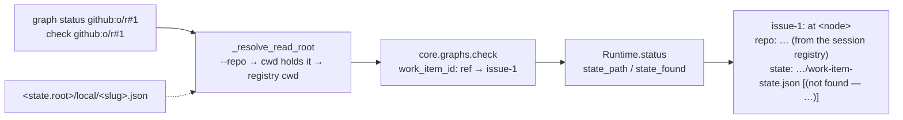

# `graph status` reads the state file the runtime wrote (issue-396) — reviewer briefing

## TL;DR

B7/O6 of the e2e Slack run: `the-loop graph status github:…#1` printed
`at phase-selection` for an item three nodes further on — from the daemon's config
directory *and* from inside the work item's checkout. Two misses, one silent fallback:
the command took the **ref** as a spec-directory id (`docs/specs/github:…#1/`, never
there) and defaulted `--repo` to the working directory; finding no state file, it
reported the graph's start node with no hint that nothing was read. Now every graph
verb translates a ref to the daemon's `issue-<n>` directory, the check report names the
`work-item-state.json` it read (or looked for), the CLI prints it as a `state:` line,
and the two read verbs resolve a daemon-run item's checkout through the session
registry when the working directory does not hold it. No config, schema, state or
event change; two additive report keys.

## Where to focus (in this order)

1. **The resolver** — `cli/the_loop/commands/graph_cmd.py` `_resolve_read_root` /
   `_session_checkout`: three tiers (`--repo` verbatim → working directory holds the
   item → registry `cwd` for a ref), read verbs only, every miss falls through. Check
   you agree a **closed** record should still answer (as `sessions attach` does).
2. **The translation** — `cli/the_loop/core/graphs.py` `work_item_id`, applied first in
   all six verbs: only a parsable GitHub ref is translated, through the daemon's own
   `spec_id_for`; everything else passes through unchanged (the `../../etc#1` case is in
   the test).
3. **The report** — `cli/the_loop/graph/runtime.py` `StatusReport.state_path` /
   `state_found`; the issue-238 key-set test moves with them on purpose, the no-path
   answer does not. Skim.
4. **The wording** — `_state_line`: three variants (found; not found with the state
   directory present, with or without `--recompute`; not found with it absent). Skim.

## What changed (map)

## Key decisions & why

- **Registry, not portable record.** The graph pointer lives only in the checkout
  (issue-368); the registry is the one record of *which* checkout. No new state.
- **Resolve in the CLI, not core.** The API's `check` takes an explicit `repo` and
  stays pure; issue-238's "no core call on unvetted input" structure is untouched.
- **Read verbs only.** A write into a checkout the operator did not name is not a
  convenience.
- **Print the path always.** One line; it is the issue's own acceptance criterion.
- **Additive keys, re-pinned.** The next addition to the check report is again a
  deliberate one.

## Evidence

`docs/specs/issue-396/evidence/automated-tests.md`: three core tests (one parametrised
over seven shapes) and eight Gherkin-docstringed CLI scenarios, all red before the fix;
the OpenAPI parity test; the full suite, ruff and pyright.

## Open questions for the reviewer

None. Tier 3: this PR's approval is the human gate; the spec chain under
`docs/specs/issue-396/` is `in-review` until then.
