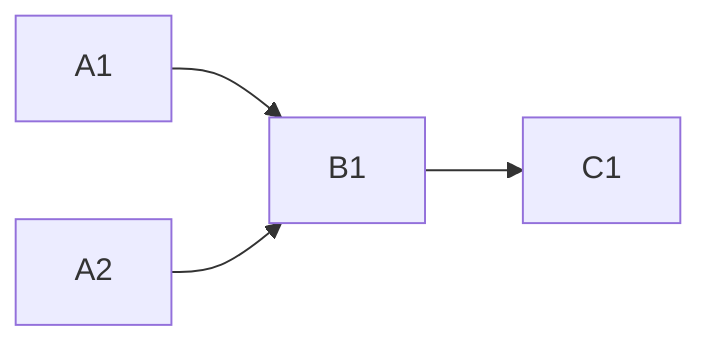

<!-- Authored per the the-loop:writing skill. -->

# Tasks: `graph status` reads the state file the runtime wrote

> Phase 4 of 4. Each task names the requirement it satisfies and the testing-plan row
> that proves it; the test lands with the change (red first).

## Task list

- [x] **A1 — `core.graphs.work_item_id`.** Ref → `issue-<n>` through `WorkItemRef.parse`
      and `graphlink.spec_id_for`; applied first in every core graph verb. *Req:* R1.1,
      R1.4 · *Test:* T1.
- [x] **A2 — `StatusReport` names its state file.** `state_path`/`state_found` filled by
      `Runtime.status`; `statePath`/`stateFound` in `as_dict`; the issue-238 key-set test
      updated; API and MCP docstrings and the authored OpenAPI description. *Req:* R2.2
      · *Test:* T1, T3. *Deps:* none.
- [x] **B1 — the CLI resolves the checkout and prints the path.** `--repo` unset on
      `check` and `graph`; `_resolve_root` (registry lookup for the read verbs);
      `_state_line`; the `repo:` note. *Req:* R1.2, R1.3, R1.4, R2.1, R2.3 · *Test:* T2,
      T7. *Deps:* A1, A2.
- [x] **C1 — docs and evidence.** `README.md` (`graph status <id|ref>`),
      `docs/cli/commands/graph.md` and `check.md` (the ref form, `--repo` unset, the
      `state:` line), `docs/capabilities/process-graph.md` and `cli.md` (requirement +
      history rows), the e2e report's B7/O6 and the follow-ups index link the issue;
      evidence files. *Deps:* A1–B1.

## Dependency graph (DAG)

## Checkpoints

- After A1 + A2: `tests/test_core_graphs.py` and `tests/test_api_contract_parity.py`
  green.
- After B1: `tests/test_graph_status_resolution.py` green.
- After C1: full suite, ruff, pyright, markdownlint.

## Review comments

*None yet.*
