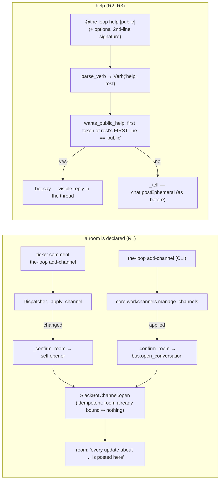

<!-- Authored per the the-loop:writing skill. -->

# Design: minor Slack polish — room-declaration confirmation, ephemeral help, connector signature

> Phase 2 of 4. Derives from the approved [`requirements.md`](requirements.md).

## Overview

**Nothing new is built; two existing seams are called from one more place each.**

- **R1** reuses the **conversation opener** (issue-317): the dispatcher already holds
  one (`Dispatcher.opener`, injected by the daemons over their config getter) and calls
  it the moment a start is accepted. `_apply_channel` now calls it once more, right
  after a *new* declaration is written, through a small `_confirm_room` that swallows
  every failure. The CLI verb (`core.workchannels.manage_channels`) does the same
  through `bus.open_conversation` when the config has a `channels` section, and reports
  the outcome as one more line of its output.
- **R2/R3** reuse the verb parser: `parse_verb` already hands `help` its remainder;
  `wants_public_help(verb)` reads the first token of the remainder's first line, and
  `process_reply` answers with `bot.say` (an ordinary reply in the member's thread)
  instead of `_tell` (the ephemeral).

## Why the opener, not a new message (R1)

The ticket offered two shapes: the existing room-opened message at declaration, or a
new one-liner. The existing message is the right one: it *is* the "this room is the
conversation" statement, it binds the record (`mode: channel`) so the first update is
delivered as a room message rather than opening the room then, and the open is
idempotent by the channel's contract — so declaring, starting and re-declaring in any
order produce exactly one message. A conversation already bound in the central channel
moves at the declaration instead of at the next event, which is issue-375 R2.2's move
brought forward; the pointer left behind is unchanged.

## Error handling

| Where | Failure | Behaviour |
|---|---|---|
| dispatcher | `opener` is `None` (tests, embedders) | nothing opened; declaration and 🎉 as before |
| dispatcher | opener raises | `logger.exception`, declaration stands, comment settled as executed |
| CLI | no `channels` section | nothing opened |
| CLI | bus returns a failed `PostResult` | one `err` line naming the channel and the error; exit code unchanged |
| inbound | `help public` from a member who may not speak | refused by the unchanged speaker check before this branch |

## Data & config

No config key, grant, scope, schema, state file or event type changes. One new public
name in `channels.verbs` (`wants_public_help`, `PUBLIC_HELP`), one private method on
the dispatcher, one private function in `core.workchannels`.
