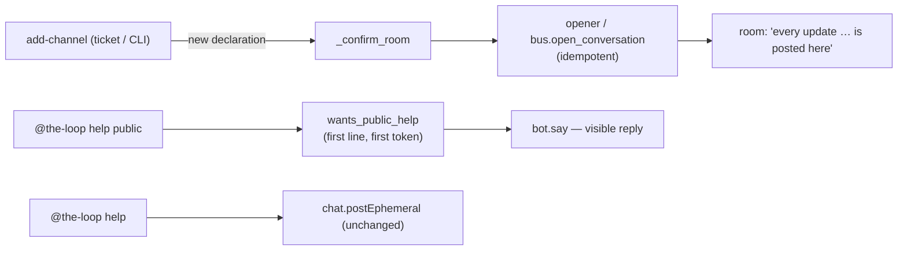

# Minor Slack polish (issue-397) — reviewer briefing

## TL;DR

Three small Slack touches from the e2e report's leftovers: a declared room hears about
its declaration right away (O1), `help public` answers visibly so a connector can read
it (O4), and the first-line-only parsing the connector signature relies on is pinned by
tests (O5). No config, grant, scope, schema or state change.

## Where to focus (in this order)

1. **The declaration now opens the conversation** — `cli/the_loop/webhook/dispatcher.py`
   `_apply_channel` / `_confirm_room`: the only behavioural consequence beyond the
   confirmation is that a conversation bound in the central channel moves at the
   declaration instead of at the next event. Confirm you agree that is the right moment.
2. **`help public`** — `cli/the_loop/channels/verbs.py` `wants_public_help` and the
   `help` branch of `process_reply` in `inbound.py`: the token is read from the first
   line only; the visible answer goes through `bot.say` in the member's thread.
3. **CLI parity** — `cli/the_loop/core/workchannels.py` `_confirm_room`: skim; the bus
   open is guarded by a `channels` section and reported, never raised.

## What changed (map)

## Key decisions & why

- **Reuse the room-opened message, not a new one-liner.** It already says the room is
  the conversation, it binds the record so the first update lands as a room message,
  and it is idempotent — one message whatever the order of declare/start.
- **`help public` on the mention path only.** The slash command's answer travels
  through Slack's `response_url`, a per-invoker receipt; the observation was the
  mention path, which the connector drove.
- **O5 as tests, not code.** The first-line rule already holds; a test keeps it.

## Evidence

`docs/specs/issue-397/evidence/automated-tests.md`: 73 passed on the touched files,
4282 passed / 1 skipped on the full suite, ruff + pyright clean.

## Open questions for the reviewer

None. Tier 2: completes after the review loop.
