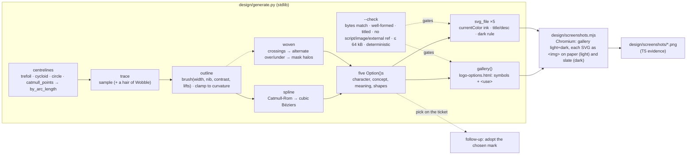

<!-- Authored per the the-loop:writing skill. -->

# Design: a logo for the-loop — five brush-drawn SVG options to choose from

> Phase 2 of 4. Derives from the approved [`requirements.md`](requirements.md).
> The visual artifacts themselves live in [`design/`](design/) per
> `reference/design-artifacts.md`; this document says how they are made and why.
> **Round 2** — round 1's five marks and this document's first version are in git
> history; the owner's review that turned it is recorded under *Review comments*.

## Overview

**Five marks, one generator, one brush.** Every option is produced by
[`design/generate.py`](design/generate.py), a stdlib-only script that draws *strokes*: a
centreline (a parametric curve, or a spline through hand-placed points) outlined by a
flat brush — full width across the nib and thinner along it, pressed harder mid-stroke,
lifted in and out — and emitted as one filled path. Nothing is traced, filtered or
font-dependent, so a mark renders the same in a browser, a README, a favicon and an
image tool, and "a heavier brush" or "a tighter loop" is a number, not a redraw (R3.3).

Round 1 drew five loop *structures* (nested, continuous, composed, overlapping, meshing)
with a wobbling, over-drawn hand. The owner's review: *over-stressed on the hand-drawn
part; no character.* Round 2 keeps the hand — a brush, held at an angle, lifted where it
stops, never shaky — and gives each mark a **personality** instead of a diagram (R1.2):

| # | Option | Character | The idea | Drawn as |
|---|---|---|---|---|
| 1 | **loop** | wit | the name, written in one line, is itself the loops — l above, o o inside, p below | a spline through 45 hand-placed points, one brush stroke |
| 2 | **Knot** | strength | a trefoil: one line, three loops, six crossings — nothing holds a loop like another loop | the trefoil curve, woven over/under with a mask |
| 3 | **Flick** | momentum | a stroke that loops back on itself twice and still moves forward, ending in an arrow | a prolate cycloid with shrinking loops, a chevron on the tangent |
| 4 | **Clip** | utility, with a wink | a paperclip: one wire, an inner loop inside an outer loop — what holds the work together | eight legs and arcs in wire-clip proportions, one stroke |
| 5 | **Ensō** | calm | three brush circles, each left open where the hand lifted — outer, inner, and the one between | three 315° arcs, heavy at the start, dry at the tail |

## Architecture

There is no runtime. Two scripts and their outputs, all under `docs/specs/issue-398/design/`:

| File | Role | Source or output |
|---|---|---|
| `generate.py` | the generator and its own checker | **source** |
| `option-{1..5}-*.svg` | the five standalone marks | output |
| `logo-options.html` | the self-contained gallery (R4.1) | output |
| `screenshots.mjs` | renders the evidence with the Chromium Playwright drives | source |
| `screenshots/*.png` | the rendered evidence (R4.2) | output |

The generator is the canonical artifact; the SVGs and the gallery are what it makes,
and `--check` refuses to pass when the files on disk differ from a fresh render. Editing
an SVG by hand is therefore a lint failure, which is the intent: iteration happens in
the parameters (`reference/design-artifacts.md` — "edits to the checked-in artifact,
not new copies"). Round 1 → round 2 was exactly that: the option functions and the
brush changed; the pipeline did not.

## Components & interfaces

**Centrelines** (`generate.py`, top half):

- `trefoil(scale, rot)` — `(sin t + 2 sin 2t, cos t − 2 cos 2t)`, the simplest knot.
- the **flick**'s prolate cycloid `(t − b·sin t, b·cos t)` with `b` shrinking along `t`,
  so each loop is smaller than the last.
- `catmull_points(keys)` — a dense open Catmull-Rom curve through hand-placed points:
  the **wordmark** (45 points for `l o o p`) and the **clip** (legs and `arc()`s).
- `by_arc_length(points)` — re-parameterises a point list by arc length, so a brush's
  pressure and lifts are even along the stroke however the points are spaced.
- `circle`, `ellipse`, `placed(points, scale, rot, …)` — placement on the 256 canvas.

**The brush:**

- `brush(base, nib_deg, contrast, entry, exit, swell, floor)` — the width at a point is
  `base × angular × pressure × lift`: `angular` is 1 across the nib and `1 − contrast`
  along it (the calligraphic thick/thin); `pressure` a Gaussian swell around
  `swell_at`; `lift` a smoothstep in over `entry` and out over `exit` of the stroke
  (0 keeps an end blunt). Round 2 uses contrasts of 0.32–0.45 — visible, not showy.
- `enso_brush(base)` — the one-breath profile: down heavy at the start, a slight press,
  then thinning to a dry tail over the second half.
- `outline(pts, width, closed, u0, u1)` — offsets the centreline left and right by half
  the width, **clamped to 0.85 × the local radius of curvature** so the offset never
  folds back on itself at a tight curl (which punched holes in round 2's first pass),
  and returns the outline as Catmull-Rom Béziers. Filled with the default `nonzero`
  rule, so a stroke that crosses itself stays solid where a pen's ink would.
- `Wobble` — kept, at 0.6 units on the ensō only: a hair of warmth, never a tremor.

**Strokes and shapes:**

- `stroke(curve, width, fill, u0, u1, …)` → one `Shape` (a filled path). The brush sees
  progress along the *drawn* stroke, not the curve's own parameter.
- `woven(curve, width, …)` — a closed stroke that crosses itself, drawn as rope:
  `crossings()` finds the self-intersections numerically, the visits are walked in
  parameter order and alternated over/under (the trefoil is an alternating knot), and
  each *over* visit's neighbourhood is drawn twice — once as a black *halo* (the stroke
  plus a gap) into a `<mask>` that carves the under strand, once on top as ink. The
  weave holds on any background because nothing is painted in the background colour.
- `arrowhead(curve, u, length, half)` — a filled chevron continuing the tangent.

**Options:** `option_loop_word()` … `option_enso()` each return an `Option` — slug,
name, **character**, the concept sentence (R1.2), what each element means, how it is
drawn, and its shapes.

**Output and checker:** `svg_file(opt)` (standalone, `currentColor` ink, one dark-scheme
rule, `<title>`/`<desc>` with ids unique per option); `svg_symbol`/`svg_use` for the
gallery's one-definition-many-instances (the sections carry `-card` ids so no id is
shared); `gallery(options)`; `check(files)` with `svg_problems()` — the parsed-tree
allowlist the security review asked for — see *Error handling*.

## UI/UX design

The visual artifacts, per `design.uiArtifacts` (`dir: design`, `format: html`,
`selfContained: true`, `screenshotEvidence: true`). No Figma: the generated SVG is the
source (agent-led work — `reference/design-artifacts.md` § Figma ↔ code).

| Artifact | Type | Location / link | Covers | Status |
|----------|------|-----------------|--------|--------|
| Option 1 — loop | svg (generated) | [`design/option-1-loop.svg`](design/option-1-loop.svg) | R1–R3 | draft (round 2) — awaiting the owner's pick |
| Option 2 — Knot | svg (generated) | [`design/option-2-knot.svg`](design/option-2-knot.svg) | R1–R3 | draft (round 2) — awaiting the owner's pick |
| Option 3 — Flick | svg (generated) | [`design/option-3-flick.svg`](design/option-3-flick.svg) | R1–R3 | draft (round 2) — awaiting the owner's pick |
| Option 4 — Clip | svg (generated) | [`design/option-4-clip.svg`](design/option-4-clip.svg) | R1–R3 | draft (round 2) — awaiting the owner's pick |
| Option 5 — Ensō | svg (generated) | [`design/option-5-enso.svg`](design/option-5-enso.svg) | R1–R3 | draft (round 2) — awaiting the owner's pick |
| The gallery | html-prototype (generated, self-contained, no script) | [`design/logo-options.html`](design/logo-options.html) | R4.1 | draft (round 2) |
| Rendered stills | png | [`design/screenshots/`](design/screenshots/) — `gallery-light.png`, `gallery-dark.png`, `option-N-*-paper.png`, `option-N-*-slate.png` | R4.2, R3.2, R3.4 | evidence (round 2) |
| Round 1 — Gimbal, One line, Coil, Rings, Planetary | svg (generated) | git history of `design/` before round 2 | R1–R3 | **superseded** — the owner's review (below) |

- **Flows & states:** no flow — five static marks, each shown in the states a logo has:
  on paper, on slate, at 96 / 48 / 24 / 16 px, and in a lockup beside the name.
- **Design system / tokens:** one palette, shared by all five (R2.2, R2.3) — warm ink
  `#3f3a33` (on slate `#e9e3d7`), sage `#8a9c84`, dusk `#7f93a5`, clay `#c48a6c`, ochre
  `#c7a86b`, mauve `#9d8a9f` (sage, ochre and mauve reserved; round 2 uses ink, dusk and
  clay), paper `#f5f0e6`, slate `#22252a`. The ink is `currentColor`, set once on the SVG
  root and swapped by the file's one `prefers-color-scheme: dark` rule; accents are
  mid-toned so they read on either ground without changing. A consumer that **inlines**
  a file into a page (rather than embedding it as an ``) drops the file's `<style>`
  and sets `color` on the element itself — as the gallery does — since the rule is
  written for the file as a document.
- **Accessibility & responsiveness:** every SVG carries `<title>`/`<desc>` and
  `role="img"` (R3.4). Contrast: ink on paper 9.9:1, ink-on-slate on slate 12.0:1; the
  accents (dusk, clay in the ensō) sit at 2.6–2.8:1 on paper and 4.9–5.3:1 on slate —
  decorative loops, never text, and every option's silhouette is carried by ink. The
  gallery is fluid (`auto-fit` grid) and follows the OS scheme.
- **Evidence:** `design/screenshots/`, produced by `design/screenshots.mjs`
  (`testing-plan.md` T5).

## Data models

None persisted. Each option is a handful of named numbers in `generate.py`:

| Option | Centreline | Brush | Ink / accents |
|---|---|---|---|
| loop | 45 keypoints (x-height 1, ascender 2.48, descender −1.24), scale 46, tilt −4° | base 9.5, nib 28°, contrast 0.45, lifts 0.03 / 0.05 | ink |
| Knot | trefoil, scale 31, rotated 180° | base 11.5, nib 40°, contrast 0.32, blunt ends; weave gap 2.2 | ink |
| Flick | cycloid, `b = 2.15 − 0.32·t/2π`, t ∈ [−2.6, 4π + 1.9], scale 14, swept −24° | base 9.2, nib 25°, contrast 0.4, entry 0.14, swell 0.22 @ 0.5; chevron 30 × 28 | ink |
| Clip | legs and arcs of a Gem clip (inner 16, top 25, outer 34), scale 1.32, tilt −22° | base 8.6, nib 30°, contrast 0.38, lifts 0.04 | ink |
| Ensō | circles r 100 / 65 / 33, arcs of 315° opening at 118° / 250° / 20° | ensō profile, base 16 / 13 / 9.5, nib 15°, contrast 0.2; wobble 0.6 | ink, dusk, clay |

All on a 256×256 viewBox.

## Error handling

`python3 generate.py --check` is the only failure surface, and it fails closed:

| Condition | Result |
|---|---|
| a generated file is missing or differs from a fresh render | `FAIL <file>: differs … (re-run it)`, exit 1 |
| an SVG is not well-formed XML, or lacks `<title>` or `<desc>` | `FAIL`, exit 1 |
| an SVG's parsed tree holds an element or attribute outside the allowlist (`svg, title, desc, style, path, mask, rect`; `viewBox, color, role, aria-labelledby, id, d, fill, opacity, mask, maskUnits, x, y, width, height`), a `mask` that is not a fragment, or a stylesheet that imports or references anything | `FAIL`, exit 1 |
| the gallery contains `<script`, `<foreignObject`, `<image`, `<iframe`, `@import`, `src=`, `javascript:` (case-insensitively), or an `href`/`url(` that is not a `#fragment` | `FAIL`, exit 1 |
| an SVG exceeds 64 000 bytes | `FAIL`, exit 1 |
| two renders in one process differ (non-determinism) | `FAIL generate.py is not deterministic`, exit 1 |

`screenshots.mjs` fails loudly when Playwright or Chromium is absent (an import error /
launch error); it never writes a partial set silently.

## Security design

No trust boundary exists to enforce: no input, no runtime, no network. The one
mechanism is the checker above, which pins the requirements' abuse case — an SVG
embedded by a consumer executes and loads nothing — as a repeatable command rather
than a reading of the files. Round 2 adds one construct, the knot's `<mask>` referenced
by `mask="url(#…)"`: an internal fragment reference, which is what the checker's
allowlist admits (a `mask` attribute must start `url(#`) and everything else it refuses.
The checker reads each SVG's parsed tree, not its text, so a construct it does not know
fails whatever its spelling. `screenshots.mjs` renders
local files only (`file://` and `data:` URIs built from them) and is run by a person,
never by CI or the daemon; Chromium's sandbox is disabled only when
`CHROMIUM_NO_SANDBOX=1` is set. No secret, hostname or personal datum can appear in the
outputs because the generator has no inputs; the screenshots show only the generated
content.

## Testing strategy

There is nothing to unit-test in the classical sense and nothing to integrate: the proof
is (a) the checker — determinism, well-formedness, self-containment, titles, size — run
as a command; (b) the rendered evidence, captured by the screenshot script in both
schemes and at the sizes R3.2 names; and (c) the owner looking at the rendering
(`reference/design-artifacts.md` — "render, don't read"), which round 1 → round 2 shows
is the test that matters. The lint the repository already runs (markdownlint on the
spec, ruff on the generator by hand since the hook scopes to `cli/`) is the rest. Rows
and commands in `testing-plan.md`.

## Trade-offs & decisions

- **Filled outlines, not strokes.** A stroked path cannot vary its width along its
  length, and the thick/thin of a brush *is* the hand in round 2. Cost: files of 39–51 kB
  instead of 3–5 kB, and a draw-on animation would need a mask rather than
  `stroke-dashoffset`. Accepted; the budget (64 kB, raised from round 1's 40 kB because a
  brush stroke needs denser sampling than a wobbled ellipse) is set in `--check`.
- **Baked geometry, not an SVG filter.** `feTurbulence`+`feDisplacementMap` would give
  a similar look in two lines but renders differently across engines and is dropped by
  many image tools; baked geometry renders identically everywhere.
- **Confidence over wobble.** Round 1's per-loop noise (1–2.4 units) and sketch overdraw
  read as *unsure*, not *made*. Round 2 moves the hand into the brush — nib angle,
  pressure, lifts — where a real hand puts it, and keeps noise to a hair on one option.
- **Personality over structure.** Round 1's five differed in how loops related; the
  review found that a taxonomy, not a set of marks. Round 2's five differ in what they
  *are* — a word, a rope, a whip, a wire, a breath — and each still carries inner, outer
  and many loops (R1.3).
- **`currentColor` for the ink, `<symbol>`/`<use>` in the gallery** — unchanged from
  round 1 and for the same reasons (portability without CSS variables; a 231 kB page
  instead of 1.4 MB).
- **A weave by mask, not by background paint.** Painting the gaps in the page colour
  would break on any other ground; a mask carves the under strand instead, so the knot
  holds on paper, slate and anything else.
- **Not delivered here, on purpose:** a typeface for the lockup (the wordmark option
  makes that moot if chosen), raster exports, and the draw-on animation the flick and
  the wordmark both invite. All belong to adoption, after the pick (`requirements.md` §
  Out of scope).

No durable decision beyond this work item — nothing under `docs/decisions/`.

## Open questions

One, and it is the deliverable's purpose: **which option?** Raised on the ticket with
the gallery, the SVGs and the PR (R4.3). The answer — and any "more of this, less of
that" — lands as a ticket or PR comment and becomes parameter edits and a re-run.

## Review comments

- **2026-09-20 · @MadaraUchiha-314 (owner, designer) · [PR #403 review](https://github.com/MadaraUchiha-314/the-loop/pull/403#pullrequestreview-5261761922)**
  — *"I think you over stressed on the hand drawn part. there's no character to these
  logos."* **Folded in as round 2** (this version): the wobble and the sketch overdraw
  are gone in favour of a brush with pressure and nib contrast; the five structures are
  replaced by five marks with a personality each (the table in *Overview*); the size
  budget is raised to 64 kB to carry the denser strokes. Round 1's marks stay in git
  history and are marked *superseded* in the inventory above.
