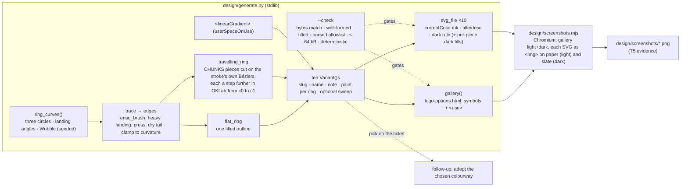

<!-- Authored per the the-loop:writing skill. -->

# Design: a logo for the-loop — the Ensō, in colourways

> Phase 2 of 4. Derives from the approved [`requirements.md`](requirements.md).
> The visual artifacts themselves live in [`design/`](design/) per
> `reference/design-artifacts.md`; this document says how they are made and why.
> **Round 3** — rounds 1 and 2 (five structures; five personalities) and this
> document's earlier versions are in git history; the owner's reviews that turned it
> are recorded under *Review comments*.

## Overview

**One mark, one brush, ten colourways.** The owner chose the **Ensō** from round 2 —
three brush circles, each left open where the hand lifted: the outer loop, the inner
loop, and the one between — and asked for colour and gradient options. Every file is
produced by [`design/generate.py`](design/generate.py), a stdlib-only script: the three
strokes' geometry is fixed (the round-2 Ensō, byte for byte in its original colours) and
only the **paint** varies. Nothing is traced, filtered or font-dependent, so a colourway
renders the same in a browser, a README, a favicon and an image tool, and a different
pairing is a line in one table and a re-run (R3.3).

| # | Colourway | Outer · middle · inner | Kind |
|---|---|---|---|
| 1 | ink · dusk · clay | ink · dusk · clay | flat — the round-2 original |
| 2 | ink | ink · ink · ink | flat — one colour, follows the ground's ink |
| 3 | ink · ink · clay | ink · ink · clay | flat — one warm centre |
| 4 | clay · ochre · ink | clay · ochre · ink | flat — warm outside, ink centre |
| 5 | dusk · sage · ink | dusk · sage · ink | flat — cool outside, ink centre |
| 6 | sage · ochre · clay | sage · ochre · clay | flat — earth, no ink |
| 7 | mauve · dusk · clay | mauve · dusk · clay | flat — the quieter trio, no ink |
| 8 | dusk → clay, along the stroke | each ring dusk where the brush lands, clay where it lifts | gradient travelling with the brush |
| 9 | ink → accent, running dry | ink → dusk · ink → clay · ink → ochre | gradient travelling with the brush |
| 10 | dusk → clay, across the mark | one linear gradient, top-left to bottom-right | spatial gradient |

## Architecture

There is no runtime. Two scripts and their outputs, all under `docs/specs/issue-398/design/`:

| File | Role | Source or output |
|---|---|---|
| `generate.py` | the generator and its own checker | **source** |
| `enso-{1..10}-*.svg` | the ten standalone colourways | output |
| `logo-options.html` | the self-contained gallery (R4.1) | output |
| `screenshots.mjs` | renders the evidence with the Chromium Playwright drives | source |
| `screenshots/*.png` | the rendered evidence (R4.2) | output |

The generator is the canonical artifact; the SVGs and the gallery are what it makes,
and `--check` refuses to pass when the files on disk differ from a fresh render. Editing
an SVG by hand is therefore a lint failure, which is the intent: iteration happens in
the parameters (`reference/design-artifacts.md` — "edits to the checked-in artifact,
not new copies"). Each round was exactly that; round 3 changed the *paint* layer and
left the brush and the geometry alone.

## Components & interfaces

**The mark** (`generate.py`, top half):

- `RINGS` — radius, the angle the brush lands at, and the base width of each circle
  (100 / 65 / 33; 118° / 250° / 20°; 16 / 13 / 9.5), each drawn over `ARC` = 315° of
  its circle; the gap is where the hand lifted. `ring_curves()` builds the three
  `circle` curves and their seeded `Wobble` (0.6 units — a hair of warmth) in a fixed
  order, so every colourway has the identical hand.
- `enso_brush(base)` — the one-breath profile: down heavy at the start, a slight press,
  then thinning to a dry tail over the second half; a flat nib at 15° adds a little
  thick/thin.
- `trace`, `edges`, `outline` — samples, the left/right edges of the stroke (half-width
  **clamped to 0.85 × the local radius of curvature** so an offset never folds back),
  and the whole-stroke outline as Catmull-Rom Béziers, filled `nonzero`.

**The paint:**

- `flat_ring(…, fill)` — one outline, one fill; `"ink"` becomes `currentColor`, so it
  follows the ground (`color` on the SVG root, swapped by the dark-scheme rule).
- `travelling_ring(…, c0, c1)` — the same stroke in `CHUNKS` (20) pieces. The pieces are
  cut from **one** set of edges along the stroke's **own Bézier segments** (`segment`,
  `piece`), with a straight cut across and a one-sample overlap, so their edges coincide
  exactly and no seam shows. Piece *k* is filled with `mix(c0, c1, (k+½)/20)` — a blend
  in **OKLab** (`to_oklab` / `from_oklab` / `mix`), so the ramp is perceptually even and
  never muddies through grey. A piece whose light colour comes from the ink also gets
  a dark-scheme colour from the slate ink, carried by a class the file's stylesheet
  maps under `prefers-color-scheme: dark` (and the gallery's `.board.slate`).
- The sweep — one `<linearGradient gradientUnits="userSpaceOnUse">` from (36, 36) to
  (220, 220), referenced by all three strokes as `fill="url(#…)"`.

**Variants:** `VARIANTS` — ten `Variant(slug, name, note, rings, sweep)` rows; `rings`
is a paint per ring (a colour, `"ink"`, or a `(start, end)` pair for a travelling
gradient), `sweep` a `(start, end)` pair for the spatial one. Adding a colourway is one
row.

**Output and checker:** `svg_file(v)` (standalone, `currentColor` ink, one dark-scheme
rule plus the travelling pieces' dark fills, `<title>`/`<desc>` with ids unique per
variant); `svg_symbol`/`svg_use` for the gallery's one-definition-many-instances (the
sections carry `-card` ids so no id is shared); `gallery(variants)`; `check(files)` with
`svg_problems()` — the parsed-tree allowlist, extended for round 3 by `linearGradient`
and `stop` and the attributes a gradient needs — see *Error handling*.

## UI/UX design

The visual artifacts, per `design.uiArtifacts` (`dir: design`, `format: html`,
`selfContained: true`, `screenshotEvidence: true`). No Figma: the generated SVG is the
source (agent-led work — `reference/design-artifacts.md` § Figma ↔ code).

| Artifact | Type | Location / link | Covers | Status |
|----------|------|-----------------|--------|--------|
| Colourway 1 — ink · dusk · clay | svg (generated) | [`design/enso-1-ink-dusk-clay.svg`](design/enso-1-ink-dusk-clay.svg) | R1–R3 | draft (round 3) — awaiting the owner's pick |
| Colourway 2 — ink | svg (generated) | [`design/enso-2-ink.svg`](design/enso-2-ink.svg) | R1–R3 | draft (round 3) |
| Colourway 3 — ink · ink · clay | svg (generated) | [`design/enso-3-ink-ink-clay.svg`](design/enso-3-ink-ink-clay.svg) | R1–R3 | draft (round 3) |
| Colourway 4 — clay · ochre · ink | svg (generated) | [`design/enso-4-clay-ochre-ink.svg`](design/enso-4-clay-ochre-ink.svg) | R1–R3 | draft (round 3) |
| Colourway 5 — dusk · sage · ink | svg (generated) | [`design/enso-5-dusk-sage-ink.svg`](design/enso-5-dusk-sage-ink.svg) | R1–R3 | draft (round 3) |
| Colourway 6 — sage · ochre · clay | svg (generated) | [`design/enso-6-sage-ochre-clay.svg`](design/enso-6-sage-ochre-clay.svg) | R1–R3 | draft (round 3) |
| Colourway 7 — mauve · dusk · clay | svg (generated) | [`design/enso-7-mauve-dusk-clay.svg`](design/enso-7-mauve-dusk-clay.svg) | R1–R3 | draft (round 3) |
| Colourway 8 — dusk → clay, along the stroke | svg (generated) | [`design/enso-8-dusk-to-clay.svg`](design/enso-8-dusk-to-clay.svg) | R1–R3 | draft (round 3) |
| Colourway 9 — ink → accent, running dry | svg (generated) | [`design/enso-9-running-dry.svg`](design/enso-9-running-dry.svg) | R1–R3 | draft (round 3) |
| Colourway 10 — dusk → clay, across the mark | svg (generated) | [`design/enso-10-sweep.svg`](design/enso-10-sweep.svg) | R1–R3 | draft (round 3) |
| The gallery | html-prototype (generated, self-contained, no script) | [`design/logo-options.html`](design/logo-options.html) | R4.1 | draft (round 3) |
| Rendered stills | png | [`design/screenshots/`](design/screenshots/) — `gallery-light.png`, `gallery-dark.png`, `enso-N-*-paper.png`, `enso-N-*-slate.png` | R4.2, R3.2, R3.4 | evidence (round 3) |
| Round 2 — loop, Knot, Flick, Clip (and the Ensō in its first file) | svg (generated) | git history of `design/` before round 3 | R1–R3 | **superseded** — the Ensō chosen, "remove all others" (review below) |
| Round 1 — Gimbal, One line, Coil, Rings, Planetary | svg (generated) | git history of `design/` before round 2 | R1–R3 | **superseded** — the round-1 review |

- **Flows & states:** no flow — one static mark in ten colourways, each shown in the
  states a logo has: on paper, on slate, at 96 / 48 / 24 / 16 px, and in a lockup beside
  the name.
- **Design system / tokens:** one palette (R2.2, R2.3) — warm ink `#3f3a33` (on slate
  `#e9e3d7`), sage `#8a9c84`, dusk `#7f93a5`, clay `#c48a6c`, ochre `#c7a86b`, mauve
  `#9d8a9f`, paper `#f5f0e6`, slate `#22252a`; every accent is used by at least one
  colourway. Flat ink is `currentColor`; accents are mid-toned so they read on either
  ground without changing; a travelling gradient that touches ink carries a second,
  dark-scheme set of piece fills. A consumer that **inlines** a file into a page (rather
  than embedding it as an ``) drops the file's `<style>` and sets `color` (and, for
  colourway 9, the piece fills) itself — as the gallery does — since the rules are
  written for the file as a document.
- **Accessibility & responsiveness:** every SVG carries `<title>`/`<desc>` and
  `role="img"` (R3.4). Contrast: ink on paper 9.9:1, ink-on-slate on slate 12.0:1; the
  accents sit at 2.0–2.8:1 on paper and 4.8–6.8:1 on slate — decorative loops, never
  text; the ink-free colourways (6, 7, 8, 10) rely on the accents alone and are the ones
  to weigh against a dark ground. The gallery is fluid (`auto-fit` grid) and follows the
  OS scheme.
- **Evidence:** `design/screenshots/`, produced by `design/screenshots.mjs`
  (`testing-plan.md` T5).

## Data models

None persisted. The geometry is three rows of numbers and the paint is one table:

| Ring | Radius | Lands at | Base width | Arc |
|---|---|---|---|---|
| outer | 100 | 118° | 16 | 315° |
| middle | 65 | 250° | 13 | 315° |
| inner | 33 | 20° | 9.5 | 315° |

Brush: `enso_brush` (nib 15°, contrast 0.2); wobble 0.6 units, seed `398_5`; 200 samples
per stroke; travelling gradients in 20 pieces. Paint per colourway: the `VARIANTS`
table in `generate.py` (and the *Overview* above). All on a 256×256 viewBox.

## Error handling

`python3 generate.py --check` is the only failure surface, and it fails closed:

| Condition | Result |
|---|---|
| a generated file is missing or differs from a fresh render | `FAIL <file>: differs … (re-run it)`, exit 1 |
| an SVG is not well-formed XML, or lacks `<title>` or `<desc>` | `FAIL`, exit 1 |
| an SVG's parsed tree holds an element or attribute outside the allowlist (`svg, title, desc, style, path, linearGradient, stop`; `viewBox, color, role, aria-labelledby, id, d, fill, class, gradientUnits, x1, y1, x2, y2, offset, stop-color`), a `url(` reference that is not a fragment, or a stylesheet that imports or references anything | `FAIL`, exit 1 |
| the gallery contains `<script`, `<foreignObject`, `<image`, `<iframe`, `@import`, `src=`, `javascript:` (case-insensitively), or an `href`/`url(` that is not a `#fragment` | `FAIL`, exit 1 |
| an SVG exceeds 64 000 bytes | `FAIL`, exit 1 |
| two renders in one process differ (non-determinism) | `FAIL generate.py is not deterministic`, exit 1 |

`screenshots.mjs` fails loudly when Playwright or Chromium is absent (an import error /
launch error); it never writes a partial set silently.

## Security design

No trust boundary exists to enforce: no input, no runtime, no network. The one
mechanism is the checker above, which pins the requirements' abuse case — an SVG
embedded by a consumer executes and loads nothing — as a repeatable command rather
than a reading of the files; it reads each SVG's parsed tree, not its text, so a
construct it does not know fails whatever its spelling. Round 3 adds two constructs:
`<linearGradient>`/`<stop>` (elements the allowlist now admits, with only the attributes
a gradient needs) referenced by `fill="url(#…)"` — an internal fragment, which is what
the checker's reference rule admits and everything else it refuses — and `class`
attributes on the travelling pieces, mapped to fills by the file's own stylesheet (which
may not `@import` or reference anything outside the file). `screenshots.mjs` renders
local files only (`file://` and `data:` URIs built from them) and is run by a person,
never by CI or the daemon; Chromium's sandbox is disabled only when
`CHROMIUM_NO_SANDBOX=1` is set. No secret, hostname or personal datum can appear in the
outputs because the generator has no inputs; the screenshots show only the generated
content.

## Testing strategy

There is nothing to unit-test in the classical sense and nothing to integrate: the proof
is (a) the checker — determinism, well-formedness, self-containment (a parsed allowlist,
probed with planted constructs), titles, size — run as a command; (b) the rendered
evidence, captured by the screenshot script in both schemes and at the sizes R3.2 names;
and (c) the owner looking at the rendering (`reference/design-artifacts.md` — "render,
don't read"), which three rounds have shown is the test that matters. The lint the
repository already runs (markdownlint on the spec, ruff on the generator by hand since
the hook scopes to `cli/`) is the rest. Rows and commands in `testing-plan.md`.

## Trade-offs & decisions

- **Pieces, not a gradient element, for colour that travels along a stroke.** SVG has
  no gradient that follows a path (no conic gradient either), so a travelling ramp is
  the stroke cut into pieces, each one shade further along. Cost: a 48–53 kB file
  instead of 42 kB and twenty paths per ring instead of one. The pieces are cut on the
  stroke's own Bézier segments so the seams are invisible — the first cut (a fresh
  outline per piece) stepped at every seam, the second (a closed spline per piece)
  rounded every corner; both are in the self-review.
- **OKLab for the blends.** A straight sRGB blend between dusk and clay passes through
  a dull grey; OKLab keeps the ramp perceptually even and the mid-tones alive.
- **A real `<linearGradient>` for the sweep**, because a spatial gradient is what the
  element is for; it is portable everywhere the files are expected to render, and the
  checker's allowlist was widened by exactly the two elements and seven attributes it
  needs.
- **Ink stays `currentColor`; ink in a gradient gets explicit dark fills.** A blend
  cannot be a `currentColor`, so colourway 9 carries a second, dark-scheme colour per
  piece through classes — the same mechanism the gallery's slate boards use. The
  ink-free colourways need neither.
- **Filled outlines, baked geometry, confidence over wobble, `<symbol>`/`<use>` in the
  gallery** — unchanged from rounds 1 and 2 and for the same reasons.
- **Not delivered here, on purpose:** raster exports, a favicon set, a wordmark
  typeface, the draw-on animation the Ensō invites (a `<mask>` revealing each stroke in
  turn). All belong to adoption, after the pick (`requirements.md` § Out of scope).

No durable decision beyond this work item — nothing under `docs/decisions/`.

## Open questions

One, and it is the deliverable's purpose: **which colourway?** Raised on the ticket and
the PR with the gallery and the SVGs (R4.3). The answer — or another pairing — lands as
a ticket or PR comment and becomes one row in `VARIANTS` and a re-run.

## Review comments

- **2026-09-20 · @MadaraUchiha-314 (owner, designer) · [PR #403 review](https://github.com/MadaraUchiha-314/the-loop/pull/403#pullrequestreview-5261761922)**
  — *"I think you over stressed on the hand drawn part. there's no character to these
  logos."* **Folded in as round 2:** the wobble and the sketch overdraw gave way to a
  brush with pressure and nib contrast; five marks with a personality each replaced
  the five structures; the size budget rose to 64 kB. Round 1's marks are in git
  history, marked *superseded* above.
- **2026-09-21 · @MadaraUchiha-314 (owner, designer) · [PR #403 review comment on `option-5-enso.svg`](https://github.com/MadaraUchiha-314/the-loop/pull/403#discussion_r4058557797)**
  — *"I am leaning towards this. Remove all others. Present some more colors and
  gradient options for this."* **Folded in as round 3** (this version): the Ensō is the
  mark; the other four round-2 marks are removed (git history keeps them); the
  generator's option layer became a paint layer — seven flat palettes, two gradients
  travelling along the strokes, one sweep across the mark — with the geometry
  unchanged. `requirements.md` records the change to R1 (one mark, colourways, not
  three-to-five concepts).
