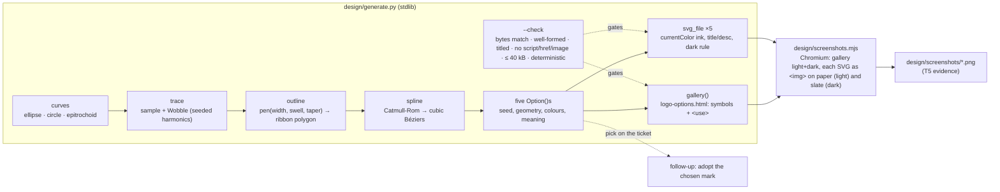

<!-- Authored per the the-loop:writing skill. -->

# Design: a logo for the-loop — five hand-drawn SVG options to choose from

> Phase 2 of 4. Derives from the approved [`requirements.md`](requirements.md).
> The visual artifacts themselves live in [`design/`](design/) per
> `reference/design-artifacts.md`; this document says how they are made and why.

## Overview

**Five marks, one generator.** Every option is produced by
[`design/generate.py`](design/generate.py), a stdlib-only script that draws *ribbons*: a
centreline sampled from a parametric curve, pushed sideways by seeded low-frequency
noise (the wobble of a hand), then outlined with a width that swells and tapers (the
pressure of a pen), and emitted as one filled path. Nothing is traced, filtered or
font-dependent, so a mark renders the same in a browser, a README, a favicon and an
image tool — and "more wobble" is a number, not a redraw (R2.1, R3.3).

The five concepts are five *structural* relationships between loops, so no option is
a variation of another (R1.2):

| # | Option | The relationship between the loops | Drawn as |
|---|---|---|---|
| 1 | **Gimbal** | nested — three rings at three tilts turning on one pivot | three ellipses + a dot |
| 2 | **One line** | continuous — one stroke makes the outer loop *and* three inner loops | one epitrochoid (3 loops), tapered ends |
| 3 | **Coil** | composed — the outer loop's *line* is itself eighteen small loops | one epitrochoid (18 loops) + a plain inner ring |
| 4 | **Rings** | overlapping — translucent loops whose overlaps make new colour | four bands, `multiply` / `screen` blend |
| 5 | **Planetary** | meshing — a ring, three planets tangent to it, a sun they all touch | five circles in planetary-gear proportions |

## Architecture

There is no runtime. Two scripts and their outputs, all under `docs/specs/issue-398/design/`:

| File | Role | Source or output |
|---|---|---|
| `generate.py` | the generator and its own checker | **source** |
| `option-{1..5}-*.svg` | the five standalone marks | output |
| `logo-options.html` | the self-contained gallery (R4.1) | output |
| `screenshots.mjs` | renders the evidence with the Chromium Playwright drives | source |
| `screenshots/*.png` | the rendered evidence (R4.2) | output |

The generator is the canonical artifact; the SVGs and the gallery are what it makes,
and `--check` refuses to pass when the files on disk differ from a fresh render. Editing
an SVG by hand is therefore a lint failure, which is the intent: iteration happens in
the parameters (`reference/design-artifacts.md` — "edits to the checked-in artifact,
not new copies").

## Components & interfaces

**Geometry** (`generate.py`, top half):

- `Wobble(rng, amp, harmonics=(2,3,5))` — a sum of sines at integer multiples of the
  loop's period with random phases; integer harmonics make a closed loop's wobble
  seamless where it meets itself.
- `trace(curve, u0, u1, n, wobble, drift)` — samples the curve on `[u0, u1]` and pushes
  each sample along its normal by the wobble; `drift` eases the last stretch of an
  overshooting loop outward so the closing stroke lands *beside* the opening one — the
  way a hand closes a circle.
- `pen(rng, base, swell, taper)` — the width function: one slow swell around the loop,
  a faster ripple on top, and a taper at the ends of an open stroke.
- `outline(pts, width, closed)` — offsets the centreline left and right by half the
  width and returns the ribbon as a closed polygon (two sub-paths, `evenodd`, for a
  seamless band; one polygon for an open stroke).
- `spline(pts, closed)` — Catmull-Rom through the polygon's points, emitted as cubic
  Béziers, so a loop needs ~100 samples rather than ~1000 and stays smooth.

**Curves:** `ellipse`, `circle`, and `epitrochoid(big, small, d, scale, rot)` — a point
at distance `d` from the centre of a circle of radius `small` rolling around one of
radius `big`; with `d > small` it loops back on itself once per revolution,
`big/small` times per lap, every loop pointing inward. One formula gives option 2 (three
big loops) and option 3 (eighteen small ones).

**Strokes:** `stroke(curve, rng, fill, width, …)` draws a curve as a hand-drawn ribbon
in one of two ways — `overshoot=None` for a seamless closed band (option 4's stains),
or an open stroke from `start` all the way round plus a little further, with tapered
ends (every other loop) — and optionally a second, thinner, fainter *sketch* pass over
part of the loop, the overdraw of a hand reinforcing a line. `dot()` is a small
wobbled disc.

**Options:** `option_gimbal()` … `option_planetary()` each return an `Option` — slug,
name, the concept sentence (R1.2), what each element means, how it is drawn, and its
ribbons — from its own fixed seed (`398_1` … `398_5`). Changing a seed changes the
hand, not the concept.

**Output:** `svg_file(opt)` writes the standalone file; `svg_symbols(opt)` and
`svg_use(opt, px, ground)` let the gallery embed each mark once as a `<symbol>` and
reference it seven times (two boards, four sizes, the lockup) — which is what keeps the
gallery under 200 kB instead of 1.4 MB. `gallery(options)` assembles the page.

**Checker:** `check(files)` — see *Error handling*.

## UI/UX design

The visual artifacts, per `design.uiArtifacts` (`dir: design`, `format: html`,
`selfContained: true`, `screenshotEvidence: true`). No Figma: the generated SVG is the
source (agent-led work — `reference/design-artifacts.md` § Figma ↔ code).

| Artifact | Type | Location / link | Covers | Status |
|----------|------|-----------------|--------|--------|
| Option 1 — Gimbal | svg (generated) | [`design/option-1-gimbal.svg`](design/option-1-gimbal.svg) | R1–R3 | draft — awaiting the owner's pick |
| Option 2 — One line | svg (generated) | [`design/option-2-one-line.svg`](design/option-2-one-line.svg) | R1–R3 | draft — awaiting the owner's pick |
| Option 3 — Coil | svg (generated) | [`design/option-3-coil.svg`](design/option-3-coil.svg) | R1–R3 | draft — awaiting the owner's pick |
| Option 4 — Rings | svg (generated) | [`design/option-4-rings.svg`](design/option-4-rings.svg) | R1–R3 | draft — awaiting the owner's pick |
| Option 5 — Planetary | svg (generated) | [`design/option-5-planetary.svg`](design/option-5-planetary.svg) | R1–R3 | draft — awaiting the owner's pick |
| The gallery | html-prototype (generated, self-contained, no script) | [`design/logo-options.html`](design/logo-options.html) | R4.1 | draft |
| Rendered stills | png | [`design/screenshots/`](design/screenshots/) — `gallery-light.png`, `gallery-dark.png`, `option-N-*-paper.png`, `option-N-*-slate.png` | R4.2, R3.2, R3.4 | evidence |

- **Flows & states:** no flow — five static marks, each shown in the states a logo has:
  on paper, on slate, at 96 / 48 / 24 / 16 px, and in a lockup beside the name.
- **Design system / tokens:** one palette, shared by all five (R2.2, R2.3) — warm ink
  `#3f3a33` (on slate `#e9e3d7`), sage `#8a9c84`, dusk `#7f93a5`, clay `#c48a6c`, ochre
  `#c7a86b`, mauve `#9d8a9f` (reserved; unused by the five), paper `#f5f0e6`, slate
  `#22252a`. The ink is `currentColor`, set once on the SVG root and swapped by the
  file's one `prefers-color-scheme: dark` rule; accents are mid-toned so they read on
  either ground without changing. A consumer that **inlines** a file into a page (rather
  than embedding it as an ``) drops the file's `<style>` and sets `color` on the
  element itself — as the gallery does — since the rule is written for the file as a
  document.
- **Accessibility & responsiveness:** every SVG carries `<title>`/`<desc>` and
  `role="img"` (R3.4). Contrast: ink on paper 9.9:1, ink-on-slate on slate 12.0:1;
  the accents sit between 2.0:1 and 2.8:1 on paper and 4.8:1 and 6.8:1 on slate —
  they are decorative loops, never text, and every option has an ink element or an
  overlap that carries the silhouette. The gallery is fluid (`auto-fit` grid) and
  follows the OS scheme.
- **Evidence:** `design/screenshots/`, produced by `design/screenshots.mjs`
  (`testing-plan.md` T5).

## Data models

None persisted. Each option is a handful of named numbers in `generate.py`:

| Option | Seed | Geometry | Ink / accents | Ribbon widths |
|---|---|---|---|---|
| Gimbal | `398_1` | ellipses 102×97 @−8°, 78×40 @27°, 32×44 @−34°; dot r 5 | ink, dusk, clay | 5.8 / 4.6 / 4.2 |
| One line | `398_2` | epitrochoid big 3, small 1, d 2.15, scale 16.4, rotated −90°; dot r 4.2 | ink, clay | 5.4 |
| Coil | `398_3` | epitrochoid big 18, small 1, d 1.5, scale 5.05; inner ellipse 42×38 @15°; dot | ink, sage, clay | 3.4 / 4.4 |
| Rings | `398_4` | ellipses 88×84, 58×54, 40×44, 34×30, offset; opacity 0.85 | dusk, clay, sage, ochre | 11 / 10 / 9 / 8.5 |
| Planetary | `398_5` | ring r 101; sun r 40; planets r 27 at radius 70, 120° apart | ink, ochre, dusk, sage, clay | 5.8 / 4.6 / 4.2 |

All on a 256×256 viewBox. Wobble amplitude 0.9–2.4 units, one to three sketch passes
per option.

## Error handling

`python3 generate.py --check` is the only failure surface, and it fails closed:

| Condition | Result |
|---|---|
| a generated file is missing or differs from a fresh render | `FAIL <file>: differs … (re-run it)`, exit 1 |
| an SVG is not well-formed XML, or lacks `<title>` or `<desc>` | `FAIL`, exit 1 |
| any file contains `<script`, `<foreignObject`, `<image`, `<iframe`, `url(`, `@import`, `src=`, or an `href` that is not a `#fragment` | `FAIL`, exit 1 |
| an SVG exceeds 40 000 bytes | `FAIL`, exit 1 |
| two renders in one process differ (non-determinism) | `FAIL generate.py is not deterministic`, exit 1 |

`screenshots.mjs` fails loudly when Playwright or Chromium is absent (an import error /
launch error); it never writes a partial set silently.

## Security design

No trust boundary exists to enforce: no input, no runtime, no network. The one
mechanism is the checker above, which pins the requirements' abuse case — an SVG
embedded by a consumer executes and loads nothing — as a repeatable command rather
than a reading of the files. `screenshots.mjs` renders local files only (`file://` and
`data:` URIs built from them) and is run by a person, never by CI or the daemon. No
secret, hostname or personal datum can appear in the outputs because the generator has
no inputs; the screenshots show only the generated content.

## Testing strategy

There is nothing to unit-test in the classical sense and nothing to integrate: the proof
is (a) the checker — determinism, well-formedness, self-containment, titles, size — run
as a command; (b) the rendered evidence, captured by the screenshot script in both
schemes and at the sizes R3.2 names; and (c) the owner looking at the rendering
(`reference/design-artifacts.md` — "render, don't read"). The lint the repository
already runs (markdownlint on the spec, ruff on the generator by hand since the hook
scopes to `cli/`) is the rest. Rows and commands in `testing-plan.md`.

## Trade-offs & decisions

- **Filled ribbons, not strokes.** A stroked path cannot vary its width along its
  length, and the variable width *is* the hand-drawn tell (R2.1). Cost: files of 25–40 kB
  instead of 3–5 kB, and a draw-on animation would need a mask rather than
  `stroke-dashoffset`. Accepted; the budget (40 kB) is set in `--check`.
- **Baked wobble, not an SVG filter.** `feTurbulence`+`feDisplacementMap` would give a
  similar look in two lines but renders differently across engines and is dropped by
  many image tools; baked geometry renders identically everywhere.
- **`currentColor` for the ink, not CSS variables.** A `var()` in a presentation
  attribute falls back to *black* in a renderer without CSS-variable support; `color`
  on the root is a plain presentation attribute every renderer honours, and it is also
  what lets a `<use>` instance in the gallery inherit the ground's ink.
- **`<symbol>`/`<use>` in the gallery.** Seven inlined copies per option made a 1.4 MB
  page; symbols make it 198 kB. A blended option (Rings) needs one symbol per ground
  because `mix-blend-mode` cannot follow the `<use>` element's context.
- **One epitrochoid for two options.** Same formula, opposite parameters (3 big loops
  vs 18 small ones) — structurally different marks (a continuous trefoil vs a coiled
  rim); the concept, not the equation, is what R1.2 asks to be unique.
- **Not delivered here, on purpose:** a wordmark typeface, raster exports, and the
  draw-on animation option 2 invites (a `<mask>` of a stroked centreline with animated
  `stroke-dashoffset` would reveal the ribbon as if being drawn). All belong to
  adoption, after the pick (`requirements.md` § Out of scope).

No durable decision beyond this work item — nothing under `docs/decisions/`.

## Open questions

One, and it is the deliverable's purpose: **which option?** Raised on the ticket with
the gallery, the SVGs and the PR (R4.3). The answer — and any "more of this, less of
that" — lands as a ticket comment and becomes parameter edits and a re-run.

## Review comments

None yet.
