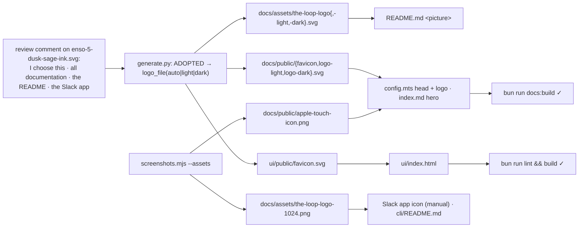

# A logo for the-loop — the Ensō, chosen and adopted, round 4 (issue-398) — reviewer briefing

## TL;DR

You chose colourway **5 — dusk · sage · ink** and asked for it everywhere. Round 4
adopts it: the root README opens with it (a theme-aware `<picture>`), the docs site
carries it as nav logo, hero image and favicon, the CLI's PyPI page opens with a raster
of it, the dashboard has it as favicon, and the Slack guide has the one step only you
can do — uploading `docs/assets/the-loop-logo-1024.png` as the app icon, since Slack's
manifest format carries no icon. Every adopted file is written by the same generator as
the options and pinned by its `--check`; the site and the dashboard both build with them.

## Where to focus (in this order)

1. **The README as GitHub renders it** — light and dark theme; the `<picture>` at the
   top of `README.md`.
2. **The site** — `docs/.vitepress/config.mts` (`head`, `themeConfig.logo`) and
   `docs/index.md` (`hero.image`); the captures `design/screenshots/site-home-light.png`
   and `-dark.png`. Toggle the theme: the logo follows the site, not the OS.
3. **The Slack icon** — `docs/assets/the-loop-logo-1024.png` at size, and the upload
   step in `docs/guide/slack.md` § *1. Create the Slack app*. Yours to upload.
4. **The generator's adoption layer** — `generate.py` `ADOPTED`, `logo_file(mode)`,
   `ADOPTED_FILES`; `screenshots.mjs --assets` for the rasters. Skim.
5. **The record** — `requirements.md` R5 and § Review comments; `design.md` § Adoption
   and the inventory (colourway 5 approved); the two capability docs. Skim.

## What changed (map)

## Key decisions & why

- **Light/dark files where the surface switches themes, the self-switching SVG where the
  OS decides.** GitHub and VitePress each let a reader choose a theme independently of
  the OS; a media-rule SVG there would disagree with the page.
- **Generated, pinned, one source.** The adopted files are outputs of the same script
  as the options; `--check` refuses a copy that drifted.
- **A raster only where SVG cannot go** — PyPI's renderer and Slack's icon upload.
- **The Slack icon is a manual step, documented,** because the manifest format has no
  icon field; nothing in code can do it.
- **Out of the adoption:** the plugin manifests (no icon field) and the Slack
  manifest's background colour (pinned and mirrored; cosmetic).

## Evidence

`docs/specs/issue-398/evidence/automated-tests.md`: the checker green on eighteen files,
a clean regeneration, ruff clean, markdownlint over every Markdown file (1307 files,
0 errors), the docs site and the dashboard built with the mark, the T8 probe;
`design/screenshots/` — the site's home page in both appearances plus the round-3
captures. Security review re-run on the adoption diff: `evidence/security-review.md`.

## Open questions for the reviewer

None for the artifacts. **Two acts are yours:** merge, and upload the Slack app icon
(`docs/assets/the-loop-logo-1024.png`) under *Basic Information → Display Information*.
