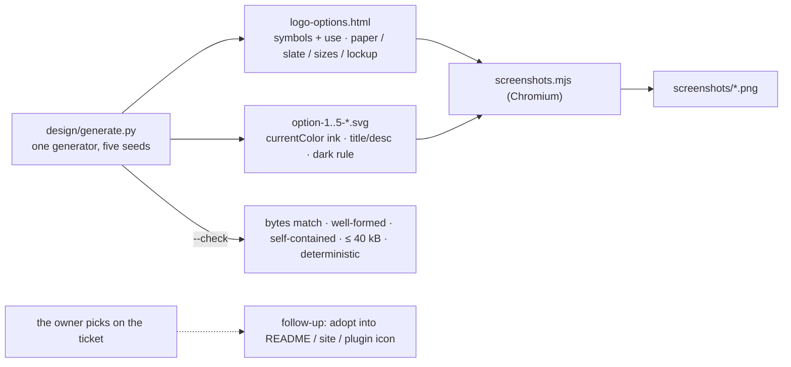

# A logo for the-loop — five hand-drawn SVG options (issue-398) — reviewer briefing

## TL;DR

Five logo marks, each a different concept of *inner, outer and many loops working
together*, drawn by hand — by a generator: a seeded wobble along every loop and a pen
whose width swells and tapers, in one muted palette. Each is a standalone SVG with no
external reference; a self-contained gallery shows them on paper, on slate, at four
sizes down to 16 px and beside the name. **Nothing is adopted here — the ask is to
look at the rendering and pick one on the ticket.** Feedback becomes a parameter edit
and a re-run, never a redraw.

## Where to focus (in this order)

1. **The rendering, not the markup** — open
   `docs/specs/issue-398/design/logo-options.html`, or the stills under
   `design/screenshots/` (`gallery-light.png`, `gallery-dark.png`, one pair per option).
   The question is which *concept* you want; the numbers can all move.
2. **Are the five really five?** — the concept table in `design.md` § Overview: nested
   (Gimbal), continuous (One line), composed (Coil), overlapping (Rings), meshing
   (Planetary). Two share a formula (an epitrochoid) with opposite parameters; check you
   agree they are different marks, not variations.
3. **How they are made** — `design/generate.py`: `Wobble`, `pen`, `outline`, `spline`
   are the hand; the five `option_*()` functions are the marks; `--check` is the gate
   (bytes match a fresh render, well-formed, titled, no script/href/image, ≤ 40 kB,
   deterministic). Skim.
4. **The screenshot script** — `design/screenshots.mjs`: renders each SVG as an
   `` under a light scheme on paper and a dark scheme on slate, proving the file's
   own `prefers-color-scheme` rule. Skim.

## What changed (map)

## Key decisions & why

- **Generated, not drawn.** "More wobble", "swap the accent", "tighter coil" are numbers
  in one file; the SVGs and the gallery are its outputs, and `--check` fails when the
  files on disk are not what the script makes — so iteration is edits, not copies.
- **Filled ribbons, baked wobble.** A stroke cannot vary its width and an SVG filter
  renders differently per engine; a filled outline with the wobble in its geometry looks
  the same in a browser, a README, a favicon and an image tool. Cost: 25–40 kB per file.
- **`currentColor` for the ink.** One `color` on the root, one media rule for dark — the
  most portable way to be legible on both grounds, and what lets the gallery's `<use>`
  instances inherit each board's ink.
- **Five concepts, one palette.** So the choice is between ideas, and any of them can be
  adopted without re-choosing colours.
- **Tier 2, resting at `loop:needs-review`.** No code, no config, no sensitive path; the
  one human act is an aesthetic choice no review round can substitute for, so the ticket
  waits on it rather than closing.

## Evidence

`docs/specs/issue-398/evidence/automated-tests.md`: the checker green (red first — six
`missing` before the first render), a regeneration leaving the tree clean, ruff and
markdownlint clean, the contrast table; `design/screenshots/` — twelve captures.

Spec chain: `docs/specs/issue-398/` (`requirements.md` → `design.md` → `testing-plan.md`
→ `tasks.md`), tier 2. No capability doc affected and no user-facing doc changed, each
with its reason in `evidence/documentation.md`.

## Open questions for the reviewer

**Which option?** — and anything to change about it. Answer on the ticket
(issue-398); the PR can merge as the record of the options either way.
