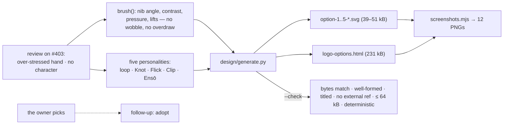

# A logo for the-loop — five brush-drawn SVG options, round 2 (issue-398) — reviewer briefing

## TL;DR

Round 1 drew five loop *structures* with a wobbling, over-drawn hand; the owner's review
said *over-stressed on the hand-drawn part, no character*. Round 2 keeps the hand — a
flat brush held at an angle, pressed and lifted, never shaky — and gives each mark a
**personality**: **loop** (the name written in one line, itself the loops — wit),
**Knot** (a trefoil drawn as rope — strength), **Flick** (a loop-de-loop that ends in an
arrow — momentum), **Clip** (a paperclip, one wire, inner loop in outer — utility with a
wink), **Ensō** (three brush circles left open — calm). Same generator, same palette,
same gallery and evidence pipeline; round 1 is in git history. **The ask is unchanged:
look at the rendering and pick one, or say what to change.**

## Where to focus (in this order)

1. **The rendering** — `docs/specs/issue-398/design/logo-options.html`, or the stills
   under `design/screenshots/`. Does any of the five have the character round 1 lacked?
   Which?
2. **The brush, not the wobble** — `design/generate.py` `brush()`/`enso_brush()`: width
   is `base × (thick across the nib, thin along it) × pressure × lift`. Round 1's noise
   and sketch passes are gone; one option keeps a 0.6-unit hair of it.
3. **The weave** — `woven()`: crossings found numerically, alternated over/under, the
   under strand carved by a `<mask>` (an internal `url(#…)`, which the checker admits).
   Skim.
4. **What the review changed in the spec** — `requirements.md` § Review comments (the
   character clause on R1, brush-not-wobble on R2.1, 64 kB budget) and `design.md` §
   Review comments. Skim.

## What changed (map)

## Key decisions & why

- **Confidence over wobble.** A tremor reads as unsure; a brush's thick/thin reads as
  made. The hand moved from noise on the path into the pen: nib angle, pressure, lifts.
- **Personality over taxonomy.** Round 1's five differed in how loops related — a
  classification, not a set of marks. Round 2's five differ in what they *are*: a word,
  a rope, a whip, a wire, a breath. Each still carries inner, outer and many loops.
- **Holes fixed at the source.** Filled outlines punched holes at tight curls
  (`evenodd` on a self-crossing outline; offsets past the centre of curvature). Now:
  `nonzero`, and the half-width clamped to 0.85 × the local radius of curvature.
- **Weave by mask.** Painting gaps in the page colour breaks on any other ground.
- **Budget 40 → 64 kB**, because a brush stroke needs ~2 px sampling; recorded in
  `requirements.md`.

## Evidence

`docs/specs/issue-398/evidence/automated-tests.md` (round-2 run): checker green, clean
regeneration, ruff and markdownlint clean, contrast table; `design/screenshots/` —
twelve round-2 captures. Security review re-run on the round-2 diff:
`evidence/security-review.md`.

## Open questions for the reviewer

**Which option — or what would give one of them the character you want?** Answer on
the ticket (#398) or here; the PR can merge as the record of the options either way.
