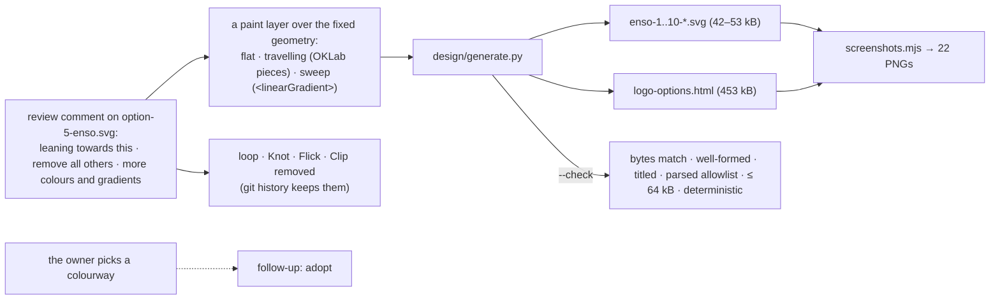

# A logo for the-loop — the Ensō in colourways, round 3 (issue-398) — reviewer briefing

## TL;DR

You chose the **Ensō** — three brush circles, each left open where the hand lifted — and
asked for colour and gradient options, with the other marks removed. Round 3 is that:
the same mark, byte for byte in its geometry, in **ten colourways** — seven flat
palettes (the original ink · dusk · clay; all ink; ink with a clay centre; warm; cool;
earth; mauve), two gradients that **travel along each stroke** (dusk → clay; ink drying
into an accent) and one **sweep** across the mark. Same generator, gallery and evidence
pipeline; rounds 1 and 2 are in git history. **The ask: pick a colourway, or name a
pairing you would rather see.**

## Where to focus (in this order)

1. **The rendering** — `docs/specs/issue-398/design/logo-options.html`, or the stills
   under `design/screenshots/`. Which paint? The ink-free ones (6, 7, 8, 10) are the ones
   to weigh against a dark ground; the ink ones swap their ink for the slate ink.
2. **How a gradient travels along a brush stroke** — `design/generate.py`
   `travelling_ring`: SVG has no along-path gradient, so the stroke is cut into twenty
   pieces on its own Bézier segments (`segment`, `piece`), each a step further in OKLab
   (`mix`). Look at colourway 8 at 220 px: no seams.
3. **What the pick changed in the spec** — `requirements.md` § Review comments (R1.1
   superseded, R1.4 added) and `design.md` § Review comments. Skim.
4. **The checker** — widened by exactly `linearGradient`, `stop`, `class` and the
   gradient attributes; a `url(` must be a fragment; the probe re-run (T8). Skim.

## What changed (map)

## Key decisions & why

- **Pieces for a travelling gradient.** No SVG gradient follows a path; twenty pieces
  per stroke, cut on the stroke's own curves so the seams are invisible, each one shade
  further along. Cost: 48–53 kB instead of 42 kB for those two files.
- **OKLab blends.** An sRGB blend from dusk to clay goes grey in the middle; OKLab keeps
  the ramp even and the mid-tones alive.
- **A real `<linearGradient>` for the sweep.** It is what the element is for, and it is
  portable; the checker admits it and nothing more.
- **Ink stays `currentColor`; a ramp that touches ink carries dark fills.** So every
  colourway still reads on paper and on slate.
- **Geometry frozen.** Every colourway is the round-2 Ensō; the original colours
  reproduce its file exactly, so the pick compares paint and nothing else.

## Evidence

`docs/specs/issue-398/evidence/automated-tests.md` (round-3 run): the checker green, a
clean regeneration, ruff and markdownlint clean, the contrast table, the T8 probe;
`design/screenshots/` — twenty-two round-3 captures. Security review re-run on the
round-3 diff: `evidence/security-review.md`.

## Open questions for the reviewer

**Which colourway — or which pairing instead?** Answer on the ticket (#398) or here;
the PR can merge as the record either way.
