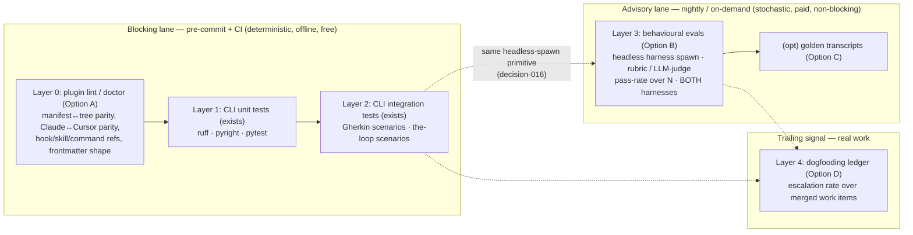

# Brainstorm: a testing strategy for the-loop (and for Claude/Cursor plugins in general)

> Root artifact for issue #40. The issue is explicitly a *strategy* question — "how do we
> test the-loop, and how does one test a Claude/Cursor plugin at all?" — so the loop
> starts here. Iterate with feedback; once locked, derive `requirements.md`.

## Problem / opportunity

the-loop ships as **two very different kinds of software glued into one repo**, and only
one half is actually tested:

1. **A conventional Python CLI** (`cli/the_loop/**`) — the webhook receiver, dispatcher,
   session registry, harness adapters, tmux runner. This half is testable the normal way
   and *is* tested: `cli/tests/` has unit tests (`test_cli.py`, `test_routing.py`,
   `test_tmux_runner.py`) and Gherkin-docstring integration tests
   (`test_*_integration.py`) discovered by `the-loop scenarios` (issue-11, decision-014).
   pytest + ruff + pyright run in pre-commit and CI at parity (decision-006).

2. **A Claude/Cursor *plugin* surface** — `skills/the-loop/SKILL.md` + `reference/*.md`,
   `commands/*.md`, `.the-loop/templates/*.md`, `hooks/hooks.json`, `rules/the-loop.mdc`,
   `.the-loop/config.schema.json`, and the two plugin manifests
   (`.claude-plugin/`, `.cursor-plugin/`). This is the *actual product* — the loop
   workflow itself — and it has **no behavioural tests at all**. Its only automated
   coverage today is: `markdownlint` (style, not meaning), a JSON-parse smoke check in CI
   (`ci.yml` "Validate JSON artifacts parse"), and `scripts/validate_config.py` (config
   *values* against the schema — not the manifest↔filesystem wiring). Nothing checks that
   a command references a skill that exists, that `hooks.json` points at a real script,
   that the Claude and Cursor manifests stay in parity, or — the hard part — that the
   skill *actually makes an agent behave the way the loop prescribes*.

The gap matters because half of the-loop's correctness is **LLM-mediated**: the skill and
commands are prompts, and "does this prompt reliably produce the right agent behaviour?"
is not answerable by pytest. Meanwhile the-loop's *own* thesis is that correctness comes
from **tests + iterative review** (`reviews.selfReviewCount`/`criticReviewCount`,
`reference/reviewing.md`) — yet it has never written down how that thesis applies to the
plugin surface it sells. Issue #40 asks us to close that: a **layered testing strategy**
that (a) covers the-loop's own untested plugin surface and (b) generalises into guidance
the-loop can *teach* — "here is how you test a Claude/Cursor plugin" — since testing a
plugin is itself a product-development-lifecycle problem the loop should have an opinion
on.

## Context & constraints

- **Two harnesses, one behaviour (R4 of issue-15).** Any behavioural test of the plugin
  must be runnable against **both** `claude` and `cursor-agent`, through the existing
  `HarnessAdapter` seam. A strategy that only proves the Claude path is half a strategy.
- **We already subprocess-drive the harness CLIs headlessly.** decision-016 established
  that the-loop invokes `claude -p <prompt> --output-format json` / `cursor-agent -p …`
  as child processes and parses their JSON. That is *exactly* the primitive an eval
  harness needs — a behavioural test of a skill is "spawn the harness headless with a
  scenario prompt, grade the result." The plumbing to run the plugin under test already
  exists; issue-40 is about what to *assert*.
- **Zero-runtime-dependency guarantee (decision-005/016).** The core CLI is stdlib-only.
  A static plugin linter must stay in that spirit (stdlib, or the already-optional
  `pyyaml` used by `validate_config.py`). A behavioural eval suite inherently depends on
  the harness CLIs + network + API credits — so it *cannot* live in the same
  always-on, offline, blocking lane as unit tests; that separation is a hard constraint,
  not a preference.
- **CI parity is non-negotiable (decision-006, learning about tooling drift).** Whatever
  static checks we add run identically in pre-commit and CI (`local`/`system` hooks via
  `uv run`, per `.pre-commit-config.yaml`). Non-deterministic/paid evals, by contrast,
  *break* the "same thing every time" contract of a required check and must be gated
  differently (nightly, on-demand, or non-blocking) — see the core tension below.
- **Determinism gradient is the whole design problem.** Structural facts about the plugin
  (does file X exist, does manifest Y list skill Z, is the frontmatter valid) are 100%
  deterministic and cheap. Agent *behaviour* is stochastic, slow, and costs money. A
  single "test suite" that mixes the two is either flaky-and-blocking or
  thorough-but-never-run. The strategy must sort every check onto this gradient.
- **the-loop dogfoods itself (learning-005, roadmap "Meta").** Every self-hosted work
  item merged through this repo is already a live, end-to-end exercise of the plugin.
  That is real signal the strategy should *capture and count*, not leave as anecdote.
- **Prior art to reuse, not reinvent.** `the-loop scenarios` already enumerates
  integration coverage as a queryable table; `validate_config.py` already walks
  `.the-loop/` against a JSON Schema. The strategy should extend these seams rather than
  grow a parallel mechanism.

## The core tension: deterministic gates vs. stochastic evals

Every option below is a resolution of one tension — the two halves of the-loop want
opposite things from "a test":

- The **CLI + plugin structure** want tests that are **deterministic, fast, offline, and
  blocking** — a red check *must* stop the merge, and it must mean the same thing every
  run. This is the `pre-commit`/CI lane the-loop already lives in.
- The **LLM-mediated behaviour** (skills/commands) can only be tested by **running an
  agent**, which is **stochastic, slow, paid, and network-bound**. Force this into the
  blocking lane and CI becomes flaky and expensive; it will be disabled within a week.
  Leave it out entirely and the *actual product* is untested.

The resolution is not to pick one — it is to **stratify** the tests by determinism and
give each stratum its own trigger, and to keep the two lanes physically separate so the
stochastic one can never redden a required check.

## Ideas & options

The options aren't mutually exclusive — several compose into the leaning. Each names
*what* is tested and *where on the determinism gradient* it sits.

### Option A — Static plugin-contract validation ("`the-loop doctor`" / plugin lint) ✅ foundational

Extend the existing `validate_config.py` idea into a deterministic **plugin linter** that
proves the plugin's *structure* is internally consistent — the manifest↔filesystem wiring
that JSON-parse checks miss today. Candidate assertions:

- **Manifest ↔ tree parity:** every path a manifest declares
  (`.claude-plugin/plugin.json`, `.cursor-plugin/plugin.json`, `marketplace.json`) points
  at a file that exists; every skill/command/hook on disk is actually declared.
- **Claude ↔ Cursor parity:** the two manifests expose the *same* skills/commands (the
  repo's whole premise is "one set of skills, two manifests" — a drift is a bug). Same for
  `hooks/hooks.json` vs. the Cursor rule equivalent.
- **Cross-references resolve:** `hooks.json` entries point at scripts that exist and are
  executable; a `commands/*.md` that says "use the the-loop skill" references a real
  skill; `reference/*.md` links in `SKILL.md` resolve.
- **Frontmatter/shape contracts:** every `.the-loop/templates/*.md` and every artifact
  under `docs/specs/*/` carries the required YAML frontmatter (`type`, `phase`,
  `workItem`, `status`) with values in-range — the same discipline `validate_config.py`
  applies to `config.yaml`, extended to the artifact family.
- **`manifest.yaml` invariant:** `.the-loop/manifest.yaml` (decision-002) still matches
  the real tree of knowledge files.

*Pros:* fully deterministic, offline, fast — belongs in pre-commit/CI as a **blocking**
check with zero new runtime deps; catches the highest-frequency real bugs (a renamed
skill, a manifest that forgot a command, Claude/Cursor drift); directly generalises —
"lint your plugin's contract" is advice any Claude/Cursor plugin can adopt, and the-loop
can ship the linter as a capability. *Cons:* proves the plugin is *well-formed*, not that
it *works* — it can't tell you the skill gives good guidance, only that the wiring is
sound. Necessary, not sufficient.

### Option B — Behavioural evals of the LLM-mediated surface (scenario prompts + rubric grading) ✅ the frontier

The hard half. Treat each skill/command as a unit under test: **spawn the harness headless
with a representative scenario prompt** (reusing the decision-016 `claude -p …` /
`cursor-agent -p …` primitive the CLI already owns), then **grade the transcript against a
rubric**. Grading options, weakest→strongest:

- **Deterministic post-conditions** where they exist: after "/create-ticket for X", did a
  ticket-shaped artifact with valid frontmatter get produced? (checkable without an LLM).
- **LLM-as-judge / rubric grading** for the genuinely semantic bits: "given this
  requirements.md, does the design.md the skill produced name a testing strategy and link
  requirements?" — a second model scores against an explicit rubric.
- **Assertion-in-prompt**: scenarios whose success criterion is a structured claim the run
  must emit (e.g. a final JSON verdict), so grading is a parse, not a judgement.

Because this is stochastic, it runs as a **separate, non-blocking suite** — nightly and
on-demand (`workflow_dispatch`), against both harnesses — and is scored by **pass-rate
over N runs**, not a single green/red. Track the rate over time (a skill edit that drops
pass-rate is a regression) rather than gating merges on a coin-flip.

*Pros:* the only option that tests the *actual product* — whether the prompts work;
reuses infrastructure the-loop already has (headless spawn, the `scenarios` vocabulary,
two-harness adapters); generalises into the flagship answer to "how do you test a
Claude/Cursor plugin?" *Cons:* non-deterministic, slow, costs API credits, needs a curated
scenario corpus + rubrics (real authoring effort); grading is itself fallible
(LLM-as-judge variance). Must never be a required/blocking check. Biggest scope; likely
staged after A.

### Option C — Golden-transcript / snapshot testing

Record a harness transcript for a fixed scenario once (`--output-format stream-json`),
check it in as a golden file, and in CI assert the *structure* of a fresh run matches —
tool-call sequence, artifacts touched, phase labels emitted — while tolerating prose
variation. A middle point between A's structure-only and B's full semantic grade.

*Pros:* cheaper/more deterministic than full rubric grading if snapshots assert on
*structure* not *wording*; a diff is human-reviewable in the PR (fits the-loop's
review-centric ethos). *Cons:* transcripts are brittle — model updates and legitimate
prose drift churn the goldens; risks becoming change-detectors that get blanket-`--update`d
(the classic snapshot-rot failure). Best reserved for a *few* high-value flows, not the
whole surface. Parked as a complement to B, not a replacement.

### Option D — Dogfooding as the acceptance test, made measurable

the-loop develops itself (issues #1, #11, #12, #15, #21, #32 …): every merged
self-hosted work item is a live end-to-end run of the whole loop. Option D is to **stop
treating that as anecdote and count it** — a lightweight ledger of "work items the-loop
drove through which phases, and where a human had to intervene" becomes the real-world
acceptance signal (escalation rate ≈ inverse of how well the plugin works). Cheap: it's
bookkeeping over `docs/specs/*/execution-log.md`, which already exists.

*Pros:* zero synthetic-scenario authoring — uses real work; measures the thing that
actually matters (does the loop deliver with minimal intervention?); reinforces
learning-005. *Cons:* slow feedback (one data point per work item), confounded (a bad run
could be the task, not the plugin), and can't gate a PR. A *trailing* indicator that
complements A/B's *leading* ones, not a substitute.

### Rejected / parked alternatives

- **"Just markdownlint + JSON-parse is enough."** ✗ — that's where we are, and it's the
  gap the issue names: style + syntax, never wiring or behaviour.
- **Full deterministic unit tests of the LLM behaviour.** ✗ impossible by construction —
  agent output is stochastic; pretending otherwise yields flaky required checks. This is
  *why* B is a separate non-blocking lane.
- **Third-party eval frameworks (promptfoo, deepeval, LangSmith, …) as a hard
  dependency.** ○ parked — their *concepts* (scenario matrix, rubric/LLM-judge, pass-rate
  tracking) directly inform Option B, but adopting one as a runtime dep collides with the
  zero-dependency guarantee (decision-005) and the "we already subprocess-drive the
  harness" primitive. Revisit only if a thin, optional adapter earns its keep; the
  built-in `scenarios` seam is the default substrate.
- **Record-live-API integration tests (VCR/cassettes) against the model API.** ✗ for the
  behavioural layer — cassettes freeze one stochastic sample as if it were the contract;
  they test our parsing of a *recorded* response (which Option A/CLI tests already cover),
  not the model's behaviour.
- **A bespoke parallel test runner.** ✗ — extend `the-loop scenarios` +
  `validate_config.py` (issue-11, decision-002/014), don't grow a second mechanism.

## Sketches & notes

The strategy as a determinism gradient — cheap/deterministic/blocking on the left,
expensive/stochastic/advisory on the right:

The load-bearing idea: **Layers 0–2 gate merges; Layer 3 tracks a trend; Layer 4 tells you
if the product actually works in the wild.** Only Layer 0 is net-new *and* cheap — it is
the obvious first increment. Layer 3 is the flagship generalisation but the largest lift.

## Open questions

Raise the ones a human must answer as ticket comments (paper trail) and link them here.

1. **Scope of issue #40 (product):** is this issue the whole strategy (all four layers,
   staged over multiple work items) or specifically the **plugin-testing** gap — i.e.
   land Option A now (deterministic plugin lint) and spin Option B's eval harness into its
   own follow-up issue? The title's "and in general claude/cursor plugins" leans toward
   *strategy doc + Layer 0 first, evals as a tracked follow-up*, but the owner should set
   the bar.
2. **Deliverable shape:** does locking this brainstorm produce (a) a **strategy/decision
   doc** (`reference/testing.md` gains a "testing the plugin surface" section + a new
   `decision-0NN`), (b) **working code** (the Option-A linter wired into pre-commit/CI),
   or (c) both in one work item? (Leaning: both — the doc *is* the strategy, the linter is
   the first deterministic increment that proves it.)
3. **Eval lane cost & credentials (Option B):** who pays for and holds the API credits the
   nightly eval suite spends, and where does it run (GitHub Actions with a stored key vs.
   local-only `workflow_dispatch`)? This gates whether Layer 3 is v1 or deferred.
4. **Rubric authorship & judge model (Option B):** what grades a skill's output — a fixed
   rubric scored by `claude`/`cursor-agent` as judge, deterministic post-conditions, or a
   mix? And is a self-graded eval (Claude grading Claude) credible, or does it need a
   cross-harness judge?
5. **Pass/fail semantics for stochastic tests:** what pass-rate over how many runs counts
   as "green" for Layer 3, and how is a regression defined (absolute threshold vs. delta
   from the last recorded rate)? This is the crux of making evals actionable without being
   flaky.
6. **Two-harness matrix reality:** do behavioural evals run against both `claude` and
   `cursor-agent` from day one (doubling cost/complexity) or Claude-first with Cursor as a
   fast-follow, given the R4 parity obligation?
7. **Where the general guidance lives:** is "how to test a Claude/Cursor plugin" shipped
   to *users* (a new `reference/*.md` in the published skill / a capability doc) or kept as
   the-loop-internal (`docs/`)? The issue's "in general" framing suggests user-facing, but
   that's a decision-010-style ship/don't-ship call.

## Leaning / working hypothesis

**Stratify by determinism; land the deterministic floor first, make the stochastic ceiling
a tracked follow-up.** Concretely, the direction `requirements.md` will likely assert:

- **Adopt the four-layer model** (0: plugin lint · 1–2: CLI tests, already shipped · 3:
  behavioural evals · 4: dogfooding ledger) as the-loop's written testing strategy, in
  `reference/testing.md` + a new decision record — so the-loop *has an opinion* on testing
  the plugin surface, and that opinion doubles as the general answer for any Claude/Cursor
  plugin (question 7 leaning: user-facing).
- **Ship Option A now** — a deterministic **plugin-contract linter** (extending
  `validate_config.py`, stdlib/pyyaml only), wired into pre-commit + CI as a blocking
  check: manifest↔tree parity, Claude↔Cursor parity, hook/skill/command cross-reference
  resolution, artifact/template frontmatter shape. This is the highest-value, lowest-risk
  increment and keeps the zero-dep + CI-parity guarantees intact.
- **Design Option B (behavioural evals) but stage it** behind the deterministic floor,
  built on the decision-016 headless-spawn primitive and the `scenarios` vocabulary,
  scored by pass-rate across both harnesses in a **separate non-blocking lane**
  (nightly/on-demand). Whether Layer 3 lands in *this* work item or its own follow-up is
  question 1/3 for the owner.
- **Formalise Option D cheaply** — a dogfooding ledger over `execution-log.md` as the
  trailing acceptance signal. Option C (golden transcripts) stays parked as a
  complement to B for a *few* high-value flows, not the whole surface.

## Hand-off → requirements

Carries forward once locked: the **four-layer / determinism-gradient model** as the-loop's
testing strategy; the **blocking-vs-advisory lane separation** as a hard architectural
constraint; **Option A (plugin-contract lint)** as the concrete v1 increment with its
assertion list (manifest↔tree parity, Claude↔Cursor parity, cross-ref resolution,
frontmatter shape) and its zero-dep/CI-parity constraints; the **two-harness (R4)
obligation** for any behavioural test; the decision-016 **headless-spawn primitive** and
the `scenarios` seam as the substrate for Option B; and the **user-facing "how to test a
Claude/Cursor plugin" guidance** as a deliverable. Rejected alternatives (markdownlint-only
as sufficient, deterministic unit tests of LLM behaviour, third-party eval frameworks or
API cassettes as hard deps, a parallel test runner) stay here as the record of what was
considered. The eval-lane cost/credentials, rubric/judge design, and stochastic pass/fail
semantics (open questions 3–5) are the load-bearing decisions `design.md` must resolve if
Layer 3 is in scope.
