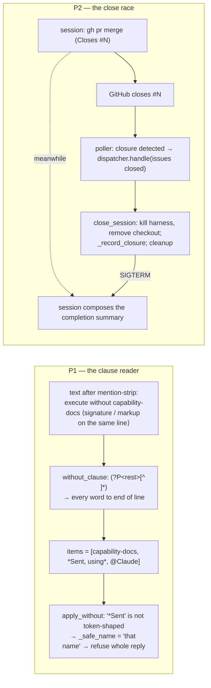

<!-- Authored per the the-loop:writing skill. -->

# Bugfix spec: the typed selection grammar reads past the phase list (P1); the close path races the session's endgame (P2)

> Phase 1 of 4 (bugfix → design → testing plan → tasks). Source: the 2026-09-20 **run 3**
> end-to-end Slack test
> ([`docs/reports/e2e-slack-test-2026-09-20-run-3.md`](../../reports/e2e-slack-test-2026-09-20-run-3.md),
> filed as [#404](https://github.com/MadaraUchiha-314/the-loop/issues/404)), findings
> **P1** and **P2**, filed together as
> [issue-405](https://github.com/MadaraUchiha-314/the-loop/issues/405).

## Summary

Two independent bugs, both on paths the previous two runs had just fixed *around*:

1. **P1 — `execute without <phase>` refuses every valid argument.** The only phase-shaping
   gesture a connector or phone-first operator has is 0 for 4 across runs 2–3, and since
   the N1 fix it *quotes the refused name back as skippable* in the same message. The
   grammar's clause reader takes **everything to the end of the line** after `without` as
   phase names; the live message does not end where the operator's list ends.
2. **P2 — the close path kills the session while it is composing its completion
   summary.** A merge that carries `Closes #N` closes the ticket at once; the close-poller
   fires; `close_session` ends the harness (SIGTERM, pane status 143) and removes the
   checkout while the agent is writing the one message a room most wants — what shipped,
   the evidence, the accepted gaps. Run 2 won that race by luck; run 3 lost it. The same
   closure logged `session.autoclosed merged: false` seconds after the delivering PR
   merged.

## Steps to reproduce

P1 — the typed grammar:

1. Declare a private room for a work item, `listen: mentions`; start it so the daemon
   posts the phase-selection checklist.
2. From the Slack MCP connector (or any client that signs its messages), send
   `<@BOT_ID> execute without capability-docs` — a name the checklist offers.
3. Send `<@BOT_ID> execute without 14` — the numeric form the refusal itself suggests.

P2 — the close race:

1. Drive a work item to `human-approval` with `routing.mergeOnApproval: true` (the
   default) and a PR whose body says `Closes #N`.
2. Approve on the room's gate message. The PR merges; GitHub closes issue `#N`.
3. Watch the session's pane and the room during the next poll cycle.

## Expected vs actual

| | Expected | Actual |
|---|---|---|
| P1 step 2 | The checklist is frozen with `capability-docs` unticked; ✅ | ⚠️, mirrored refusal *"that name is not a phase this checklist offers … 14. `capability-docs` …"*; `channel.dropped reason=unskippable-phase` |
| P1 step 3 | Same as above, by number | Refused with the **identical** text |
| P2 step 3 | The session posts its completion summary (ticket + room), claims `graph complete`, and only then is ended and retained | `session.autoclosed merged:false`, `session.harness_terminated`, checkout removed, the pane dead mid-sentence; the summary never posts |

## Root cause (confirmed by reading the live path; P1 additionally instrumented)

- **P1.** `execute`, `start`, `approved` and `help` are unaffected because every other
  reader matches a whole-token keyword anywhere in the text or reads the **first token**
  only (`parse_verb`, `wants_public_help`). `without_clause` alone consumes the rest of
  the line, and `apply_without` refuses the reply on the first item that is not an offered
  phase. A word that is not token-shaped (`_TOKEN_RE`: letters, digits, `.`, `_`, `-`) is
  named *"that name"* — which is exactly what the operator saw, for `capability-docs` and
  `14` alike; a valid item would have been echoed in backticks. So the item list carried
  more than the phase, and the extra was not a word: a connector signature
  (`*Sent using* @Claude`, issue-397 O5) or markup on the command's line. The run-2
  isolation repro put the signature on a **second** line, where `[^\n]*` never reaches
  it, which is why every component passed there. Two more misses in the same reader
  compound it: Slack markup around a name (`*5*`, `_design_`) and invisible format
  characters (zero-width space, U+200B) also make a valid name non-token-shaped, and both
  `apply_without` refusals drop as `unskippable-phase` although only one of them is.
- **P2.** `Dispatcher.handle`'s close branch runs `close_session` (registry close,
  `_close_tmux` → `_terminate_harness` under the default `killHarnessOnClose`, workspace
  removal) → `_record_closure` → `session.autoclosed` → `_cleanup_after_close`,
  synchronously, whatever the session is doing. Before O9 the session merged and posted
  its summary in one breath and usually beat the poll cycle; the merge's `Closes #N` now
  closes the ticket the moment the merge lands. The `merged` field of `session.autoclosed`
  is `reason == "pr-merged"`, which an *issue* closure can never satisfy, even when the
  daemon has already recorded the delivering pull request as `merged` in the work item's
  own `work-item-state.json` (`on_pr_state`, issue-368).

## Requirements

### Requirement 1 — the typed clause reads the phases and nothing else (P1)

**User story:** As an operator on a connector or a phone, I want `execute without
<phase>` to freeze the selection I typed, and a refusal to tell me which word it could
not read, so that the one typed gesture the checklist offers actually works.

#### Acceptance criteria (EARS)

1. WHEN the text after `<execute keyword> without` carries a connector signature
   (`*Sent using* …`, with or without markup, on the same line or a later one) THEN the
   grammar SHALL ignore the signature and read the phases before it.
2. WHEN an item is wrapped in Slack markup (`*`, `_`, `~`, backticks, quotes, brackets or
   trailing punctuation) or carries invisible format characters (Unicode category `Cf`)
   THEN the grammar SHALL read the bare name or number inside it.
3. WHEN an item is not token-shaped after that cleaning THEN the reply SHALL be refused
   with a refusal that names the item's **position** after `without` and what it reads as
   (markup, a mention or prose), never echoing it (abuse case 4 and the existing
   hostile-name rule hold), and SHALL tell the operator to put only phase names or numbers
   on the `without` line.
4. WHEN a reply is refused THEN the drop reason SHALL say which family it is:
   `unknown-phase` (a name or number the checklist does not offer, or a non-token item),
   `unskippable-phase` (a protected phase), `empty-clause` (nothing named), or the existing
   `checklist-unreadable`. `unskippable-phase` SHALL no longer be recorded for a name the
   checklist does not offer.
5. WHEN the grammar runs THEN the exact text it was handed and the items it read SHALL be
   logged at `info`, and a refusal's `channel.dropped` record SHALL carry `read`: the
   items as read, token-shaped items verbatim and any other item as its length only — the
   instrumentation the report asked for, on the one observable the deployment has.
6. The fix SHALL include regression tests that fail before the fix and pass after: a
   same-line signature (`*Sent using* @Claude`, `<@U…>` mention form, plain), a
   second-line signature (unchanged behaviour), markup-wrapped names and numbers, a
   zero-width space, the position-naming refusal, and the distinct drop reasons.

### Requirement 2 — a session at its endgame finishes before the close path ends it (P2)

**User story:** As the person reading the room, I want the agent's completion summary to
land even when the merge closes the ticket first, so that the last message of a work item
is the agent's, not a `🎉 closed`.

#### Acceptance criteria (EARS)

1. WHEN a close event (`issue-closed` or `pr-merged`) matches a **live** session whose
   tmux pane is running AND the work item's graph pointer stands on a **terminal** node
   whose exit has not been recorded (the endgame: `finish-tasks` in progress) THEN the
   dispatcher SHALL **defer** the whole closure — registry close, harness termination,
   checkout removal, closure stamp, roster and room clear, cleanup — and record
   `session.closing` with the reason, the node and the grace.
2. WHEN a deferred closure's work item records its terminal node as exited (the
   session's `the-loop graph complete <id>` claim) OR `routing.tmux.finishGraceSeconds`
   (default `300`) has elapsed since the deferral THEN the closure SHALL run exactly as
   it does today, and `session.autoclosed` SHALL carry `waited_seconds` and
   `finished: true | false` (whether the claim was seen).
3. WHEN the pointer is anywhere else (a wontfix mid-work), the session is not live, the
   pane is dead, the graph cannot be read, or `finishGraceSeconds` is `0` THEN the closure
   SHALL run immediately, as before.
4. WHEN the work item is reopened during the grace THEN the pending closure SHALL be
   cancelled (`session.closing_cancelled`); WHEN a second close for the same work item
   arrives during the grace THEN it SHALL be a no-op. The poller SHALL not re-ask the
   provider about a work item whose closure is pending.
5. WHEN an issue closure is recorded THEN `session.autoclosed`'s `merged` SHALL be `true`
   when the closure is a merge OR the work item's state file records a merged pull
   request; the closure **stamp** (`state: closed | merged`) is unchanged.
6. The `finish-tasks` command and the skill SHALL state the order of the endgame — post
   the completion summary, claim `graph complete`, then close the ticket if it is still
   open — and that a ticket already closed by a merge's `Closes #N` is expected, with the
   daemon waiting `finishGraceSeconds` for exactly those two acts.
7. The fix SHALL include regression tests that fail before the fix and pass after: a
   closure at the terminal node is deferred and the harness is not ended; the claim ends
   the grace early; the deadline ends it; a pointer off the terminal node closes at once;
   a reopen cancels; `merged: true` on an issue closure whose PR merged.

## Security considerations

- **Actors & trust.** P1 reads a Slack member's text that the allow-list and the roster
  have already admitted; nothing new reaches the checklist record — a cleaned item is
  still validated against the rows the gate parses, and a non-token item is still refused
  without being echoed (the `<!channel>`, `@here` and 60-character cases stay pinned).
  Stripping the signature removes text; it never adds a phase the person did not type.
  The `read` field of the drop record carries token-shaped items only, others as a
  length — no broadcast, mention or prose reaches the event log through it.
- **P2 widens no permission.** A deferred closure holds a session **open** that GitHub
  has already declared finished, for a bounded time, on the machine that spawned it: the
  session keeps the access it already had, and the only actors are the daemon's own
  close path and the state file the session already writes. The deferral is decided
  from the-loop's own graph state, never from event text; a state file that cannot be
  read, or names no terminal node, answers *close now* (fail-closed toward today's
  behaviour). The grace is bounded by a config value the operator sets, `0` disables it.
- **The cleanup gate is unchanged.** `_cleanup_after_close` still requires a named,
  allowlisted closer; a deferred closure re-reads the same routed event at finish time.
- **No new attack surface.** One additive config key (`routing.tmux.finishGraceSeconds`,
  number ≥ 0), two additive fields on `GraphContext`, three additive event fields and
  three event types; no grant, scope, schema-shape, lock or state-file change.

## Out of scope

- Posting the completion summary from the **daemon** (the report's second option): the
  summary is the agent's voice, and the room rework (issue-393) put that voice in the
  session on purpose.
- Rewriting the PR body to strip `Closes #N` before the merge (the third option): it
  would take the ticket's closure away from GitHub's own linkage, which every other
  reader relies on.
- The `phase.started` stutter, the room-opened header and the gate digests pasting the
  document (run 3's "still reads wrong" 2–4): separate polish, not bugs.
- The hosted process log going to `/dev/null` (a deployment setting).

## Open questions

None.
