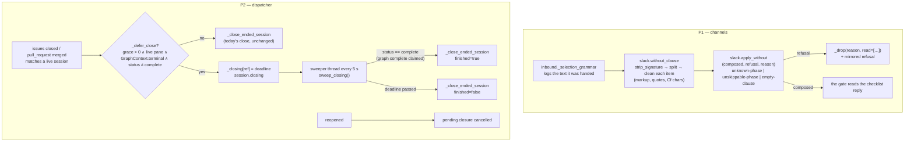

<!-- Authored per the the-loop:writing skill. -->

# Design: the clause reader stops at the phases; the close path waits for the endgame

> Phase 2 of 4. Derives from [`bugfix.md`](bugfix.md).

## Overview

**Two local changes, no new object, no new state file.** (1) The `without` clause reader
drops a connector signature and Slack markup before it splits, refuses a non-token word
by position, and hands the caller a reason; the caller logs what it read. (2) The
dispatcher's close branch asks one question it never asked — *is this session at its
endgame?* — and, when it is, parks the closure in memory with a deadline; a sweeper
finishes it on the session's completion claim or at the deadline. Everything the close
does today still happens, once, in the same order; only *when* moves.

## Architecture

### P1 — where each piece lives

- **`channels/verbs.py` — `strip_signature(text)`.** The signature is already a named
  thing here (`PUBLIC_HELP`'s docstring, issue-397 O5); this is its one regex:
  `[*_~]*sent using[*_~]*` followed by one word (`<@U…>`, `@Claude`, `Claude`), at the
  **end of the text**, preceded by any whitespace — so it matches on the command's line
  and on its own line alike, and nothing else. Case-insensitive.
- **`channels/slack.py` — `without_clause`.** Runs `strip_signature` before the regex;
  each split item is cleaned with `_clean_item`: Unicode `Cf` characters removed, then the
  wrapper set extended with `*`, `_`, `~`. The stop words stay. The rest-of-line rule
  stays: it is what lets `execute without 2, 5 — thanks` refuse loudly rather than freeze
  quietly (abuse case 4), and the position-naming refusal now says which word broke it.
- **`channels/slack.py` — `apply_without`** returns `(composed, refusal, reason)`. A
  non-token item's refusal reads *"that name (word N after `without`) reads as markup, a
  mention or prose, not a phase name, so nothing was recorded. Put only phase names or
  numbers on the `without` line."* + the offered list; the existing token-shaped refusals
  keep their wording. Reason constants: `UNKNOWN_PHASE`, `UNSKIPPABLE_PHASE`,
  `EMPTY_CLAUSE` (the first for an unknown name, an out-of-range number or a non-token
  item; the second for a protected phase; the third for a bare clause).
- **`channels/inbound.py` — `_selection_grammar`** passes the reason through and logs
  `repr(text)` and the items at `info`; the drop carries `read=` from `_read_summary`
  (token-shaped verbatim, else `<non-token: N chars>`). The mirrored refusal is unchanged.
- **`eventlog.py`** — the `channel.dropped` catalogue names the four selection reasons and
  `read`.

### P2 — where each piece lives

- **`webhook/dispatcher.py` — `TmuxConfig.finish_grace_seconds`** (`finishGraceSeconds`,
  default `300.0`, `0` disables). It sits with `killHarnessOnClose` /
  `harnessKillGraceSeconds` because it governs the same moment — the end of a work
  item's session — and the same object.
- **`graphlink.py` — `GraphContext.terminal: bool`, `.delivered_by_merge: bool`**
  (additive, default `False`), filled by `_context_from` from the compiled node and the
  state's `pullRequests[]`. `context()` is already the read-only, ownership-gated,
  never-raising read the inbound path uses (`_at_human_gate`); the dispatcher uses the
  same one.
- **`webhook/dispatcher.py` — the close branch.** The immediate path is factored into
  `_close_ended_session(session, routed, reason, *, waited=None, finished=None)`
  (close → stamp → `session.autoclosed` → cleanup, byte-for-byte today's order). Before
  it, `_defer_close(session, routed, reason)` answers whether to park:
  `grace > 0` ∧ `session.is_live` ∧ `session.tmux_target` ∧
  `tmux.has_live_session(target)` ∧ `ctx is not None` ∧ `ctx.terminal` ∧
  `ctx.status != "complete"`. Parking writes `_PendingClose(session, routed, reason,
  node, since, deadline)` into `self._closing` (keyed by ref, under `_closing_lock`),
  emits `session.closing`, and starts the sweeper if it is not running.
- **The sweeper.** One daemon thread, `sweep_closing()` every
  `close_sweep_interval_seconds` (class attribute, `5.0`; tests set it lower or call
  `sweep_closing(now=…)` directly). A sweep re-reads the context: `status == "complete"`
  → finish with `finished=True`; `now ≥ deadline` → finish with `finished=False`;
  otherwise keep. The thread exits when nothing is pending; `stop()` sets its event and
  joins it. A pending closure the daemon is stopped under is **not** finished: the item
  stays unstamped and the poller's closure reconciliation finds it again after a
  restart, where it is deferred again only if still at the endgame — bounded either way.
- **Finish.** `_close_ended_session` re-finds the record: a session still live takes the
  ordinary trio; one an operator already closed (`the-loop cleanup`, `sessions close`
  during the grace) is only stamped, once.
- **Reopen / duplicate.** `_record_reopen` pops the pending entry
  (`session.closing_cancelled`); a second close for a pending ref logs and returns.
  `is_closing(ref)` is public so the **poller** skips the ref in `_reconcile_closures`
  instead of re-asking the provider every cycle.
- **`merged`.** `_close_ended_session` computes
  `merged = reason == "pr-merged" or ctx.delivered_by_merge` for `session.autoclosed`
  (`ctx` read once for the branch; `None` → `False`). The stamp keeps `state: closed`
  for an issue — an issue is not merged.
- **Schema copies.** `.the-loop/cli-config.schema.json` and
  `cli/the_loop/schemas/cli-config.schema.json` gain `finishGraceSeconds` identically
  (the parity test pins them).
- **The session's side.** `commands/finish-tasks.md` orders the endgame — summary, claim,
  ticket close — and `SKILL.md`'s merge-on-approval bullet says the merge's `Closes #N`
  may close the ticket first and that the daemon waits `finishGraceSeconds` for the
  summary and the claim.

## Components & interfaces

| Component | File | Change |
|---|---|---|
| `strip_signature(text)` | `cli/the_loop/channels/verbs.py` | **new.** Exported; used by `without_clause`. |
| `without_clause`, `_clean_item` | `cli/the_loop/channels/slack.py` | signature strip; `Cf` removal; `*_~` in the wrapper set. |
| `apply_without` | `cli/the_loop/channels/slack.py` | returns a 3-tuple; position-naming refusal; reason constants exported. |
| `_selection_grammar`, `_read_summary` | `cli/the_loop/channels/inbound.py` | reason from `apply_without`; `info` log; `read=` on the drop. |
| `TmuxConfig.finish_grace_seconds` | `cli/the_loop/webhook/dispatcher.py` | **new** field + `from_mapping`. |
| `GraphContext.terminal`, `.delivered_by_merge` | `cli/the_loop/graphlink.py` | **new** fields, filled in `_context_from`. |
| `_PendingClose`, `_defer_close`, `_close_ended_session`, `sweep_closing`, `is_closing`, `_cancel_close`, the sweeper | `cli/the_loop/webhook/dispatcher.py` | **new**; the close branch and `_record_reopen` call them; `stop()` joins the sweeper. |
| `_reconcile_closures` | `cli/the_loop/poller/poller.py` | skips a ref the dispatcher is closing. |
| `session.closing`, `session.closing_cancelled`; `session.autoclosed` (+`waited_seconds`, `finished`; `merged` redefined); `channel.dropped` reasons + `read` | `cli/the_loop/eventlog.py` | catalogue. |
| `routing.tmux.finishGraceSeconds` | both `cli-config.schema.json` copies, `docs/config/cli/routing-options.md` | **new** key, documented. |
| finish-tasks order | `commands/finish-tasks.md`, `skills/the-loop/SKILL.md` | the summary → claim → close order and why. |

## Data models

- Config: `routing.tmux.finishGraceSeconds` — `number`, `minimum: 0`, default `300`.
- In memory only: `Dispatcher._closing: Dict[str, _PendingClose]`. Nothing on disk.
- Events: `session.closing {work_item, reason, node, grace_seconds, delivery_id}`,
  `session.closing_cancelled {work_item, source}`, `session.autoclosed` gains
  `waited_seconds` and `finished` when the closure was deferred; `channel.dropped` gains
  `read` on a selection refusal.

## Error handling

| Where | Failure | Behaviour |
|---|---|---|
| `strip_signature` | no signature | text unchanged |
| `apply_without` | any refusal | `("", refusal, reason)`; nothing recorded |
| `_defer_close` | `context()` returns `None` (no checkout, foreign checkout, unreadable state, coupling off) | close now — today's behaviour |
| `_defer_close` | `has_live_session` raises | treated as not live → close now |
| `sweep_closing` | `context()` returns `None` mid-grace | keep waiting until the deadline |
| `_close_ended_session` at finish | record already closed | stamp once, no second close |
| sweeper thread | `sweep_closing` raises | logged, the loop continues; the deadline still ends every entry |
| daemon stop with a pending closure | — | not finished; re-detected by the poller after restart |

## Security design

See [`bugfix.md`](bugfix.md) § Security considerations. Two invariants pin it: a cleaned
item is still validated against the checklist's own rows before anything is written, and
the deferral reads only the-loop's own state (`GraphContext`), never event text — an
unreadable state answers *close now*.

## Testing strategy

Unit tests on `strip_signature`, `without_clause` and `apply_without`; the typed-grammar
pipeline tests in `test_selection_control.py` for the drop reasons and the `read` field;
a scenario suite `test_finish_grace.py` driving the real `Dispatcher` with `FakeTmux` and
a stub graph link over the six P2 cases (deferred / claim / deadline / off-terminal /
reopen / merged flag); the schema parity test. Detail in [`testing-plan.md`](testing-plan.md).

## Trade-offs & decisions

- **Ignore the signature, refuse everything else.** A same-line suffix the-loop has *not*
  seen still refuses — loudly, by position — rather than being silently truncated: a
  truncation could freeze `execute without 2` when the person typed `execute without 2,
  *5*` (abuse case 4). Markup around a name is stripped because it *is* that name.
- **Defer on the terminal node only.** Deferring every closure would keep a wontfix's
  session alive for five minutes on a closed item. The endgame is precisely where the
  race is, and `GraphContext` already knows the node.
- **Handshake through the state file, not a new verb.** `the-loop graph complete <id>` is
  the claim the skill already prescribes at every node; reading its trace
  (`nodes.complete.outcome`) needs no new CLI surface and no event-log tailing.
- **A thread in the dispatcher, not a hook in each daemon.** The webhook daemon has no
  cycle; the poller's is 60 s. One sweeper serves both, and `sweep_closing()` stays a
  plain method a test drives with its own clock.
- **`merged` from the state file, best-effort.** The daemon records a PR's merge there
  when it sees the PR close; an issue closed before that record lands still says
  `merged: false`, honestly.

## Open questions

None.
