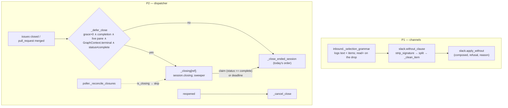

# The typed selection grammar reads past the phase list; the close path races the session's endgame (issue-405) — reviewer briefing

## TL;DR

The two bugs of the 2026-09-20 run-3 e2e Slack test (#404). **P1:** `execute without
<phase>` was refused for every valid argument because the clause reader took the whole
rest of the line as phase names, and a connector's same-line signature (`*Sent using*
@Claude`) became a "phase" that is not token-shaped — hence *"that name"* while the
offer quoted the valid name back. The clause now drops the signature wherever it sits,
strips Slack markup and invisible characters around each word, refuses a non-name by its
**position**, drops under its own family, and logs what it read. **P2:** a merge's
`Closes #N` closed the ticket and the close path ended the session mid completion
summary. A closure reaching a live session standing on the graph's **terminal node** is
now **held** for up to `routing.tmux.finishGraceSeconds` (default 300): the session's
`graph complete` claim ends the hold at once, the deadline ends it regardless; anything
else closes at once as before. `session.autoclosed` says `merged: true` when a recorded
PR merged. The run-3 report is recorded under `docs/reports/` and the e2e series indexed
(#404's deliverable). One additive config key; no grant, scope or state-file change.

## Where to focus (in this order)

1. **The hold and its conditions** — `cli/the_loop/webhook/dispatcher.py`
   `_defer_close` / `sweep_closing` / `_close_ended_session`: the four conditions
   (grace > 0, completion closure, live pane, unexited terminal node), the immediate
   path byte-for-byte the old order, the sweeper thread and `stop()`. Check you agree a
   **paused** session's closure is held too (bounded either way), and that a daemon
   stopped under a hold leaving the item unstamped — re-detected by the poller after a
   restart — is the right failure mode.
2. **The clause reader** — `cli/the_loop/channels/slack.py` `without_clause` /
   `_clean_item` / `apply_without`, and `verbs.strip_signature`'s regex: the signature
   shape it matches (`[*_~]*sent using[*_~]* <word>` at the end of the text, any line),
   and that markup stripping (`*_~`) around a name cannot widen what reaches the
   record — every cleaned item is still validated against the checklist's rows.
3. **The session's side** — `commands/finish-tasks.md`, `skills/the-loop/SKILL.md`: the
   endgame order the hold relies on (summary → claim → close if still open). Skim.
4. **`GraphContext.terminal` / `.delivered_by_merge`** — `cli/the_loop/graphlink.py`:
   two additive fields off the compiled node and the state's `pullRequests[]`. Skim.

## What changed (map)

## Key decisions & why (education)

- **Ignore the signature, refuse everything else — by position.** Truncating the
  clause at the first non-name could freeze `execute without 2` when the person typed
  `execute without 2, *5*` (abuse case 4); so markup around a name is stripped because
  it *is* that name, one known signature is dropped, and any other non-name refuses
  loudly, naming where it sat, never echoed.
- **Hold on the terminal node only.** Deferring every closure would keep a wontfix's
  session alive for five minutes; the endgame is exactly where the race is, and the
  graph context already knows the node.
- **The handshake is the claim the skill already prescribes** (`the-loop graph complete
  <id>`), read from the state file the runtime writes — no new verb, no event-log
  tailing.
- **A sweeper thread in the dispatcher, not a hook in each daemon.** The webhook daemon
  has no cycle and the poller's is 60 s; `sweep_closing()` stays a plain method a test
  drives with its own clock.
- **`merged` from the state file, best-effort.** An issue closed before the daemon
  recorded its PR's merge still says `merged: false`, honestly.

## Evidence

`docs/specs/issue-405/evidence/automated-tests.md`: the pre-fix reader reproduced red
on the live shapes; 52 grammar/pipeline tests, 12 dispatcher scenarios (Gherkin), the
graph-context test and the schema parity test green; full suite 4335 passed / 1 skipped
with four **pre-existing, environmental** `test_instance.py` failures that fail
identically on the base commit here; ruff, ruff format, pyright, markdownlint and
`validate_config` clean. Security review: pass, no findings
(`evidence/security-review.md`). Critic rounds unavailable (`critics: []`), recorded.

## Open questions for the reviewer

- Is **300 s** the right default for `finishGraceSeconds`? It bounds how long a dead-end
  session (one that never claims) keeps its checkout after the ticket closed; a
  completion summary is usually posted within a minute.
