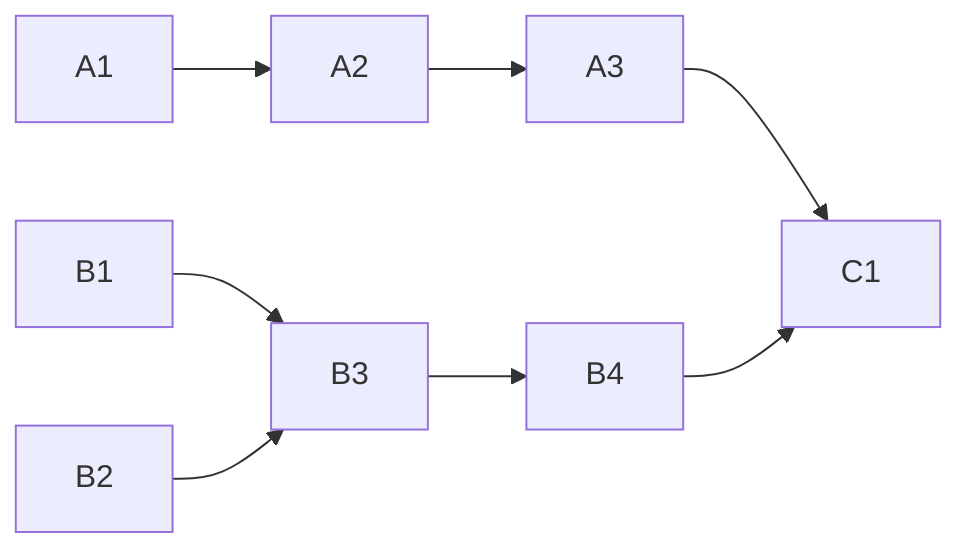

<!-- Authored per the the-loop:writing skill. -->

# Tasks: the clause reader stops at the phases; the close path waits for the endgame

> Phase 4 of 4. Each task names the requirement it satisfies and the testing-plan row
> that proves it; the test lands with the change (red first).

## Task list

- [x] **A1 — `strip_signature` and the clause cleaning.** `verbs.strip_signature`;
      `without_clause` strips the signature, `Cf` characters and `*_~` wrappers.
      *Req:* R1.1, R1.2 · *Test:* T1.
- [x] **A2 — `apply_without` reasons and the position-naming refusal.** 3-tuple return,
      `UNKNOWN_PHASE` / `UNSKIPPABLE_PHASE` / `EMPTY_CLAUSE`; the non-token refusal; the
      three existing call sites updated. *Req:* R1.3, R1.4 · *Test:* T1, T9. *Deps:* A1.
- [x] **A3 — the pipeline logs and records what it read.** `_selection_grammar` passes the
      reason, logs the text, `_read_summary` on the drop; the `channel.dropped` catalogue.
      *Req:* R1.4, R1.5 · *Test:* T2, T9. *Deps:* A2.
- [x] **B1 — the graph context knows the endgame.** `GraphContext.terminal`,
      `.delivered_by_merge`; `_context_from` fills them. *Req:* R2.1, R2.5 · *Test:* T5.
- [x] **B2 — `finishGraceSeconds`.** `TmuxConfig.finish_grace_seconds`, both schema
      copies, `routing-options.md`. *Req:* R2.2, R2.3 · *Test:* T4.
- [x] **B3 — the deferred closure.** `_PendingClose`, `_defer_close`,
      `_close_ended_session`, `sweep_closing`, `is_closing`, `_cancel_close`, the sweeper
      thread, `stop()`; the close branch and `_record_reopen` wired; the `merged` flag;
      the poller skip; the event catalogue. *Req:* R2.1–R2.5 · *Test:* T3, T9.
      *Deps:* B1, B2.
- [x] **B4 — the session's endgame order.** `commands/finish-tasks.md`, `SKILL.md`.
      *Req:* R2.6. *Deps:* B3.
- [x] **C1 — docs, reports and evidence.** The run-3 report and the e2e series in
      `docs/reports/index.md`; `followups/` P1/P2 notes and README rows; capability docs
      (`channels.md`, `interactive-sessions.md`, `webhook-triggers.md`) with history rows;
      evidence files; the testing plan completed. *Deps:* A3, B4.

## Dependency graph (DAG)

## Checkpoints

- After A1–A3: `tests/test_channels_verbs.py`, `tests/test_selection_control.py` green.
- After B1–B3: `tests/test_finish_grace.py`, `tests/test_graph_drive.py`,
  `tests/test_schema_parity.py`, `tests/test_routing.py` green.
- After C1: full suite, ruff, ruff format, pyright, markdownlint, `validate_config`.

## Review comments

*None yet.*
