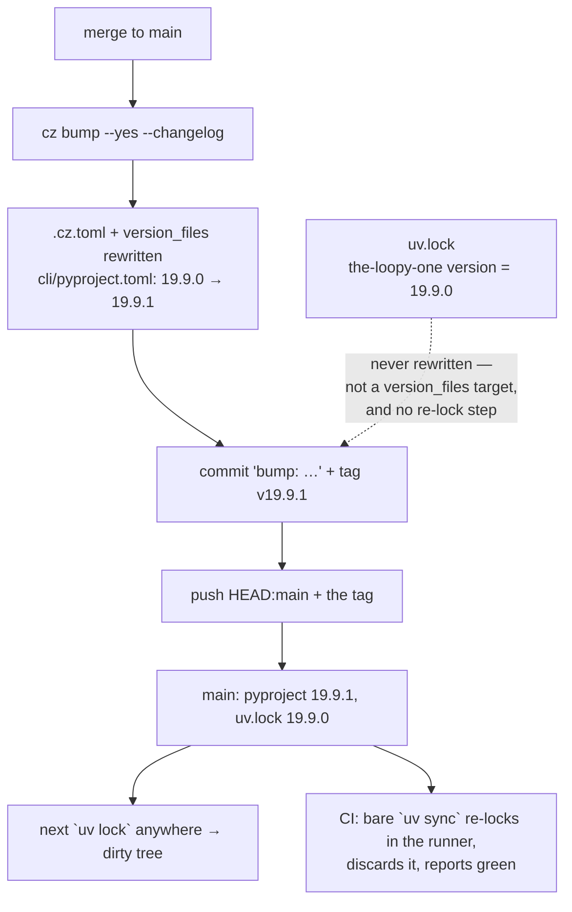

<!-- Authored per the the-loop:writing skill. -->

# Bugfix spec: the release leaves `uv.lock` a version behind, and nothing notices

> Phase 1 of 4 (bugfix → design → testing plan → tasks). Source:
> [issue-407](https://github.com/MadaraUchiha-314/the-loop/issues/407).

## Summary

`cz bump` owns the version and rewrites every artifact listed in `.cz.toml`'s
`version_files`. `uv.lock` is not one of them and cannot be: the lockfile records the
version of `the-loopy-one` as an **editable workspace member**, on a `version = "…"`
line indistinguishable from the ~70 other packages' version lines, so no
`version_files` pattern can single it out. Nothing else re-locks either, so every
release pushes a bump commit whose lockfile still names the *previous* version.

The drift is invisible until someone resolves the workspace, at which point `uv`
rewrites the line and hands them a dirty tree they did not ask for — which is how the
owner found it. CI never caught it because CI's `uv sync` **silently re-locks in the
runner** and throws the result away.

The reported diff carried a second hunk (`exceptiongroup`'s `typing-extensions` marker)
which is a different drift with the same shape: the committed lockfile's text depends
on the uv that wrote it, and nothing says which uv that is.

## Steps to reproduce

1. Check out `main` at any commit after a release (e.g. `46c684b`, `bump: version
   19.9.0 → 19.9.1`). The tree is clean.
2. Run `uv lock` (or anything that resolves the workspace — `uv sync`, `uv run …`).
3. `git diff uv.lock`.

For the second hunk, do step 2 on a uv older than the one that last wrote the lockfile
(the reporter's uv against the repository's).

## Expected vs actual

| | Expected | Actual |
|---|---|---|
| Step 3 | No diff — `main` carries a lockfile in step with the version it locks | `the-loopy-one version = "19.9.0"` → `"19.9.1"`, one release behind |
| A PR's CI run | A lockfile that has fallen behind fails the run | `uv sync` re-locks inside the runner, the PR is green, and `main` stays stale |
| Step 2 on another uv | The same bytes, whoever resolves | Markers move (`{ name = "typing-extensions" }` → `{ …, marker = "python_full_version < '3.11'" }`), a spurious diff that masks the real one |

## Root cause (confirmed by reading the release job and by re-running it locally)

- **The bump commit.** `.github/workflows/release.yml`'s `Bump version (commitizen)`
  step is the only thing between the merge and the push, and commitizen's contract is
  `version_files` — a per-line pattern replace. The one entry that could cover the
  lockfile, `uv.lock:^version = `, matches every package in it, so the guard in
  `scripts/check_version_lockstep.py` (*every* matching line must carry the version)
  would reject it, correctly. The lockfile needs a **re-lock**, not a rewrite, and the
  job never runs one.
- **The missing guard.** `.github/workflows/ci.yml` runs a bare `uv sync`. uv treats
  an out-of-date lockfile as something to fix, not something to report, so it updates
  `uv.lock` in the runner's checkout and proceeds. The updated file is never committed
  and never compared, so drift survives every PR. `cli/tests/test_version_lockstep.py`
  — the guard built for exactly this class of bug in issue-46 — checks only
  `version_files`, so it had nothing to say either.
- **The marker hunk.** The workflows install uv with `astral-sh/setup-uv@v5` and no
  `version:`, i.e. whatever is latest on the day the job runs, and developer machines
  run whatever they installed. Re-locking this repository's dependency set with uv
  0.8.17 and with uv 0.12.17 produces *different* text for the same resolution; only
  the older one emits the `exceptiongroup` hunk. So the committed lockfile is a
  function of an unpinned tool, against a repository whose stated rule is *no
  local-vs-CI drift*.

## Requirements

### Requirement 1 — a release leaves the lockfile in step

**User story:** As someone who pulls `main`, I want a checkout that resolves clean, so
that `uv lock` never hands me a diff I did not make.

#### Acceptance criteria (EARS)

1. WHEN the release workflow bumps the version THEN it SHALL re-resolve `uv.lock` and
   include the result in the **same** bump commit, so no revision of `main` records a
   lockfile and a package version that disagree.
2. WHEN the lockfile is folded into the amended bump commit THEN the release tag
   commitizen created SHALL be moved onto that commit, so `v<version>` still names the
   commit that is pushed and `gh release create --verify-tag` still finds it.
3. WHEN the re-lock produces no change THEN the step SHALL leave the bump commit and
   its tag untouched rather than amending for nothing.
4. WHEN no release is warranted THEN the step SHALL not run (unchanged no-op path).

### Requirement 2 — a stale lockfile fails a pull request

**User story:** As a reviewer, I want lockfile drift to be a red check, so that it is
fixed on the branch instead of discovered on someone's machine weeks later.

#### Acceptance criteria (EARS)

1. WHEN CI syncs the workspace THEN it SHALL use `uv sync --locked`, so an out-of-date
   lockfile fails the run instead of being rewritten inside the runner.
2. WHEN the lockstep check runs THEN it SHALL also require every **editable workspace
   member** recorded in `uv.lock` to carry the commitizen version, and SHALL name the
   member, both versions and `uv lock` when it does not.
3. WHEN `uv.lock` records no editable workspace member THEN the check SHALL report that
   rather than pass — a guard that matches nothing is the silent pass issue-46 was
   about.
4. The fix SHALL include regression tests that fail before the fix and pass after.

### Requirement 3 — one resolver writes the lockfile

**User story:** As a contributor, I want my `uv lock` to produce the same bytes as
CI's, so that the diff I see is the change I made.

#### Acceptance criteria (EARS)

1. WHEN uv runs against this repository THEN a version window SHALL be enforced
   (`[tool.uv] required-version` in the root `pyproject.toml`), so a uv outside it
   refuses with a message that says what to do rather than rewriting the lockfile.
2. WHEN a workflow installs uv THEN it SHALL pin an exact version inside that window
   (`ci.yml`, `release.yml`, `the-loop-gate.yml`).

## Security considerations

- **No new credential, grant or secret.** The release job's permissions
  (`contents: write` on the release job, `id-token: write` on the publish job) are
  unchanged, and the added step runs `uv lock` + `git commit --amend` + `git tag -f`
  inside the job that already commits and tags.
- **What `git tag -f` can move.** Only a tag in the runner's own checkout, created
  seconds earlier by `cz bump` in the same job, and never yet pushed — the push step
  that follows is the first time it leaves the runner. No published tag is rewritten,
  and the concurrency group (`release`, `cancel-in-progress: false`) still means one
  release at a time.
- **What the amend can sweep in.** `git add uv.lock` names one path, so only the
  lockfile is added; the runner's checkout is otherwise the merge commit the job
  started from.
- **`uv lock` resolves from the network.** It does so against the same index the job
  already resolved from to run `cz` at all, with the pin making the resolver itself
  deterministic; it installs nothing new into the published artifact, which is built
  from `cli/` by `uv build` as before.
- **Fail-closed.** `uv sync --locked` turns a class of silent mutation into a failure,
  and `required-version` turns an unknown resolver into a refusal. Both make the
  toolchain stricter, neither widens it.

## Out of scope

- Adding `uv.lock` to `.cz.toml`'s `version_files`. Its patterns match lines, and
  every package in the lockfile has a `version = "…"` line; there is no pattern that
  names the workspace member's line alone. The re-lock is the mechanism.
- Backfilling the stale lockfile on `main` by hand for past releases — this PR commits
  the current re-lock, and every future release carries its own.
- Moving the `exceptiongroup` resolution itself. The hunk was the reporter's older uv
  rendering the same resolution differently; pinning the resolver removes it without
  touching the dependency set.
- Renovating the uv pin automatically. Bumping the window is a deliberate, reviewed
  change to two files, like `ruff==0.15.8` and `markdownlint-cli2@0.18.1` beside it.

## Open questions

None.
