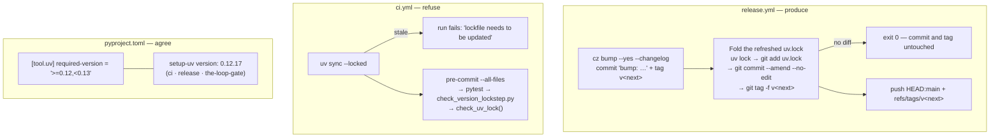

<!-- Authored per the the-loop:writing skill. -->

# Design: re-lock into the bump commit, and make a stale lockfile loud

> Phase 2 of 4. Derives from [`bugfix.md`](bugfix.md).

## Overview

**One step added to the release job, one flag added to CI, one function added to the
existing guard, one key added to the root `pyproject.toml`.** No runtime code changes;
nothing in `cli/the_loop/` is touched. The shape of the fix is: the release *produces*
a correct lockfile, CI *refuses* an incorrect one, and the resolver that decides what
"correct" looks like is pinned so the two agree.



## Architecture

### The fold-in step (`.github/workflows/release.yml`)

Placed between `Bump version (commitizen)` and `Push bump commit + tag to main`, and
guarded by the same `steps.bump.outputs.released == 'true'` every post-bump step uses:

```sh
uv lock
if git diff --quiet -- uv.lock; then exit 0; fi   # R1.3
git add uv.lock
git commit --amend --no-edit                      # R1.1 — same commit, not a second one
git tag -f "v${version}"                          # R1.2 — the tag follows the amend
```

Three properties make this safe, and each is why the step looks like this rather than
something simpler:

- **Amend, not a follow-up commit.** A second commit would put a revision on `main`
  whose lockfile and package version disagree — the very state being fixed — and would
  leave the tag on the wrong one. Amending means no such revision ever exists.
- **The tag must move.** `cz bump` creates the tag at the commit it just made;
  amending replaces that commit, so without `git tag -f` the pushed tag would name a
  commit that is not on `main`, and `gh release create --verify-tag` would fail. The
  tag is still local at this point — the push step below is the first time it leaves
  the runner — so moving it costs nothing and rewrites nothing published.
- **The no-op guard.** `git diff --quiet -- uv.lock` compares the worktree against
  `HEAD`; when the lockfile is already in step (nothing to fold), amending would
  rewrite the commit for no reason and change its SHA. The step exits instead.

### The CI guard (`.github/workflows/ci.yml`)

`uv sync` → `uv sync --locked`. `--locked` is uv's own "verify, don't fix" mode: it
resolves, compares against the committed lockfile, and exits non-zero with
*"The lockfile at `uv.lock` needs to be updated, but `--locked` was provided"* instead
of writing. Nothing else in the job changes — the same virtualenv is produced for the
pre-commit run that follows.

### The lockstep guard (`scripts/check_version_lockstep.py`)

A second check beside the `version_files` loop, sharing the same output and exit code
so the existing `cli/tests/test_version_lockstep.py` (and therefore the pytest
pre-commit hook and CI) gates it with no new wiring:

```python
UV_PACKAGE_RE = re.compile(
    r'^\[\[package\]\]\nname = "(?P<name>[^"]+)"\nversion = "(?P<version>[^"]+)"\n'
    r'source = \{ editable = ',
    flags=re.MULTILINE,
)
```

The regex reads the lockfile's block shape rather than parsing TOML, which keeps the
script stdlib-only on any Python the workspace supports (`tomllib` is 3.11+, the
existing constraint the file already documents). `source = { editable = … }` is what
distinguishes a workspace member from the ~70 registry packages, whose versions are
none of this check's business. An empty match is itself a failure (R2.3): a guard that
silently matches nothing is precisely the failure mode issue-46 was written about.

Every editable member is required to carry the commitizen version — the repository has
one (`the-loopy-one`), and the loop's convention is that everything versioned moves
together. A future member with an independent version would have to say so here.

### The resolver window (`pyproject.toml`, `setup-uv`)

`[tool.uv] required-version = ">=0.12,<0.13"` in the **root** (the virtual workspace
root, where every `uv` invocation for this repository resolves from). uv reads it
before doing anything and refuses outside the window:

```text
error: Required uv version `>=0.12, <0.13` does not match the running version `0.8.17`.
Update `uv` by running `uv self update`.
```

The three workflows that install uv pin `version: "0.12.17"`, an exact version inside
that window. The pin is what makes `--locked` meaningful: without it a new uv release
would re-render the lockfile's text and turn the guard into a red check nobody caused.

## Trade-offs

- **A closed window (`<0.13`) over a floor alone.** A floor would let a contributor on
  uv 0.13 commit a lockfile that CI's pinned 0.12.17 then rejects — the same drift,
  inverted. The closed window costs a deliberate two-file bump each uv minor, which is
  how `ruff==0.15.8` and `markdownlint-cli2@0.18.1` are already handled here.
- **`required-version` is a breaking change for contributors on an older uv**, by
  design: it is the only thing that stops their `uv lock` from re-rendering the
  lockfile. The error names the fix (`uv self update`), and this is called out in the
  PR rather than left to be discovered.
- **Both guards, not one.** `uv sync --locked` catches *any* staleness but only in CI
  and only while the pin holds; `check_uv_lock` catches this specific drift
  deterministically, runs in the local pre-commit hook too, and says which member
  drifted and what to run. The release fix makes both quiet; they exist for when it
  does not.
- **The release job now resolves the workspace twice** (`uv run cz bump`, then
  `uv lock`). A few seconds on a job that already builds and publishes.

## Rejected alternatives

| Alternative | Why not |
|---|---|
| Add `uv.lock` to `.cz.toml` `version_files` | Patterns match lines; every package has a `version = "…"` line, and no pattern reaches the member's line alone. The existing lockstep guard would reject any pattern that tried. |
| A separate `chore: re-lock` commit after the bump | Puts a revision on `main` where the lockfile and the version disagree, and leaves the tag on it. |
| Re-lock in a scheduled job / a bot PR | Fixes drift after the fact instead of never creating it, and leaves `main` briefly wrong after every release. |
| `uv lock --check` as its own CI step | Same signal as `uv sync --locked`, one more step and one more resolve. |
| Leave uv unpinned | `--locked` then fails on any uv release that re-renders the lockfile, training reviewers to ignore it. |

## Testing strategy

See [`testing-plan.md`](testing-plan.md). The release step is proved by replaying it —
a scratch clone, a real `cz bump`, the step's verbatim script — because a workflow
step cannot be unit-tested and the properties that matter (the lockfile is *in* the
bump commit, the tag *moved* with it) are only observable on a real commit.
