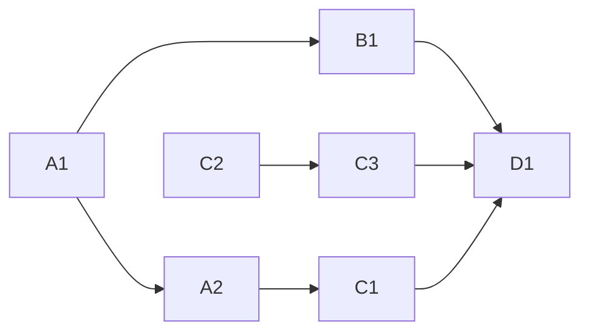

<!-- Authored per the the-loop:writing skill. -->

# Tasks: re-lock into the bump commit, and make a stale lockfile loud

> Phase 4 of 4. Each task names the requirement it satisfies and the testing-plan row
> that proves it; the test lands with the change (red first).

## Task list

- [x] **A1 — the resolver window.** `[tool.uv] required-version = ">=0.12,<0.13"` in
      the root `pyproject.toml`; `setup-uv` pinned to `0.12.17` in `ci.yml`,
      `release.yml` and `the-loop-gate.yml`. *Req:* R3.1, R3.2 · *Test:* T6.
- [x] **A2 — the lockfile re-locked onto the current version.** `uv lock` with the
      pinned uv; `the-loopy-one` 19.9.0 → 19.9.1, and no other hunk. *Req:* R1.1
      (the standing drift) · *Test:* T2, T5. *Deps:* A1.
- [x] **B1 — the fold-in step.** `Fold the refreshed uv.lock into the bump commit` in
      `release.yml`: `uv lock`, the no-op guard, `git commit --amend --no-edit`,
      `git tag -f`. *Req:* R1.1, R1.2, R1.3, R1.4 · *Test:* T3, T4. *Deps:* A1.
- [x] **C1 — CI refuses a stale lockfile.** `uv sync` → `uv sync --locked` in
      `ci.yml`. *Req:* R2.1 · *Test:* T5. *Deps:* A1, A2.
- [x] **C2 — the lockstep guard covers the lockfile.** `check_uv_lock` +
      `UV_PACKAGE_RE` in `scripts/check_version_lockstep.py`, wired into `main`'s
      problem list and its summary line. *Req:* R2.2, R2.3 · *Test:* T1, T2.
- [x] **C3 — the regression tests.** Three cases in
      `cli/tests/test_version_lockstep.py` over a trimmed lockfile fixture; red
      against the pre-fix `uv.lock`. *Req:* R2.4 · *Test:* T1. *Deps:* C2.
- [x] **D1 — docs and evidence.** `docs/capabilities/release-publishing.md` (current
      behaviour + history row); the spec chain; the evidence files; the testing plan
      completed. *Deps:* B1, C3.

## Dependency graph (DAG)

## Notes

Nothing under `cli/the_loop/` changes: this work item is release plumbing, the guard
that watches it, and the resolver pin that makes the guard deterministic.
