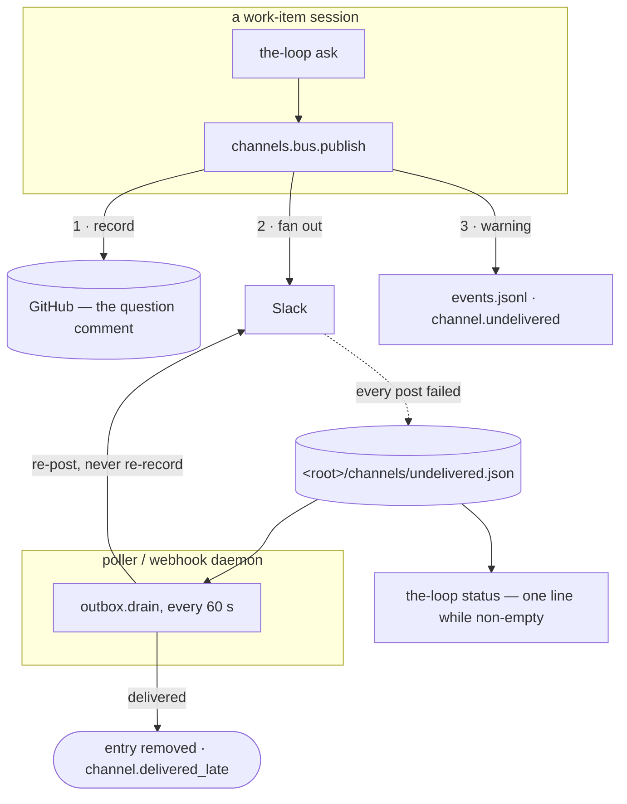

<!-- Authored per the the-loop:writing skill. -->

# Design: the bus keeps an outbox, and `status` reads it

> Phase 2 of 4 (bugfix → design → testing plan → tasks). Derives from
> [bugfix.md](bugfix.md). Source:
> [issue-409](https://github.com/MadaraUchiha-314/the-loop/issues/409).

## Overview

**One new file, one new module, and four call sites.** When `publish` asks channels to take
an event and every one of them refuses, it writes the event to
`<state.root>/channels/undelivered.json` — the **outbox** — and says so at `warning`. A
small drain thread in each daemon re-posts the backlog on an interval, dropping each entry
the moment a channel accepts it. `the-loop status` prints one line while the file is
non-empty.

Nothing else changes: the ledger still records first, the fan-out is still best-effort per
channel, `publish` returns the same `PublishResult`, and the envelope still means what it
has always meant — with the difference that it is now true, because an event no channel
took is no longer forgotten.



## Components & interfaces

### `cli/the_loop/channels/outbox.py` — the new module

The whole feature lives here. It owns the file, its lock, its cap and its backoff, and
exposes five functions. None of them raises: an outbox that cannot be read or written
degrades to the behaviour this change replaces, which is today's behaviour.

```python
OUTBOX_CAP = 200            # entries; past it the OLDEST goes, with one warning
DRAIN_BUDGET = 20           # entries attempted per drain cycle
DRAIN_INTERVAL_SECONDS = 60 # how often each daemon's drainer runs
RETRY_BASE_SECONDS = 60     # first backoff; doubles per attempt
RETRY_MAX_SECONDS = 3600    # and is capped here

def path_for(cli_config) -> Path                      # <root>/channels/undelivered.json
def remember(event, posts, cli_config) -> bool        # R1.1–R1.6
def entries(cli_config) -> List[Dict[str, Any]]       # newest last; [] when unreadable
def summary(cli_config) -> Dict[str, Any]             # what `status` prints (R3)
def drain(cli_config, *, channels=None, budget=DRAIN_BUDGET) -> Dict[str, int]
def start_drainer(cli_config, stop_event, *, interval_override=None) -> Optional[Thread]
```

One entry, keyed by a generated id so the map keeps insertion order the way every other
map in `channels/state.py` does:

```json
{
  "at": "2026-09-22T10:00:00Z",
  "attempts": 1,
  "lastAttemptAt": "2026-09-22T10:01:00Z",
  "lastError": "slack: post failed: channel_not_found",
  "channels": ["slack"],
  "event": {
    "eventType": "session.awaiting_input", "workItem": "github:o/r#7",
    "text": "A or B?", "url": "https://github.com/o/r/issues/7#issuecomment-1",
    "detail": {"actor": "octocat"}, "source": "cli", "summary": "",
    "actor": {"ids": {"github": "octocat"}, "name": "Octo"}
  }
}
```

`event` is a `channels.base.Event` and its `actor` a `the_loop.identity.Principal`, both
round-tripped field by field rather than pickled, so a file written by an older CLI loads
under a newer one with its unknown keys ignored and its missing keys defaulted — the rule
`_delivery_record` and `_pending_record` already follow in `channels/state.py`.

**Locking and writing** are that module's idioms exactly: an exclusive `flock` on
`undelivered.json.lock` around every read-modify-write (`the_loop.runlock`, skipped with one
debug line on a platform without `flock`), and a tmp-file-plus-`os.replace` save. Four
processes write this file — each session's `ask`, the graph runtime, and the two daemons'
drainers — which is the same set that already shares `channels/slack.json`.

**The backoff** is per entry: an entry is skipped while
`now - lastAttemptAt < min(RETRY_BASE_SECONDS * 2**attempts, RETRY_MAX_SECONDS)`. A backlog
therefore costs one attempt per entry per minute at first and one per hour after eleven
failures, which is what keeps a drain from becoming the burst that fills the outbox again
when the failure is a rate limit.

### `cli/the_loop/channels/bus.py` — where the outbox is written

Six lines at the end of `publish`, after the `bus.published` line:

```python
if cli_config and channels is None and posts and not any(post.ok for post in posts):
    outbox.remember(event, posts, cli_config)
```

Three guards, each load-bearing:

- **`cli_config`** — without one there is no state root to write under, and a bare
  `publish(event, channels=[...])` must not create `./.the-loop`.
- **`channels is None`** — the bus resolved the channels itself. An injected list is a
  caller's one-off (a test, an embedder, `open_conversation`'s callers) and its failures
  are that caller's to interpret.
- **`posts`** — at least one channel was asked (R1.3). An event nobody subscribes to was
  never going to be delivered, and queueing it would make the outbox a log of everything.

`remember` emits `channel.undelivered` at `warning` itself, so the fact is in the log of
whichever process published — and, once the deployment's config is shared, in the service's
own log.

### `cli/the_loop/poller/daemon.py`, `cli/the_loop/webhook/daemon.py` — who drains

Both daemons already start two background watchers on their stop event
(`selfdiagnosis.start_watcher`, `channels.watcher.start_watcher`); the drainer is the third,
built to the same shape — a daemon thread looping `stop_event.wait(interval)` around one
cycle, a raising cycle logged and survived, `None` when no channel is configured. Both
daemons rather than one, because either may be the only one a deployment runs; a drain by
both is harmless, since each entry is claimed and removed under the file's lock.

### `cli/the_loop/core/lifecycle.py` + `commands/lifecycle_cmd.py` — the status line

`status_all`'s report gains `"channelDelivery": outbox.summary(config)` beside
`sessionEnvironment` and `slackSplit`, and for the same stated reason: it never moves `ok`,
which answers "is every enabled service running". `undelivered_line(doc)` renders it, the
way `environment_line` renders drift, and `StatusCommand` prints it under the service rows:

```
channels    3 events undelivered, oldest 2h ago (slack: channel_not_found) — retried every 60s
```

Nothing is printed when the file is absent or empty (R3.2).

### `cli/the_loop/core/sessions.py` — what the asking session is told

`ask_session` keeps its outcome exactly as it is — the record decides `ok` and the exit code
(R4.4) — and gains one message on the path where `channel_results` is non-empty and no
result is `ok`:

```
note: no channel took this question (slack: channel_not_found); it is queued for
redelivery and `the-loop status` counts it until it lands
```

Its `session.awaiting_input` event gains `channels_posted`, so the count that was only ever
in a `debug` line is on the event the attention surface already reads.

### `cli/the_loop/state.py` — the path is declared

A `channels_outbox` property on `StateLayout` and its `GeneratedPath` entry, classified
**local** with the reason the channel state gives plus its own: the entry names a Slack
channel this deployment failed to post to, and carries the message that was going there.
`docs/cli/state.md` gains the matching row, tree line and section — the parity
`test_state_portability.py` enforces.

## Error handling

| Failure | Behaviour |
|---|---|
| the outbox file is missing | an empty backlog: `entries` is `[]`, `summary` reports nothing, `remember` creates the file |
| the file is corrupt or unreadable | logged once at `warning`; treated as empty, and the next `remember` replaces it. A corrupt outbox must never break publishing |
| `flock` is unavailable on the platform | the read-modify-write runs unlocked, once at `debug` — `ChannelState.locked`'s own fallback |
| `remember` raises anything | caught in `publish`; the `PublishResult` the caller sees is unchanged (R1.6) |
| a drain cycle raises | caught by the thread, logged, the loop continues (R2.6) |
| one entry's post raises | that entry keeps its attempt and its error; the rest of the budget is still attempted (R2.5) |
| the cap is reached | the oldest entry goes, with `channel.undelivered_dropped` at `warning` (R1.5) |
| `status` cannot read the file | no backlog reported; `status` still answers (R3.4) |

## What it costs

- **Message text at rest.** Up to `OUTBOX_CAP` events' text sits under the state root until
  delivered. `bugfix.md` § Security considerations carries the argument and the bounds.
- **Late messages.** An entry delivered after a long outage arrives out of order with
  whatever was posted since. That is the trade this bug is about: late beats lost, and the
  channel timestamps it.
- **A second copy of an event, briefly.** Between `remember` and a successful drain, the
  event exists on the ticket and in the outbox. Neither is authoritative for the loop's
  state — `work-item-state.json` and the graph are — so the copy can only produce a
  duplicate *message*, never a duplicate decision.
- **Two drainers in a deployment running both daemons.** One file lock, two threads waking
  each minute on a file that is usually absent.
- **Not fixed here:** the credential drift that triggered the report (a session posting with
  the token it was spawned with) is [issue-410](https://github.com/MadaraUchiha-314/the-loop/issues/410)'s,
  and the report files it separately. This change makes any such failure survivable, not
  impossible.

## Testing strategy

Unit tests drive `outbox` directly — `remember` under each guard, the cap, the backoff, the
round trip of an `Event` with an actor, a corrupt file — and `publish` with a `tmp_path`
state root and a failing fake channel. One integration test walks the whole scenario the
report describes: an ask whose channel refuses, the entry on disk, `status` naming it, the
channel recovering, the drain delivering it, the file empty and `status` silent again. The
full matrix is [testing-plan.md](testing-plan.md).

## Security design

The threat model is the one `bugfix.md` states; the design answers it in four places, each
a line a reviewer can check:

1. **The drain never records.** It posts to resolved channels directly and never calls
   `publish`, so no replayed entry can write a comment, open an issue or reach a gate.
2. **The event log stays ids-only.** `channel.undelivered`, `channel.delivered_late` and
   `channel.undelivered_dropped` carry event type, work item, channel names, counts, waited
   seconds and the provider's error string — never `event.text`.
3. **The file is local by declaration**, so `the-loop check`'s portability rules stop it
   travelling into a repository with the tracked records.
4. **The backlog is bounded** by the cap, by the per-cycle budget and by the per-entry
   backoff, so neither disk nor a rate-limited provider is attacked by the recovery path.
