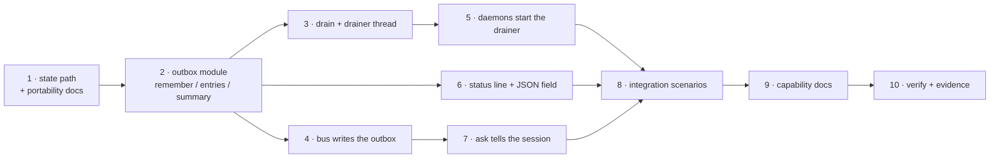

<!-- Authored per the the-loop:writing skill. -->

# Tasks: the bus keeps an outbox, and `status` reads it

> The last spec artifact. Derived from [design.md](design.md) and
> [testing-plan.md](testing-plan.md). Gate-less (issue-281): it advances on shape.

## Execution DAG

## Tasks

- [ ] **1 · Declare the path.** Add `StateLayout.channels_outbox`
      (`<root>/channels/undelivered.json`) and its `GeneratedPath` entry in
      `cli/the_loop/state.py`, classified local with its reason; add the row, the tree
      line and the section to `docs/cli/state.md`.
      _Requirements:_ R1.1.
      _Test:_ testing-plan T8, T12.

- [ ] **2 · The outbox.** Write `cli/the_loop/channels/outbox.py` — `path_for`,
      `remember`, `entries`, `summary`, the entry round trip, the lock, the cap and the
      backoff — per `design.md` § Components. Write `cli/tests/test_channels_outbox.py`
      first, red, then implement. Document `channel.undelivered` and
      `channel.undelivered_dropped` in `eventlog.EVENT_TYPES`.
      _Requirements:_ R1.1, R1.2, R1.3, R1.4, R1.5, R1.6, R4.1.
      _Test:_ testing-plan T1, T7, T8, T9.

- [ ] **3 · The drain.** Add `drain` and `start_drainer` to the same module: the per-entry
      backoff, the per-cycle budget, removal on delivery, and the watcher-shaped thread.
      Document `channel.delivered_late`.
      _Requirements:_ R2.1, R2.2, R2.3, R2.4, R2.5, R2.6.
      _Test:_ testing-plan T2, T7, T9.

- [ ] **4 · The bus writes it.** Add the three-guard call at the end of
      `channels/bus.py`'s `publish`, and its test in `cli/tests/test_bus.py` and
      `cli/tests/test_bus_integration.py`.
      _Requirements:_ R1.1, R1.2, R1.3, R1.6.
      _Test:_ testing-plan T3.

- [ ] **5 · The daemons drain it.** Start `outbox.start_drainer` beside
      `channels_watcher.start_watcher` in `cli/the_loop/poller/daemon.py` and
      `cli/the_loop/webhook/daemon.py`.
      _Requirements:_ R2.1, R2.6.
      _Test:_ testing-plan T4, T10.

- [ ] **6 · The status line.** Add `channelDelivery` to `lifecycle.status_all`'s report
      and `undelivered_line` beside `environment_line`; print it in
      `commands/lifecycle_cmd.py`'s `StatusCommand`.
      _Requirements:_ R3.1, R3.2, R3.3, R3.4, R3.5.
      _Test:_ testing-plan T5.

- [ ] **7 · The session is told.** In `core/sessions.py`'s `ask_session`, add the
      no-channel-took-it note and the `channels_posted` field on the
      `session.awaiting_input` event; update the event's `EVENT_TYPES` description.
      _Requirements:_ R4.2, R4.3, R4.4.
      _Test:_ testing-plan T4.

- [ ] **8 · The scenarios.** Write `cli/tests/test_channels_outbox_integration.py` with
      Gherkin docstrings: the report's full ask → queue → recover → deliver walk, and the
      `status` surface.
      _Requirements:_ all.
      _Test:_ testing-plan T4, T5.

- [ ] **9 · The capability docs.** Update `docs/capabilities/channels.md` (the outbox, the
      drain, the status line) and `docs/capabilities/observability.md` if the new events
      belong in its list.
      _Requirements:_ R3.1, R4.1.
      _Test:_ testing-plan T12.

- [ ] **10 · Verify and record.** Run the matrix and write `evidence/verification.md`,
      `self-review.md`, `security-review.md` and `documentation.md`.
      _Requirements:_ all.
      _Test:_ testing-plan T1–T12.
