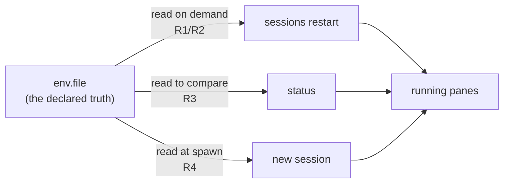
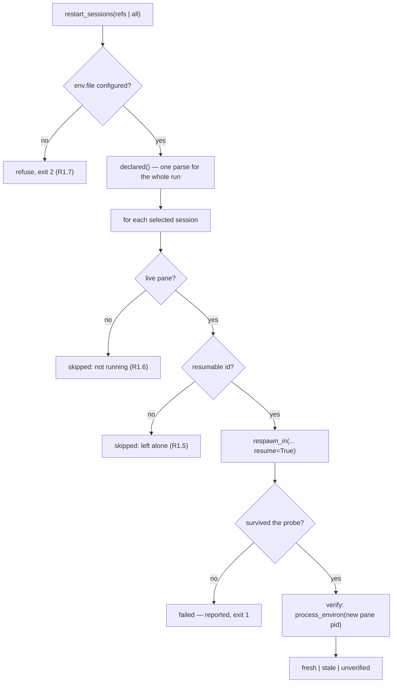

<!-- Authored per the the-loop:writing skill. -->

# Design: roll running sessions onto a refreshed environment

> Phase 2 of 4. Derived from [requirements.md](requirements.md); reviewed with
> [testing-plan.md](testing-plan.md) at one gate.

## The shape of the fix

Three things are missing, and they are the same thing seen from three distances:



One new module answers "what does the file declare, and what does that process actually
hold"; the runner learns to hand values to a pane; and two command surfaces use both.
Nothing else moves.

## Components

### `the_loop/envstate.py` — new

The whole of the new knowledge, and the only place a value is ever handled.

| function | answers |
|---|---|
| `declared(config, config_path)` | the names and values `env.file` declares **right now** — a fresh parse, never `os.environ` |
| `fingerprint(value)` | a truncated SHA-256, the only form a value may take in output |
| `process_environ(pid)` | that process's environment, or `None` when this platform/permission will not say |
| `compare(declared, actual)` | the names whose fingerprints differ, in name order |

`declared` re-parses through `envfile.parse` rather than calling `envfile.load`: `load`
mutates an environment and applies the "already set wins" rule, and neither is wanted
here (requirements § Security, *the file wins*). It returns `None` when the config names
no file — the distinction R1.7 refuses on, kept separate from "a file that declares
nothing".

`process_environ` reads `/proc/<pid>/environ` and, where that does not exist, falls back
to `ps eww -p <pid>`. Every failure — a pid that has exited, `EACCES`, no `/proc` and no
`ps` — is `None`. This is the one function that could raise on a platform the-loop has
not seen, so it raises nothing.

`compare` is pure and takes two mappings, so the interesting assertions in the test suite
need no processes at all.

### `the_loop/runner.py` — two changes

**`TmuxRunner(..., env_provider=None)`.** A zero-argument callable returning the names
and values a spawned pane should carry. `None` — the default, and what every existing
construction site keeps — means "no extra environment", so nothing changes for a
deployment with no env file, for the injected runners in the test suite, or for the
short-lived runners `core.sessions` builds to kill and deliver.

`spawn_in` folds the provider's answer into the `-e` list it already builds for
`THE_LOOP_INSTANCE`/`THE_LOOP_WORK_ITEM`/`THE_LOOP_CLI_CONFIG`, behind the same
`_supports_env` gate (R4.3). the-loop's own three names are appended **last** so a
hand-written env file cannot redefine them.

**`TmuxRunner.respawn_in(target, adapter, prompt, cwd, session_id, resume, env)`** — new.

```text
tmux respawn-pane -k -t <target> -c <cwd> -e NAME=VALUE … -- <binary> <harness argv>
```

`respawn-pane -k` replaces the process **inside the existing pane**: the tmux session and
its window keep their identity, so an operator attached to `loop-…` stays attached rather
than being dropped, and nothing else has to re-find the name. The alternative — kill and
`new-session` — would evict every attached client and race every other reader of the
target. `-c` is passed explicitly because a respawned pane otherwise starts in the pane's
current working directory, which is whatever the agent last `cd`-ed to.

The pane's **scrollback does not survive** the respawn: `respawn-pane` clears it, verified
directly rather than assumed (`evidence/verification.md` § Scrollback). That is a real
cost of the verb — the retention `remain-on-exit` gives a *finished* session (issue-86)
does not extend to a relaunched one — and it is stated in the operator documentation
rather than glossed. The conversation itself survives, which is what `--resume` is for.

The argv is `adapter.interactive_resume_argv(prompt, session_id)`: the same resume the
respawn path has used since issue-89, so "relaunch" and "recover from a crash" produce
the same command line.

### `the_loop/core/sessions.py` — `restart_sessions`



Each session becomes one row — `ref`, `tmuxTarget`, `outcome`, `detail`, and for a
verified row the `stale` names — and the rows are rendered by the command layer, per the
core-never-prints rule. The exit code is 1 when any row is `failed` or verified `stale`,
and 0 otherwise; `unverified` alone never fails the run (R2.3), because `-e` is a
deterministic mechanism and verification is the check on it, not the mechanism itself.

`--dry-run` stops after the selection and the liveness/resumability decision, so an
operator can read exactly which panes would be replaced before replacing any (R2.4).

**Why this executes in-process rather than through the control-plane service.** `reset`
set the precedent (issue-137) and it applies exactly: this is a bootstrap-and-recovery
action, and the deployment it recovers is one whose credentials have just changed. Asking
the service to perform it would make the recovery depend on the very thing an operator
runs it to repair. It is also irreducibly local — it replaces processes on this host.

### `the_loop/core/sessions.py` — `environment_drift`

The read half of the same knowledge, with no side effect: for every registered session,
its live pane pids, what it holds, and how that compares with the file. `status` and
`restart --dry-run` are both renderings of it.

### `status`

`lifecycle.status_all` gains one key, `sessionEnvironment`, with the counts and the
per-session rows (R3.3). Both renderers — `the-loop status`'s text and the Slack
`render_status` — print **one** line, and only when `stale` is non-zero (R3.2):

```text
sessions    2 of 6 running with a stale environment — `the-loop sessions restart --all`
```

`ok` is untouched (R3.5). The whole block is computed inside a `try` that yields empty
counts: a `status` that cannot read `/proc` is still a `status` (R3.4).

## Data

Nothing is persisted. No new state file, no new registry field, no new config key — the
env file and the running processes are both already there, and the answer is a comparison
of the two at the moment it is asked. This is deliberate: a recorded fingerprint would be
one more thing that can itself go stale.

## Error handling

| situation | behaviour |
|---|---|
| no `env.file` configured | refuse, exit 2, name the config key |
| env file gone or unreadable since it was configured | refuse, exit 2 — a rotation cannot be applied from a file that is not there |
| env file has malformed lines | the valid names are used, the line **numbers** are reported (never the text — `envfile`'s own rule) |
| work item has no registered session | that row is `skipped`, the run continues |
| pane not live | `skipped`, never started (R1.6) |
| no recorded harness conversation, or one the adapter cannot resume | `skipped`, the pane is left running (R1.5) |
| tmux refuses the respawn | `failed`, exit 1, tmux's own error carried through |
| the respawned pane dies inside the probe window | `failed`, exit 1 — the issue-89 rule: a corpse is not a session |
| environment unreadable after respawn | `unverified`, exit unchanged |

## Testing strategy

Unit tests for `envstate` (pure comparison, fingerprint stability, a real `/proc` read of
the test's own pid, and the `None` paths). Unit tests for `respawn_in`'s argv and for the
`env_provider` folding in `spawn_in`, against the fake tmux the suite already has.
Integration tests for `restart_sessions` end-to-end against a registry and a fake runner,
one per outcome row. A redaction test that asserts no declared value appears anywhere in
the messages, the event log, or the rendered `status`. Full detail in
[testing-plan.md](testing-plan.md).
