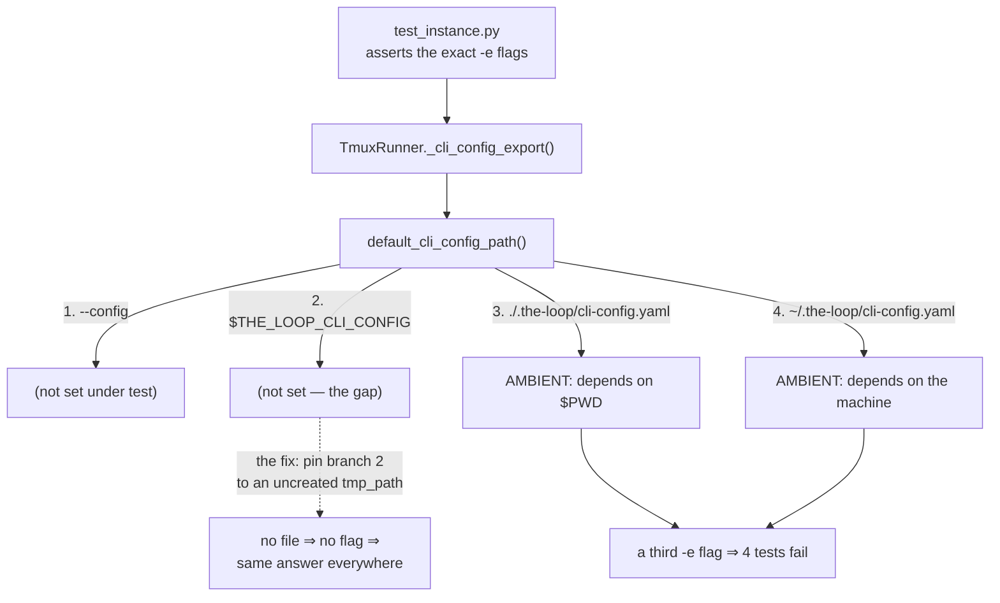

# `make check` is red where CI is green (issue-412) — reviewer briefing

## TL;DR

Four argv tests in `cli/tests/test_instance.py` inherited a third `-e` flag from the
developer's own machine, so they passed from `cli/` on a runner with no CLI config and
failed everywhere else — including on every machine that actually runs the-loop. Pinned
with one autouse fixture. Separately, `make test` and the pre-commit `pytest` hook ran
different commands while the Makefile claimed they were the same; they are now identical.
**No runtime code changed** — `cli/the_loop/` is untouched.

## Where to focus (in this order)

1. **The scope of the fixture** — `cli/tests/test_instance.py`. This is the only judgement
   call in the PR. It was written suite-wide in `conftest.py` first and the suite rejected
   it: 14 failures, because the config path's parent anchors the **state root**, so pinning
   it moved that root out from under tests that deliberately `chdir` and write their own
   config. Raw output in `evidence/verification.md` § The suite-wide variant. If you would
   still prefer a suite-wide seam, that is a change to shipped code and a separate item.
2. **That the fix does not stub the thing under test** — the fixture pins the *input*
   (`$THE_LOOP_CLI_CONFIG`), so `default_cli_config_path()` and `_cli_config_export()` both
   still run and return `""` through the real "empty ⇒ not exported" rule. The obvious
   alternative (`monkeypatch.setattr(runner_mod, "_cli_config_export", lambda: "")`) would
   have stubbed out issue-393's absolutization, which these tests otherwise exercise.
3. **The Makefile direction** — `make test` moved onto the hook's command, not the reverse.
   `.github/workflows/**` and `.pre-commit-config.yaml` are unchanged, so CI runs exactly
   what it ran before. Skim only.

## The bug in one picture

## Why CI never saw it

| where pytest starts | `~/.the-loop/cli-config.yaml` | the four tests |
|---|---|---|
| repo root | absent | **fail** |
| `cli/` | absent | pass ← the only green row, and the one CI is in |
| `cli/` | present | **fail** ← every contributor who runs the-loop |
| repo root | present | **fail** |

All four rows are now green, run both with and without the home config present — see
`evidence/verification.md` T1.

## Key decisions & why

- **Pin the path, not the function.** Keeps the code under test running for real; a stub
  would have moved the coverage, not the bug.
- **Module-scoped, not suite-wide.** The suite itself settled this (14 failures). The
  general rule went into `docs/capabilities/testing-and-contracts.md` instead, phrased as
  "a test **pins or controls** what it resolves" — because a cwd-relative lookup is not
  ambient in itself, and pinning it wholesale is what broke the other tests.
- **Move the Makefile onto CI's command, not CI onto the Makefile's.** The complaint was
  local; changing the hook would have changed a sensitive path to settle it.

## Evidence

[`verification.md`](verification.md) (all matrix rows, raw output, the negative control on
`main`, and the rejected suite-wide variant) ·
[`self-review.md`](self-review.md) (3 rounds, converged; critics unavailable) ·
[`security-review.md`](security-review.md) (no findings; no production code in the diff) ·
[`documentation.md`](documentation.md)
